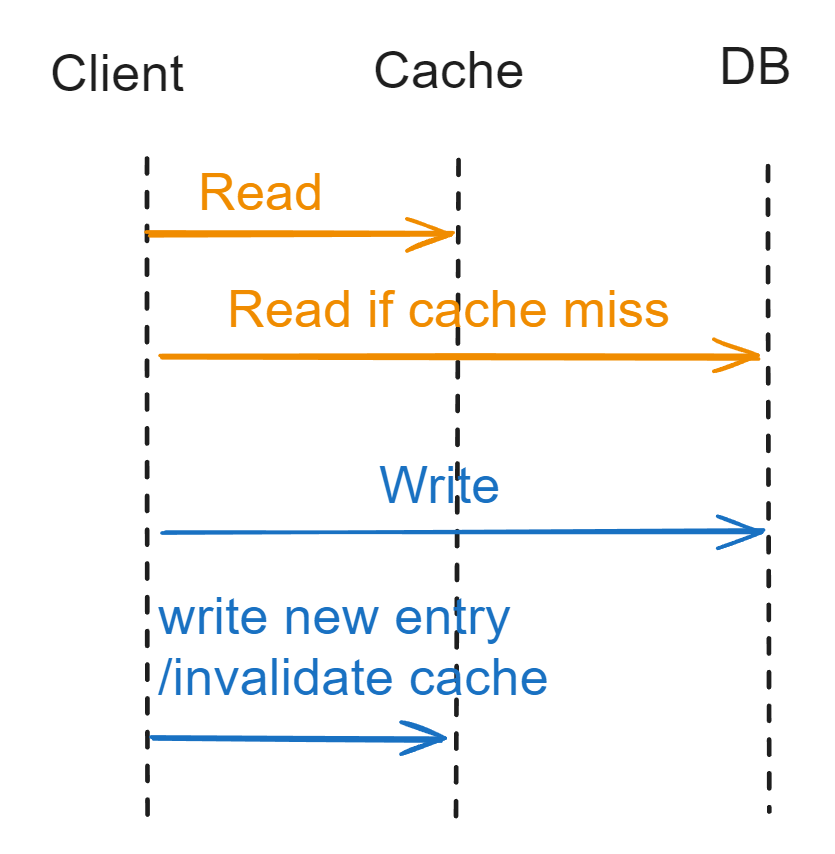

- [Cache aside](#cache-aside)
  - [Use case](#use-case)
  - [Potential issues](#potential-issues)
    - [Data inconsistency](#data-inconsistency)
    - [Cache hit ratio](#cache-hit-ratio)
    - [Flowchart](#flowchart)
    - [What if update cache instead of invalidate cache after writing to DB](#what-if-update-cache-instead-of-invalidate-cache-after-writing-to-db)
    - [What if invalidate cache first and then write to DB](#what-if-invalidate-cache-first-and-then-write-to-db)
- [Read/Write through](#readwrite-through)
  - [Def](#def)
  - [Pros](#pros)
  - [Cons](#cons)
- [Write behind/back cache](#write-behindback-cache)
  - [Def](#def-1)
  - [Pros](#pros-1)
  - [Cons](#cons-1)
    - [Stale data](#stale-data)
    - [Lose update](#lose-update)
- [Write around cache](#write-around-cache)
  - [Def](#def-2)
  - [Pros](#pros-2)
- [Refresh ahead](#refresh-ahead)
  - [Def](#def-3)
  - [Pros](#pros-3)
  - [Cons](#cons-2)
- [References](#references)

# Cache aside
* Doing nothing special when using cache

## Use case

* Most widely used pattern in distributed applications. Popular cache frameworks such as Redis / Memcached opt this approach by default. 

## Potential issues

### Data inconsistency

* Possibility of data inconsistency. However, the scenario doesn't happen frequently because the read operation need to happen before write and finish after write and it is unlikely that the read operation is slower than write operation. 

```
// data inconsistency
┌───────────┐         ┌───────────┐         ┌───────────┐         ┌───────────┐
│ Request A │         │ Request B │         │   Cache   │         │ Database  │
└───────────┘         └───────────┘         └───────────┘         └───────────┘

      │                     │                     │                     │      
      │                     │     cache miss      │                     │      
      │─────────────────────┼────────────────────▶│                     │      
      │                     │                     │                     │      
      │                     │                     │                     │      
      │                     │                     │                     │      
      ├─────────────────────┼read 20 from database┼─────────────────────▶      
      │                     │                     │                     │      
      │                     │                     │                     │      
      │                     │                     │                     │      
      │                     │                     │                     │      
      │                     │─────────Update database value to 21───────▶      
      │                     │                     │                     │      
      │                     │                     │                     │      
      │                     │      invalidate     │                     │      
      │                     ├─────────cache───────▶                     │      
      │                     │                     │                     │      
      │                     │                     │                     │      
      │                     │                     │                     │      
      │                     │                     │                     │      
      ├──────────update cache value to 20────────▶│                     │      
      │                     │                     │                     │      
      │                     │                     │                     │      
      │                     │                     │                     │
```

### Cache hit ratio

* When write operation happens frequently, cache data will be invalidated frequently. As a result, the cache hit ratio might suffer. Two possible solutions:
  * Update cache while update database, and put two operations in a distributed lock. 
  * Update cache while update database, and set a low expiration time for cache.

### Flowchart



### What if update cache instead of invalidate cache after writing to DB

* It will cause the following two problems: 
  * Data inconsistency
  * Lose update

```
// Data inconsistency
┌───────────┐         ┌───────────┐         ┌───────────┐         ┌───────────┐
│ Request A │         │ Request B │         │   Cache   │         │ Database  │
└───────────┘         └───────────┘         └───────────┘         └───────────┘

      │                     │                     │                     │      
      │                     │                     │                     │      
      ├───────────────────Update database value to 20───────────────────▶      
      │                     │                     │                     │      
      │                     │                     │                     │      
      │                     │                     │                     │      
      │                     │                     │                     │      
      │                     │───────Update database value to 21─────────▶      
      │                     │                     │                     │      
      │                     │                     │                     │      
      │                     │                     │                     │      
      │                     │                     │                     │      
      │                     │                     │                     │      
      │                     │    update cache     │                     │      
      │                     │─────value to 21─────▶                     │      
      │                     │                     │                     │      
      │                     │                     │                     │      
      │                     │                     │                     │      
      │                     │                     │                     │      
      │                     │                     │                     │      
      ├────────────Update cache value to 20───────▶                     │      
      │                     │                     │                     │      
      │                     │                     │                     │      
      │                     │                     │                     │
```

```
// Lose update
┌───────────┐         ┌───────────┐         ┌───────────┐         ┌───────────┐
│ Request A │         │ Request B │         │   Cache   │         │ Database  │
└───────────┘         └───────────┘         └───────────┘         └───────────┘

      │                     │                     │                     │      
      │                     │                     │                     │      
      ├────────────Get value from cache───────────┼▶                    │      
      │                     │                     │                     │      
      │                     │                     │                     │      
      │                     │                     │                     │      
      │                     │     Get value       │                     │      
      │                     │─────from cache──────▶                     │      
      │                     │                     │                     │      
      │                     │                     │                     │      
      │                     │                     │                     │      
      │                     │                     │                     │      
      │                     │                     │                     │      
      │                     │                     │                     │      
      │                     │───────────Increment 1 and update value────▶      
      │                     │                     │                     │      
      │                     │                     │                     │      
      │                     │                     │                     │      
      │                     │                     │                     │      
      │                     │                     │                     │      
      ├─────────────────────┼─Increment 1 and update value──────────────▶      
      │                     │                     │                     │      
      │                     │                     │                     │      
      │                     │                     │                     │
```

* How to solve the above problem? There are three possible ways: 
  1. A single transaction coordinator. 2PC
  2. Many transaction coordinators, with an elected master via Paxos or Raft consensus algorithm. Paxos
  3. Deletion of elements from memcached on DB updates
* 3 above is selected because 1 and 2 will cause performance and stability cost. 

### What if invalidate cache first and then write to DB

* It will result in data inconsistency problems

```
┌───────────┐         ┌───────────┐         ┌───────────┐         ┌───────────┐
│ Request A │         │ Request B │         │   Cache   │         │ Database  │
└───────────┘         └───────────┘         └───────────┘         └───────────┘

      │                     │                     │                     │      
      │                     │                     │                     │      
      ├───────────Invalidate cache value──────────┼▶                    │      
      │                     │                     │                     │      
      │                     │                     │                     │      
      │                     │                     │                     │      
      │                     │                     │                     │      
      │                     │─────cache miss──────▶                     │      
      │                     │                     │                     │      
      │                     │                     │                     │      
      │                     │                     │                     │      
      │                     │─────────Read value 20 from database───────▶      
      │                     │                     │                     │      
      │                     │                     │                     │      
      │                     │                     │                     │      
      │                     │     update cache    │                     │      
      │                     ├─────────to 20───────▶                     │      
      │                     │                     │                     │      
      │                     │                     │                     │      
      │                     │                     │                     │      
      ├────────────────────update database value to 21──────────────────▶      
      │                     │                     │                     │      
      │                     │                     │                     │      
      │                     │                     │                     │
```

# Read/Write through

## Def
* Read Through / Lazy Loading: Load data into the cache only when necessary. If application needs data for some key x, search in the cache first. If data is present, return the data, otherwise, retrieve the data from data source, put it into the cache & then return.
* Write through: Write go through the cache and write is confirmed as success only if writes to DB and the cache both succeed.


## Pros
* It does not load or hold all the data together, it’s on demand. Suitable for cases when you know that your application might not need to cache all data from data source in a particular category.
* Client does not need to manage two connections towards cache and repository, separately. Everything could be managed by the cache itself. 

## Cons
* For cache miss, there are 3 network round trips. Check in the cache, retrieve from database, pour the data into the cache. So cache causes noticeable delay in the response.
* Stale data might become an issue. If data changes in the database & the cache key is not expired yet, it will throw stale data to the application.

# Write behind/back cache
## Def
*  In this strategy, the application writes data directly to the caching system. Then after a certain configured interval, the written data is asynchronously synced to the underlying data source. So here the caching service has to maintain a queue of ‘write’ operations so that they can be synced in order of insertion.


## Pros
* Suitable for high read & write throughput system. Used more often in operating system's write to cache
  * Linux page cache algorithm
  * Asynchronously write message to disk in message queue
* Since the application writes only to the caching service, it does not need to wait till data is written to the underlying data source. Read and write both happens at the caching side. Thus it improves performance.
* The application is insulated from database failure. If database fails, queued items can be retried or re-queued.

## Cons
### Stale data
* Eventual consistency between database & caching system. So any direct operation on database or joining operation may use stale data.

### Lose update
* Since in this strategy cache is written first & then database — they are not written in a transaction, if cached items can not be written to the database, some rollback process must be in-place to maintain consistency over a time window.

* Write-behind caching may allow out of order database updates, so database have to be able to relax foreign key constraints. Also if the database is a shared database, other apps may also use it, hence no way to know whether write-behind cache updates will conflict with other external updates. This has to be handled manually or heuristically.

# Write around cache
## Def
* def: write directly goes to the DB. The cache reads the info from DB in case of a miss

## Pros
* use-case: lower write load to cache and faster writes, but can lead to higher read latency in case of applications which write and re-read the information quickly

# Refresh ahead
## Def
So what refresh ahead caching does is it essentially refreshes the cache at a configured interval just before the next possible cache access although it might take some time due to network latency to refresh the data & meanwhile few thousand read operation already might have happened in a very highly read heavy system in just a duration of few milliseconds.

## Pros
* It’s useful when large number of users are using the same cache keys. Since the data is refreshed periodically & frequently, staleness of data is not a permanent problem.
* Reduced latency than other technique like Read Through cache.

## Cons
* Probably a little hard to implement since cache service takes extra pressure to refresh all the keys as and when they are accessed. But in a read heavy environment, it’s worth it.

# References
* https://medium.datadriveninvestor.com/all-things-caching-use-cases-benefits-strategies-choosing-a-caching-technology-exploring-fa6c1f2e93aa