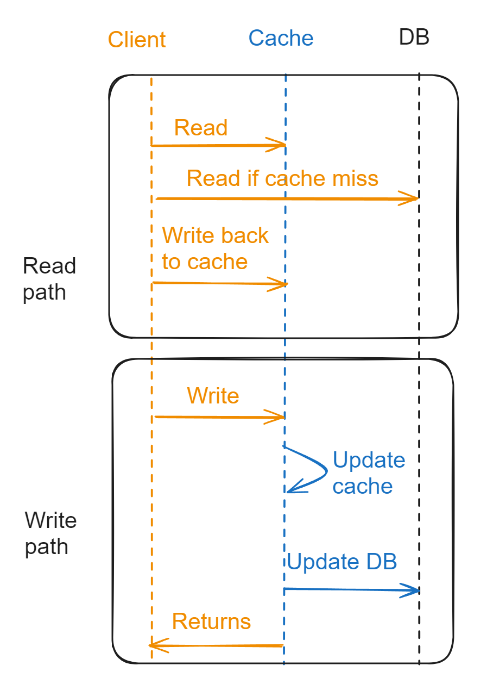

- [Cache aside](#cache-aside)
  - [Flowchart](#flowchart)
  - [Cons: Data inconsistency](#cons-data-inconsistency)
- [Double delete](#double-delete)
  - [Flowchart](#flowchart-1)
  - [Pros: Data consistency](#pros-data-consistency)
  - [Cons: Low cache hit rate](#cons-low-cache-hit-rate)
- [Read through](#read-through)
  - [Flowchart](#flowchart-2)
  - [Cons: Data inconsistency](#cons-data-inconsistency-1)
  - [Asynchronous version](#asynchronous-version)
- [Write through](#write-through)
  - [Flowchart](#flowchart-3)
  - [Cons: Data inconsistency](#cons-data-inconsistency-2)
  - [Asynchronous version](#asynchronous-version-1)
- [Write back](#write-back)
  - [Flowchart](#flowchart-4)
  - [Pros](#pros)
    - [Data consistency](#data-consistency)
    - [Performance](#performance)
  - [Cons: Data loss](#cons-data-loss)
- [Refresh ahead](#refresh-ahead)
  - [Flowchart](#flowchart-5)
  - [Pros](#pros-1)
    - [Data consistency](#data-consistency-1)
    - [Performance](#performance-1)
  - [Cons: Additional components](#cons-additional-components)

# Cache aside
## Flowchart
* Doing nothing special when using cache. Treat the database and cache as independent data sources. 
* First write DB, then cache; read from cache, then DB.  
* Most widely used pattern in distributed applications. Popular cache frameworks such as Redis / Memcached opt this approach by default. 

## Cons: Data inconsistency
* Data inconsistency could happen in multiple cases:
  * Two parallel write 
  * One read and one write

* Possible solution: Add one delayed delete after the immediate delete

# Double delete
## Flowchart

## Pros: Data consistency
* Since the second delete is scheduled a bit long after the first one, setting cache operation should already be eliminated. 

## Cons: Low cache hit rate

# Read through

## Flowchart
* In read path, cache will act on behalf of client; on write path, it is the same as cache aside. 

## Cons: Data inconsistency
* Since it shares the same write path as cache aside, it has the same data inconsistency issue with cache aside. 

## Asynchronous version
* For the step to update cache, put it in an asynchronous job. This step will only improve the perf a lot when the cached item is large. 

# Write through
* In the read path, it is the same as cache aside; in the write path, cache will act on behalf of client.

## Flowchart

## Cons: Data inconsistency
* It has similar problem.  

## Asynchronous version
* For the step to update cache, put it in an asynchronous job. This step will only improve the perf a lot when the cached item is large. 

# Write back
* Suitable for high read & write throughput system. Used more often in operating system's write to cache
  * Linux page cache algorithm
  * Asynchronously write message to disk in message queue

## Flowchart
* When updating data, only update cache. When cache keys expire, these entries will be persisted to DB. 

## Pros
### Data consistency
* This pattern could greatly reduce the inconsistency problem if handled properly. 
  * When there is no data in DB, then cache is source of truth
  * When there is data in DB, as long as SETNX is used, the "write back" operation on read path will not result in cache & DB inconsistency. 
* SETNX: Set if not exist
  * Update cache if there is no entry
  * Skip is there is already an entry

### Performance
* Since the application writes only to the caching service, it does not need to wait till data is written to the underlying data source. Read and write both happens at the caching side. Thus it improves performance.

## Cons: Data loss
* If cache suddenly crashes, then the data cached inside will all be lost. 

# Refresh ahead
* This pattern is actually similar to write back. But it writes to DB instead of cache, and it will watch DB binlog for updating cache. 

## Flowchart

## Pros

### Data consistency
* Please refer to the SETNX solution in "Write back" approach.

### Performance
* Please refer to the explanation in "Write back" approach.

## Cons: Additional components
* Requires an additional components for watch binlogs