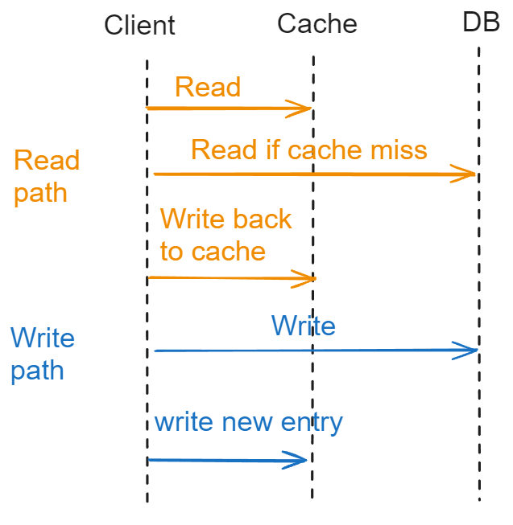
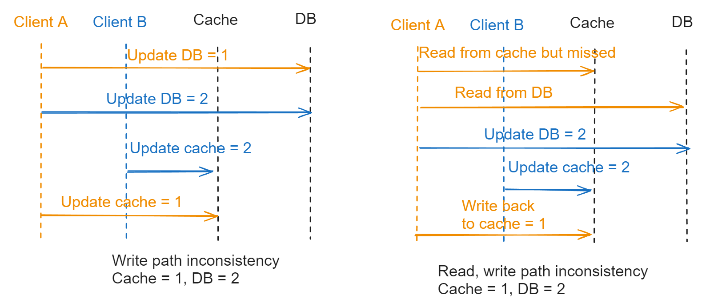

- [Cache aside](#cache-aside)
  - [Flowchart](#flowchart)
  - [Cons: Data inconsistency](#cons-data-inconsistency)
- [Read through](#read-through)
  - [Flowchart](#flowchart-1)
  - [Cons: Data inconsistency](#cons-data-inconsistency-1)
  - [Asynchronous version](#asynchronous-version)
- [Write through](#write-through)
  - [Flowchart](#flowchart-2)
  - [Cons: Data inconsistency](#cons-data-inconsistency-2)
  - [Asynchronous version](#asynchronous-version-1)
- [Write behind/back cache](#write-behindback-cache)
  - [Def](#def)
  - [Pros](#pros)
  - [Cons](#cons)
    - [Stale data](#stale-data)
    - [Lose update](#lose-update)
- [Write around cache](#write-around-cache)
  - [Def](#def-1)
  - [Pros](#pros-1)
- [Refresh ahead](#refresh-ahead)
  - [Def](#def-2)
  - [Pros](#pros-2)
  - [Cons](#cons-1)
- [References](#references)

# Cache aside
## Flowchart
* Doing nothing special when using cache. Treat the database and cache as independent data sources. 
* First write DB, then cache; read from cache, then DB.  
* Most widely used pattern in distributed applications. Popular cache frameworks such as Redis / Memcached opt this approach by default. 

## Cons: Data inconsistency
* Possible solution with distributed lock

# Read through

## Flowchart
* In read path, cache will act on behalf of client; on write path, it is the same as cache aside. 

## Cons: Data inconsistency
* Since it shares the same write path as cache aside, it has the same data inconsistency issue with cache aside. 

## Asynchronous version
* For the step to update cache, put it in an asynchronous job. This step will only improve the perf a lot when the cached item is large. 

# Write through
* In the read path, it is the same as cache aside; in the write path, cache will act on behalf of client.

## Flowchart

## Cons: Data inconsistency
* It has similar problem.  

## Asynchronous version
* For the step to update cache, put it in an asynchronous job. This step will only improve the perf a lot when the cached item is large. 

# Write behind/back cache
## Def
*  In this strategy, the application writes data directly to the caching system. Then after a certain configured interval, the written data is asynchronously synced to the underlying data source. So here the caching service has to maintain a queue of ‘write’ operations so that they can be synced in order of insertion.

## Pros
* Suitable for high read & write throughput system. Used more often in operating system's write to cache
  * Linux page cache algorithm
  * Asynchronously write message to disk in message queue
* Since the application writes only to the caching service, it does not need to wait till data is written to the underlying data source. Read and write both happens at the caching side. Thus it improves performance.
* The application is insulated from database failure. If database fails, queued items can be retried or re-queued.

## Cons
### Stale data
* Eventual consistency between database & caching system. So any direct operation on database or joining operation may use stale data.

### Lose update
* Since in this strategy cache is written first & then database — they are not written in a transaction, if cached items can not be written to the database, some rollback process must be in-place to maintain consistency over a time window.

* Write-behind caching may allow out of order database updates, so database have to be able to relax foreign key constraints. Also if the database is a shared database, other apps may also use it, hence no way to know whether write-behind cache updates will conflict with other external updates. This has to be handled manually or heuristically.

# Write around cache
## Def
* def: write directly goes to the DB. The cache reads the info from DB in case of a miss

## Pros
* use-case: lower write load to cache and faster writes, but can lead to higher read latency in case of applications which write and re-read the information quickly

# Refresh ahead
## Def
So what refresh ahead caching does is it essentially refreshes the cache at a configured interval just before the next possible cache access although it might take some time due to network latency to refresh the data & meanwhile few thousand read operation already might have happened in a very highly read heavy system in just a duration of few milliseconds.

## Pros
* It’s useful when large number of users are using the same cache keys. Since the data is refreshed periodically & frequently, staleness of data is not a permanent problem.
* Reduced latency than other technique like Read Through cache.

## Cons
* Probably a little hard to implement since cache service takes extra pressure to refresh all the keys as and when they are accessed. But in a read heavy environment, it’s worth it.

# References
* https://medium.datadriveninvestor.com/all-things-caching-use-cases-benefits-strategies-choosing-a-caching-technology-exploring-fa6c1f2e93aa