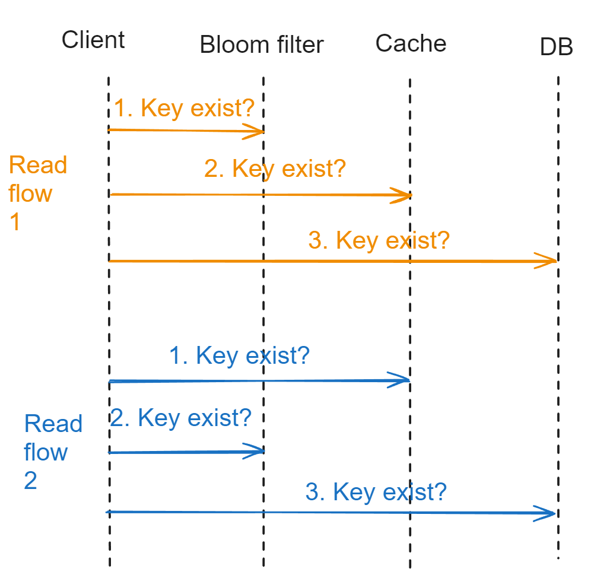

- [Cache penetration](#cache-penetration)
  - [Def](#def)
  - [Solution1: Cache empty values](#solution1-cache-empty-values)
    - [Flowchart](#flowchart)
    - [Cons](#cons)
  - [Solution2: Bloomberg filter](#solution2-bloomberg-filter)
    - [Flowchart](#flowchart-1)
    - [Cons](#cons-1)
- [Cache avalanch](#cache-avalanch)
  - [Def](#def-1)
  - [Solution1: Add jitter](#solution1-add-jitter)
  - [Solution2: Rate limiting](#solution2-rate-limiting)

# Cache penetration
## Def
* Cache penetration occurs when there is a cache miss, but the primary database also lacks the required data.

## Solution1: Cache empty values
### Flowchart
* Within the business code, cache special values for empty entries 

### Cons
* If each time attacker query different and non-existing keys, large space could be consumed and actual useful entries will be purged out of the storage. 

## Solution2: Bloomberg filter
* Use case
  * Time complexity: O(1) read/write
  * Space complexity: Within 1 billion records (roughly 1.2GB memory)

### Flowchart
* The order of cache and bloomfilter could switch:
    * Cache first, bloomfilter second: Better performance for normal requests
    * Bloomfilter first, cache second: Better protection against attacks.

### Cons
* False positives
  * Solution: Use multiple hash algorithm to calculate multiple hash values
* No support for delete
  * Solution: Store a counter for each entry 

# Cache avalanch

## Def
* when a significant number of caches expire at the same time, which leads to a large number of requests that don't hit the cache and instead directly query the database. T

## Solution1: Add jitter
* Jitter to expiration time

## Solution2: Rate limiting
* Rate limiting / Circuit breaker to DB