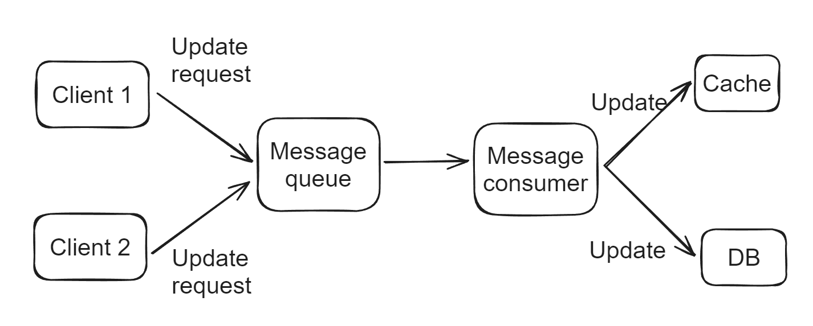

- [Sources of cache \& DB inconsistency](#sources-of-cache--db-inconsistency)
- [Messge queue](#messge-queue)
- [Inconsistency between local and distributed cache](#inconsistency-between-local-and-distributed-cache)
- [Consistent hanshing + Singleflight](#consistent-hanshing--singleflight)
  - [Flowchart](#flowchart)
- [Distributed lock](#distributed-lock)

# Sources of cache & DB inconsistency
* Failure for part of requests: For this type of failure, the only resolution will be distributed transactions such as XA. However, since most distributed cache don't support transactions, it will be hard to avoid this type of inconsistency. What we could achieve is eventual consistency. 
* **Concurrent requests: All solutions below focus on this type of inconsistency**. 

# Messge queue
* Put all requests inside a message queue. 
* Cons:
  * Additional cost for maintaining a message queue

# Inconsistency between local and distributed cache
* Recommend to update local before distributed cache because:
  * Updating local cache will sedomly succeed. 
  * When querying for data, local cache comes before distributed cache. Updating local cache will enable clients to get the most-up-to-date data. 

# Consistent hanshing + Singleflight
* This approach combines consistent hashing and singleflight mode. 
* Consistent hashing: Ensure that a single cache key will only land on a specific node.
* Singleflight mode: When multiple same keys land on cache, only a single request will land on DB. 

## Flowchart
* When upscaling the cluster, there will be a short-period (depending on the scaling period) where both new nodes and old nodes receive requests for a single key. To avoid inconsistency, we could skip cache during this short period. 

# Distributed lock 
* [TO BE completed]()