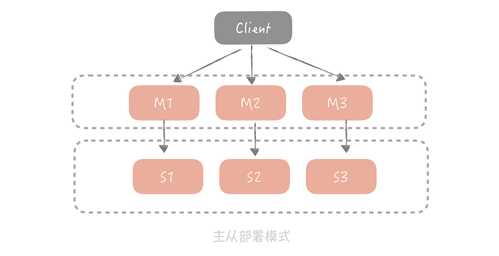

- [Client layer solution](#client-layer-solution)
  - [Sharding](#sharding)
  - [Consistency hashing](#consistency-hashing)
  - [Memcached master-slave](#memcached-master-slave)
  - [Multiple copies](#multiple-copies)
- [Proxy layer solution](#proxy-layer-solution)
- [Server layer solution](#server-layer-solution)

# Client layer solution

## Sharding

## Consistency hashing

* Pros: 
  * Low impact on hit ratio
* Cons: 
  * Cache node is not distributed evenly inside the ring
  * Dirty data: Suppose there are two nodes A and B in cluster. Initially pair (k,3) exists within cache A. Now a request comes to update k's value to 4 and cache A goes offline so the update load on cache B. Then cache A comes back online. Next time when client gets value, it will read 3 inside cache A instead of 4 inside cache B. 
    * Must set cache expiration time

## Memcached master-slave

## Multiple copies

# Proxy layer solution

* All client read/write requests will come through the proxy layer. 
* The high availability strategy is implemented within the proxy layer.
* E.g. Facebook's Mcrouter, Twitter's Twemproxy, Codis

# Server layer solution

* Redis Sentinel

