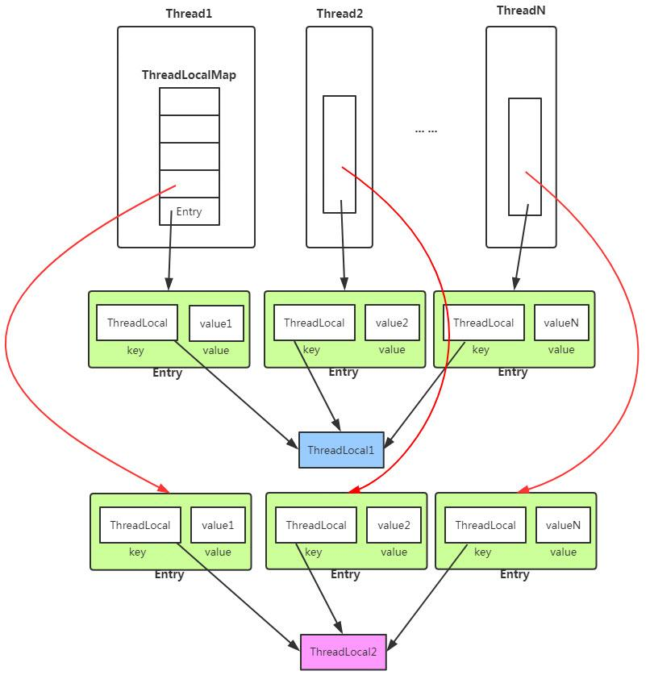

- [ThreadLocal](#threadlocal)
  - [Use case](#use-case)
    - [Each thread needs a separate object](#each-thread-needs-a-separate-object)
    - [Avoid to always pass parameters](#avoid-to-always-pass-parameters)
  - [Two ways to set threadlocal](#two-ways-to-set-threadlocal)
  - [Benefits](#benefits)
  - [Internals](#internals)

## ThreadLocal
### Use case
#### Each thread needs a separate object
* Usually applies to utility classes such as SimpleDateFormat

```java
import java.text.SimpleDateFormat;
import java.util.Date;
import java.util.concurrent.ExecutorService;
import java.util.concurrent.Executors;

/**
 * Description: SimpleDateFormat is not thread safe. If multiple threads try to use it, then non thread-safe behaviors might occur (e.g. in this case, printing the same timestamp)
 */
public class ThreadLocalNormalUsage05 {

    public static ExecutorService threadPool = Executors.newFixedThreadPool(10);

    public static void main(String[] args) throws InterruptedException {
        for (int i = 0; i < 1000; i++) {
            int finalI = i;
            threadPool.submit(new Runnable() {
                @Override
                public void run() {
                    String date = new ThreadLocalNormalUsage05().date(finalI);
                    System.out.println(date);
                }
            });
        }
        threadPool.shutdown();
    }

    public String date(int seconds) {
        // The unit for Date is ms, start counting from 1970.1.1 00:00:00 GMT 
        Date date = new Date(1000 * seconds);

        // Use thread local to get a thread safe DateFormat entity
        // SimpleDateFormat dateFormat = new SimpleDateFormat("yyyy-MM-dd HH:mm:ss");
        SimpleDateFormat dateFormat = ThreadSafeFormatter.dateFormatThreadLocal2.get();
        return dateFormat.format(date);
    }
}

class ThreadSafeFormatter {

    public static ThreadLocal<SimpleDateFormat> dateFormatThreadLocal = new ThreadLocal<SimpleDateFormat>() {
        @Override
        protected SimpleDateFormat initialValue() {
            return new SimpleDateFormat("yyyy-MM-dd HH:mm:ss");
        }
    };

    public static ThreadLocal<SimpleDateFormat> dateFormatThreadLocal2 = ThreadLocal
            .withInitial(() -> new SimpleDateFormat("yyyy-MM-dd HH:mm:ss"));
}
```

#### Avoid to always pass parameters 
* Within the same thread, want to share a variable between different methods. Could use threadlocal to pass. E.g. UserId, tenantId
* Other approaches:
  * Declare a static global variable: Not working because each request will have a different argument (e.g. userId, tenantId). The scope needs to be per request. 
  * Use synchronized / concurrentHashmap (Thread->userId/tenantId mapping). Will have performance cost anyways. 

```java
public class ThreadLocalNormalUsage06 {

    public static void main(String[] args) {
        new Service1().process("");

    }
}

class Service1 {

    public void process(String name) {
        User user = new User("Bruce");
        UserContextHolder.holder.set(user);
        new Service2().process();
    }
}

class Service2 {

    public void process() {
        User user = UserContextHolder.holder.get();
        System.out.println("Service2 gets username：" + user.name);
        new Service3().process();
    }
}

class Service3 {

    public void process() {
        User user = UserContextHolder.holder.get();
        System.out.println("Service3 gets username：" + user.name);
        UserContextHolder.holder.remove();
    }
}

class UserContextHolder {

    public static ThreadLocal<User> holder = new ThreadLocal<>();


}

class User {

    String name;

    public User(String name) {
        this.name = name;
    }
}public class ThreadLocalNormalUsage06 {

    public static void main(String[] args) {
        new Service1().process("");

    }
}
``` 

### Two ways to set threadlocal
* Use InitialValue when you could decide what value to set during construction of ThreadLocal.
* Use Set when you could only determine the usage at runtime. 

### Benefits
* Thread safe
* No locking required
* Use memory more efficiently to avoid creating new objects for each request
* Avoid passing repetitive parameters

### Internals
* Each thread will contain a threadLocalMap
* Each threadLocal map could contain multiple threadLocal key value pairs.


