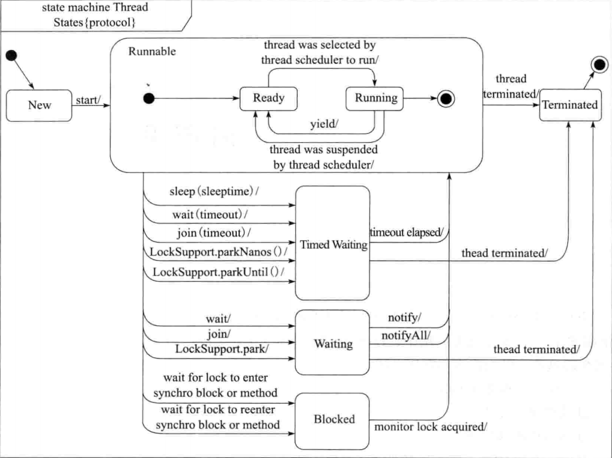

# ThreadLifeCycle

* [Thread Lifecycle](threadlifecycle.md#thread-lifecycle)
  * [State conversion](threadlifecycle.md#state-conversion)
  * [Create thread - implementing Runnable vs extending Thread](threadlifecycle.md#create-thread---implementing-runnable-vs-extending-thread)
  * [Start a thread](threadlifecycle.md#start-a-thread)
  * [Stop a thread](threadlifecycle.md#stop-a-thread)
  * [Object methods](threadlifecycle.md#object-methods)
    * [Wait, notify and notifyAll](threadlifecycle.md#wait-notify-and-notifyall)
  * [Thread methods](threadlifecycle.md#thread-methods)
    * [Join](threadlifecycle.md#join)
    * [Sleep](threadlifecycle.md#sleep)

## Thread Lifecycle

### State conversion

* When will be a thread blocked?
  * Blocked:
  * Waiting:
  * Timed waiting: 
* New -&gt; Runnable -&gt; terminated is not reversible
* Timed waiting / Waiting / Blocked can only transfer to each other by going through Runnable first. 



### Create thread - implementing Runnable vs extending Thread

* Internal mechanism
  * There is only one way to create thread - create a Thread instance. And there are two ways to implement the run\(\) method - Override the run\(\) method inside Thread instance vs pass an implementation of Runnable interface into Thread constructor. 
  * Thread and Runnable are complement to each other for multithreading not competitor or replacement. Because we need both of them for multi-threading.
    * For Multi-threading we need two things:
      * Something that can run inside a Thread \(Runnable\).
      * Something That can start a new Thread \(Thread\).
    * So technically and theoretically both of them is necessary to start a thread, one will run and one will make it run \(Like Wheel and Engine of motor vehicle\).

```text
@Override
public void run() 
{
    if (target != null) 
    {
        target.run();
    }
}
```

* Best practices - Implement Runnable\(\)
  * Code cleaniness perspective: 
    * Decoupling: Implementing Runnable could separate thread creation from running. 
    * Extensibility: If adopting the approach of extending Thread, then it could not extend another class because Java does not support multiple inheritance.
  * Cost of operation perspective: Thread approach will require creating and destroying a thread object each time; When combined with threadpool, Runnable approach could avoid creating a new thread object and deleting it.

```text
// Approach 1: Runnable
public class DemoRunnable implements Runnable 
{
    public void run() 
    {
        //Code
    }
}

// Approach 2: Thread
public class DemoThread extends Thread 
{
    public DemoThread() 
    {
        super("DemoThread");
    }

    public DemoThread(Runnable ) 
    {
        super("DemoThread");
    }

    public void run() 
    {
        //Code
    }
}
```

### Start a thread

* Best practices - Use Start\(\)
  * Start\(\) method responsiblity:
    * Start a new thread
    * Check the thread status
    * Add the thread to thread group
    * Kick off the Run\(\)
  * Run\(\) method responsibility:
    * Kick off the code inside Run\(\)
  * Key difference is that Start\(\) method \(approach 1 below\) will create a new thread to run. Run\(\) \(approach 2 below\) will run everything inside main\(\) method. 

```text
public static void main(string[] args)
{
    // Approach 1: Create a runnable instance and run it
    // Output: main
    Runnable runnable = () -> 
    {
        System.out.println(Thread.currentThread().GetName());
    };
    runnable.run();

    // Approach 2: Start a new thread
    // Output: thread0
    new Thread(runnable).start();
}
```

### Stop a thread

* Java does not provide a way for one thread to force stop of another thread because if it does so, then the other thread might be in a state of inconsistency. Java provides a collaboration mechanism for one thread to notify another thread that it would better stop.
* Best practices: Please see this folder for sample code: [https://github.com/DreamOfTheRedChamber/system-design-interviews/tree/master/code/multithreads/StopThreads](https://github.com/DreamOfTheRedChamber/system-design-interviews/tree/master/code/multithreads/StopThreads)

### Object methods

* Please see [https://github.com/DreamOfTheRedChamber/system-design-interviews/tree/master/code/multithreads/ObjectMethods](https://github.com/DreamOfTheRedChamber/system-design-interviews/tree/master/code/multithreads/ObjectMethods) for best practices

#### Wait, notify and notifyAll

* Wait and notify are all based on object's monitor mechanism. Therefore, they are declared as methods on top of Object. 
* They are considered the native way of doing multi-threading. Java JDK has shipped packages such as Condition variable which is easier to use. 

### Thread methods

* Please see [https://github.com/DreamOfTheRedChamber/system-design-interviews/tree/master/code/multithreads/ThreadMethods](https://github.com/DreamOfTheRedChamber/system-design-interviews/tree/master/code/multithreads/ThreadMethods)

#### Join

* Join thread will be in the waiting status
* Join is the native way of doing waiting. Java JDK has shipped packages such as CountDownLatch or CyclicBarrier.
* Best pratices:

#### Sleep

* Wait vs Sleep
  * Similarities:
    * Both wait and sleep method could make the thread come into blocked state. Wait will result in Waiting and sleep will result in Time\_Waiting. 
    * Both wait and sleep method could respond to interrupt. 
  * Differences:
    * Wait could only be used in synchronized blocks, while sleep could be used in other scenarios. 
    * Wait is a method on Object, and sleep is a method on Thread. 
    * Wait will release monitor lock, and sleep will not. 
    * Wait could only exit blocked state reactively, and sleep could proactive exit after specific time. 
* Yield vs Sleep: Similar. However yield is non-blocking but sleep is blocking

