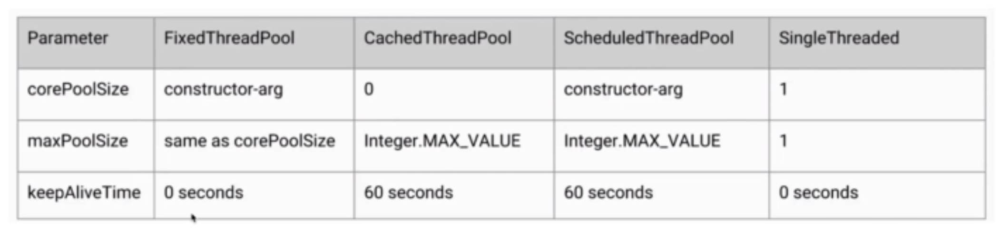
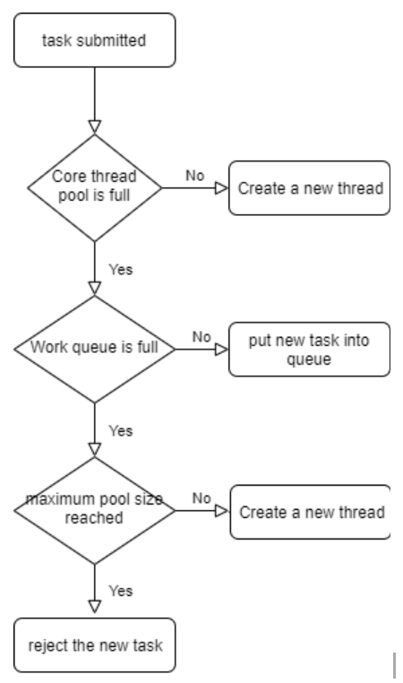
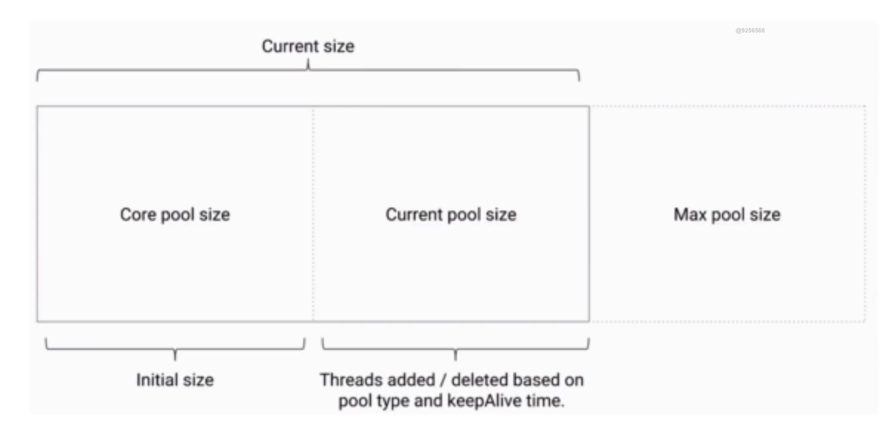

# ThreadPool

* [Thread Pool](threadpool.md#thread-pool)
  * [Motivation](threadpool.md#motivation)
  * [Types](threadpool.md#types)
  * [Internal design](threadpool.md#internal-design)
    * [Not using pooled resource pattern](threadpool.md#not-using-pooled-resource-pattern)
    * [Producer consumer pattern](threadpool.md#producer-consumer-pattern)
  * [Threadpool constructor](threadpool.md#threadpool-constructor)
    * [Create threadpool](threadpool.md#create-threadpool)
      * [Notes](threadpool.md#notes)
    * [Recycle thread](threadpool.md#recycle-thread)
    * [Reject task](threadpool.md#reject-task)
  * [Stop threadpool](threadpool.md#stop-threadpool)
    * [Shutdown and ShutdownNow](threadpool.md#shutdown-and-shutdownnow)
    * [IsShutdown and IsTerminate](threadpool.md#isshutdown-and-isterminate)
  * [Number of threads](threadpool.md#number-of-threads)

## Thread Pool

### Motivation

* Efficiency: Thread is an object in Java. Creating / Destroying objects will all take time. If creating + destroying time &gt; execution time, then it is not that efficient. No need to swtich between different thread contexts. 
* Better CPU and memory utilitzation: According to JVM, the maximum stack size for a thread is 1M inside system memory. Creating too many threads will occupy much space. 
* Easier management

### Types

* FixedThreadPool
  * It adopts LinkedBlockingQueue internally because there are limited number of threads which could be created.
* SingleThread
  * It adopts LinkedBlockingQueue internally because there are limited number of threads which could be created.
* CachedThreadPool
  * It uses SynchronousQueue internally because there is no limit on the maxPoolSize
* ScheduledThreadPool
  * It uses DelayedQueue
* WorkStealingPool
  * After JDK 1.8



### Internal design

#### Not using pooled resource pattern

```java
// Pooled resource pattern
class ThreadPool
{
  // Obtain free thread
  Thread acquire() 
  {
  }

  // Release thread
  void release(Thread t)
  {
  }
} 

/** Usage example **/
ThreadPool pool；
Thread T1=pool.acquire();
// Pass in Runnable object
T1.execute(()->{
  // Business logic
  ......
});
```

#### Producer consumer pattern

```java
// Simplified thread pool implementation
class MyThreadPool
{
  // Use blocking queue to implement producer and consumer pattern
  BlockingQueue<Runnable> workQueue;
  // Used to maintain internal threads
  List<WorkerThread> threads = new ArrayList<>();
  // Constructor
  MyThreadPool(int poolSize, BlockingQueue<Runnable> workQueue)
  {
    this.workQueue = workQueue;

    // Create worker threads
    for(int idx=0; idx<poolSize; idx++)
    {
      WorkerThread work = new WorkerThread();
      work.start();
      threads.add(work);
    }
  }

  // Submit task
  void execute(Runnable command)
  {
    workQueue.put(command);
  }

  // Worker thread is responsible for consuming task and execute 
  class WorkerThread extends Thread
  {
    public void run() 
    {
      // loop to fetch task and execute
      while(true)
      { // ①
        Runnable task = workQueue.take();
        task.run();
      } 
    }
  }  
}

/** Usage example **/
// Create bounded blocking queue
BlockingQueue<Runnable> workQueue = new LinkedBlockingQueue<>(2);
// Create thread pool
MyThreadPool pool = new MyThreadPool(10, workQueue);
// Submit task
pool.execute(()->{
    System.out.println("hello");
});
```

### Threadpool constructor

```text
public ThreadPoolExecutor(int corePoolSize,
                          int maximumPoolSize,
                          long keepAliveTime,
                          TimeUnit unit,
                          BlockingQueue<Runnable> workQueue,
                          ThreadFactory threadFactory,
                          RejectedExecutionHandler handler)
```

#### Create threadpool





* corePoolSize:
  * The number of core threads in the thread pool will not be recycled, even if there is no task execution, it will remain idle. If the number of threads in the thread pool is less than this, it is created when the task is executed.
* maximumPoolSize
  * The maximum number of threads allowed in the pool. When the number of threads reaches corepoolsize and the workqueue queue is full of tasks, continue to create threads.
* WorkQueue
  * When the current number of threads exceeds the corepoolsize, the new task will be in the waiting state and exist in the workqueue. There are several different types of queue:
    * SynchronousQueue: Size == 0
    * LinkedBlockingQueue: Unbounded
    * ArrayBlockingQueue: Bounded
* threadFactory
  * To create a factory class of a thread, we usually set the name of the thread from the top of a threadfactory, so that we can know which factory class the thread is created by and quickly locate it.

**Notes**

* If corePoolSize is same as the maximumPoolSize, then the size of threadpool will always be fixed. 
* Only when work queue is full, additional thread will be created out of CorePoolSize. If the worker queue is an unbounded queue, then no the pool size will not exceed corePoolSize.

#### Recycle thread

* keepAliveTime
  * The lifetime of the temporary thread after corepoolsize is exceeded.

#### Reject task

* handler
  * When the number of lines reaches the maximum poolsize and the workqueue is full of tasks, the thread pool will call the handler rejection policy to process the request.
* The default rejection policies are as follows:
  * Abortpolicy: the default rejection policy of thread pool, which directly throws exception handling.
  * Discardpolicy: discard directly without processing.
  * Discardoldestpolicy: discards the oldest task in the queue.
  * Callerrunspolicy: assign the task to the current execute method thread to process.

We can also customize the rejection policy by implementing the rejectedexecutionhandler interface. The friendly rejection policy implementation is as follows:

Save the data to the data and process it when the system is idle Record the data with log, and then handle it manually

### Stop threadpool

#### Shutdown and ShutdownNow

* Shutdown: Will shutdown gracefully
* ShutdownNow: Shutdown forcefully

```java
public class ShutDown {

    public static void main(String[] args) throws InterruptedException {
        ExecutorService executorService = Executors.newFixedThreadPool(10);
        for (int i = 0; i < 100; i++) {
            executorService.execute(new ShutDownTask());
        }
        Thread.sleep(1500);

        executorService.shutdown();
        executorService.execute(new ShutDownTask());
    }
}

class ShutDownTask implements Runnable {


    @Override
    public void run() {
        try {
            Thread.sleep(500);
            System.out.println(Thread.currentThread().getName());
        } catch (InterruptedException e) {
            System.out.println(Thread.currentThread().getName() + "被中断了");
        }
    }
}
```

#### IsShutdown and IsTerminate

* IsShutdown: Decide whether already inside shutdown state.
* IsTerminated: Whether every shutdown operation has been finished. 

### Number of threads

```text
Number of threads 
= number of CPU cores * (1 + Average waiting time / Average working time)
```

* If CPU intensive - set the number of threads to 1-2 \* the number of CPU cores
* If IO intensive \(Network, file, database, etc

