# Container_Docker

* [MicroSvcs container](container_docker.md#microsvcs-container)
  * [Container concepts](container_docker.md#container-concepts)
    * [Namespace](container_docker.md#namespace)
      * [Categories of namespaces](container_docker.md#categories-of-namespaces)
      * [Compare with hypervisor separation](container_docker.md#compare-with-hypervisor-separation)
        * [Cons of hypervisor](container_docker.md#cons-of-hypervisor)
        * [Cons of container](container_docker.md#cons-of-container)
      * [Commands](container_docker.md#commands)
      * [Internals](container_docker.md#internals)
    * [Cgroup](container_docker.md#cgroup)
      * [Categories](container_docker.md#categories)
        * [Blkio Cgroup](container_docker.md#blkio-cgroup)
        * [Cgroup v1 and v2](container_docker.md#cgroup-v1-and-v2)
      * [Cons of Cgroup](container_docker.md#cons-of-cgroup)
    * [Rootfs](container_docker.md#rootfs)
      * [Def](container_docker.md#def)
      * [Mount points](container_docker.md#mount-points)
    * [UnionFS](container_docker.md#unionfs)
      * [Motivation](container_docker.md#motivation)
      * [Implementation](container_docker.md#implementation)
      * [Limitations](container_docker.md#limitations)
    * [Storage quota](container_docker.md#storage-quota)
  * [Docker storage](container_docker.md#docker-storage)
    * [Bind mounts (host path)](container_docker.md#bind-mounts-host-path)
      * [Use case](container_docker.md#use-case)
      * [Pros](container_docker.md#pros)
      * [Cons](container_docker.md#cons)
      * [Command](container_docker.md#command)
    * [Docker volumes](container_docker.md#docker-volumes)
      * [Pros](container_docker.md#pros-1)
      * [Command](container_docker.md#command-1)
      * [How avoid being docker commited](container_docker.md#how-avoid-being-docker-commited)
    * [In-memory storage](container_docker.md#in-memory-storage)
      * [Use case](container_docker.md#use-case-1)
      * [Internal mechanism](container_docker.md#internal-mechanism)
  * [Linux network](container_docker.md#linux-network)
    * [Linux Net namespace](container_docker.md#linux-net-namespace)
      * [Connect two net namespaces](container_docker.md#connect-two-net-namespaces)
      * [Connect multiple net namespaces](container_docker.md#connect-multiple-net-namespaces)
  * [Docker network - Flannel](container_docker.md#docker-network---flannel)
    * [UDP based flannel](container_docker.md#udp-based-flannel)
      * [Idea](container_docker.md#idea)
      * [Process](container_docker.md#process)
      * [Limitations](container_docker.md#limitations-1)
    * [VXLAN based flannel](container_docker.md#vxlan-based-flannel)
      * [Idea](container_docker.md#idea-1)
      * [Process](container_docker.md#process-1)
    * [host-gw based flannel](container_docker.md#host-gw-based-flannel)
      * [Idea](container_docker.md#idea-2)
      * [Process](container_docker.md#process-2)
      * [Limitation](container_docker.md#limitation)
    * [Calico](container_docker.md#calico)
      * [Idea](container_docker.md#idea-3)
      * [Components](container_docker.md#components)
      * [Modes](container_docker.md#modes)
      * [Process](container_docker.md#process-3)
  * [Docker network](container_docker.md#docker-network)
    * [Host](container_docker.md#host)
    * [Bridge](container_docker.md#bridge)
  * [Docker file](container_docker.md#docker-file)
  * [Docker commands](container_docker.md#docker-commands)
  * [References](container_docker.md#references)
  * [Real world](container_docker.md#real-world)

## MicroSvcs container

### Container concepts

* Def: Container is a special type of process with namespace based separation and the amount of resources it could use is defined by Cgroup.  

#### Namespace

* Def: Used to create separate view of resources. 

**Categories of namespaces**

| `Namespace` | `Separated resource`               |
| ----------- | ---------------------------------- |
| Cgroup      | Cgroup root directory              |
| IPC         | System V IPC, POSIX message queues |
| Network     | Network equipment, port            |
| Mount       | Mount point                        |
| PID         | Process ID                         |
| Time        | Clock                              |
| User        | User ID and user group ID          |
| UTS         | Machine name, host name            |


**Compare with hypervisor separation**

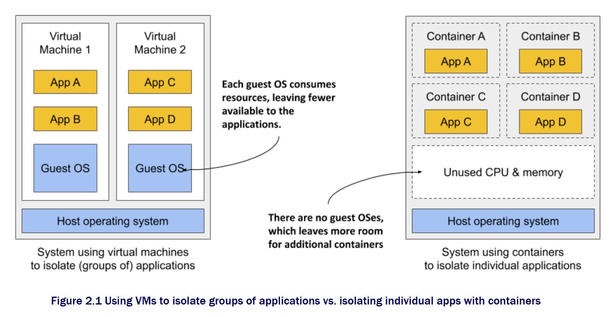


**Cons of hypervisor**

* Hypervisor must run an independent guest OS, which will cost 100\~200MB memory by itself. 
* User process runs inside supervisor and all operations need to be intercepted by hypervisor, resulting in performance cost. 
* On the contrary, since container is just another process, there isn't much performance cost. 

**Cons of container**

* Containers share the same kernel as host. 
  * If you want to use a higher version container on a lower version Linux host, it is not possible. 
  * If you want to use Linux on top of Windows host, it won't be possible. 
* Many resources and objects could not be separated using namespace, such as time. 
  * If your container use SetTimeOfDay and changed the time in the container, then the host's time will also change. 
* Containers expose more security attack surface than hypervisor. Even though technology such as Seccomp could be used, it has performance cost. 

**Commands**

```
$ docker run -it busybox /bin/sh
/ #

/ # ps
PID  USER   TIME COMMAND
  1 root   0:00 /bin/sh
  10 root   0:00 ps
```

**Internals**

```
// find a process id
$ docker inspect --format '{{ .State.Pid }}'  4ddf4638572d
25686

// see all corresponding namespace files
$ ls -l  /proc/25686/ns
  total 0
  lrwxrwxrwx 1 root root 0 Aug 13 14:05 cgroup -> cgroup:[4026531835]
  lrwxrwxrwx 1 root root 0 Aug 13 14:05 ipc -> ipc:[4026532278]
  lrwxrwxrwx 1 root root 0 Aug 13 14:05 mnt -> mnt:[4026532276]
  lrwxrwxrwx 1 root root 0 Aug 13 14:05 net -> net:[4026532281]
  lrwxrwxrwx 1 root root 0 Aug 13 14:05 pid -> pid:[4026532279]
  lrwxrwxrwx 1 root root 0 Aug 13 14:05 pid_for_children -> pid:[4026532279]
  lrwxrwxrwx 1 root root 0 Aug 13 14:05 user -> user:[4026531837]
  lrwxrwxrwx 1 root root 0 Aug 13 14:05 uts -> uts:[4026532277]

// open the namespace file descriptor with setns() command
```

#### Cgroup

* Def: Used to create resource constraints. 

**Categories**


```
// use mount command to display the limit. 
$ mount -t cgroup 

cpuset on /sys/fs/cgroup/cpuset type cgroup (rw,nosuid,nodev,noexec,relatime,cpuset)
cpu on /sys/fs/cgroup/cpu type cgroup (rw,nosuid,nodev,noexec,relatime,cpu)
cpuacct on /sys/fs/cgroup/cpuacct type cgroup (rw,nosuid,nodev,noexec,relatime,cpuacct)
blkio on /sys/fs/cgroup/blkio type cgroup (rw,nosuid,nodev,noexec,relatime,blkio)
memory on /sys/fs/cgroup/memory type cgroup (rw,nosuid,nodev,noexec,relatime,memory)
...
```

**Blkio Cgroup**

* Question: How to guarantee the disk read/write performance when multiple containers read/write?
* Disk performance criteria:
  * IOPS: Input/Output operations per second.
  * Throughput: Bandwidth in MB/s. 
  * Relationship: Throughput = IOPS \* blocksize
* Def of Blkio Cgroup: A subsystem under Cgroup. 

```
// four parameters under Blkio Cgroup
blkio.throttle.read_iops_device
blkio.throttle.read_bps_device
blkio.throttle.write_iops_device
blkio.throttle.write_bps_device
```

* Two Linux I/O modes:
  * Direct I/O
  * Buffered I/O


**Cgroup v1 and v2**

* Under Cgroup v1, each subsystem is independent. 
* Under Cgroup v2, one process could belong to multiple control group. Each control group could contain multiple evaluation criteria (e.g. Blkio Cgroup + Memory Cgroup)

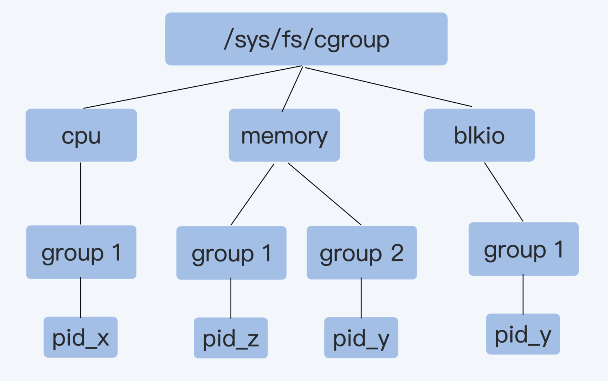

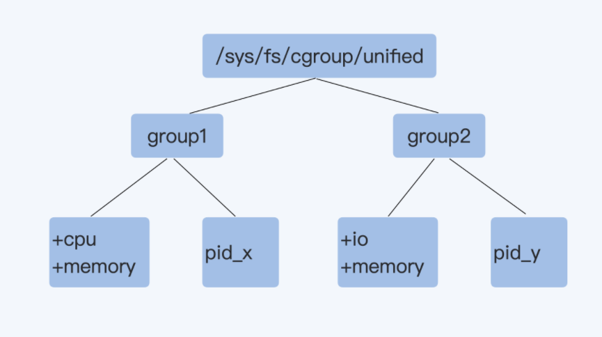

**Cons of Cgroup**

* /Proc directory stores the core status, such as CPU and memory usage. But when using **top** command, it displays the host file system's information. 
* /Proc does not have any knowledge about Cgroup. 

#### Rootfs

**Def**

* A directory on the system that looks like the standard root ( / ) of the operating system.
  * It contains file system and configuration files. 
  * But does not include operating system kernels. 
* Typical files under rootfs

```
$ ls /
bin dev etc home lib lib64 mnt opt proc root run sbin sys tmp usr var
```

* rootfs structure: All seven layers will be mounted under /var/lib/docker/aufs/mnt. 
  * Lowest layers: readonly+whiteout
  * Mid layers: used to store /etc/hosts, /etc/resolv.conf. When docker commit is executed, these config files could be avoided. 
  * Higher layers: read write. Used to store the incremental changes when modifying the rootfs. 

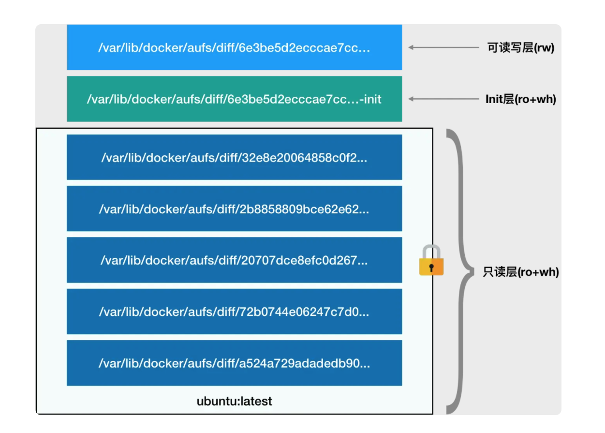

**Mount points**

* Def: Unix file system is organized into a tree structure. Storage devices are attached to specific locations in that tree. These locations are called mount points.
* A mount point contains three parts:
  * The location in the tree
  * The access properties to the data at that point (for example, writability)
  * The source of the data mounted at that point (for example, a specific hard disk, USB device, or memory-backed virtual disk)


#### UnionFS

**Motivation**

* If without a container specific file system, then file systems such as XFS or ext4 need to be used. For these file systems, the entire system needs to be downloaded to each container, resulting in much redundancy. 

**Implementation**

* UnionFS has many implementations, including Docker's AUFS and OverlayFS. Since Linux 3.18, OverlayFS has been part of Linux and default container file system impl. 
* OverlayFS is a modern union filesystem that is similar to AUFS, but faster and with a simpler implementation.
  * Lower layer is readonly.
  * Upper layer is writable and modifiable. 

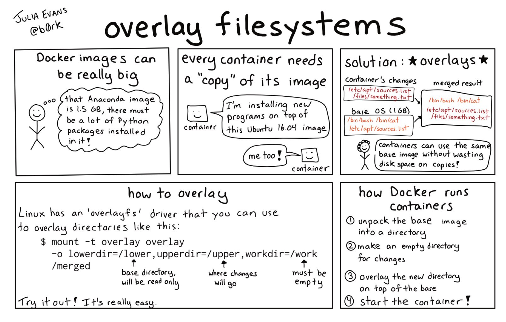

**Limitations**

* For write, it uses Copy-On-Write mechanism, resulting in low efficiency; For read, it also needs to read from top down. 
* The RW layer has the same lifetime as the container. When container stops, the RW layer will disappear. If you need to store the RW layer, you could commit it to the image. 
* There is no mechanism for sharing the data. 


#### Storage quota

* Question: How to set quota for a directory?
* Solution:
  * Tag a project ID on the upperdir
  * Set XFS quota on the project. 

### Docker storage

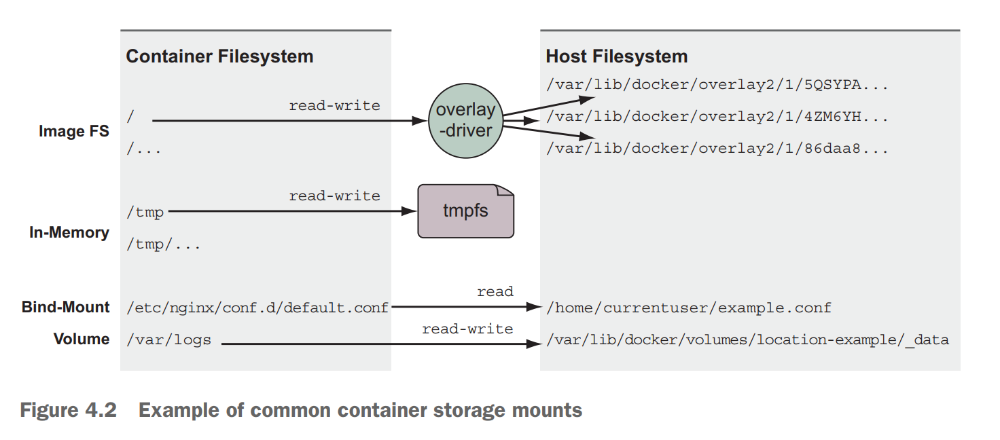

| `Types`      | `Pros`                                                                          | `Cons`                                                       |
| ------------ | ------------------------------------------------------------------------------- | ------------------------------------------------------------ |
| Bind mounts  | Most straightforward/flexible.                                                  | Must explicitly specify a file path on host                  |
| Volumes      | Cross disk/file system; Docker manage volumes, no need to worry about conflict; | Data exist on host could not easily be shared to containers. |
| tmpfs mounts | High performant; Secure                                                         | Could not share among multiple containers                    |

#### Bind mounts (host path)

**Use case**

* Bind mounts are useful when the host provides a file or directory that is needed by a program running in a container, or when that containerized program produces a file or log that is processed by users or programs running outside containers
* History: Exist since Linux 2.4 kernel 2001. 

**Pros**

* Much more performant than unionfilesystem. 
* Across file systems
* Across disks

**Cons**

* It ties otherwise portable container descriptions to the filesystem of a specific host.
* It creates an opportunity for conflict with other containers

**Command**

```
// category 2: --mount format
docker run -d --name test1 --mount type=bind,src=/host/app,dst=/app
```

#### Docker volumes

* Use case: Using volumes is a method of decoupling storage from specialized locations on the filesystem that you might specify with bind mounts.

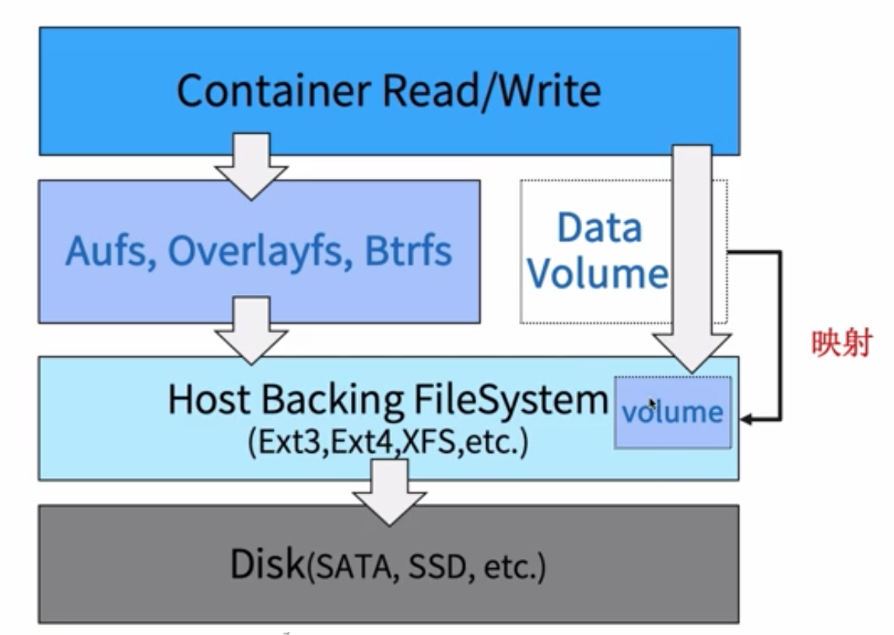

**Pros**

* User does not need to remember a hardcoded hostpath. It only needs to use the correct volume name. 

**Command**

*   docker volume create/rm/ls/inspect/prune \[-d local] volName

    \-v volumeName:containerPath

    \-v containerPath

    \--mount type=volume, src={volumeName}, dest={containerPath}

```
// The following command does not specify host directory path, it will use the default directory /var/lib/docker/volumes/[VOLUME_ID]/_data
$ docker run -v /test ...

// The following command specify /home as host directory path. 
$ docker run -v /home:/test ...
```

**How avoid being docker commited**

* Problem: Will the changes inside /test directory being commited by docker? 
* Solution: 
  * Data inside volume will not be commited by "docker commit" command. 

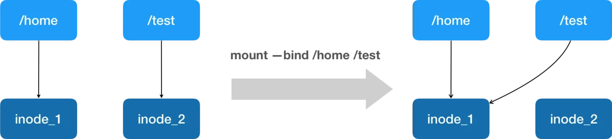

#### In-memory storage

**Use case**

*   Most service software and web applications use private key files, database passwords, API key files, or other sensitive configuration files, and need upload buffering space.

    In these cases, it is important that you never include those types of files in an image or write them to disk. 

**Internal mechanism**

* Linux tmpfs: 

```
mkdir /my-tmp && mount -t tmpfs -o size=20m tmpfs /my-tmp
```

* tmpfs volume

```
docker run -d --name tmptest --mount type=tmpfs, dst=/app, tmpfs-size=10k, busybox:1.24
```

### Linux network

#### Linux Net namespace

* Net namespace will have an independent network stack including 
  * Network interface controller
  * IP/MAC
  * ARP
  * iptables/ipvs
  * Socket
  * Network parameters with namespace attributes

**Connect two net namespaces**

* Linux veth pair


**Connect multiple net namespaces**

* Problem: Use veth pair will result in exponential number of pairs
  * Linux bridge
  * Routing table

### Docker network - Flannel

* Use case: Cross node communication

#### UDP based flannel

**Idea**

* A three layer overlay network by encapsulating the original IP packages under UDP protocol. 


**Process**

* Steps with flowchart
  1. Container A's address is 172.17.8.2/24. 
  2. Container A wants to visit container B 172.17.9.2.
  3. Container A has a default routing rule: **default via 172.17.8.1 dev eth0**
  4. The network package is sent to docker0 bridge (172.17.8.1) according to routing rule.
  5. Physical machine A has a routing rule: **172.17.0.0/24 via 172.17.0.0 dev flannel.1**
  6. A package sent to container B 172.17.9.2 will be transferred to network card flannel.1 (A virtual network card created by process flanneld).
  7. flanneld in machine A will encapsulate network package inside UDP, with machine A/B's IP addresses. 
  8. flanneld in machine A will send it to flanneld in machine B. 
  9. flanneld in machine B will extract the package. 
  10. Physical machine B has a routing rule: **172.17.9.0/24 dev docker0 proto kernel scope link src 172.17.9.1**

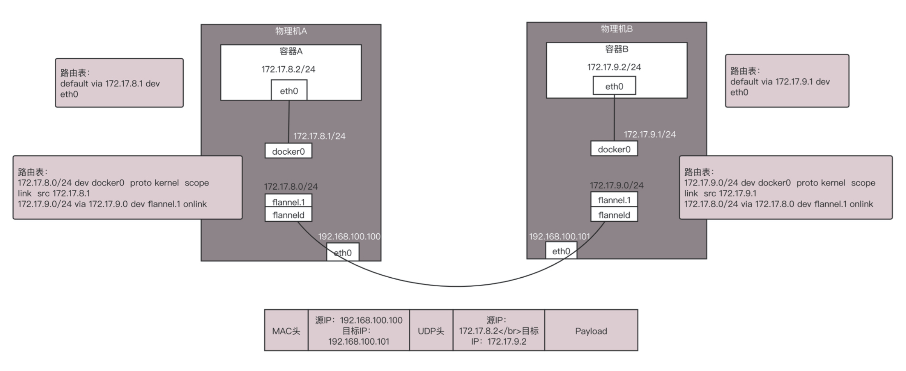

**Limitations**

* Requires copy operation between kernel and user space for three times because packages need to pass through TUN device (flannel0)
  1. User's IP packet passes through docker0 bridge. 
  2. IP packet passes through TUN device (flannel0) and to flanneld process inside user space. 
  3. IP packet gets encapsulated inside UDP protocol and enters kernel space. 

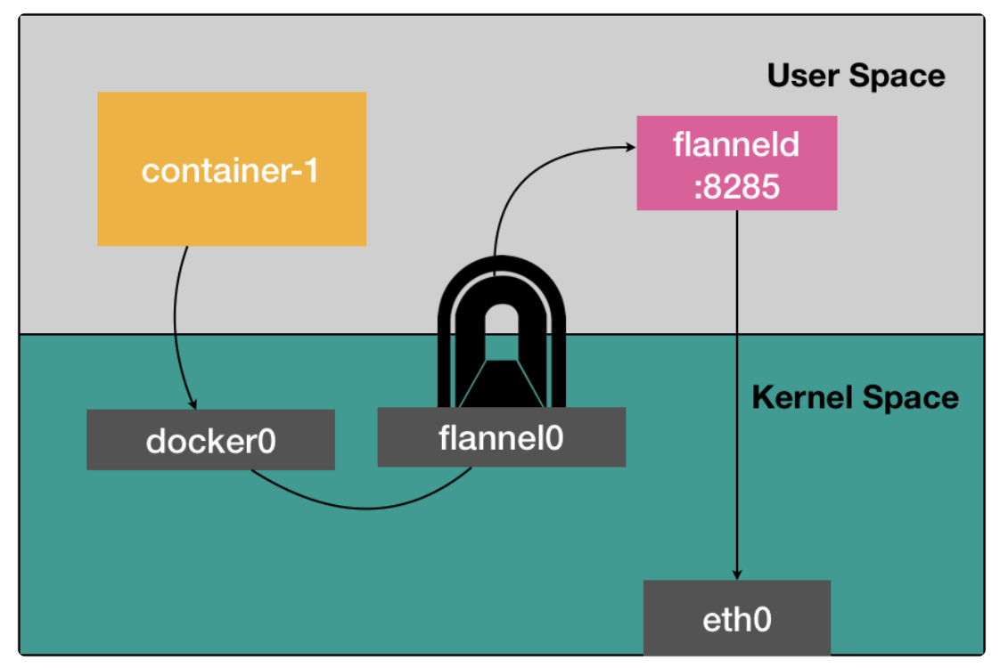

#### VXLAN based flannel

**Idea**

* VXLAN builds a overlay network on top of containers and virtual machines, making them talk to each other freely. It replaces flanneld process with a VTEP device instead of TUN device which operates on the second network layer - ethernet frame. 
* The benefit is that VXLAN avoids the switch between user and kernel space as in UDP based flannel because VXLAN is a linux kernel mode. 

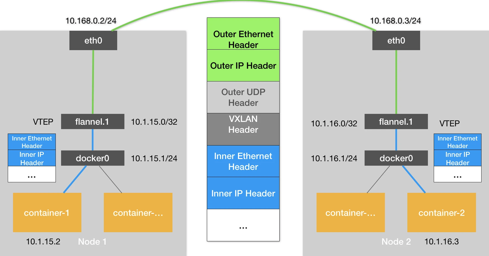

**Process**


#### host-gw based flannel

**Idea**

* Set the next hop of each flannel subset (e.g. 10.244.1.0/24) as host machine's IP address. Host machine will also serve the role of gateway, and that's how this approach is named. 
* When IP packet is packaged as an ethernet frame and sent out, it will use the next hop address inside routing table to set destination MAC address. 
  * Flannel subnet and host machine information are all stored inside etcd. 
  * Flanneld only needs to watch corresponding etcd directory and update routing table. 

**Process**

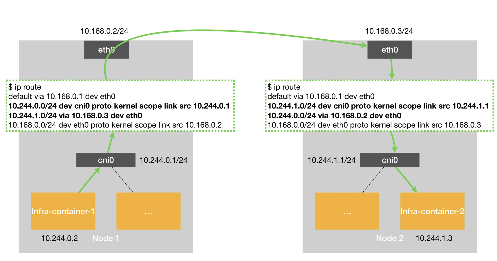

**Limitation**

* It requires that host machines are connected to each other in the second network layer. 
* When host machines are located in different VLANs, they are not connected in the second network layer. 

#### Calico

**Idea**

* Instead of using the etcd to store routing information, it uses the BGP protocol. By not going through overlay network, it avoids the performance cost from the additional abstraction layer. 
* BGP (Border gateway protocol): Store routing information across different autonomous system. It is far more scalable than each machine storing their own routing information. 

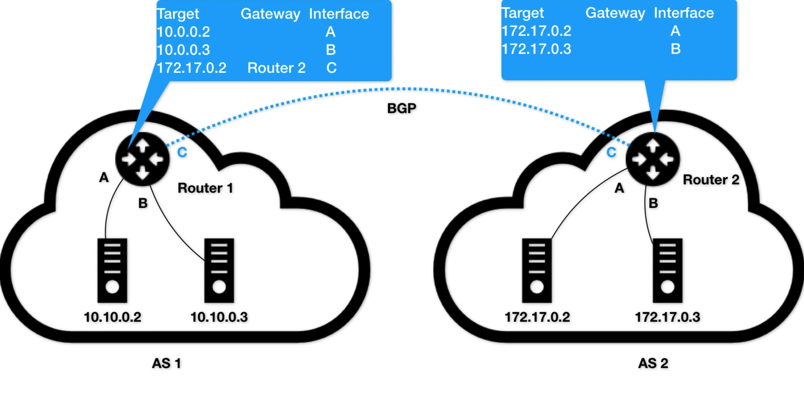

**Components**

* CNI plugin: The place where Calico connects with Kubernetes. 
* Felix: DaemonSet responsible for writing routing rules on host machines and maintain Calico's network devices. 
* Bird: BGP's client, responsible for distributing routing information. 

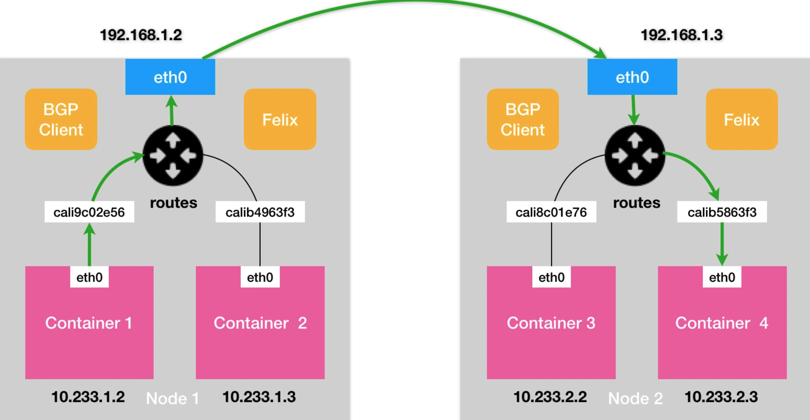

**Modes**

* Node-to-Node Mesh
  * Each BGP client on the host machine needs to establish connection with all other BGP clients. 
  * Cons: As the number of nodes increases, the number of connection will grow exponentially. So typically this mode is used in clusters with fewer than 100 nodes. 
* Route Reflector
  * Designate specific nodes to establish BGP connection with other nodes to learn global routing rules. All other nodes only need to talk with these few nodes. 
* IPIP

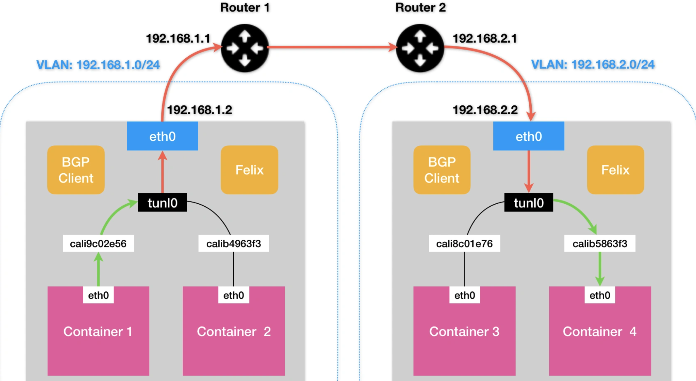

* Set host machine as BGP peers

**Process**

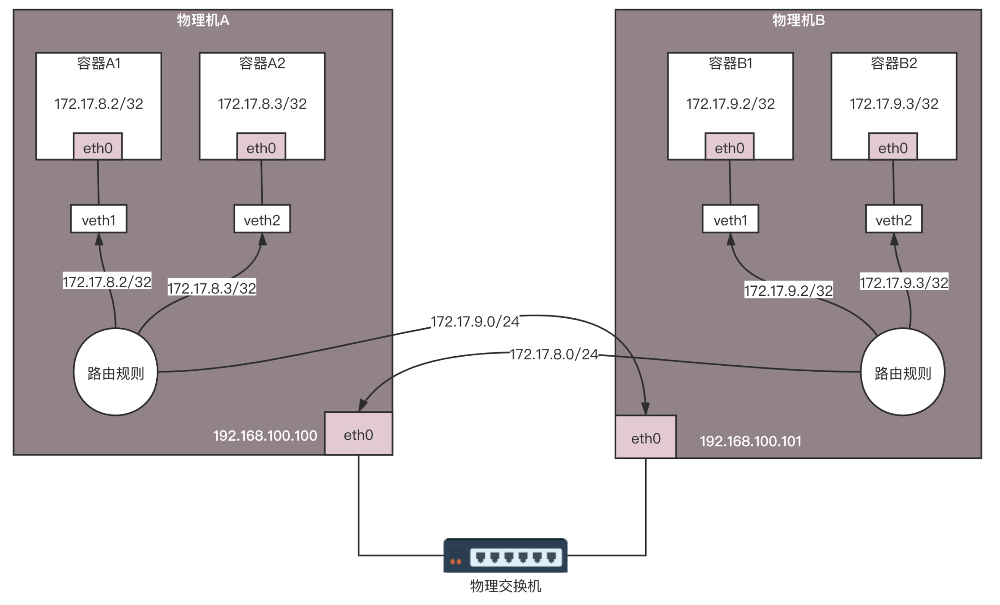

### Docker network

#### Host

#### Bridge


### Docker file

* Write a dockerfile 
  * When each docker file statement runs, an image layer will be generated. 

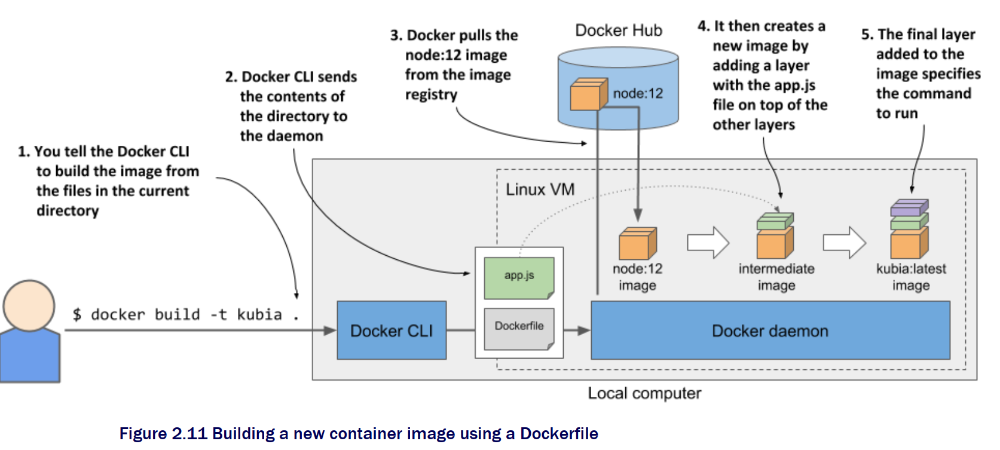

```python
# Use official python image as the base image. 
FROM python:2.7-slim

# Set current directory as /app
WORKDIR /app

# Copy all content under current directory to /app
ADD . /app

# Use pip command to install needed dependencies by the application. 
RUN pip install --trusted-host pypi.python.org -r requirements.txt

# Allow external world visit container's port 80
EXPOSE 80

# Set environment variable
ENV NAME World

# Set container's process as python app.py, namely start the container with this process. ENTRYPOINT of container
CMD ["python", "app.py"]
```

### Docker commands

```
// docker build
$ docker build -t helloworld .

// docker image
$ docker image ls

REPOSITORY            TAG                 IMAGE ID
helloworld         latest              653287cdf998

// docker run
$ docker run -p 4000:80 helloworld

// docker ps
$ docker ps
CONTAINER ID        IMAGE               COMMAND             CREATED
4ddf4638572d        helloworld       "python app.py"     10 seconds ago

// docker tag
$ docker tag helloworld geektime/helloworld:v1

// docker push
$ docker push geektime/helloworld:v1
```

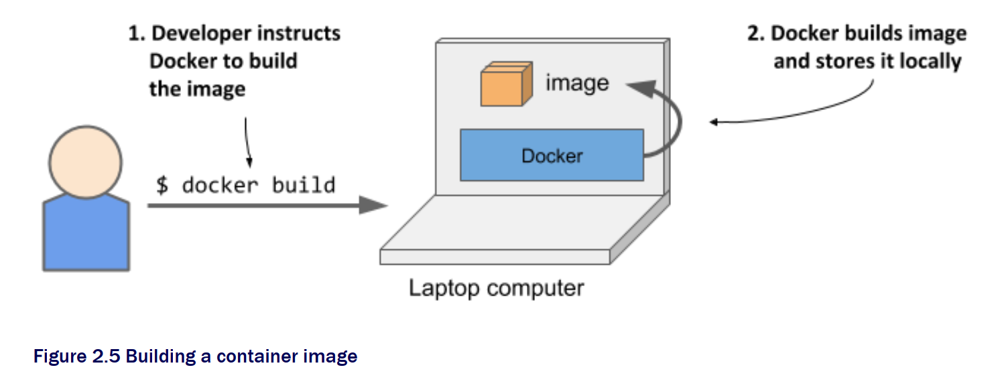

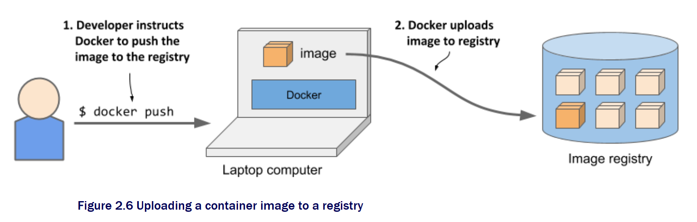

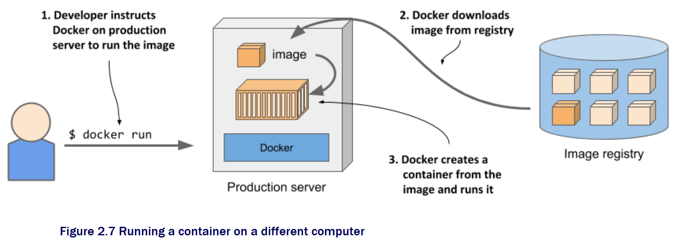

### References

* [container and CICD](https://time.geekbang.org/course/detail/100003901-2279)
* [Why container and Docker](https://time.geekbang.org/column/article/41977)
* [Container management with Mesos](https://time.geekbang.org/course/detail/100003901-2280)
* [Docker image repo and deployment](https://time.geekbang.org/column/article/42167)
* [Docker orchestration](https://time.geekbang.org/column/article/42477)
* [Container DevOps platform](https://time.geekbang.org/column/article/42604)
* [CI, CD](https://time.geekbang.org/column/article/42825)

### Real world

* Netflix container journey: [https://netflixtechblog.com/the-evolution-of-container-usage-at-netflix-3abfc096781b](https://netflixtechblog.com/the-evolution-of-container-usage-at-netflix-3abfc096781b)
