# Container\_Kubernetes-\[TODO\]

* [Kubernetes](container_kubernetes.md#kubernetes)
  * [History](container_kubernetes.md#history)
  * [Use cases](container_kubernetes.md#use-cases)
  * [Components](container_kubernetes.md#components)
    * [Control panel](container_kubernetes.md#control-panel)
      * [Control loop](container_kubernetes.md#control-loop)
      * [Type of controllers](container_kubernetes.md#type-of-controllers)
    * [Workload panel](container_kubernetes.md#workload-panel)
    * [Deployment controller - Horizontal scaling and rolling update](container_kubernetes.md#deployment-controller---horizontal-scaling-and-rolling-update)
    * [StatefulSet controller](container_kubernetes.md#statefulset-controller)
      * [Internals](container_kubernetes.md#internals)
      * [Headless service](container_kubernetes.md#headless-service)
        * [Big picture](container_kubernetes.md#big-picture)
        * [Example definition](container_kubernetes.md#example-definition)
  * [API objects](container_kubernetes.md#api-objects)
    * [Persistent volume / +Claim](container_kubernetes.md#persistent-volume--claim)
      * [Limitations of using volume](container_kubernetes.md#limitations-of-using-volume)
      * [Process](container_kubernetes.md#process)
      * [Internals](container_kubernetes.md#internals-1)
  * [Deploy to Kubernetes](container_kubernetes.md#deploy-to-kubernetes)
  * [Container](container_kubernetes.md#container)
    * [Attributes](container_kubernetes.md#attributes)
      * [ImagePullPolicy](container_kubernetes.md#imagepullpolicy)
      * [LifeCycle](container_kubernetes.md#lifecycle)
    * [Projected volume](container_kubernetes.md#projected-volume)
  * [Pod](container_kubernetes.md#pod)
    * [Motivation](container_kubernetes.md#motivation)
    * [Def](container_kubernetes.md#def)
    * [Use case](container_kubernetes.md#use-case)
      * [Sample: War and webapp](container_kubernetes.md#sample-war-and-webapp)
    * [Attributes](container_kubernetes.md#attributes-1)
      * [NodeSelector](container_kubernetes.md#nodeselector)
      * [NodeName](container_kubernetes.md#nodename)
      * [HostAlias](container_kubernetes.md#hostalias)
      * [Namespace related](container_kubernetes.md#namespace-related)
  * [Network](container_kubernetes.md#network)
    * [Limitation](container_kubernetes.md#limitation)
    * [CNI network model](container_kubernetes.md#cni-network-model)
    * [Calico](container_kubernetes.md#calico)
  * [References](container_kubernetes.md#references)

## Kubernetes

### History

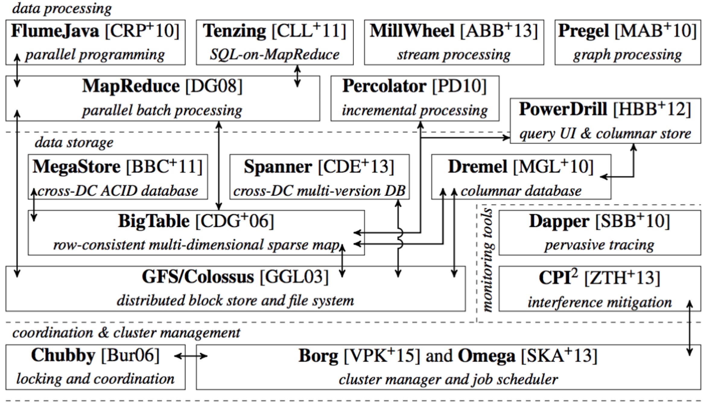

### Use cases

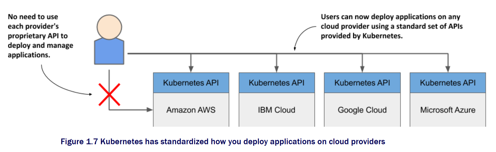

* Kubernetes provides the following:
  * Service discovery
  * Horizontal scaling
  * Load balancing
  * Self-healing 
  * Leader election

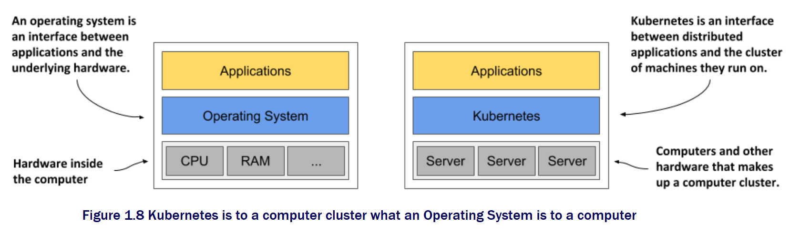

### Components

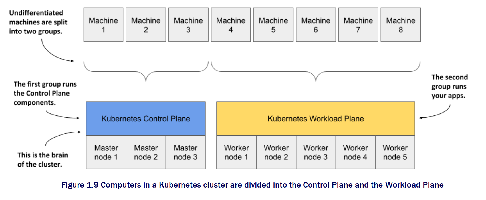

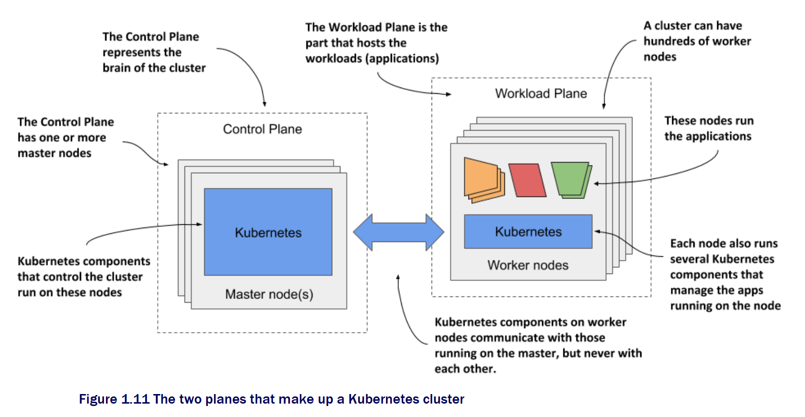

#### Control panel

* The Kubernetes API Server exposes the RESTful Kubernetes API. Engineers using the cluster and other Kubernetes components create objects via this API.
* The etcd distributed datastore persists the objects you create through the API, since the API Server itself is stateless. The Server is the only component that talks to etcd.
* The Scheduler decides on which worker node each application instance should run.
* Controllers bring to life the objects you create through the API. Most of them simply create other objects, but some also communicate with external systems \(for example, the cloud provider via its API\).

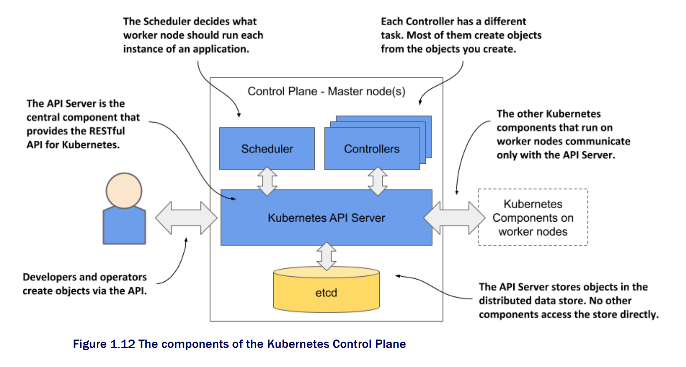

**Control loop**

```text
for {
  Actual state = Obtain object X's actual state inside cluster
  Expected state = Obtain object X's expected state inside cluster
  if actual state == expected state
  {
      do nothing
  }
  else
  {
      perform orchestration behaviors
  }
}
```

**Type of controllers**

```bash
$ cd kubernetes/pkg/controller/
$ ls -d */              
deployment/             job/                    podautoscaler/          
cloud/                  disruption/             namespace/              
replicaset/             serviceaccount/         volume/
cronjob/                garbagecollector/       nodelifecycle/          replication/            statefulset/            daemon/
...
```

#### Workload panel

* The Kubelet, an agent that talks to the API server and manages the applications running on its node. It reports the status of these applications and the node via the API.
* The Container Runtime, which can be Docker or any other runtime compatible with Kubernetes. It runs your applications in containers as instructed by the Kubelet.
* The Kubernetes Service Proxy \(Kube Proxy\) load-balances network traffic between applications. Its name suggests that traffic flows through it, but that’s no longer the case. 

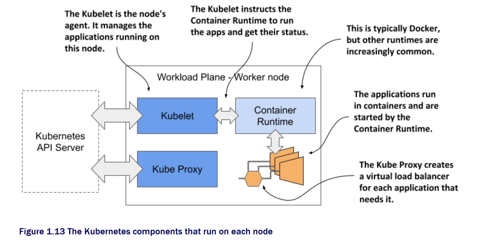

#### Deployment controller - Horizontal scaling and rolling update

* ReplicaSet: Consists of a definition of replica number definition and a pod template. 
* Deployment controller operates on top of replica set, instead of a pod. 

```yaml
apiVersion: apps/v1
kind: ReplicaSet
metadata:
  name: nginx-set
  labels:
    app: nginx
spec:
  replicas: 3
  selector:
    matchLabels:
      app: nginx
  template:
    metadata:
      labels:
        app: nginx
    spec:
      containers:
      - name: nginx
        image: nginx:1.7.9
```

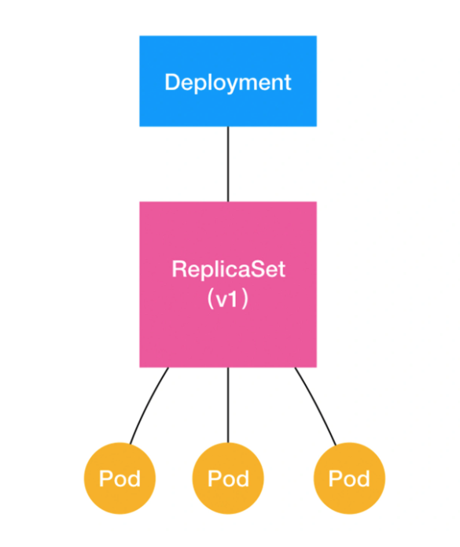

* For deployment, 
  * To support horizontal scaling, it modifies the replica number. 
  * To support rolling upgrade, it adds UP-TO-DATE status. 

#### StatefulSet controller

* Motivation: Limitations of deployment controller - Deployment assumes that all pods are stateless. However, distributed applications usually have states. 
* StatefulSet abstracts application from two perspectives: 
  * Topology status. For example: 
    * Application A must start before application B. 
    * When pods are recreated, they must share the same network identifiers as before. 
  * Storage status. For example:

**Internals**

* What statefulSet manages is pod. 
* Kubernetes number these pods by headless service, and generate DNS records inside DNS servers. As long as the pod numbering stay unchanged, then DNS records don't need to be changed. 
* StatefulSet allocate an independent PVC for each pod. Kubernetes will bind a PV for each PVC by using persistent volume. In this case, even 

**Headless service**

**Big picture**

* Service: Service is a mechanism for applications to expose pods to external env. 
* Two types of ways to visit a service:
  * VIP: A virtual IP maps to an address. 
  * DNS: A domain name maps to an address. And it could be divided into two more types
    * Headless service
    * Normal service

**Example definition**

* The cluster ip is set to None. It means that after the application is created, it will not have a virtual IP address. All it has will be a domain name.

```yaml
apiVersion: v1
kind: Service
metadata:
  name: nginx
  labels:
    app: nginx
spec:
  ports:
  - port: 80
    name: web
  clusterIP: None
  selector:
    app: nginx
```

* And all pods represented by headless service are identified by the labels "app: nginx".

  ```text
  <pod-name>.<svc-name>.<namespace>.svc.cluster.local
  ```

* How the DNS record is used by StatefulSet to record pod topology status?
  * When kubectl create the service according to yaml, it will number the pod as "statefulset name"-"ordinal index"
  * As long as statefulset is not deleted, then when you visit statefulset-0, you will always be landing at app 0; When you visit statefulset-1, you will always be landing at app 1. 

```yaml
apiVersion: apps/v1
kind: StatefulSet
metadata:
  name: web
spec:
  serviceName: "nginx"
  replicas: 2
  selector:
    matchLabels:
      app: nginx
  template:
    metadata:
      labels:
        app: nginx
    spec:
      containers:
      - name: nginx
        image: nginx:1.9.1
        ports:
        - containerPort: 80
          name: web
```

### API objects

#### Persistent volume / +Claim

**Limitations of using volume**

* Requires much knowledge of the storage system themselves. 
* For example, the following volume file for ceph exposes these information
  * Ceph storage user name, storage server locations, authorization file locations
* Persistent volume / claim to rescue. 

```yaml
apiVersion: v1
kind: Pod
metadata:
  name: rbd
spec:
  containers:
    - image: kubernetes/pause
      name: rbd-rw
      volumeMounts:
      - name: rbdpd
        mountPath: /mnt/rbd
  volumes:
    - name: rbdpd
      rbd:
        monitors:
        - '10.16.154.78:6789'
        - '10.16.154.82:6789'
        - '10.16.154.83:6789'
        pool: kube
        image: foo
        fsType: ext4
        readOnly: true
        user: admin
        keyring: /etc/ceph/keyring
        imageformat: "2"
        imagefeatures: "layering"
```

**Process**

1. Have a PVC defining volume attribute

```yaml
kind: PersistentVolumeClaim
apiVersion: v1
metadata:
  name: pv-claim
spec:
  accessModes:
  - ReadWriteOnce
  resources:
    requests:
      storage: 1Gi
```

1. Use the PVC inside pod. 

```yaml
apiVersion: v1
kind: Pod
metadata:
  name: pv-pod
spec:
  containers:
    - name: pv-container
      image: nginx
      ports:
        - containerPort: 80
          name: "http-server"
      volumeMounts:
        - mountPath: "/usr/share/nginx/html"
          name: pv-storage
  volumes:
    - name: pv-storage
      persistentVolumeClaim:
        claimName: pv-claim
```

1. The PV is defined here

```yaml
kind: PersistentVolume
apiVersion: v1
metadata:
  name: pv-volume
  labels:
    type: local
spec:
  capacity:
    storage: 10Gi
  accessModes:
    - ReadWriteOnce
  rbd:
    monitors:
    # 使用 kubectl get pods -n rook-ceph 查看 rook-ceph-mon- 开头的 POD IP 即可得下面的列表
    - '10.16.154.78:6789'
    - '10.16.154.82:6789'
    - '10.16.154.83:6789'
    pool: kube
    image: foo
    fsType: ext4
    readOnly: true
    user: admin
    keyring: /etc/ceph/keyring
```

**Internals**

* PVC is like an interface and PV is implementation. 

### Deploy to Kubernetes

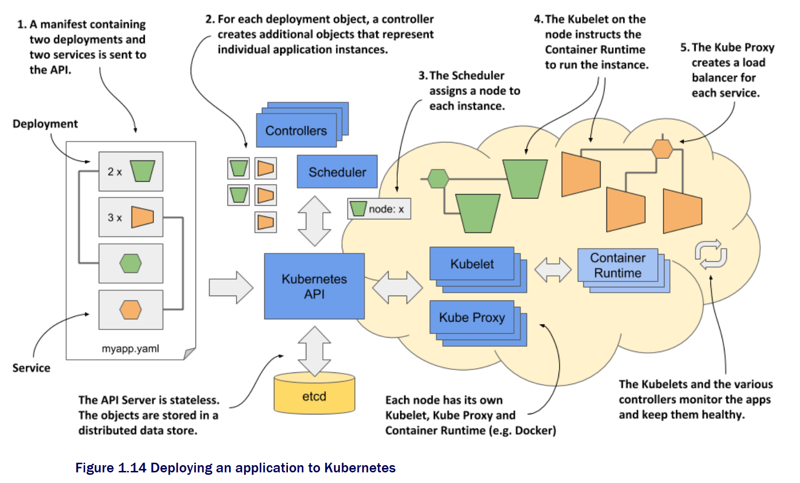

* Pods

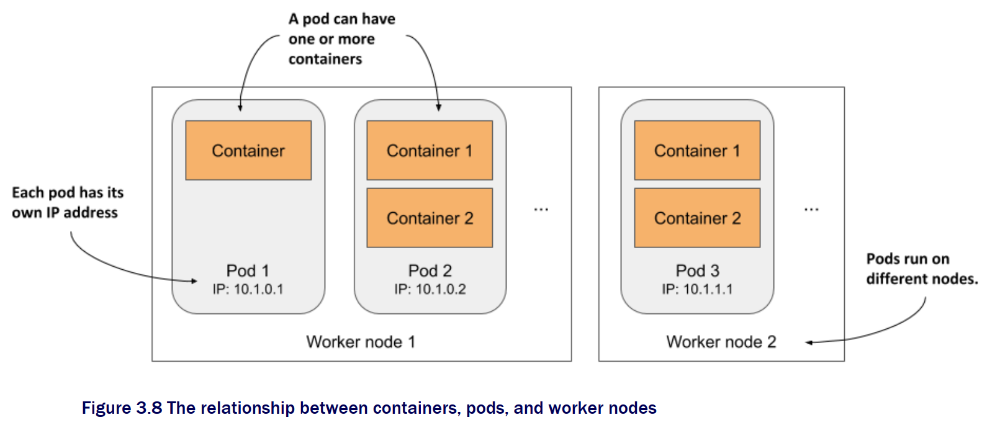

* Objects

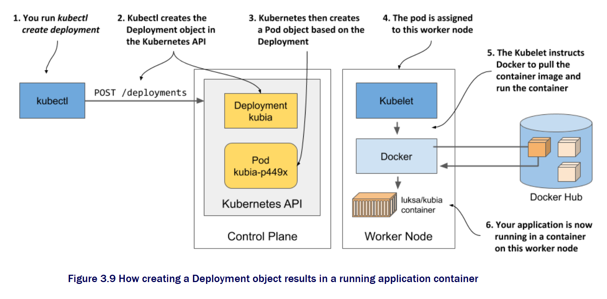

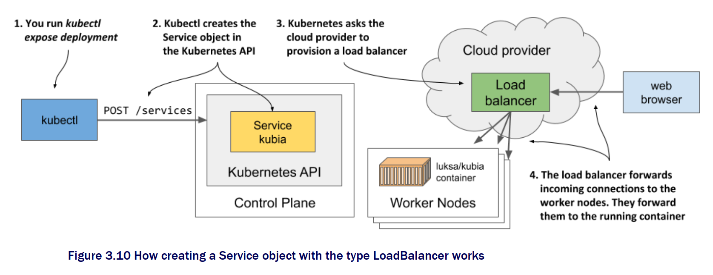

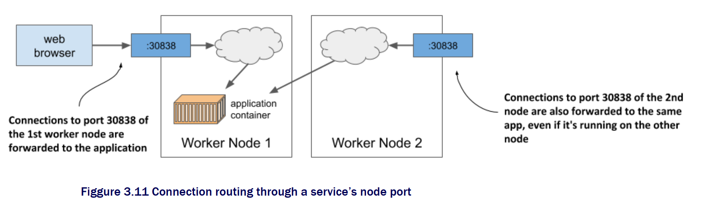

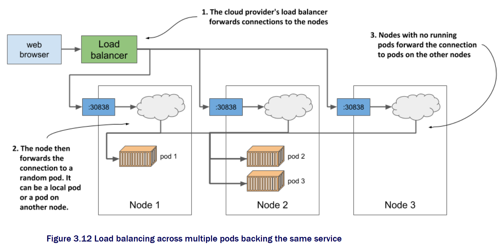

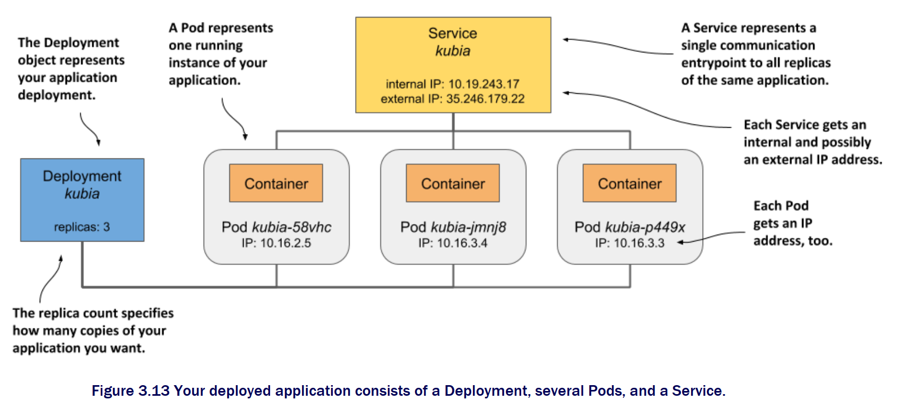

### Container

#### Attributes

**ImagePullPolicy**

* Default value is Always. Each time creating pod will pull the image. 

**LifeCycle**

* For example
  * PostStart: Runs immediately after containers get started. 
  * PreStop: Runs before containers get stopped. 

```yaml
apiVersion: v1
kind: Pod
metadata:
  name: lifecycle-demo
spec:
  containers:
  - name: lifecycle-demo-container
    image: nginx
    lifecycle:
      postStart:
        exec:
          command: ["/bin/sh", "-c", "echo Hello from the postStart handler > /usr/share/message"]
      preStop:
        exec:
          command: ["/usr/sbin/nginx","-s","quit"]
```

#### Projected volume

* Secret: Used to store database credential 
* ConfigMap: Used to store config info that does not need encryption
* Downward API: Used to make pod's info accessible to containers inside pod. 
* ServiceAccountToken: A special type of secret used to store access control related information. 

### Pod

#### Motivation

* There will be the gang scheduling problem: How to orchestrate a group of containers. 
  * Mesos tries to solve using resource hoarding and Google Omega tries to use optimistic lock. 
  * Kubernetes avoid this problem because pod is the smallest unit. 
* Each container is a single process. 
  * Within a container, PID = 1 represents the process itself. And all other processes are the children of PID = 1 process. 
  * There could be many relationships between containers: File exchange, use localhost or socket file for communication, frequent remote procedure call, share some linux namespace. 

#### Def

* Pod is only a logical concept and a group of containers having shared resources. All containers in a pod share the same network namespace and could share the same volume.
* Why can't pod be realized by docker run command?
  * The dependency of starting different containers. 

```text
$ docker run --net=B --volumes-from=B --name=A image-A ...
```

* Kubernetes has an intermediate container: Infra container. Other containers associate with each other by joining infra container's namespace. 
  * Infra container: Written in assembly language and super lightweight. Use a special container image called k8s.gcr.io/pause. It always stay in pause state and only has a size of 100-200KB after decompression. 

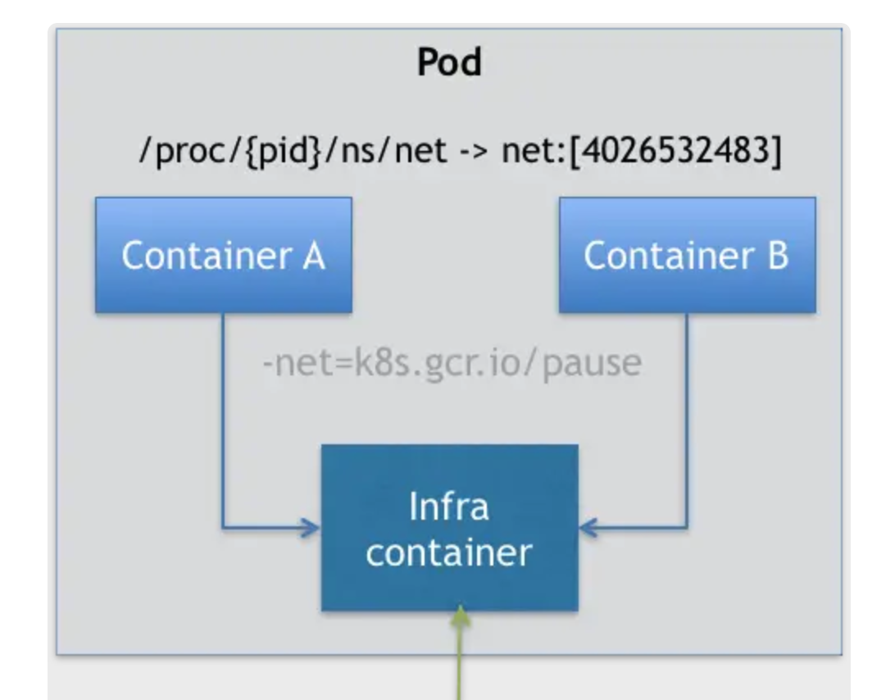

#### Use case

* Container design model: When users want to run multiple applications in a container, they should first think whether they could be designed as multiple containers in a pod. 
* All containers inside a pod share the same network namespace. So network related configuration and management could be completed inside pod namespace. 
* Anything in the machine level \(network, storage, security, orchestration\) or Linux namespace level. 

**Sample: War and webapp**

* Problem: Java web depends on a war. It needs to be put under Tomcat's webapps directory. 
* Tries to solve with docker:
  * Put war under Tomcat's webapps directory. Cons: Will need to update the container image if need to upgrade war. 
  * Reference the war inside volume. Cons: To make the war within volume accessible to multiple containers, need to build a distributed file system. 
* Solution with pod: Side car model. Build war and tomcat into separate container images and combine them inside a pod. 
  * Init type of containers will start before regular containers. 

```yaml
apiVersion: v1
kind: Pod
metadata:
  name: javaweb-2
spec:
  initContainers:
  - image: geektime/sample:v2
    name: war
    command: ["cp", "/sample.war", "/app"]
    volumeMounts:
    - mountPath: /app
      name: app-volume
  containers:
  - image: geektime/tomcat:7.0
    name: tomcat
    command: ["sh","-c","/root/apache-tomcat-7.0.42-v2/bin/start.sh"]
    volumeMounts:
    - mountPath: /root/apache-tomcat-7.0.42-v2/webapps
      name: app-volume
    ports:
    - containerPort: 8080
      hostPort: 8001 
  volumes:
  - name: app-volume
    emptyDir: {}
```

#### Attributes

**NodeSelector**

* Use case: Associated a pod with a node. 

```yaml
// the pod could only run inside a node with ssd tag. 
apiVersion: v1
kind: Pod
...
spec:
 nodeSelector:
   disktype: ssd
```

**NodeName**

* Use case: Orchestration name. 

**HostAlias**

* Use case: Define pod's hosts config file

```yaml
// Define alias foo.remote / bar.remote for host. 
apiVersion: v1
kind: Pod
...
spec:
  hostAliases:
  - ip: "10.1.2.3"
    hostnames:
    - "foo.remote"
    - "bar.remote"
...
```

**Namespace related**

* Use case: Share host network, IPC and PID

```yaml
apiVersion: v1
kind: Pod
metadata:
  name: nginx
spec:
  hostNetwork: true
  hostIPC: true
  hostPID: true
  containers:
  - name: nginx
    image: nginx
  - name: shell
    image: busybox
    stdin: true
    tty: true
```

### Network

#### Limitation

* Problem: Under multi-host environments, two container applications might use the same IP address and will have duplicate registry center entries. 

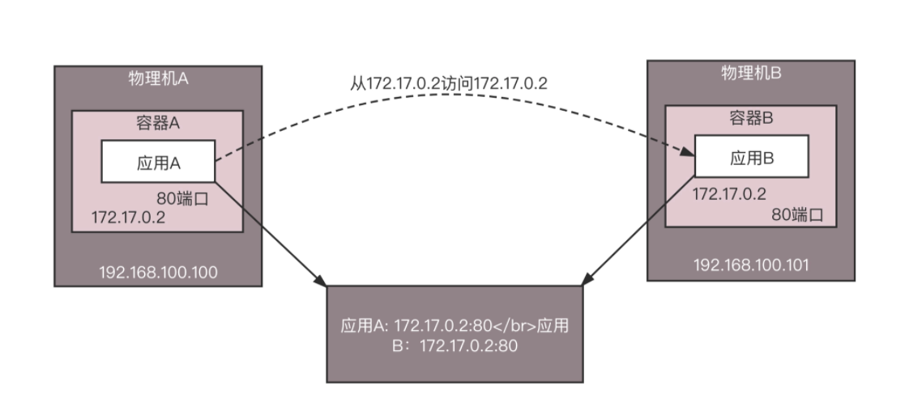

* Solution:
  * Don't use containers' ip address. Use physical machines' ip address. However, this requires containers to know physical machines' ip address and this is bad abstraction from architecture perspective. 

#### CNI network model

* Kubernetes uses a similar model as XLAN and it replaces docker0 with cni0. The reason is 
  * Kubernetes does not use Docker's CNM model.
  * The first step for creating a pod is to create an infra to hold the pod's network namespace. 

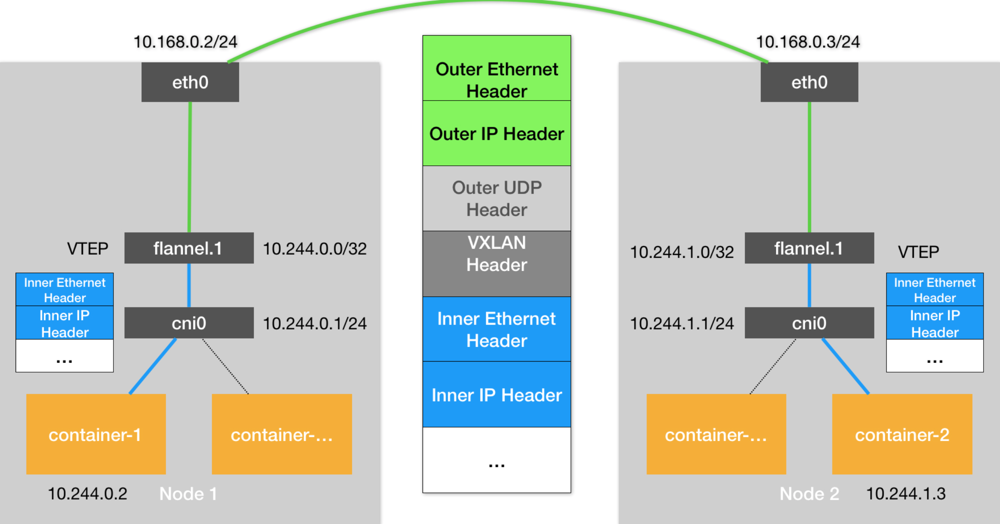

* Within CNI model
  * All containers could use their own IP addresses to communicate with other containers, without using NAT. 
  * All hosts could use their own IP addresses to communicate with other hosts, without using NAT. 
  * Containers see the same self IP address with other containers/hosts. 

#### Calico

### References

* [Kubernetes in Action](https://www.manning.com/books/kubernetes-in-action)
* [深入剖析Kubernetes](https://time.geekbang.org/column/article/40092)

