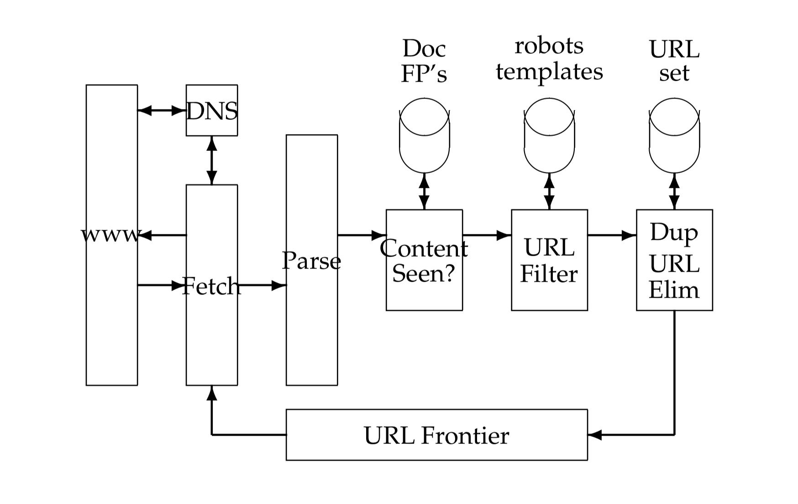

# Crawler

<!-- MarkdownTOC -->

- [Requirements](#requirements)
    - [Core](#core)
    - [Optional](#optional)
- [Estimation](#estimation)
- [Simple design](#simple-design)
    - [A single threaded web crawler](#a-single-threaded-web-crawler)
    - [A distributed web crawler](#a-distributed-web-crawler)
- [Scalable Design](#scalable-design)
    - [Flow chart](#flow-chart)
    - [Component](#component)
        - [URL frontier](#url-frontier)
        - [DNS resolution](#dns-resolution)
- [Service](#service)
- [Scale](#scale)
    - [How to identify whether a page has been crawled before](#how-to-identify-whether-a-page-has-been-crawled-before)
    - [How to support recrawl](#how-to-support-recrawl)
    - [Shard task table](#shard-task-table)
    - [How to handle update for failure](#how-to-handle-update-for-failure)
    - [How to handle dead cycle](#how-to-handle-dead-cycle)
    - [Multi-region](#multi-region)
- [Appendix - Threading programs](#appendix---threading-programs)
    - [A simplistic news crawler](#a-simplistic-news-crawler)
        - [A multi-threaded web crawler](#a-multi-threaded-web-crawler)
    - [Initial implementation](#initial-implementation)
    - [Improve with Condition](#improve-with-condition)
    - [Add a max size on the queue](#add-a-max-size-on-the-queue)
    - [Use a queue instead](#use-a-queue-instead)
- [Reference](#reference)

<!-- /MarkdownTOC -->

## Requirements
### Core
* Robutness: The Web contains servers that create spider traps, which are generators of web pages that mislead crawlers into getting stuck fetching an infinite number of pages in a particular domain. Crawlers must be designed to be resilient to such traps. Not all such traps are malicious; some are the inadvertent side-effect of faulty website development.
* Politeness: Web servers have both implicit and explicit policies regulating the rate at which a crawler can visit them. These politeness policies must be respected.

### Optional
* Distributed: The crawler should have the ability to execute in a distributed fashion across multiple machines.
* Scalable: The crawler architecture should permit scaling up the crawl rate by adding extra machines and bandwidth.
* Performance and efficiency: The crawl system should make efficient use of various system resources including processor, storage and network bandwidth.
* Quality: Given that a significant fraction of all web pages are of poor utility for serving user query needs, the crawler should be biased towards fetching “useful” pages first.
* Freshness: In many applications, the crawler should operate in continuous mode: it should obtain fresh copies of previously fetched pages. A search engine crawler, for instance, can thus ensure that the search engine’s index contains a fairly current representation of each indexed web page. For such continuous crawling, a crawler should be able to crawl a page with a frequency that approximates the rate of change of that page.
* Extensible: Crawlers should be designed to be extensible in many ways –
to cope with new data formats, new fetch protocols, and so on. This demands that the crawler architecture be modular.

## Estimation
* Crawler process
    1. Get the domain URL from a queue
    2. Download the front page (path: "/") and robots.txt file
    3. Parse all links to other domains
    4. Check if the discovered links to external domains have already been
    analysed
    5. If they haven’t, put them on a queue.If they have, update an incoming
    link counter
    6. Save the collected information about the site to the database.
    7. Optionally: Save the sites HTML and HTTP headers to the database

* For every link to a domain encountered, the following operations are needed:
    1. Check if this domain is already in the data store
    2. Insert the link into the queue OR increment a incoming link counter

* ops = dps * (2 * elpd) + is
    - ops = back-end i/o operations per second
    - dps = number of processed domains per second. The initial target for the crawler are 10 domains per second (about
864.000 domains per day)
    - elpd = external links per domain. Information about this number can be found in several other papers. For our calculation, we assume an average of 7.5 external links per web page. 
    - is = amount of operations needed for storing the collected information. depending on the back-end, this might only be 1 write operation (e.g. a single SQL INSERT)

* With these numbers, we end up with approximately: 10 ∗ (2 ∗ 7:5) + 1 + 2 ∗ (0:005) ≈ 151 operations per second on our back-end system just for crawling the front page alone.

* Given seeds, crawl the web
    - How many web pages?
        + 1 trillion web pages
    - How long? 
        + Crawl all of them every week
    - How large?
        + Average size of a web page: 10k
        + 10p web page storage

## Simple design
### A single threaded web crawler
* Input: Url seeds
* Output: List of urls
* [Producer-consumer implementation in Python](http://agiliq.com/blog/2013/10/producer-consumer-problem-in-python/)

```
// breath first search, single-threaded crawler
function run
    while ( url_queue not empty )
        url = url_queue.dequeue()
        html = web_page_loader.load( url ) // consume
        url_list = url_extractor.extract( html ) // produce
        url_queue.enqueue_all( url_list )
    end
```

### A distributed web crawler
* URL queue is inside memory. Queue is too big to completely fit into memory. Use a MySQL DB task table
    - state (working/idle): Whether it is being crawling.
    - priority (1/0): 
    - available time: frequency. When to fetch the next time.

| id | url                     | state     | priority | available_time        | 
|----|-------------------------|-----------|----------|-----------------------| 
| 1  | “http://www.sina.com/”  | “idle”    | 1        | “2016-03-04 11:00 am” | 
| 2  | “http://www.sina1.com/” | “working” | 1        | “2016-03-04 12:00 am” | 
| 3  | “http://www.sina2.com/” | “idle”    | 0        | “2016-03-14 02:00 pm” | 
| 4  | “http://www.sina3.com/” | “idle”    | 2        | “2016-03-12 04:25 am” | 

## Scalable Design
### Flow chart
* 

1. Starts with taking a URL from the frontier and fetching the web page at that web page. 
2. The page is parsed and the link within it is extracted. 
3. Each extracted link goes through a series of tests to determine whether the link should be added to the URL frontier.
    + First, the thread tests whether a web page with the same content has already been seen at another URL. The simplest implementation for this would use a simple fingerprint such as a checksum. A more sophisticated test would use shingles instead of fingerprints. (What is Shingles ???)            
    + Next, a URL filter is used to determine whether the extracted URL should be excluded from the frontier based on one of several tests. For instance, the crawl may seek to exclude certain domains (say, all .com URLs) – in this case the test would simply filter out the URL if it were from the .com domain.
        - Many hosts on the Web place certain portions of their websites off-limits to crawling, under a standard known as the Robots Exclusion Protocol. This is done by placing a file with the name robots.txt at the root of the URL hierarchy at the site. Here is an example robots.txt file that specifies that no robot should visit any URL whose position in the file hierarchy starts with /yoursite/temp/, except for the robot called “searchengine”.
    + Then a URL should be normalized. Often the HTML encoding of a link from a web page p indicates the target of that link relative to the page p. 

### Component
#### URL frontier


* A set of front queues: Prioritization
    - A prioritizer first assigns to the URL an integer priority i between 1 and F based on its fetch history (taking into account the rate at which the web page at this URL has changed between previous crawls). 
        + Frequency of change: For instance, a document that has exhibited frequent change would be assigned a higher priority. 
        + Other heuristics (application-dependent and explicit) – for instance, URLs from news services may always be assigned the highest priority. 
    - Now that it has been assigned priority i, the URL is now appended to the ith of the front queues
    - Two important considerations govern the order in which URLs are returned by the frontier. 
        + First, high-quality pages that change frequently should be prioritized for frequent crawling. Thus, the priority of a page should be a function of both its change rate and its quality (using some reasonable quality estimate). The combination is necessary because a large number of spam pages change completely on every fetch.
        + We must avoid repeated fetch requests to a host within a short time span. The likelihood of this is exacerbated because of a form of locality of reference: many URLs link to other URLs at the same host. A common heuristic is to insert a gap between successive fetch requests to a host that is an order of magnitude larger than the time taken for the most recent fetch from that host.
    - An importance score will be assigned to each URL which we discover and then crawl them accordingly. We use Redis sorted sets to store the priority associated with each URL and hashes to store the visited status of the discovered URLs. This, of course, comes with a large memory footprint.

* A set of back queues: Politeness
    - Each of the B back queues maintains the following invariants: 
        + (i) it is non- empty while the crawl is in progress 
        + (ii) it only contains URLs from a single host
    - An auxiliary table T is used to maintain the mapping from hosts to back queues. Whenever a back-queue is empty and is being re-filled from a front-queue, table T must be updated accordingly.
    - Process
        1. A crawler thread requesting a URL from the frontier extracts the root of this heap and (if necessary) waits until the corresponding time entry te. 
        2. It then takes the URL u at the head of the back queue j corresponding to the extracted heap root, and proceeds to fetch the URL u. 
        3. After fetching u, the calling thread checks whether j is empty. 
        4. If so, it picks a front queue and extracts from its head a URL v. The choice of front queue is biased (usually by a random process) towards queues of higher priority, ensuring that URLs of high priority flow more quickly into the back queues. We examine v to check whether there is already a back queue holding URLs from its host. 
        5. If so, v is added to that queue and we reach back to the front queues to find another candidate URL for insertion into the now-empty queue j. 
        6. This process continues until j is non-empty again. In any case, the thread inserts a heap entry for j with a new earliest time te based on the properties of the URL in j that was last fetched (such as when its host was last contacted as well as the time taken for the last fetch), then continues with its processing. For instance, the new entry te could be the current time plus ten times the last fetch time.


#### DNS resolution
* DNS resolution is a well-known bottleneck in web crawling. Due to the distributed nature of the Domain Name Service, DNS resolution may entail multiple requests and round-trips across the internet, requiring seconds and sometimes even longer. Right away, this puts in jeopardy our goal of fetching several hundred documents a second. 
    - A standard remedy is to introduce caching: URLs for which we have recently performed DNS lookups are likely to be found in the DNS cache, avoiding the need to go to the DNS servers on the internet. However, obeying politeness constraints limits the of cache hit rate.
    - https://nlp.stanford.edu/IR-book/pdf/20crawl.pdf for more details.

## Service
* Crawler service
* Task service
* Storage service

## Scale
### How to identify whether a page has been crawled before
* A Bloom filter is a probabilistic data structure and is used for answering set-existential questions (eg: has this URL been crawled before?). Due its probabilistic nature, it can give erroneous results in the form of false positives. You can however tweak the error rate, allowing for only a small number of false positives. The great benefit is the large amount of memory you can save (much more memory efficient than Redis Hashes). If we start crawling pages in the hundreds of millions, we definitely would have to switch to this data structure. As for the false positives, well, there ain’t no harm in occasionally crawling the same page twice.

### How to support recrawl
* In scenarios where the goal is the build the product history, recrawling of pages need to be done intelligently. Pages that frequently change their prices should be crawled more often when compared with pages that don't change at all. 

### Shard task table
* Horizontal sharding

### How to handle update for failure
* Exponential back-off
	- Success: crawl after 1 week
	- no.1 failure: crawl after 2 weeks
	- no.2 failure: crawl after 4 weeks
	- no.3 failure: crawl after 8 weeks

### How to handle dead cycle
* Too many web pages in sina.com, the crawler keeps crawling sina.com and don't crawl other websites
* Use quota (10%)

### Multi-region
* When Google's webpage crawls China's webpages, it will be really really slow. Deploy crawler servers in multiple regions.


## Appendix - Threading programs
### A simplistic news crawler
* Given the URL of news list page
    1. Send an HTTP request and grab the content of the news list page
    2. Extract all the news titles from the news list page. (Regular expressions)

```python
import urllib2
url = 'http://tech.163.com/it'
// get html
request = urllib2.Request(url)
response = urllib2.urlopen(request)
page = response.read()

// extract info using regular expressions
```

#### A multi-threaded web crawler
* How different threads work together
    - sleep: Stop a random interval and come back to see whether the resource is available to use. 
    - condition variable: As soon as the resource is released by other threads, you could get it immediately.
    - semaphore: Allowing multiple number of threads to occupy a resource simultaneously. Number of semaphore set to 1. 
* However, more threads doesn't necessarily mean more performance. The number of threads on a single machine is limited because:
    - Context switch cost ( CPU number limitation )
    - Thread number limitation
        + TCP/IP limitation on number of threads
    - Network bottleneck for single machine

### Initial implementation
* Problem: At some point, consumer has consumed everything and producer is still sleeping. Consumer tries to consume more but since queue is empty, an IndexError is raised.
* Correct bnehavior: When there was nothing in the queue, consumer should have stopped running and waited instead of trying to consume from the queue. And once producer adds something to the queue, there should be a way for it to notify the consumer telling it has added something to queue. So, consumer can again consume from the queue. And thus IndexError will never be raised.


```python
from threading import Thread, Lock
import time
import random

queue = []
lock = Lock()

# Producer keeps on adding to the queue 
class ProducerThread(Thread):
    def run(self):
        nums = range(5) #Will create the list [0, 1, 2, 3, 4]
        global queue
        while True:
            num = random.choice(nums) #Selects a random number from list [0, 1, 2, 3, 4]

            # queue is kept inside lock to avoid race condition
            lock.acquire()
            queue.append(num)
            print "Produced", num 
            lock.release()

            time.sleep(random.random())

# Consumer keeps on removing from the queue
class ConsumerThread(Thread):
    def run(self):
        global queue
        while True:

            # queue is kept inside lock to avoid race condition
            lock.acquire()
            if not queue:
                print "Nothing in queue, but consumer will try to consume"
            num = queue.pop(0)
            print "Consumed", num 
            lock.release()

            time.sleep(random.random())

# start one producer thread and one consumer thread
ProducerThread().start()
ConsumerThread().start()

```

### Improve with Condition
* Condition object allows one or more threads to wait until notified by another thread. And this is exactly what we want. We want consumer to wait when the queue is empty and resume only when it gets notified by the producer. Producer should notify only after it adds something to the queue. So after notification from producer, we can be sure that queue is not empty and hence no error can crop if consumer consumes.
    - Condition is always associated with a lock
    - A condition has acquire() and release() methods that call the corresponding methods of the associated lock. Condition provides acquire() and release() which calls lock's acquire() and release() internally, and so we can replace lock instances with condition instances and our lock behaviour will keep working properly.
    - Consumer needs to wait using a condition instance and producer needs to notify the consumer using the condition instance too. So, they must use the same condition instance for the wait and notify functionality to work properly.

```python
from threading import Condition

condition = Condition()

class ConsumerThread(Thread):
    def run(self):
        global queue
        while True:
            condition.acquire()

            # Check if the queue is empty before consuming. If yes then call wait() on condition instance. 
            # wait() blocks the consumer and also releases the lock associated with the condition. This lock was held by consumer, so basically consumer loses hold of the lock.
            # Now unless consumer is notified, it will not run.
            if not queue:
                print "Nothing in queue, consumer is waiting"
                condition.wait()
                print "Producer added something to queue and notified the consumer"
            num = queue.pop(0)
            print "Consumed", num 
            condition.release()
            time.sleep(random.random())

class ProducerThread(Thread):
    def run(self):
        nums = range(5)
        global queue
        while True:
            # Producer can acquire the lock because lock was released by consumer
            condition.acquire()

            # Producer puts data in queue and calls notify() on the condition instance.
            num = random.choice(nums)
            queue.append(num)
            print "Produced", num 

            # Once notify() call is made on condition, consumer wakes up. But waking up doesn't mean it starts executing. notify() does not release the lock. Even after notify(), lock is still held by producer.
            condition.notify()

            # Producer explicitly releases the lock by using condition.release().
            condition.release()

            # And consumer starts running again. Now it will find data in queue and no IndexError will be raised.
            time.sleep(random.random())            
```

### Add a max size on the queue

```python
from threading import Thread, Condition
import time
import random

queue = []
MAX_NUM = 10
condition = Condition()

class ProducerThread(Thread):
    def run(self):
        nums = range(5)
        global queue
        while True:
            condition.acquire()

            # Before putting data in queue, producer should check if the queue is full. 
            if len(queue) == MAX_NUM:
                # If the queue is full, producer must wait. So call wait() on condition instance to accomplish this.
                # This gives a chance to consumer to run. Consumer will consume data from queue which will create space in queue.
                print "Queue full, producer is waiting"

                # And then consumer should notify the producer.
                condition.wait()
                print "Space in queue, Consumer notified the producer"

            # Once consumer releases the lock, producer can acquire the lock and can add data to queue.    
            num = random.choice(nums)
            queue.append(num)
            print "Produced", num
            condition.notify()
            condition.release()
            time.sleep(random.random())


class ConsumerThread(Thread):
    def run(self):
        global queue
        while True:
            condition.acquire()
            if not queue:
                print "Nothing in queue, consumer is waiting"
                condition.wait()
                print "Producer added something to queue and notified the consumer"
            num = queue.pop(0)
            print "Consumed", num
            condition.notify()
            condition.release()
            time.sleep(random.random())


ProducerThread().start()
ConsumerThread().start()
```

### Use a queue instead
* Queue encapsulates the behaviour of Condition, wait(), notify(), acquire() etc.

```python
from threading import Thread
import time
import random
from Queue import Queue

queue = Queue(10)

class ProducerThread(Thread):
    def run(self):
        nums = range(5)
        global queue
        while True:
            num = random.choice(nums)
            # Producer uses put available on queue to insert data in the queue.
            # put() has the logic to acquire the lock before inserting data in queue.
            # Also put() checks whether the queue is full. If yes, then it calls wait() internally and so producer starts waiting.
            queue.put(num)
            print "Produced", num
            time.sleep(random.random())


class ConsumerThread(Thread):
    def run(self):
        global queue
        while True:
            # Consumer uses get.
            # get() acquires the lock before removing data from queue.
            # get() checks if the queue is empty. If yes, it puts consumer in waiting state.
            # get() and put() has proper logic for notify() too. Why don't you check the source code for Queue now?
            num = queue.get()
            queue.task_done()
            print "Consumed", num
            time.sleep(random.random())


ProducerThread().start()
ConsumerThread().start()
```


## Reference
* [blog post](http://agiliq.com/blog/2013/10/producer-consumer-problem-in-python/)