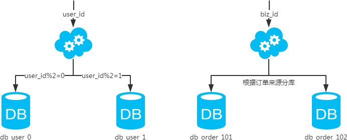

<!-- MarkdownTOC -->

- [Read-write separation](#read-write-separation)
	- [Replication delay between slave and master](#replication-delay-between-slave-and-master)
- [Optimization](#optimization)
	- [Performance factors](#performance-factors)
	- [Optimize on Query level](#optimize-on-query-level)
		- [Solution 1](#solution-1)
		- [Solution 2](#solution-2)
	- [Reduce join](#reduce-join)
		- [Have redundancy](#have-redundancy)
		- [Merge in business level](#merge-in-business-level)
- [High availability](#high-availability)
	- [Monitor](#monitor)
	- [Failover](#failover)
- [Sharding](#sharding)
	- [Motivations](#motivations)
		- [Performance](#performance)
		- [Scale](#scale)
			- [IO bottleneck](#io-bottleneck)
			- [CPU bottleneck](#cpu-bottleneck)
	- [Approaches](#approaches)
		- [Vertical sharding](#vertical-sharding)
		- [Horizontal sharding](#horizontal-sharding)
	- [Query](#query)
		- [Query on single nonpartition key](#query-on-single-nonpartition-key)
		- [Scenario](#scenario)
		- [Mapping based approach](#mapping-based-approach)
		- [Gene based approach](#gene-based-approach)
	- [Scale out](#scale-out)
		- [Database](#database)
		- [Table](#table)
	- [Limitations](#limitations)
		- [Cross shard joins](#cross-shard-joins)
		- [AUTO_INCREMENT columns](#auto_increment-columns)
	- [Sharding Proxy](#sharding-proxy)
	- [Sharding](#sharding-1)
		- [Number of shards](#number-of-shards)
			- [The size of a table](#the-size-of-a-table)
				- [Theoretical limitation](#theoretical-limitation)
				- [Practical limitation](#practical-limitation)
		- [Choose the shard key](#choose-the-shard-key)
		- [???IM分库分表例子-玄姐](#im%E5%88%86%E5%BA%93%E5%88%86%E8%A1%A8%E4%BE%8B%E5%AD%90-%E7%8E%84%E5%A7%90)
			- [Limitations](#limitations-1)
				- [Cross shard joins](#cross-shard-joins-1)
				- [AUTO_INCREMENT columns](#auto_increment-columns-1)
- [NoSQL](#nosql)
	- [NoSQL vs SQL](#nosql-vs-sql)
	- [NoSQL flavors](#nosql-flavors)
		- [Key-value](#key-value)
		- [Document](#document)
		- [Column-Family](#column-family)
		- [Graph](#graph)
	- [Lookup service](#lookup-service)
		- [Features](#features)
		- [Services](#services)
		- [Storage](#storage)
			- [Initial solution](#initial-solution)
			- [How to support lookup for files in one disk](#how-to-support-lookup-for-files-in-one-disk)
				- [Architecture](#architecture)
				- [Read optimization](#read-optimization)
				- [Read process](#read-process)
			- [Distributed lookup](#distributed-lookup)
				- [Master slave](#master-slave)
				- [Final read process](#final-read-process)
	- [Big table](#big-table)
		- [Features](#features-1)
		- [Services](#services-1)
		- [Storage](#storage-1)
			- [Initial design](#initial-design)
			- [Balance read/write complexity](#balance-readwrite-complexity)
			- [Store the Nth table/file in memory](#store-the-nth-tablefile-in-memory)
			- [Save disk space](#save-disk-space)
			- [Optimize read](#optimize-read)
				- [Optimize read with index](#optimize-read-with-index)
				- [Optimize read with Bloom filter](#optimize-read-with-bloom-filter)
			- [Standalone final solution](#standalone-final-solution)
				- [Terminologies](#terminologies)
				- [Read process](#read-process-1)
				- [Write process](#write-process)
		- [Scale](#scale-1)
			- [Master slave model](#master-slave-model)
				- [Read process](#read-process-2)
				- [Write process](#write-process-1)
			- [Too much data to store on slave local disk](#too-much-data-to-store-on-slave-local-disk)
				- [Read/Write process](#readwrite-process)
			- [Race condition](#race-condition)
				- [Read process](#read-process-3)
				- [Write process](#write-process-2)

<!-- /MarkdownTOC -->

# Read-write separation
## Replication delay between slave and master
* Solution1: After write to master, write to cache as well. 
	- What if write to cache fails
		+ If read from master, slave useless
		+ If read from slave, still replication delay
* Solution2: If cannot read from slave, then read from master. 
	+ It works for DB add operation
	+ It doesn't work for DB update operation
* Solution3: If master and slave are located within the same location, synchronous replication
* Solution4: Shard the data


# Optimization
## Performance factors
* Unpractical needs

```
Select count(*) from infoTable
```

* Deep paging

## Optimize on Query level
### Solution 1

```
SELECT id, subject, url FROM photo WHERE user_id = 1 LIMIT 10
SELECT COUNT(*) FROM photo_comment WHERE photo_id = ?
```

### Solution 2

```
SELECT id, subject, url FROM photo WHERE user_id = 1 LIMIT 10
SELECT photo_id, count(*) FROM photo_comment WHERE photo_id IN() GROUP BY photo_id
```

## Reduce join
### Have redundancy
### Merge in business level

# High availability
## Monitor
## Failover


# Sharding
## Motivations
### Performance
* Placing data geographically close to the user. 

### Scale
#### IO bottleneck
* Disk IO: There are too many hot data to fit into database memory. Each time a query is executed, there are a lot of IO operations being generated which reduce performance. 
* Network IO: Too many concurrent requests. 

#### CPU bottleneck
* SQL query problem: SQL query contains too many join, group by, order by which requires lots of CPU cycles. 
* Single table too big: There are too many lines in a single table. Each query scans too many rows and the efficiency is really low.

## Approaches
### Vertical sharding
* Database sharding: 
	- Operations
		+ Put different **tables** into different databases
		+ There is no intersection between these different tables 
		+ As the stepping stone for micro services
	- Scenario: Too many concurrent requests


* Table sharding:
	- Operations:
		+ Put different **fields of a table** into different tables
		+ Segmented tables usually share the primary key for correlating data
	- Scenario: 
		+ Too many fields in a single table. Hot and cold co-exist in a single row which result in increased size of every single row. The increased row size results in reduced database memory. 
		+ ??? [Do not use join at database layer](https://www.cnblogs.com/littlecharacter/p/9342129.html)


### Horizontal sharding
* Database sharding:
	- Operations:
		+ Based on certain fields, put **tables of a database** into different database. 
		+ Each database will share the same structure. 
	- Scenario: 
		+ Too many concurrent requests
* Table sharding
	- Operations:
		+ Based on certain fields, put **rows of a table** into different tables. 
	- Scenario: 
		+ Single table is too large



* Table sharding:


## Query
### Query on single nonpartition key
### Scenario
* First, it could depend on the query pattern. If it is a OLAP scenario, it could be done offline as a batch job. If it is a OLTP scenario, it should be done in a much more efficient way. 

### Mapping based approach
* Query the mapping table first for nonpartition key => partition key
* The mapping table could be covered by index


### Gene based approach
* Number of gene bits: Depend on the number of sharding tables
* Process:
	1. When querying with user name, generate user_name_code as the first step
	2. intercept the last k gene bits from user_name_code


## Scale out
* https://www.cnblogs.com/littlecharacter/p/9342129.html

### Database


### Table


## Limitations
### Cross shard joins
* Usually needed when creating reports. 
	- Execute the query in a map-reduce fashion. 
	- Replicate all the shards to a separate reporting server and run the query. 

### AUTO_INCREMENT columns
* Generate a unique UUID
	- UUID takes 128 bit. 
* Use a composite key
	- The first part is the shard identifier (see “Mapping the Sharding Key” on page 206)
	- The second part is a locally generated identifier (which can be generated using AUTO_INCREMENT). 
	- Note that the shard identifier is used when generating the key, so if a row with this identifier is moved, the original shard identifier has to move with it. You can solve this by maintaining, in addition to the column with the AUTO_INCREMENT, an extra column containing the shard identifier for the shard where the row was created.

## Sharding Proxy
* 百度DB Proxy ??? 

## Sharding
### Number of shards
#### The size of a table
##### Theoretical limitation
* Limit from primary key type: It's true that if you use an int or bigint as your primary key, you can only have as many rows as the number of unique values in the data type of your primary key, but you don't have to make your primary key an integer, you could make it a CHAR(100). You could also declare the primary key over more than one column.
* For instance you could use an operating system that has a file size limitation. Or you could have a 300GB hard drive that can store only 300 million rows if each row is 1KB in size.
* The MyISAM storage engine supports 2^32 rows per table, but you can build MySQL with the --with-big-tables option to make it support up to 2^64 rows per table.
	- 2^32 = 1 billion
* The InnoDB storage engine doesn't seem to have a limit on the number of rows, but it has a limit on table size of 64 terabytes. How many rows fits into this depends on the size of each row.
* The effective maximum table size for MySQL databases is usually determined by operating system constraints on file sizes, not by MySQL internal limits. 

##### Practical limitation
* If has a cap on storage:
	- Each shard could contain at most 1TB data.
	- number of shards = total storage / 1TB
* If has a cap on number of records:
	- Suppose the size of row is 100 bytes
		- User table: uid (long 8 bytes), name (fixed char 16 bytes), city (int 4 bytes), timestamp (long 8 bytes), sex (int 4 bytes), age (int 4 bytes) = total 40 bytes
	- Total size of the rows: 100 bytes * Number_of_records
	- number of shards = total size of rows / 1TB

### Choose the shard key
* How to partition the application data.
	- What tables should be split
	- What tables should be available on all shards
	- What columns are the data to be sharded on 
* What sharding metadata (information about shards) you need and how to manage it. 
	- How to allocate shards to MySQL servers
	- How to map sharding keys to shards
	- What you need to store in the sharding database
* How to handle the query dispatch
	- How to get the sharding key necessary to direct queries and transactions to the right shard
* Create a scheme for shard management
	- How to monitor the load on the shards
	- How to move shards
	- How to rebalance the system by splitting and merging shards.
* If a non-integer value is chosen to be used a sharding key, for the ease of sharding, a hashing (e.g. CRC32) could be performed. 
* Typical sharding key
	- City
		+ How to handle uneven distribution problem
	- Timestamp
		+ Uneven distribution
	- Unique user idenitifer

### ???IM分库分表例子-玄姐


#### Limitations
##### Cross shard joins
* Create reports. 
	- Execute the query in a map-reduce fashion. 
	- Replicate all the shards to a separate reporting server and run the query. 

##### AUTO_INCREMENT columns

# NoSQL 
## NoSQL vs SQL 
* There is no generally accepted definition. All we can do is discuss some common characteristics of the databases that tend to be called "NoSQL".

|       Database        |        SQL    |     NoSQL    |  
| --------------------- |:-------------:| ------------:| 
|     Data uniformity  | Uniform data. Best visualized as a set of tables. Each table has rows, with each row representing an entity of interest. Each row is described through columns. One row cannot be nested inside another. | Non-uniform data. NoSQL databases recognize that often, it is common to operate on data in units that have a more complex structure than a set of rows. This is particularly useful in dealing with nonuniform data and custom fields. NoSQL data model can be put into four categories: key-value, document, column-family and graph. |
|     Schema change     | Define what table exists, what column exists, what data types are. Although actually relational schemas can be changed at any time with standard SQL commands, it is of high cost. | Changing schema is casual and of low cost. Essentially, a schemaless database shifts the schema into the application code. |
|    Query flexibility  | Low cost on changing query. It allows you to easily look at the data in different ways. Standard SQL supports things like joins and subqueries. | High cost in changing query. It does not allow you to easily look at the data in different ways. NoSQL databases do not have the flexibility of joins or subqueries. |
|    Transactions       | SQL has ACID transactions (Atomic, Consistent, Isolated, and Durable). It allows you to manipulate any combination of rows from any tables in a single transaction. This operation either succeeds or fails entirely, and concurrent operations are isolated from each other so they cannot see a partial update. | Graph database supports ACID transactions. Aggregate-oriented databases do not have ACID transactions that span multiple aggregates. Instead, they support atomic manipulation of a single aggregate at a time. If we need to manipulate multiple aggregates in an atomic way, we have to manage that ourselves in application code. An aggregate structure may help with some data interactions but be an obstacle for others.  |
|    Consistency        | Strong consistency  |  Trade consistency for availability or partition tolerance. Eventual consistency |
|    Scalability      | relational database use ACID transactions to handle consistency across the whole database. This inherently clashes with a cluster environment |  Aggregate structure helps greatly with running on a cluster. It we are running on a cluster, we need to minize how many nodes we need to query when we are gathering data. By using aggregates, we give the database important information about which bits of data (an aggregate) will be manipulated together, and thus should live on the same node. | 
|    Performance        | MySQL/PosgreSQL ~ 1k QPS  |  MongoDB/Cassandra ~ 10k QPS. Redis/Memcached ~ 100k ~ 1M QPS |
|    Maturity           | Over 20 years. Integrate naturally with most web frameworks. For example, Active Record inside Ruby on Rails | Usually less than 10 years. Not great support for serialization and secondary index |

* Scenarios where MySQL does not work so well [Pinterest experience](https://medium.com/pinterest-engineering/learn-to-stop-using-shiny-new-things-and-love-mysql-3e1613c2ce14)
	- Cartesian Distance: If you need to search for nearby points in two dimensions, storing coordinates as Geohashes in MySQL would work well (here’s an XKCD comic to help). Three dimensions would probably also work well. But if you need large N-dimensional search spaces, I don’t know of a good way to store and retrieve them in MySQL efficiently. You might find yourself needing to store N-dimensional points if, for instance, you have created a model that produces feature vectors for some input and you want to see if two inputs are similar. Classic examples include determining if two images are similar but not exactly the same. For these sorts of situations, consider building a distributed RP/KD tree (would love to collaborate! Email me!).
	- Speed of writes: MySQL delivers full write consistency. If you’re willing to trade off “full” for “eventual” consistency, your writes can be much faster. HBase, Cassandra and other similar technologies write to an update log incredibly fast, at the expense of making reads slower (reads must now read the stored info and walk the update log). This is a nice inversion, because it’s easier to cache reads and make them fast.
	- FIFOs, such as feeds: My biggest complaint about MySQL is that it’s still living in 1994 (with baggy pants and the.. erk.. Macarena). Many uses of databases back then needed relational queries. There were no social networks. MySpace wouldn’t come around for another nine years! And so MySQL is built out of trees and has no good notion of queues. To insert into a B-tree is an O(lg(N)) operation (assuming happy balance). But today, social networks are a major force on the internet, and they depend heavily on queues. We want uber fast O(1) enqueuing! My suggestion is to not use MySQL for feeds. It’s too much overhead. Instead, consider Redis, especially if you’re still a small team. Redis is super fast and has lists with fast insertion and retrieval. If you’re a larger company and can hire the folks to maintain it, consider HBase. It’s working well for our feeds.
	- Logs: For the love of everything holy, don’t store logs in MySQL. As mentioned in the previous paragraph, MySQL stores things in trees. Logs should not live in trees (that’s a weird thing to say…). Send your logs to Kafka, then use Secor to read from Kafka and ship up to S3. Then go nuts with EMR, Qubole or your map-reduce platform du jour.
	- Scale beyond one box: If you’re in this position and you’ve optimized all queries (no joins, foreign keys, distinct, etc.), and you’re now considering using read slaves, you need to scale to beyond one MySQL server. MySQL won’t do this for you out of the box, but it’s not hard. And we have a solution, which you’ll be able to read about and learn how we did this once I finish writing the blog post

## NoSQL flavors  

### Key-value 
* Suitable use cases 
	- **Storing session information**: Generally, every web session is unique and is assigned a unique sessionid value. Applications that store the sessionid on disk or in a RDBMS will greatly benefit from moving to a key-value store, since everything about the session can be stored by a single PUT request or retrieved using GET. This single-request operation makes it very fast, as everything about the session is stored in a single object. Solutions such as Memcached are used by many web applications, and Riak can be used when availability is important
	- **User profiles, Preferences**: Almost every user has a unique userId, username, or some other attributes, as well as preferences such as language, color, timezone, which products the user has access to, and so on. This can all be put into an object, so getting preferences of a user takes a single GET operation. Similarly, product profiles can be stored. 
	- **Shopping Cart Data**: E-commerce websites have shopping carts tied to the user. As we want the shopping carts to be available all the time, across browsers, machines, and sessions, all the shopping information can be put into value where the key is the userid. A riak cluster would be best suited for these kinds of applications. 

* When not to use 
	* **Relationships among Data**: If you need to have relationships between different sets of data, or correlate teh data between different sets of key, key-value stores are not the best solution to use, even though some key-value stores provide link-walking features. 
	* **Multioperation transactions**: If you're saving multiple keys and there is a failure to save any of them, and you want to revert or roll back the rest of the operations, key-value stores are not the best solution to be used.
	* **Query by data**: If you need to search the keys based on something found in the value part of the key-value pairs, then key-value stores are not going to perform well for you. This is no way to inspect the value on the database side, with the exception of some products like Riak Search or indexing engines like Lucene. 
	* **Operations by sets**: Since operations are limited to one key at a time, there is no way to operate upon multiple keys at the same time. If you need to operate upon multiple keys, you have to handle this from the client side. 

### Document 
* Suitable use cases 
	- **Event logging**: Applications have different event logging needs; within the enterprise, there are many different applications that want to log events. Document databases can store all these different types of events and can act as a central data store for event storage. This is especially true when the type of data being captured by the events keeps changing. Events can be sharded by the name of the application where the event originated or by the type of event such as order_processed or customer_logged. 
	- **Content Management Systems, Blogging Platforms**: Since document databases have no predefined schemas and usually uderstand JSON documents, they work well in content management systems or applications for publishing websites, managing user comments, user registrations, profiles, web-facing documents. 
	- **Web Analytics or Real-Time Analytics**: Document databases can store data for real-time analytics; since parts of the document can be updated, it's very easy to store page views or unique visitors, and new metrics can be easily added without schema changes. 
	- **E-Commerce Applications**: E-commerce applications often need to have flexible schema for products and orders, as well as the ability to evolve their data models without expensive database refactoring or data migration. 

* When not to use 
	- **Complex Transactions Spanning Different Operations**: If you need to have atomic cross-document operations, then document databases may not be for you. However, there are some document databases that do support these kinds of operations, such as RavenDB. 
	- **Queries against Varying Aggregate Structure**: Flexible schema means that the database does not enforce any restrictions on the schema. Data is saved in the form of application entities. If you need to query these entities ad hoc, your queries will be changing (in RDBMS terms, this would mean that as you join criteria between tables, the tables to join keep changing). Since the data is saved as an aggregate, if the design of the aggregate is constantly changing, you need to save the aggregates at the lowest level of granularity-basically, you need to normalize the data. In this scenario, document databases may not work. 

### Column-Family 
* Suitable use cases 
	- **Event Logging**: Column-family databases with their ability to store any data structures are a great choice to store event information, such as application state or errors encountered by the application. Within the enterprise, all applications can write their events to Cassandra with their own columns and the row key of the form appname:timestamp. Since we can scale writes, Cassandra would work ideally for an event logging system. 
	- **Content Management Systems, Blogging Platforms**: Using column-families, you can store blog entries with tags, categories, links, and trackbacks in different columns. Comments can be either stored in the same row or moved to a different keyspace; similarly, blog users and the actual blogs can be put into different column families. 
	- **Counters**: Often, in web applications you need to count and categorize visitors of a page to calculate analytics, you can use the CounterColumnType during creation of a column family. 
	- **Expiring usage**: You may provide demo to users, or may want to show ad banners on a website for a specific time. You can do this by using expiring columns: Cassandra allows you to have columns which, after a given time, are deleted automatically. This time is known as TTL and is defined in seconds. The column is deleted after the TTL has elapsed; when the column does not exist, the access can be revoked or the banner can be removed.

```sql
CREATE COLUMN FAMILY visit_counter
WITH default_validation_class=CounterColumnType
AND key_validation_class=UTF8Type AND comparator=UTF8Type

// Once a column family is created, you can have arbitrary columns for each page visited within the web application for every user. 
INCR visit_counter['mfowler'][home] BY 1;
INCR visit_counter['mfowler'][products] BY 1;
INCR visit_counter['mfowler'][contactus] BY 1;

// expiring columns
SET Customer['mfowler']['demo_access'] = 'allowed' WITH ttl=2592000;
```

* When not to use 
	- **ACID transactions for writes and reads**
	- **Database to aggregate the data using queries (such as SUM or AVG)**: you have to do this on the client side using data retrieved by the client from all the rows. 
	- **Early prototypes or initial tech spikes**: During the early stages, we are not sure how the query patterns may change, and as the query patterns change, we have to change the column family design. This causes friction for the product innovation team and slows down developer productivity. RDBMS impose high cost on schema change, which is traded off for a low cost of query change; in Cassandra, the cost may be higher for query change as compared to schema change. 

### Graph 
* Suitable use cases 
	- **Connected data**: 
		+ Social networks are where graph databases can be deployed and used very effectively. These social graphs don't have to be only of the friend kind; for example, they can represent employees, their knowledge, and where they worked with other employees on different projects. Any link-rich domain is well-suited for graph databases. 
	    + If you have relationships between domain entities from different domains (such as social, spatial, commerce) in a single database, you can make these relationships more valuable by providing the ability to traverse across domains. 
	- **Routing, Dispatch, and Location-Based Services**: Every location or address that has a delivery is node, and all the nodes where the delivery has to be made by the delivery person can be modeled as a graph nodes. Relationships between nodes can have the property of distance, thus allowing you to deliver the goods in an efficient manner. Distance and location properties can also be used in graphs of places of interest, so that your application can provide recommendations of good restaurants or entertainment options nearby. You can also create nodes for your points of sales, such as bookstores or restaurants, and notify the users when they are close to any of the nodes to provide location-based services. 
	- **Recommendation Engines**: 
	    + As nodes and relationships are created in the system, they can be used to make recommendations like "your friends also bought this product" or "when invoicing this item, these other items are usually invoiced." Or, it can be used to make recommendations to travelers mentioning that when other visitors come to Barcelona they usually visit Antonio Gaudi's creations. 
	    + An interesting side effect of using the graph databases for recommendations is that as the data size grows, the number of nodes and relationships available to make the recommendations quickly increases. The same data can also be used to mine information-for example, which products are always bought together, or which items are always invoiced together; alerts can be raised when these conditions are not met. Like other recommendation engines, graph databases can be used to search for patterns in relationships to detect fraud in transactions. 

* When not to use 
	- When you want to update all or a subset of entities - for example, in an analytics solution where all entities may need to be updated with a changed property - graph databases may not be optimal since changing a peroperty on all the nodes is not a straight-forward operation. Even if the data model works for the problem domain, some databases may be unable to handle lots of data, especially in global graph operations. 

## Lookup service
### Features
* How big is the data
	- Key ( Latitude 37.40, Longtitude -122.09 )
		+ Each key size < 20B
		+ Total key size = 200GB
	- Value ( pic and all the building name on this pic )
		+ Each value size = 100KB
		+ Total value size = 1PB

### Services
* App client + Web servers + Storage service

### Storage
#### Initial solution
* Hashmap
	- Only in memory
* Database (SQL, noSQL)
	- Good but no perfect
	- Usually optimized for writing
* GFS
	- Cannot support key, value lookup

#### How to support lookup for files in one disk
##### Architecture
* Only a single file sorted by key stored in GFS
* Memory: index and file address.
* Chunk index table (Key, Chunk index)
	- Given a key How do we know which chunk we should read
	- 20B * 10 billion = 200G. Can be stored inside memory.

##### Read optimization
1. Cache

##### Read process
1. Check index for the given key
2. Binary search within the file

#### Distributed lookup
##### Master slave
* Master has consistent hashmap
	- Shard the key according to latitude/longtitude
	- Actual do not need the master because consistent hashmap could be stored directly in the web server.
* Slave

##### Final read process
1. Client sends lookup request key K to web server. 
2. Web server checks its local consistent hashmap and finds the slave server Id.
3. Web server sends the request key K to the slave server. 
4. Slave server looks up its chunk table (Key, Chunk) table by with Key K and get the chunk index. 
5. Slave server checks the cache to see whether the specific chunk is already inside the cache. 
6. If not inside the cache, the slave server asks the specific chunk from GFS by chunk index.   

## Big table
### Features
* Read or write intensive
	- Whether to optimize read operations
* Large amounts of data
	- Whether needs sharding

### Services
* value get(Key)
* set(key, value)
	- Modify existing entry (key, value)
	- Create new entry (key, value)

### Storage
#### Initial design
* Sorted file with (Key, Value) entries
	- Disk-based binary search based read O(lgn)
	- Linear read operations write O(n)
* Unsorted file with (Key, Value) entries
	- Linear read operations O(n)
	- Constant time write O(1)

#### Balance read/write complexity
* Combine append-only write and binary search read
	- Break the large table into a list of smaller tables 0~N
		+ 0~N-1 th tables are all stored in disk in sorted order as File 0 ~ File N-1.
		+ Nth table is stored in disk unsorted as File N.
	- Have a in-memory table mapping mapping tables/files to its address.
* Write: O(1)
	- Write directly goes to the Nth table/file.
	- If the Nth table is full, sort it and write it to disk. And then create a new table/file.
* Read: O(n)
	- Linearly scan through the Nth table.  
	- If cannot find, perform binary search on N-1, N-2, ..., 0th. 

#### Store the Nth table/file in memory
* Disk-based approach vs in-memory approach
	- Disk-based approach: All data Once disk reading + disk writing + in-memory sorting
	- In-memory approach: All data Once disk writing + in-memory sorting
* What if memory is lost?
	- Problem: Nth in memory table is lost. 
	- Write ahead log / WAL: The WAL is the lifeline that is needed when disaster strikes. Similar to a BIN log in MySQL it records all changes to the data. This is important in case something happens to the primary storage. So if the server crashes it can effectively replay that log to get everything up to where the server should have been just before the crash. It also means that if writing the record to the WAL fails the whole operation must be considered a failure. Have a balance between between latency and durability.

#### Save disk space
* Consume too much disk space due to repetitive entries (Key, Value)
	- Have a background process doing K-way merge for the sorted tables regularly

#### Optimize read
##### Optimize read with index
* Each sorted table should have an index inside memory. 
	- The index is a sketch of key value pairs
* More advanced way to build index with B tree. 

##### Optimize read with Bloom filter
* Each sorted table should have a bloomfilter inside memory. 
* Accuracy of bloom filter
	- Number of hash functions
	- Length of bit vector
	- Number of stored entries

#### Standalone final solution
##### Terminologies
* In-memory table: In-memory skip list
* 1~N-1th disk-based tables: Sstable
* Tablet server: Slave server


##### Read process
1. First check the Key inside in-memory skip list.
2. Check the bloom filter for each file and decide which file might have this key.
3. Use the index to find the value for the key.
4. Read and return key, value pair.

##### Write process
1. Record the write operation inside write ahead log.
2. Write directly goes to the in-memory skip list.
3. If the in-memory skip list reaches its maximum capacity, sort it and write it to disk as a Sstable. At the same time create index and bloom filter for it.
4. Then create a new table/file.

### Scale
#### Master slave model
* Master has the hashmap [Key, server address]
* Slave is responsible for storing data

##### Read process
1. Client sends request of reading Key K to master server. 
2. Master returns the server index by checking its consistent hashmap.
3. Client sends request of Key to slave server. 
	1. First check the Key pair inside memory.
	2. Check the bloom filter for each file and decide which file might have this key.
	3. Use the index to find the value for the key. 
	4. Read and return key, value pair

##### Write process
1. Clients send request of writing pair K,V to master server.
2. Master returns the server index
3. Clients send request of writing pair K,V to slave server. 
	1. Slave records the write operation inside write ahead log.
	2. Slave writes directly go to the in-memory skip list.
	3. If the in-memory skip list reaches its maximum capacity, sort it and write it to disk as a Sstable. At the same time create index and bloom filter for it.
	4. Then create a new table/file.

#### Too much data to store on slave local disk
* Replace local disk with GFS for
	- Disk size
	- Replica 
	- Failure and recovery
* Write ahead log and SsTable are all stored inside GFS.
	- How to write SsTable to GFS
		+ Divide SsTable into multiple chunks (64MB) and store each chunk inside GFS.

##### Read/Write process
* GFS is added as an additional layer

#### Race condition
* Master server also has a distributed lock (such as Chubby/Zookeeper)
* Distributed lock 
	- Consistent hashmap is stored inside the lock server

##### Read process
1. Client sends request of reading Key K to master server. 
2. Master server locks the key. Returns the server index by checking its consistent hashmap.
3. Client sends request of Key to slave server. 
	1. First check the Key pair inside memory.
	2. Check the bloom filter for each file and decide which file might have this key.
	3. Use the index to find the value for the key. 
	4. Read and return key, value pair
4. Read process finishes. Slave notifies the client. 
5. The client notifies the master server to unlock the key. 

##### Write process
1. Clients send request of writing pair K,V to master server.
2. Master server locks the key. Returns the server index. 
3. Clients send request of writing pair K,V to slave server. 
	1. Slave records the write operation inside write ahead log.
	2. Slave writes directly go to the in-memory skip list.
	3. If the in-memory skip list reaches its maximum capacity, sort it and write it to disk as a Sstable. At the same time create index and bloom filter for it.
	4. Then create a new table/file.
4. Write process finishes. Slave notifies the client.
5. The client notifies the master server to unlock the key. 


