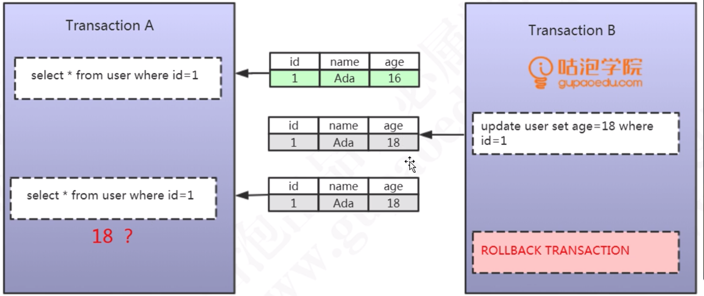
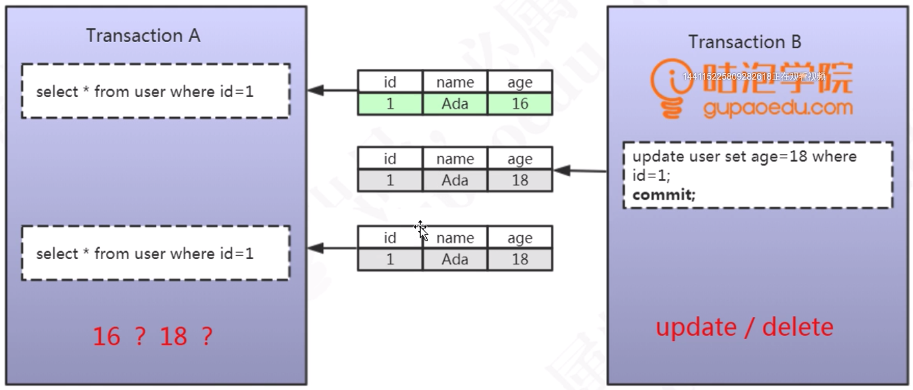
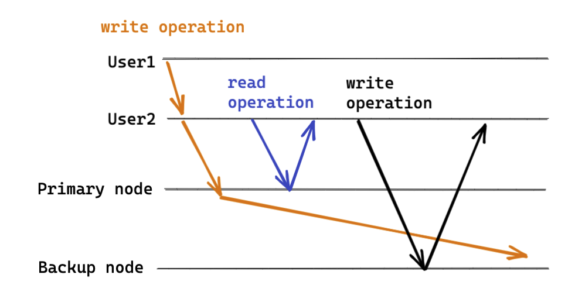

- [Standalone](#standalone)
  - [Three problems](#three-problems)
    - [Dirty read](#dirty-read)
    - [Non-repeatable read](#non-repeatable-read)
    - [Phantam read](#phantam-read)
  - [Four isolation solution options](#four-isolation-solution-options)
    - [Read uncommitted](#read-uncommitted)
    - [Read committed](#read-committed)
    - [Repeatable read](#repeatable-read)
    - [Serializable](#serializable)
- [Distributed](#distributed)
  - [Strict serializability](#strict-serializability)
  - [Linearizability](#linearizability)
    - [Total order broadcast](#total-order-broadcast)
    - [Engineering implementation](#engineering-implementation)
  - [Casual consistency](#casual-consistency)
  - [Single session](#single-session)
    - [Monotonic write](#monotonic-write)
    - [Monotonic read](#monotonic-read)
    - [Read your write](#read-your-write)
  - [Multiple session](#multiple-session)
    - [Write follow reads](#write-follow-reads)
  - [Consistent prefix](#consistent-prefix)
  - [Consensus algorithm](#consensus-algorithm)
    - [Consensus equivalent problems](#consensus-equivalent-problems)
    - [Categories](#categories)
      - [Non-fault tolerant consensus: Two phase commit and XA transactions](#non-fault-tolerant-consensus-two-phase-commit-and-xa-transactions)
      - [Fault-tolerant consensus : VSR, Paxos, Raft and Zab](#fault-tolerant-consensus--vsr-paxos-raft-and-zab)
  - [Update consistency](#update-consistency)
  - [Read consistency](#read-consistency)
  - [Replication Consistency](#replication-consistency)
- [References](#references)

# Standalone

## Three problems

### Dirty read

* Def: SQL-transaction T1 modifies a row. SQL-transaction T2 then reads that row before T1 performs a COMMIT. If T1 then performs a ROLLBACK, T2 will have read a row that was never committed and that may thus be considered to have never existed.

### Non-repeatable read

* Def: P2 ("Non-repeatable read"): SQL-transaction T1 reads a row. SQL-transaction T2 then modifies or deletes that row and performs a COMMIT. If T1 then attempts to reread the row, it may receive the modified value or discover that the row has been deleted. It only applies to UPDATE / DELETE operation. 

### Phantam read

* Def: SQL-transaction T1 reads the set of rows N that satisfy some . SQL-transaction T2 then executes SQL-statements that generate one or more rows that satisfy the  used by SQL-transaction T1. If SQL-transaction T1 then repeats the initial read with the same , it obtains a different collection of rows.

## Four isolation solution options

### Read uncommitted

* Def: Not solving any concurrent transaction problems.

### Read committed

* Def: When a transaction starts, could only see the modifications by the transaction itself. 

### Repeatable read

* Def: Within a transaction, it always read the same data. 

### Serializable

* Def: Everything is conducted in an exlusive way with lock. 

# Distributed
## Strict serializability

## Linearizability
* Multiple programs happen concurrently. If you could find a way to streamline these operations and get correct business result, these operations are linearizable. 

* For example, one possible order:

### Total order broadcast
* Def: Total order broadcast implies two properties
  * Reliable delivery: No messages are lost: if a message is delivered to one node, it is delivered to all nodes. 
  * Totally ordered delivery: Messages are delivered to every node in the same order. 
* Usage:
  * To implement serializable transactions
  * To create a replication log
  * To implement a lock service that provides fencing tokens

### Engineering implementation

* To achieve linearizability, it requires Global clock and total order. 
* In engineering, most products use TSO (get time from a single server with HA design); Google Spanner uses TrueTime (Global clock by GPS and atomic clock, the variance is within 7ms)

## Casual consistency

* Causality provides us with a weaker consistency model when compared with libearizability. Some things can be concurrent, so the version history is like a timeline with branching and merging. Causal consistency does not have the coordination overhead of linearizability and is much less sensitive to network problems. 
* Implementation:
  * Linearizability. Any system that is linearizable will preserve causality correctly. However, it comes at performance cost. 
  * Version vectors. However, keeping track of all causality can be impractical. 
  * Lamport stamp: A method of generating total ordering sequence ordering numbers
    * Def: Simply a pair of \(counter, node ID\).
    * Why consistent with causality: Every onde and every client keeps track of the maximum counter value it has seen so far, and includes that maximum on every request. When a node receives a request or response with a maximum counter value greater than its own counter value, it immediately increases its own counter to that maximum. 
    * Limitations: The total order of operations only emerges after you have collected all of the operations. It's not sufficient to have a total ordering of operations - you also need to know when that order is finalized. Total order broadcast to rescue
* Casual consistency is weaker than linearizability but more efficient in engineering. Partial events could be ordered. 

## Single session
### Monotonic write
* All server nodes have exactly the same write order. 

### Monotonic read
* New read could not read the old write. 
* A user first reads from a fresh replica, then from a stale replica. Time appears to go backward. To prevent this anomaly, we need monotonic reads.

### Read your write
* A user makes a write, followed by a read from a stale replica. To prevent this anomaly, we need read-after-write consistency.

## Multiple session
### Write follow reads

## Consistent prefix

* If some partitions are replicated slower than others, an observer may see the answer before they see the question.
* Reference: [https://ebrary.net/64710/computer_science/consistent_prefix_reads#807](https://ebrary.net/64710/computer_science/consistent_prefix_reads#807)

## Consensus algorithm

### Consensus equivalent problems

* Linearizable compare-and-set registers
* Atomic transaction commit
* Total order broadcast
* Locks and leases
* Membership/Coordination services
* Uniqueness constraint

### Categories

#### Non-fault tolerant consensus: Two phase commit and XA transactions

* Def: Two phase commit is an algorithm for achieving atomic transaction commit across multiple nodes - To ensure that either all nodes commit or all nodes abort. 
* The process: The protocol contains two crucial points of no return: When a participant votes yes, it promises that it will definitely be able to commit later; And once the coordinator 

  decides. 

* Why not-fault tolerant: If the coordinator fails, 
  * 2PC must wait for the coordinator to recover, and accept that the system will be blocked in the meantime. 
  * Manually fail over by getting humans to choose a new leader node and reconfigure the system to use it. 

#### Fault-tolerant consensus : VSR, Paxos, Raft and Zab

* Def: A fault tolerant consensus satisfy the following properties:
  * Uniform agreement: No two nodes decide differently. 
  * Integrity: No node decides twice. 
  * Validity: If a node decides value v, then v was proposed by some node. 
  * Termination: Every node that does not crash eventually decides on some value. 
* Assumptions: 
  * The termination property is subject to the assumption that fewer than half of the nodes are crashed or unreacheable. 
  * There are no Byzantine faults. 
  * Requires at least a majority of nodes to be functioning correctly in order to assume termination. 
* Costs:
  * Within the algorithm, the process by which nodes vote on proposals before they are decided is a kind of synchronous replication. However, in practice database are often configured to use asynchronous replication. 
  * Consensus systems always require a strict majority to operate. 
  * Consensus algorithms generally rely on timeouts to detect failed nodes. In environments with highly variable network delays, it could result in frequent leader elections and terrible performance. 
  * Sometimes consensus algorithms are sensitive to network problems.
* Could consider use a tool like ZooKeeper to provide the "outsourced" consensus, failure detection and membership service. 

## Update consistency

* Def: Write-write conflicts occur when two clients try to write the same data at the same time. Result is a lost update. 
* Solutions: 
  * Pessimistic approach: Preventing conflicts from occuring.
    * The most common way: Write locks. In order to change a value you need to acquire a lock, and the system ensures that only once client can get a lock at a time. 
  * Optimistic approach: Let conflicts occur, but detects them and take actions to sort them out.
    * The most common way: Conditional update. Any client that does an update tests the value just before updating it to see if it is changed since his last read. 
    * Save both updates and record that they are in conflict. This approach usually used in version control systems. 
* Problems of the solution: Both pessimistic and optimistic approach rely on a consistent serialization of the updates. Within a single server, this is obvious. But if it is more than one server, such as with peer-to-peer replication, then two nodes might apply the update in a different order.
* Often, when people first encounter these issues, their reaction is to prefer pessimistic concurrency because they are determined to avoid conflicts. Concurrent programming involves a fundamental tradeoff between safety \(avoiding errors such as update conflicts\) and liveness \(responding quickly to clients\). Pessimistic approaches often severly degrade the responsiveness of a system to the degree that it becomes unfit for its purpose. This problem is made worse by the danger of errors such as deadlocks. 

## Read consistency

* Def: 
  * Read-write conflicts occur when one client reads inconsistent data in the middle of another client's write.
* Types:
  * Logical consistency: Ensuring that different data items make sense together. 
    * Example: 
      * Martin begins update by modifying a line item
      * Pramod reads both records
      * Martin completes update by modifying shipping charge
  * Replication consistency: Ensuring that the same data item has the same value when read from different replicas. 
    * Example: 
      * There is one last hotel room for a desirable event. The reservation system runs onmany nodes. 
      * Martin and Cindy are a couple considering this room, but they are discussing this on the phone because Martin is in London and Cindy is in Boston. 
      * Meanwhile Pramod, who is in Mumbai, goes and books that last room. 
      * That updates the replicated room availability, but the update gets to Boston quicker than it gets to London. 
      * When Martin and Cindy fire up their browsers to see if the room is available, Cindy sees it booked and Martin sees it free. 
  * Read-your-write consistency \(Session consistency\): Once you have made an update, you're guaranteed to continue seeing that update. This can be difficult if the read and write happen on different nodes. 
    * Solution1: A sticky session. a session that's tied to one node. A sticky session allows you to ensure that as long as you keep read-your-writes consistency on a node, you'll get it for sessions too. The downsides is that sticky sessions reduce the ability of the load balancer to do its job. 
    * Solution2: Version stamps and ensure every interaction with the data store includes the latest version stamp seen by a session. 

## Replication Consistency

* Def: Slaves could return stale data. 
* Reason: 
  * Replication is usually asynchronous, and any change made on the master needs some time to replicate to its slaves. Depending on the replication lag, the delay between requests, and the speed of each server, you may get the freshest data or you may get stale data. 
* Solution:
  * Send critical read requests to the master so that they would always return the most up-to-date data.
  * Cache the data that has been written on the client side so that you would not need to read the data you have just written. 
  * Minize the replication lag to reduce the chance of stale data being read from stale slaves.

# References
* [https://ebrary.net/64709/computer_science/monotonic_reads#720](https://ebrary.net/64709/computer_science/monotonic_reads#720)
* [Consistency Guarantees in Distributed Systems Explained Simply](https://kousiknath.medium.com/consistency-guarantees-in-distributed-systems-explained-simply-720caa034116)
* Azure Cosmos DB consistency models: [https://docs.microsoft.com/en-us/azure/cosmos-db/consistency-levels](https://docs.microsoft.com/en-us/azure/cosmos-db/consistency-levels)
* Reference: [https://ebrary.net/64846/computer_science/linearizability#283](https://ebrary.net/64846/computer_science/linearizability#283)
