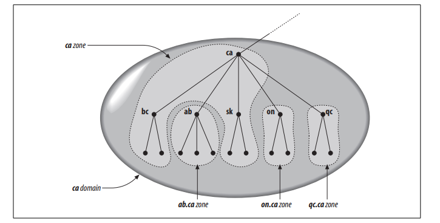
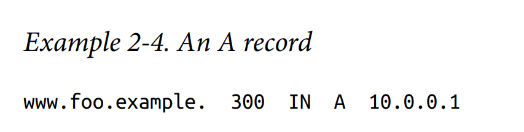
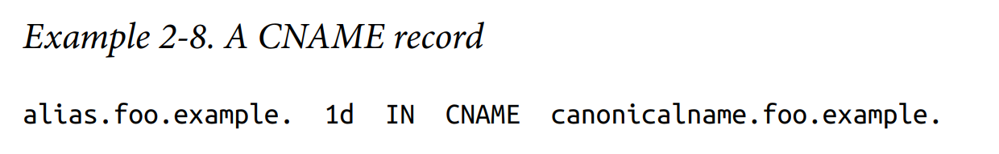
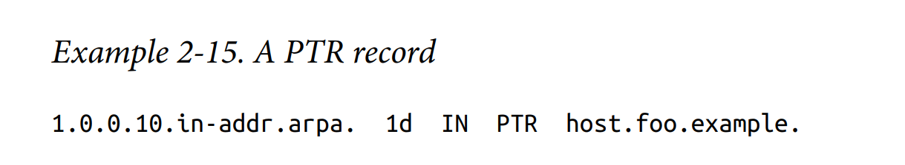
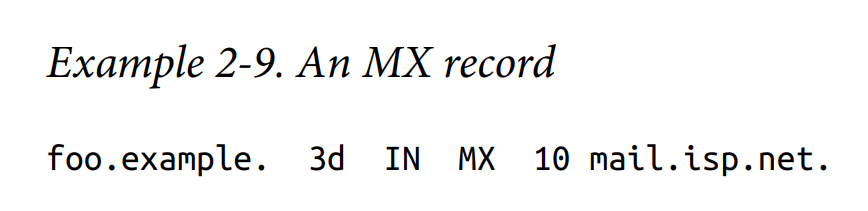
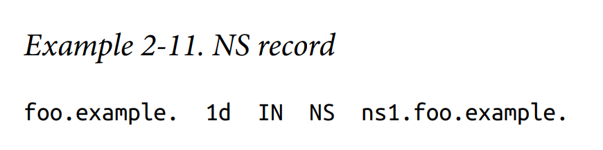
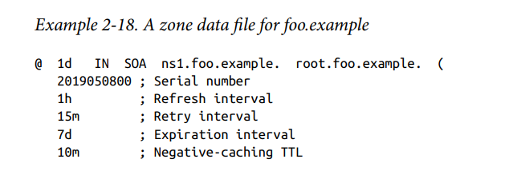
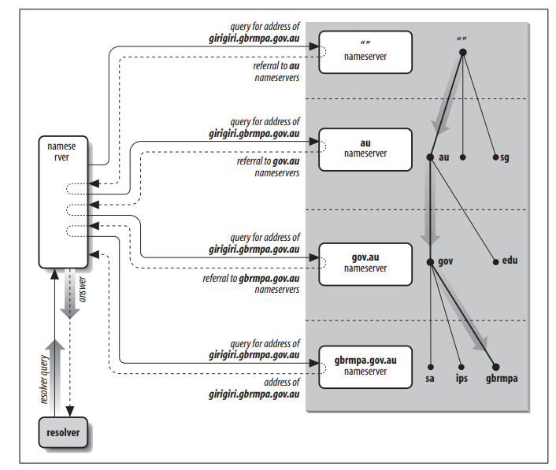
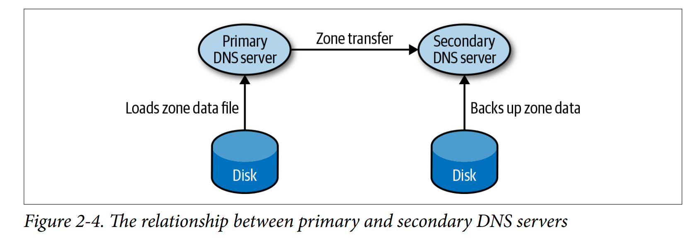
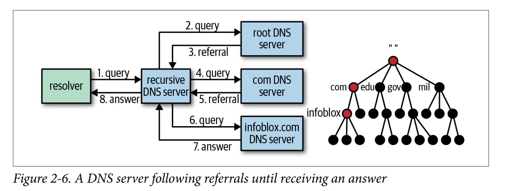

<!-- MarkdownTOC -->

- [DNS](#dns)
	- [Use case](#use-case)
		- [Look up address](#look-up-address)
		- [Load balancing](#load-balancing)
		- [Host alias](#host-alias)
	- [Definition](#definition)
		- [Domains, Delegation, Zone](#domains-delegation-zone)
		- [DNS Record](#dns-record)
			- [Categories](#categories)
				- [A type](#a-type)
				- [AAAA type](#aaaa-type)
				- [CName type](#cname-type)
				- [PTR type](#ptr-type)
				- [SOA type](#soa-type)
				- [MX type](#mx-type)
				- [NS type](#ns-type)
			- [Sample Zone Record](#sample-zone-record)
		- [Name server](#name-server)
			- [A distributed, hierarchical database](#a-distributed-hierarchical-database)
			- [Zone transfer](#zone-transfer)
	- [DNS query flowchart](#dns-query-flowchart)
		- [Strategy for choosing NS server](#strategy-for-choosing-ns-server)
		- [Insert records into DNS DB](#insert-records-into-dns-db)
	- [Problems](#problems)
		- [DNS Caching](#dns-caching)
		- [Other](#other)
	- [Optimization](#optimization)
		- [Prefetching](#prefetching)
		- [EDNS](#edns)
		- [HTTPDNS](#httpdns)
		- [Protect against DDos](#protect-against-ddos)
	- [References](#references)

<!-- /MarkdownTOC -->

# DNS 
## Use case
### Look up address
* Work with either IPv4 or IPv6. 
* Lookup: DNS could turn a Host name into an IP address.
* Reverse lookup: DNS could also turn an IP address into a Host name. 

```
To be completed
```

### Load balancing
* DNS can be used to perform load distribution among replicated servers, such as replicated web servers. For replicated web servers, a set of IP addresses is thus associated with one canonical hostname. The DNS database contains this set of IP addresses. When clients make a DNS query for a name mapped to a set of addresses, the server responds with the entire set of IP addresses, but rotates the ordering of the addresses within each reply. Because a client typically sends its HTTP request to the IP address that is the first in the set, DNS rotation distributes the traffic among the replicated servers. 

* Routing methods
	- Weighted round robin, Latency-based, Geolocation-based
	- For example, please see [Amazon Route53 strategy](https://docs.aws.amazon.com/Route53/latest/DeveloperGuide/routing-policy.html#routing-policy-latency)

### Host alias
* A host with a complicated hostname can have one or more alias names. For example, a hostname such as relay1.west-coast.enterprise.com could have two aliases such as enterprise.com and www.enterprise. 

## Definition
### Domains, Delegation, Zone
* Domains, Delegation, Zone



### DNS Record
* The DNS servers store source records (RRs). A resource record is a four-tuple that contains the following fields: (Name, Value, Type, TTL )


#### Categories
##### A type



##### AAAA type


##### CName type



##### PTR type



##### SOA type


##### MX type



##### NS type



#### Sample Zone Record




### Name server
#### A distributed, hierarchical database
* **Root DNS servers**: 
* **Top-level domain servers**: Responsible for top level domains such as com, org, net, edu, and gov, and all of the country top-level domains such as uk, fr, ca, and jp. 
* **Authoritative DNS servers**: 
* **Local DNS server**: Each ISP - such as a university, an academic department, an employee's company, or a residential ISP - has a local DNS server. When a host connects to an ISP, the ISP provides the host with the IP addresses of one of its local DNS servers. 



#### Zone transfer



## DNS query flowchart



### Strategy for choosing NS server
* When a user enters a URL into the browser's address bar, the first step is for the browser to resolve the hostname (http://www.amazon.com/index.html) to an IP address. The browser extracts the host name www.amazon.com from the URL and delegates the resolving task to the operating system. At this stage, the operating system has a couple of choices. 
* It can either resolve the address using a static hosts file (such as /etc/hosts on Linux) 
* It then query a local DNS server.
	- The local DNS server forwards to a root DNS server. The root DNS server takes not of the com suffix and returns a list of IP addresss for TLD servers responsible for com domain
	- The local DNS server then resends the query to one of the TLD servers. The TLD server takes note of www.amazon. suffix and respond with the IP address of the authoritative DNS server for amazon. 
	- Finally, the local DNS server resends the query message directly to authoritative DNS which responds with the IP address of www.amazon.com. 
* Once the browser receives the IP addresses from DNS, it can initiate a TCP connection to the HTTP server process located at port 80 at that IP address. 

### Insert records into DNS DB 
* Take domain name networkutopia.com as an example.
* First you need to register the domain name network. A registrar is a commercial entity that verifies the uniqueness of the domain name, enters the domain name into the DNS database and collects a small fee for its services.
	- When you register, you need to provide the registrar with the names and IP addresses of your primary and secondary authoritative DNS servers. For each of these two authoritative DNS servers, the registrar would then make sure that a Type NS and a Type A record are entered into the TLD com servers.

## Problems
### DNS Caching 
* Types:
	- Whenever the client issues a request to an ISP's resolver, the resolver caches the response for a short period (TTL, set by the authoritative name server), and subsequent queries for this hostname can be answered directly from the cache. 
	- All major browsers also implement their own DNS cache, which removes the need for the browser to ask the operating system to resolve. Because this isn't particularly faster than quuerying the operating system's cache, the primary motivation here is better control over what is cached and for how long.
* Performance:
    - DNS look-up times can vary dramatically - anything from a few milliseconds to perhaps one-half a second if a remote name server must be queried. This manifests itself mostly as a slight delay when the user first loads the site. On subsequent views, the DNS query is answered from a cache. 

### Other
Accessing a DNS server introduces a slight delay, although mitigated by caching described above.
DNS server management could be complex and is generally managed by governments, ISPs, and large companies.
DNS services have recently come under DDoS attack, preventing users from accessing websites such as Twitter without knowing Twitter's IP address(es).

```
To be added
```

## Optimization
### Prefetching
* Performing DNS lookups on URLs linked to in the HTML document, in anticipation that the user may eventually click one of these links. Typically, a single UDP packet can carry the question, and a second UDP packet can carry the answer. 
* Control prefetching
	* Most browsers support a link tag with the nonstandard rel="dns-prefetch" attribute. This causes teh browser to prefetch the given hostname and can be used to precache such redirect linnks. For example

	> <link rel="dns-prefetch" href="http://www.example.com" >

	* In addition, site owners can disable or enable prefetching through the use of a special HTTP header like:

	> X-DNS-Prefetch-Control: off

### EDNS

```
Add a flowchart here
```

### HTTPDNS

```
Need a flow chart
```

### Protect against DDos
* 保证访问入口安全：HttpDNS

## References
* https://www.cloudflare.com/learning/dns/what-is-dns/
* https://www.zytrax.com/books/dns/ch2/#components