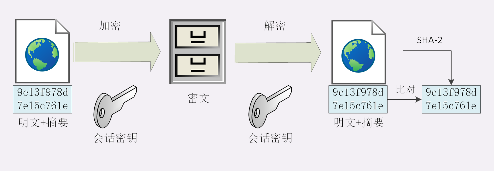
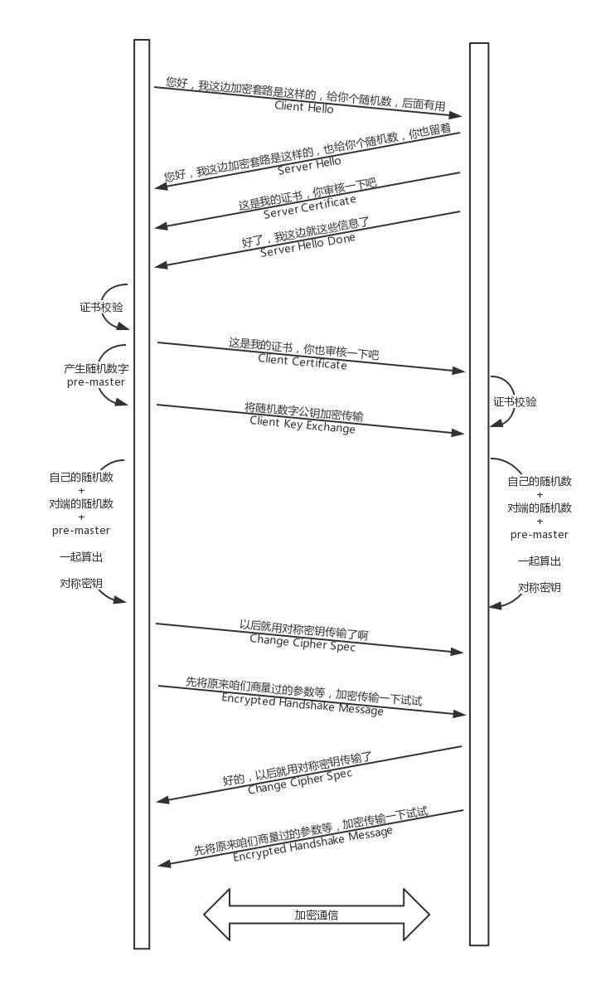

<!-- MarkdownTOC -->

- Https
	- Security - Confidentiality
		- Symmetric encryption
		- Asymmetric encryption
		- Combined encryption
	- Security - Integrity
	- Security - Authentication and Non-repudiation
		- Digital signature
			- Certificate
				- Concepts
				- Cons
	- Structure
		- SSL/TLS
	- Overall flowchart
		- Handshake
		- Almost handshake
		- Early termination

<!-- /MarkdownTOC -->


# Https

## Security - Confidentiality
* Guaranteed by AES

### Symmetric encryption
* RC4, DES, 3DES, AES, ChaCha20
* 加密分组模式：用固定长度的秘钥加密任意长度的密文，把小秘密转化为大秘密
	- ECB, CBC, CFB, OFB, GCM
* Cons:
	- Does not have a reliable way to transfer cipher key


### Asymmetric encryption
* DH, DSA, RSA, ECC
* RSA: 基于证书分解的数学难题，使用两个超大素数的乘积作为生成秘钥的材料
* ECC: 基于椭圆曲线离散对数
	- Widely used elliptic curve: P-256 / x25519
	- P-256 is the curve recommended by NIST/NSA
	- 下5519 is the most secure 


### Combined encryption
* First use RSA/ECDHE to solve the problem of exchanging private key
* Generate session key used for symmetric key
* Speed comparison for symmetric asymetric

```
aes_128_cbc enc/dec 1000 times : 0.97ms, 13.11MB/s

rsa_1024 enc/dec 1000 times : 138.59ms, 93.80KB/s
rsa_1024/aes ratio = 143.17

rsa_2048 enc/dec 1000 times : 840.35ms, 15.47KB/s
rsa_2048/aes ratio = 868.13
```

## Security - Integrity
* Digest algorithm
* MD5, SHA1-> SHA2 (SHA224、SHA256、SHA384，分别能够生成 28 字节、32 字节、48 字节的摘要)
* HMAC:



## Security - Authentication and Non-repudiation

### Digital signature
*  Reverse the usage of private and public key inside asymmetric encryption
* Private key only encrypts the digest of message

#### Certificate


##### Concepts
* Certificate authority
* Certificate issuer: DigiCert, VeriSign, Entrust, Let's Encrypt
* Types of certificates: 
	- DV
	- EV
* Root CA needs to have a self-signed certificate / root certificate.


##### Cons
* What if CA gets tricked to issue certificate to the wrong person
	- CRL (certificate revocation list)
	- OCSP (online certificate status protocol)
* CA itself get hacked
* RSA asymmetric 


## Structure


### SSL/TLS 
* Secure Sockets Layer / Transport layer security
* Fifth layer. Netscape 1994. V2/V3
* Versions:
	* SSLv1/v2
	* SSLv3.1 => TLS1.0
	* TLS1.0/1.1、SSLv3/v2 all considered to be unsecure
* Most widely used: TLS 1.2
* SSL/TLS could also be applied to other applications 
	* FTP => FTPS
	* LDAP => LDAPS

## Overall flowchart
* Flow chart


* TLS Cipher suite
	- 秘钥交换算法-签名算法-对称加密算法-摘要算法
	- ECDHE-RSA-AES256-GCM-SHA384
* Many softwares such as Nginx/Apache use OpenSSL to implement TLS


### Handshake


### Almost handshake


### Early termination


