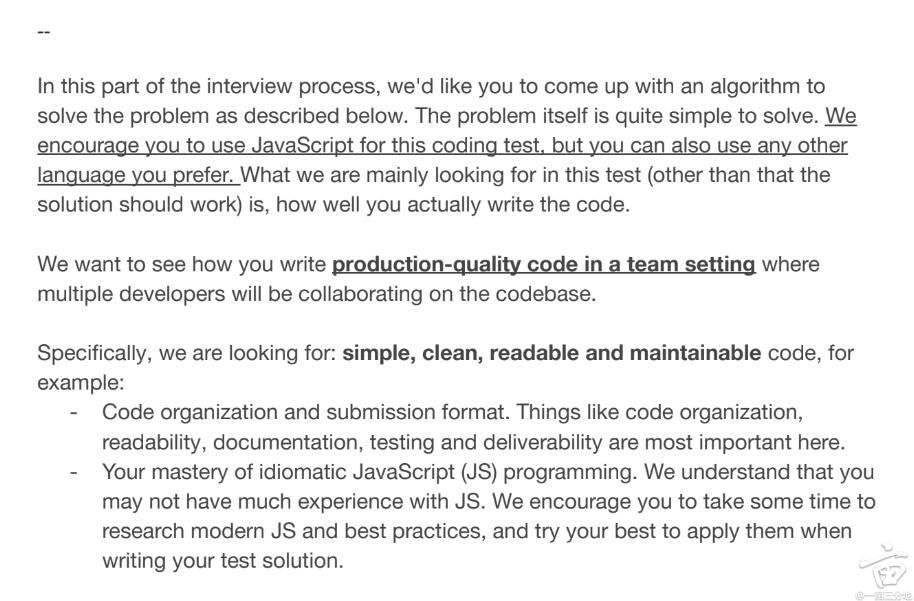

- [Rangelist 加，减，打印](#rangelist-加减打印)
  - [描述](#描述)
  - [实现](#实现)
  - [链接](#链接)
  - [实现2](#实现2)
    - [链接](#链接-1)


# Rangelist 加，减，打印
## 描述
写一个class, 能表达出多个range list。写3个方法：add, remove, print。用javascript实现。



// A pair of integers define a range, for example: [1, 5). This range includes integers: 1, 2, 3, and 4.
// A range list is an aggregate of these ranges: [1, 5), [10, 11), [100,201) =》1~4，10，100~200

## 实现
实现如下：

```javascript
class RangeList {

  constructor() 
  {
    this.ranges = [];
  }

  add(range) {
    if (range[0] >= range[1]) {
      console.error('Invalid range: start must be less than end.');
      return;
    }
    let newRanges = [];
    let inserted = false;
    for (const r of this.ranges) {
      if (range[1] < r[0]) {
        if (!inserted) {
          newRanges.push(range);
          inserted = true;
        }
        newRanges.push(r);
      } else if (range[0] > r[1]) {
        newRanges.push(r);
      } else {
        range = [Math.min(range[0], r[0]), Math.max(range[1], r[1])];
      }
    }
    if (!inserted) {
      newRanges.push(range);
    }
    this.ranges = newRanges;
  }

  remove(range) {
    if (range[0] >= range[1]) {
      console.error('Invalid range: start must be less than end.');
      return;
    }
    let newRanges = [];
    for (const r of this.ranges) {
      if (range[1] <= r[0] || range[0] >= r[1]) {
        newRanges.push(r);
      } else {
        if (range[0] > r[0]) {
          newRanges.push([r[0], range[0]]);
        }
        if (range[1] < r[1]) {
          newRanges.push([range[1], r[1]]);
        }
      }
    }
    this.ranges = newRanges;
  }

  print() {
    const rangesStr = this.ranges
      .map(range => `[${range[0]}, ${range[1]})`)
      .join(' ');
    console.log(rangesStr);
  }
}

// 示例使用
const rl = new RangeList();
rl.add([1, 5]);
rl.print(); // 输出: [1, 5)
rl.add([10, 20]);
rl.print(); // 输出: [1, 5) [10, 20)
rl.add([20, 20]);
rl.print(); // 输出: [1, 5) [10, 20)
rl.add([20, 21]);
rl.print(); // 输出: [1, 5) [10, 21)
rl.add([2, 4]);
rl.print(); // 输出: [1, 5) [10, 21)
rl.add([3, 8]);
rl.print(); // 输出: [1, 8) [10, 21)
rl.remove([10, 10]);
rl.print(); // 输出: [1, 8) [10, 21)
rl.remove([10, 11]);
rl.print(); // 输出: [1, 8) [11, 21)
rl.remove([15, 17]);
rl.print(); // 输出: [1, 8) [11, 15) [17, 21)
rl.remove([3, 19]);
rl.print(); // 输出: [1, 3) [19, 21)

```
## 链接
* https://www.1point3acres.com/bbs/thread-1001762-1-1.html
* https://www.1point3acres.com/bbs/thread-925807-1-1.html

## 实现2

```javascript
type IRange = [number, number];
type Mode = 'add' | 'remove';

// 把当前格式tuple转 array
type WriteAbleTuple<T> = (T extends Array<any> ? (T[number] extends readonly [infer A, infer B] ? [A, B] : never) : never)[];

class RangeList {
    list: IRange[] = [];

    /**
     * @description: 与已有空间不存在交叉合并的情况
     * @param {[number, number]} input
     * @param {add | remove} mode
     * @return {null | number} idx
     */
    private filterInvalid = (input: IRange, mode: Mode = 'add') => {
        const [from, end] = input;
        if (input[0] === input[1]) {
            // 去掉相同输入
            return null;
        }
        let idx = this.list.findIndex((item) => item[1] >= from);
        if (!~idx) {
            // 最右边的case
            if (mode === 'add') {
                this.list.push([from, end]);
            }
            return null;
        }
        if (end < this.list[idx][0]) {
            if (mode === 'add') {
                // 直接插入的case
                this.list.splice(idx, 0, [...input]);
            }
            return null;
        }

        return idx;
    };

    /**
     * @description: add调用，让input区间合并到this.list[idx]上
     * @param {[number, number]} input
     * @param {number} idx
     * @return {void}
     */
    private merge = (input: IRange, idx: number) => {
        const idxRange = this.list[idx];
        idxRange[0] = Math.min(idxRange[0], input[0]);
        idxRange[1] = Math.max(idxRange[1], input[1]);
    };

    add = (range: IRange) => {
        // 找到第一个， 右小于等于from的; 后mixin
        let idx = this.filterInvalid(range);

        if (typeof idx === 'object') { // null
            return this;
        }
        const finalPoi = this.collect(range, idx);

        this.merge(range, idx);
        this.merge(this.list[finalPoi], idx);
        this.list.splice(idx + 1, finalPoi - idx); // 删除掉中间位置
        return this;
    };
    print = () => {
        console.log(JSON.stringify(this.list).replace(/\](?!$)/g, ')'));
        return this;
    };

    /**
     * @description: 从idx位开始收集，找到所有的区间内数组
     * @return {number} 最后一位相关数组
     */
    private collect = (input: IRange, idx: number) => {
        const end = input[1];
        const len = this.list.length;
        for (let i = idx; i < len; i++) {
            const item = this.list[i];
            if (item[0] > end) {
                return i - 1;
            }
        }
        return len - 1;
    };


    /**
     * @description: 同理于merge
     */
    private detach = (input: IRange, idx: number): IRange[] => {
        const [from, end] = input;

        const appendRanges = ([
            [
                this.list[idx][0],
                from
            ], [
                end,
                this.list[idx][1]
            ]
        ] as const).filter(item => item[1] - item[0] > 0)

        return appendRanges as WriteAbleTuple<typeof appendRanges>
    };

    remove = (range: IRange) => {
        let idx = this.filterInvalid(range, 'remove');
        if (typeof idx === 'object') {
            return this;
        }
        const finalPoi = this.collect(range, idx);

        const appendRanges = (finalPoi === idx) ? this.detach(range, idx) : this.detach(range, idx).concat(this.detach(range, finalPoi));
        this.list.splice(idx, finalPoi - idx + 1);
        this.list.splice(idx, 0, ...appendRanges);
        return this;
    };
}


const l = new RangeList();

l.add([1, 5]);

l.add([10, 20]);

l.add([20, 20]); // [1, 5) [10, 20)

l.add([20, 21]); // [1, 5) [10, 21)

l.add([2, 4]); //  [1, 5) [10, 21)

l.add([3, 7]); //  [1, 7) [10, 21)

// l.add([8, 10]); // [[1,7),[7,21)]

l.remove([10, 10]); // [1, 7) [10, 21)

l.remove([10, 11]); // [1, 7) [11, 21)

l.remove([15, 17]); // [1, 7) [11, 15) [17, 21)

l.remove([3, 19]); // [1, 3) [19, 21)

l.print();

```

### 链接
https://juejin.cn/post/7119762208501792804#heading-13
