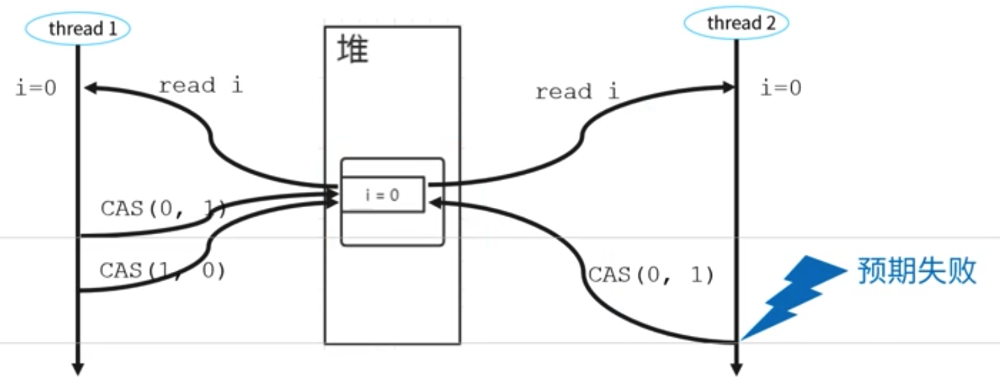

## Atomic

**Smallest atomic unit - CAS operations**

* sun.misc.Unsafe class
  * CompareAndSwapInt
  * CompareAndSwapLong

### Cons

#### ABA problem

* CompareAndSwap only compares the actual value, but it does not guarantee that there are no thread changing this. This means that within the
* For example
  1. Thread 1 change i from 0 => 1
  2. Thread 1 change i from 1 => 0
  3. Thread 2 changes i from 0 => 1, originally expected to fail. However, since CSA only uses the value comparison, it won't detect such changes.



* Solution: Add a version number

#### Spin lock CPU consumption

* CAS is usually combined together with loop implementation. This is similar to a long-running spinlock, end up consuming lots of resource.
* Def: If a lock is a spin lock, it means that when the lock has been occupied by a thread, another thread trying to acquire it will constantly circulating to see whether the lock has been released (constantly causing CPU cycles) insteading entering a blocking state such as sleep.
* Internals:
  * Implementation based on CAS: [https://programmer.help/blogs/java-lock-spin-lock.html](https://programmer.help/blogs/java-lock-spin-lock.html)
  * Usually spin lock is associated with a timeout. And this timeout threshold is usually set to typical context swap time.
* Applicable cases: Reduce the CPU thread context swap cost because the waiting thread never enters blocked state. Applicable for cases where the lock time is relatively low, or where there isn't much lock contention so that CPU context switch time could be saved.

#### CAS utilities - Atomic classes

* AtomicBoolean, AtomicInteger, AtomicLong
* AtomicIntegerArray, AtomicLongArray, AtomicReferenceArray
* AtomicIntegerFieldUpdater, AtomicLongFieldUpdater, AtomicReferenceFieldUpdater
* AtomicReference, AtomicStampedReference, AtomicMarkableReference

#### Demo solution with counter example

* Composite actions like counter++ does not execute as a single operation. Instead, it is shorthand for a sequence of three discrete operations: fetch the current value, add one to it, and write the new value back to memory. This is an example of a read-modify-write operation, in which the resulting state is derived from the previous state. In Java these kind of operations are not overall atomic by default.
* [Thread safe counter](../code/multithreads/Counter.md)


# AQS

## Motivation

* Many utilities such as Semahpore, CountdownLatch, etc. need to rely on a common set of methods: Lock, synchronizer, etc.


## Internals

* AQS is an abstract queue synchronizer. It mains a volatile int state variable and a FIFO queue.
* There are three methods to visit the state variable
  * getState()
  * setState()
  * compareAndSetState(): Internally relies on UnSafe compareAndSwapInt

## Create impl inheriting AQS

* AQS defines two ways to access a resource:
  * Exclusive: Concrete implementation such as ReentrantLock
  * Share: Concrete implementation such as Semaphore and CountDownLatch
* Both of these two approaches rely on a number of methods

```java
// methods
isHeldExclusively()
tryAcquire(int)
tryRelease(int)
tryAcquireShared(int)
tryReleaseShared(int)
```