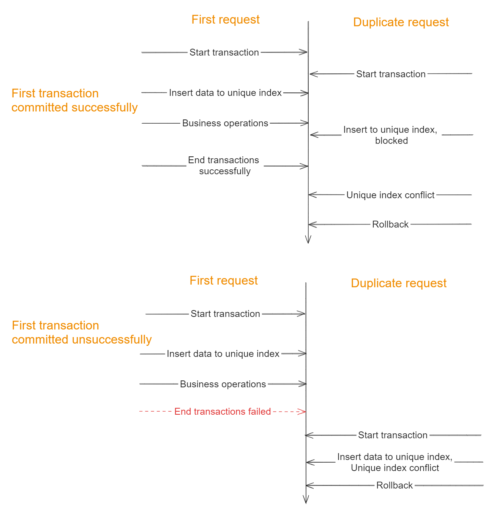
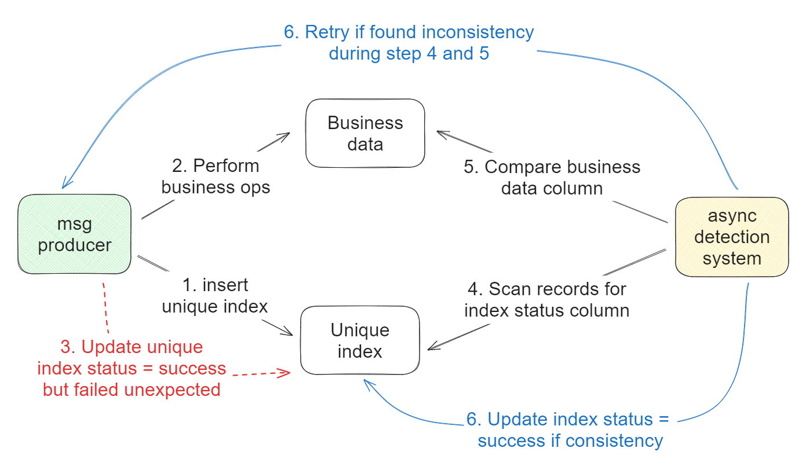
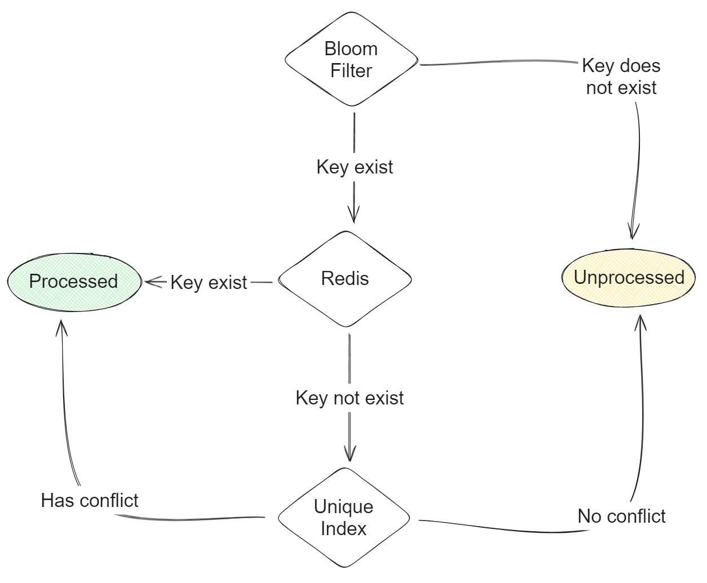
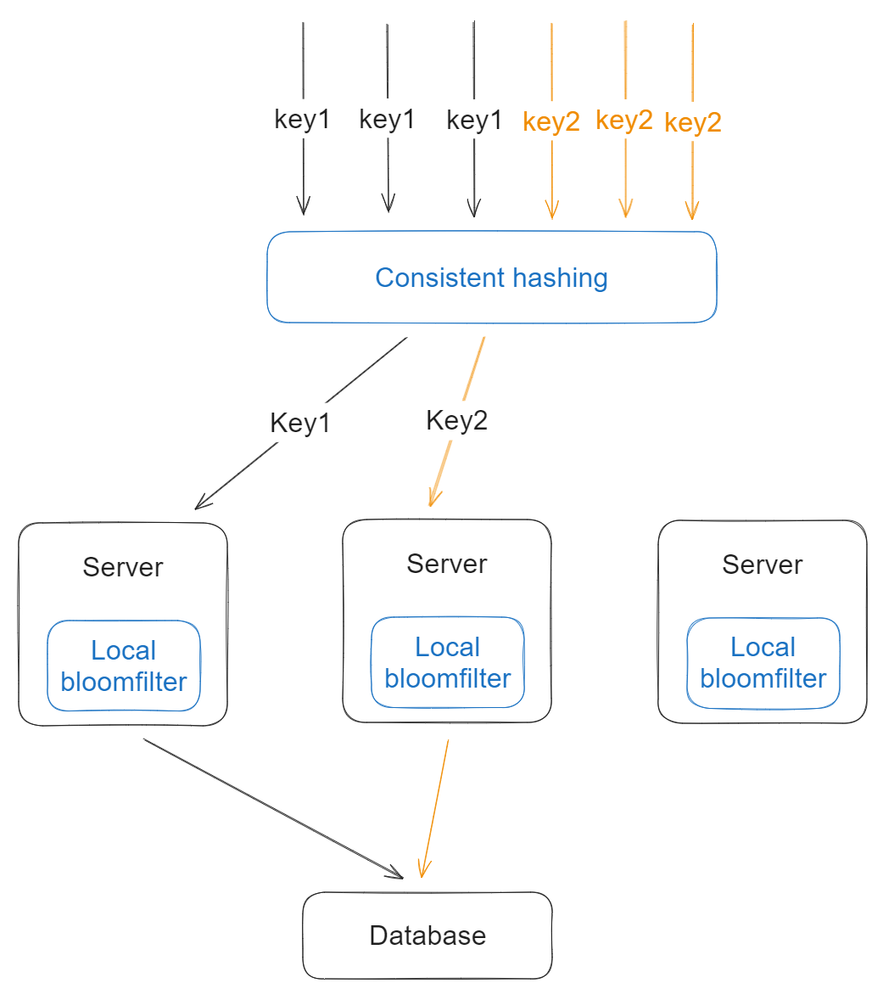

- [Consumer idempotency](#consumer-idempotency)
  - [When local transaction is transaction](#when-local-transaction-is-transaction)
  - [When local transaction not available](#when-local-transaction-not-available)
- [Reduce load stress on unique index](#reduce-load-stress-on-unique-index)
  - [Flowchart of adding bloomfilter and redis](#flowchart-of-adding-bloomfilter-and-redis)
  - [Update order](#update-order)
  - [Improvements with local bloomfilter and consistent hashing](#improvements-with-local-bloomfilter-and-consistent-hashing)

# Consumer idempotency
* The most straightforward way to guarantee consumer idempotency is to use unique index. 
* There are two ways to implement unique index depends on whether local transaction is available. 

## When local transaction is transaction

## When local transaction not available

# Reduce load stress on unique index
## Flowchart of adding bloomfilter and redis 

## Update order
1. Unique index because source of truth is always the first option.
2. Then update bloomfilter or redis. 

## Improvements with local bloomfilter and consistent hashing
* If consistent hashing is used, then the distributed bloomfilter could be moved to local machines, this will help reduce hash collision and performance (reduce network traffic).

