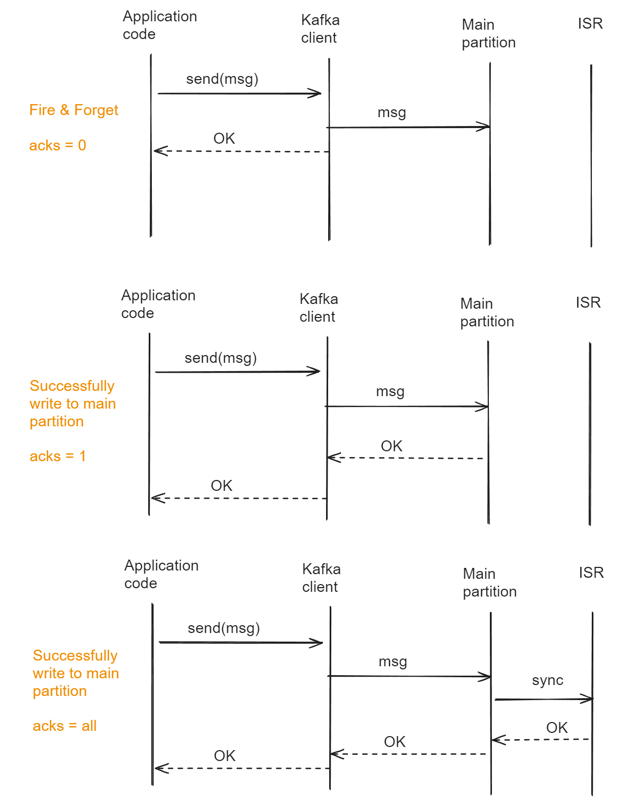
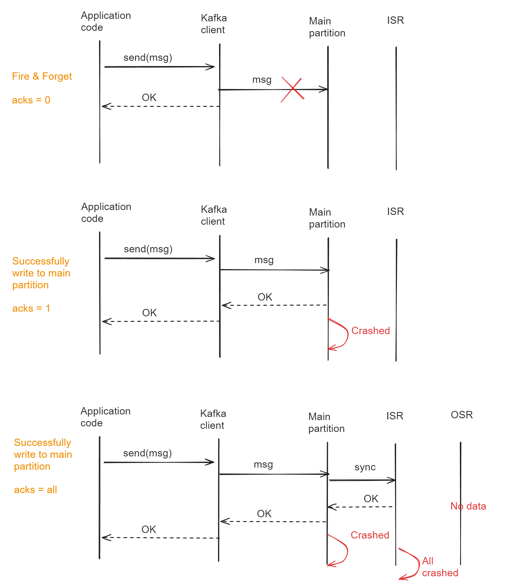
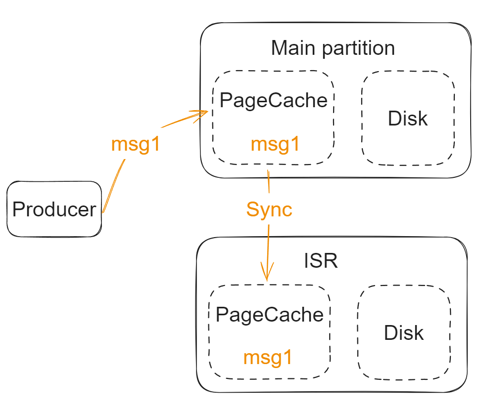

- [Write to Kafka config](#write-to-kafka-config)
  - [In-Sync replicas](#in-sync-replicas)
  - [Flowchart](#flowchart)
- [Message loss](#message-loss)
  - [Minimize by acks config](#minimize-by-acks-config)
  - [Minimize by disk flush](#minimize-by-disk-flush)
    - [Loss scenario](#loss-scenario)
    - [Config parameters](#config-parameters)

# Write to Kafka config
## In-Sync replicas
* Kafka dynamically maintains a set of in-sync replicas (ISR) that are caught-up to the leader. Only members of this set are eligible for election as leader. A write to a Kafka partition is not considered committed until all in-sync replicas have received the write. 

## Flowchart

# Message loss 
## Minimize by acks config
* To minimize msg loss possibility, set acks=all and forbid the unclean election. 

## Minimize by disk flush
### Loss scenario

### Config parameters
* **By Number**: log.flush.interval.ms: Every certain time, flush page cache to disk. 
* **By Time**: Two combined config: 
  * log.flush.scheduler.interval.ms: 
  * log.flush.interval.messages: Each time when there is this number of messages, flush page cache to disk. 

