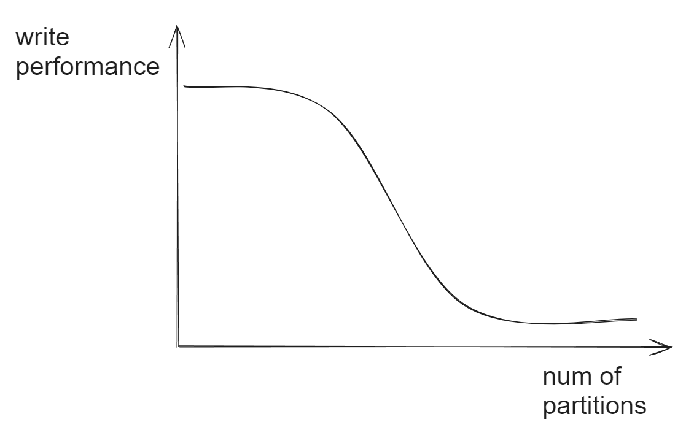

- [Index structure](#index-structure)
- [Zero copy](#zero-copy)
  - [Definition](#definition)
  - [Flowchart](#flowchart)
    - [Old approach with four copies](#old-approach-with-four-copies)
    - [DMA via sendfile()](#dma-via-sendfile)
- [Sequential write](#sequential-write)
  - [Flowchart](#flowchart-1)
  - [Old approach for using main memory as disk caching](#old-approach-for-using-main-memory-as-disk-caching)
  - [Use PageCache by directly appending to segment files](#use-pagecache-by-directly-appending-to-segment-files)
  - [Benefits](#benefits)
    - [No overhead from garbage collector](#no-overhead-from-garbage-collector)
    - [No cache warm-up](#no-cache-warm-up)
- [Number of partitions](#number-of-partitions)
  - [When too many partitions exist](#when-too-many-partitions-exist)
- [Batch processing](#batch-processing)
- [Compression](#compression)

# Index structure
* Suppose we want to look for topic = test_topic, partition = 1, and offset = 1051
  1. First look for the directory = test_topic_1
  2. Binary search by ".log" file name, 1051 should be inside 01051.index
  3. Binary search by ".index" file content, 1051 hits the first record. 
  4. Suppose the offset is not available in ".index", then search line by line inside corresponding .log file. 

 

# Zero copy
## Definition
* There is no CPU involved in the process. 
* Original process will have user-kernel state transition for four times. 
* Using DMA, there will only be two user-kernel state transitions. 

## Flowchart
* Within linux, the kernel cache actually means page cache. 
* NIC: Network interface card
* DMA: Direct memory access

 

### Old approach with four copies
* To understand the impact of sendfile, it is important to understand the common data path for transfer of data from file to socket:
  1. The operating system reads data from the disk into pagecache in kernel space
  2. The application reads the data from kernel space into a user-space buffer
  3. The application writes the data back into kernel space into a socket buffer
  4. The operating system copies the data from the socket buffer to the NIC buffer where it is sent over the network

### DMA via sendfile()
* This is clearly inefficient, there are four copies and two system calls. Modern unix operating systems offer a highly optimized code path for transferring data out of pagecache to a socket; in Linux this is done with the sendfile system call. Using sendfile, this re-copying is avoided by allowing the OS to send the data from pagecache to the network directly. So in this optimized path, only the final copy to the NIC buffer is needed. 
* Using the zero-copy optimization above, data is copied into pagecache exactly once and reused on each consumption instead of being stored in memory and copied out to user-space every time it is read. This allows messages to be consumed at a rate that approaches the limit of the network connection.

# Sequential write
## Flowchart

 

## Old approach for using main memory as disk caching
* The difference of random vs sequential access could be as high as 6000X. 
* Modern operating system uses main memory for disk caching. A modern OS will happily divert all free memory to disk caching with little performance penalty when the memory is reclaimed. All disk reads and writes will go through this unified cache.

## Use PageCache by directly appending to segment files
* Within each topic, there are many partitions. Each partition is stored sequentially on disk. For each partition, there is a separate WAL. When it writes to WAL, it writes sequentially. 
* Each partition is a logical log file. Physically, this log file consists of a group of segment files with roughly the same size. 
* All data is immediately written to a persistent log on the filesystem without necessarily flushing to disk. In effect this just means that it is transferred into the kernel's pagecache.

## Benefits
### No overhead from garbage collector
* Kafka is built on top of JVM: The memory overhead of objects is very high, often doubling the size of the data stored (or worse). Java garbage collection becomes increasingly fiddly and slow as the in-heap data increases if Kafka also relies on the unified cache. 
* Kafka directly writes data to page cache, and this avoid the garbage collection done by JVM. 

### No cache warm-up
* This cache will stay warm even if the service is restarted, whereas the in-process cache will need to be rebuilt in memory (which for a 10GB cache may take 10 minutes) or else it will need to start with a completely cold cache (which likely means terrible initial performance).

# Number of partitions
* Introducing partitions will help reduce concurrent competition on the topic level. 
* However, it doesn't mean the more partitions there are, the better it is. 

 

## When too many partitions exist
* Consider only using partial partitions, or merge topics if needed. 

# Batch processing
* The small I/O problem happens both between the client and the server and in the server's own persistent operations.
* To avoid this, our protocol is built around a "message set" abstraction that naturally groups messages together. This allows network requests to group messages together and amortize the overhead of the network roundtrip rather than sending a single message at a time. The server in turn appends chunks of messages to its log in one go, and the consumer fetches large linear chunks at a time.
* This simple optimization produces orders of magnitude speed up. Batching leads to larger network packets, larger sequential disk operations, contiguous memory blocks, and so on, all of which allows Kafka to turn a bursty stream of random message writes into linear writes that flow to the consumers.

# Compression
