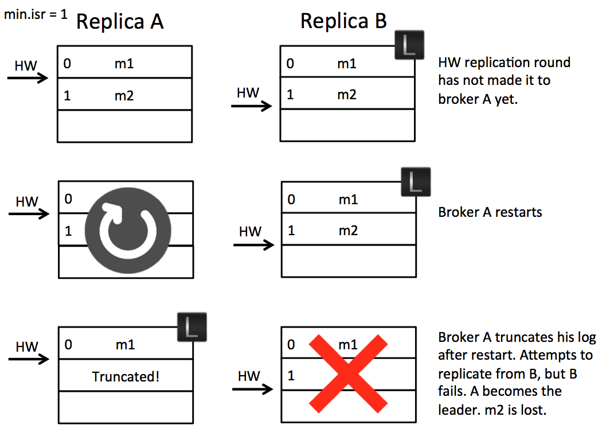

- [High watermark / Log end offset](#high-watermark--log-end-offset)
  - [Definition](#definition)
  - [When to update high watermark](#when-to-update-high-watermark)
  - [When to update log end offset](#when-to-update-log-end-offset)
- [Leader epoch](#leader-epoch)
  - [Existing flaws in replica protocol](#existing-flaws-in-replica-protocol)
  - [Epoch concept](#epoch-concept)
  - [Epoch in data lose scenario](#epoch-in-data-lose-scenario)
  - [Epoch in data diverge scenario](#epoch-in-data-diverge-scenario)
  - [Unclean leader election](#unclean-leader-election)

# High watermark / Log end offset

## Definition

* High watermark <= HW means all the commited messages available to consumers. 
* The offset position value for the next log

## When to update high watermark

* Follower side: Each time after follower writes log. It will take the minimum(LEO, HW in leader's response)
* Leader side: 
  1. When the replica becomes a leader
  2. When broker crashes and replica is kicked out of ISR
  3. When producer writes a message to leader replica
  4. When leader process follower's FETCh request

## When to update log end offset

* Follwer side: Each time follower writes a log 
* Leader side: 
  * Leader side stored followers' LEO: After receiving a follower FETCH request but before returns response to follower. 
  * Leader side stored leader's LEO: Each time leader writes a log

# Leader epoch
## Existing flaws in replica protocol
* The replication protocol in Kafka has two phases. Initially the the follower fetches messages. So it might fetch message m2. On the next round of RPC it will confirm receipt of message m2 and, assuming other replicas have confirmed successfully, the leader will progress the High Watermark. This is then passed back to the followers in the responses to their fetch requests. So the leader controls the progression rate of the High Watermark, which is propagated back to followers in subsequent rounds of RPC.
* The replication protocol also includes a phase where, on initialisation of a follower, the follower will truncate its log to the High Watermark it has recorded, then fetch messages from the leader. The problem is that, should that follower become leader before it has caught up, some messages may be lost due to the truncation.

## Epoch concept
* We can solve both of these issues by introducing the concept of a Leader Epoch. This allocates an identifier to a period of leadership, which is then added to each message by the leader. Each replica keeps a vector of \[LeaderEpoch => StartOffset] to mark when leaders changed throughout the lineage of its log. This vector then replaces the high watermark when followers need to truncate data (and will be stored in a file for each replica).  So instead of a follower truncating to the High Watermark, the follower gets the appropriate LeaderEpoch from the leader’s vector of past LeaderEpochs and uses this to truncate only messages that do not exist in the leader’s log. So the leader effectively tells the follower what offset it needs to truncate to.

## Epoch in data lose scenario
* High watermark truncation followed by immediate leader election
  * Let’s take an example. Imagine we have two brokers A & B. B is the leader initially as in the below figure. (A) fetches message m2 from the leader (B). So the follower (A) has message m2, but has not yet got confirmation from the leader (B) that m2 has been committed (the second round of replication, which lets (A) move forward its high watermark past m2, has yet to happen). At this point the follower (A) restarts. It truncates its log to the high watermark and issues a fetch request to the leader (B). (B) then fails and A becomes the new leader. Message m2 has been lost permanently (regardless of whether B comes back or not).

* How does it help    
  * In this solution the follower makes a request to the leader to determine if it has any divergent epochs in its log. It sends a LeaderEpochRequest to the leader for its current LeaderEpoch. In this case the leader returns the log end offset, although if the follower was lagging by more than one Leader Epoch, the leader would return the first offset in (Follower Leader Epoch + 1). So that’s to say the LeaderEpoch response contains the offset where the requested LeaderEpoch ends.
  * In this case the LeaderEpochResponse returns offset 2. Note this is different to the high watermark which, on the follower, is offset 0. Thus the follower does not truncate any messages and hence message m2 is not lost.

## Epoch in data diverge scenario

* Replica divergence on restart after multiple hard failures
  * Imagine again we have two brokers, but this time we have a power outage which affects both of them. It is acceptable, in such a case, that we could lose data if n replicas are lost (Kafka guarantees durability for n-1 replicas). Unfortunately there is an opportunity for the logs, on different machines, to diverge and even, in the worst case, for replication to become stuck.
  * The underlying issue is that messages are flushed to disk asynchronously. This means, after a crash, machines can be an arbitrary number of messages behind one another. When they come back up, any one might become leader. If the leader happens to be the machine with the fewest messages in its log we’ll lose data. Whilst that is within the durability contract of the system, the issue is that the replicas can diverge, with different message lineage in different replicas.
  * As we support compressed message sets this can, at worst, lead to an inability for replicas to make progress. This happens when the offset for a compressed message set in one replica points to the midpoint of a compressed message set in another.

* How does it help
  * When the two brokers restart after a crash, broker B becomes leader. It accepts message m3 but with a new Leader Epoch, LE1. Now when broker A starts, and becomes a follower, it sends a LeaderEpoch request to the leader. This returns the first offset of LE1, which is offset 1. The follower knows that m2 is orphaned and truncates it. It then fetches from offset 1 and the logs are consistent.

* [Reference](https://cwiki.apache.org/confluence/display/KAFKA/KIP-101+-+Alter+Replication+Protocol+to+use+Leader+Epoch+rather+than+High+Watermark+for+Truncation)

## Unclean leader election

* Kafka's guarantee with respect to data loss is predicated on at least one replica remaining in sync. If all the nodes replicating a partition die, this guarantee no longer holds.
* If you are unlucky enough to have this occur, it is important to consider what will happen. There are two behaviors that could be implemented:
  1. Wait for a replica in the ISR to come back to life and choose this replica as the leader (hopefully it still has all its data).
  2. Choose the first replica (not necessarily in the ISR) that comes back to life as the leader.
* This is a simple tradeoff between availability and consistency. If we wait for replicas in the ISR, then we will remain unavailable as long as those replicas are down. If such replicas were destroyed or their data was lost, then we are permanently down. If, on the other hand, a non-in-sync replica comes back to life and we allow it to become leader, then its log becomes the source of truth even though it is not guaranteed to have every committed message.