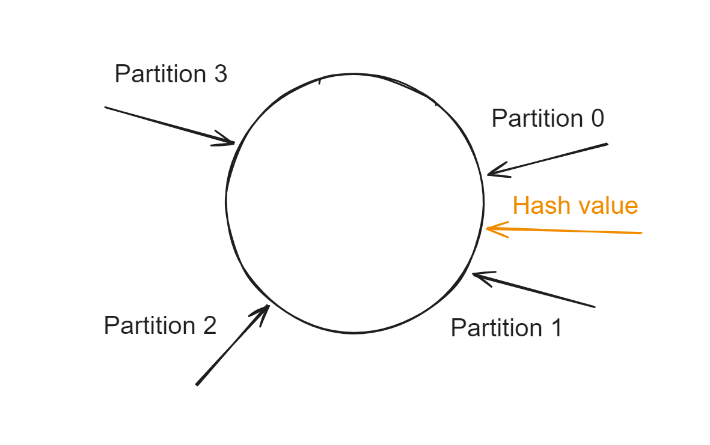

- [Ordering definition](#ordering-definition)
  - [Ordering across partition](#ordering-across-partition)
- [Flowchart for ordering guarantee within business domain](#flowchart-for-ordering-guarantee-within-business-domain)
  - [Cons - Uneven data distribution](#cons---uneven-data-distribution)
    - [Slot allocation](#slot-allocation)
    - [Consistent hashing](#consistent-hashing)

# Ordering definition
* If the msg producing order is the same with msg consuming order, then msgs are in order.
  * The msg producing order is the order when msg arrives at broker. 

## Ordering across partition
* For Kafka, it could not guarantee the order across different partitions. 
* Cross-partition ordering would typically need a role for coordinator. 
  1. Suppose msg1 is produced before msg2 but msg2 arrives at consumer before msg1
  2. Then the coordinator needs to hold msg2 until msg1 is consumed. 

# Flowchart for ordering guarantee within business domain

## Cons - Uneven data distribution

### Slot allocation 
* Steps
  1. Calculate a hashing value according to the business key. 
  2. Calculate a slot index according to hashing_value % slot_num.
  3. Decide the mapping between slot and partition based on load.

* The mapping between slot and partition could be stored inside service registry. 
* Redis uses 16385 slots, and the number of slots could be decided based on business cases. 

### Consistent hashing
* Adjust the partition allocation on ring for data distribution.

