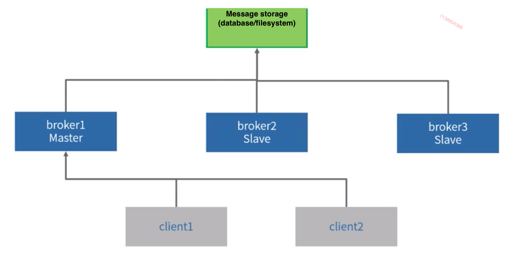
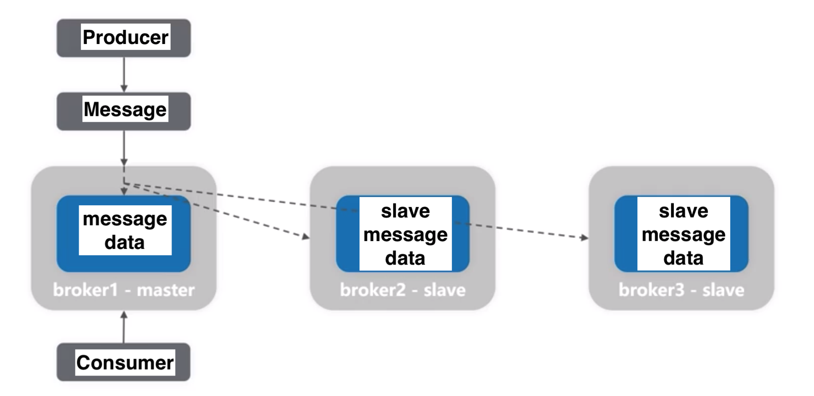
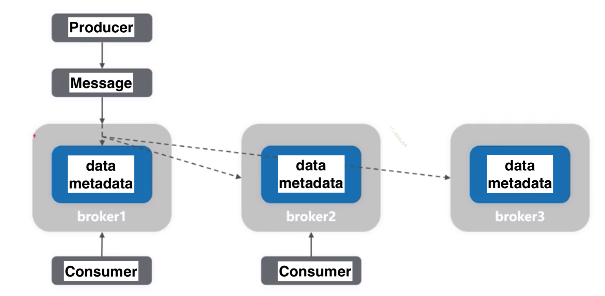
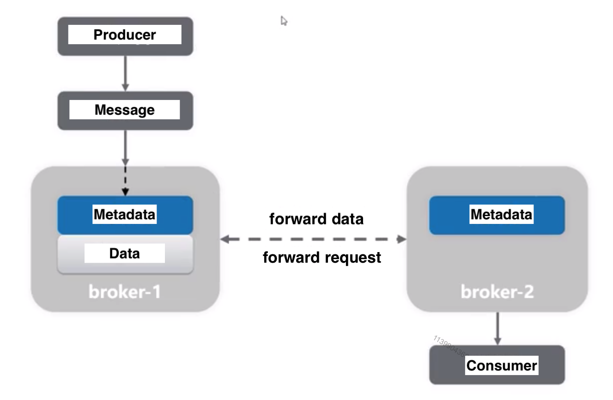
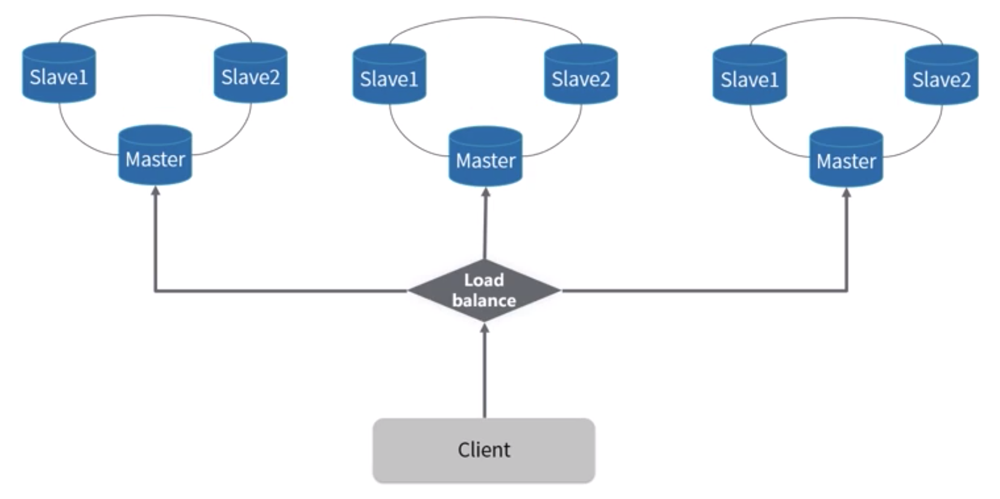

- [An overall component flowchart](#an-overall-component-flowchart)
- [Protocols](#protocols)
- [Persistent mechanisms](#persistent-mechanisms)
- [Message distribution](#message-distribution)
- [High availability](#high-availability)
  - [Single master broker and multi slave brokers](#single-master-broker-and-multi-slave-brokers)
  - [Multi master broker](#multi-master-broker)
- [High reliable](#high-reliable)
  - [Message transmission reliability](#message-transmission-reliability)
  - [Message storage reliability](#message-storage-reliability)
- [Advanced features](#advanced-features)
  - [Message ordering](#message-ordering)
  - [Message requeueing](#message-requeueing)

# An overall component flowchart

```
┌───────────────────────────────────┐                                                                   
│             Producer              │                                                                   
│                                   │                                                                   
│         1. Send in batch          │                                                                   
│         (e.g. Local MQ -          │                                                                   
│  LinkedBlockingQueue/Distruptor)  │                                                                   
│                                   │                                                                   
└───────────────────────────────────┘                                                                   
                  │                                                                                     
                  │                                                                                     
                  │                                                                                     
                  ▼                                     ┌───────────────┐                               
┌──────────────────────────────────┐      replicate────▶│MQ Server slave│                               
│            MQ Server             │       │            └───────────────┘                               
│   ┌──────────────────────────┐   │       │                                                            
│   │Receive data from network │   │       │                                                            
│   │    e.g. Netty in JAVA    │   │       │                                                            
│   └──────────────────────────┘   │       │                                                            
│                 │                │       │             ┌────────────────────────┐                     
│                 ▼                │       │             │   ┌───────────────┐    │                     
│   ┌──────────────────────────┐   │       │             │   │   Java code   │    │                     
│   │Parse the network package │   │       │             │   │               │    │                     
│   │  according to protocol   │   │       │             │   └───────────────┘    │                     
│   └──────────────────────────┘   │       │             │           │            │                     
│                 │                │       │             │           ▼            │                     
│                 │                │       │             │   ┌───────────────┐    │                     
│                 ▼                │       │             │   │      JDK      │    │                     
│   ┌──────────────────────────┐   │       │             │   └───────────────┘    │                     
│   │       Save message       │   │       │             │           │            │                     
│   │      1. flush disk       ├───┼───────┤             │           ▼            │                     
│   │    2. save to replica    │   │       │             │   ┌───────────────┐    │                     
│   └──────────────────────────┘   │       │             │   │      JVM      │    │                     
│                 │                │       │             │   └───────────────┘    │                     
│                 │                │       │             │           │            │                     
│                 ▼                │       │             │           ▼            │                     
│   ┌──────────────────────────┐   │       │             │   ┌ ─ ─ ─ ─ ─ ─ ─ ┐    │                     
│   │      Send to client      │   │       │             │      User memory       │   Could be avoided  
│   │       1. Pull/Push       │   │       │             │   │e.g. Java Heap │────┼─▶   with NIO API    
│   │      2. Fetch size       │   │       └────────Persistent─ ─ ─ ─ ─ ─ ─ ─     │                     
│   └──────────────────────────┘   │                     │           │            │                     
│                                  │                     │           │            │                     
│                                  │                     │           ▼            │                     
│                                  │                     │   ┌───────────────┐    │                     
│                                  │                     │   │e.g. Linux Page│    │                     
│                                  │                     │   │     Cache     │    │                     
└──────────────────────────────────┘                     │   └───────────────┘    │                     
                  │                                      │           │            │                     
                  │                                      │      Frequency         │                     
                  │                                      │       to flush         │                     
                  │                                      │      into disk         │                     
                  ▼                                      │           │            │                     
 ┌────────────────────────────────┐                      │           ▼            │                     
 │                                │                      │   ┌───────────────┐    │                     
 │Consumer                        │                      │   │     Disk      │    │                     
 │                                │                      │   └───────────────┘    │                     
 │1. Multi-thread to consume queue│                      │                        │                     
 │                                │                      │                        │                     
 │                                │                      │      Persistence       │                     
 └────────────────────────────────┘                      └────────────────────────┘
```

# Protocols

* Why not http protocol
  * Too complicated. Large transmission overhead
    * Headers, status code ......
  * Most cases short-lived connection
    * Message queue client could wait long for a message queue. 
* Openwire
* AMQP
  * Proposed by JPMorgan Chase
  * Pros: Transaction support. Persistent support.
  * Both RabbitMQ and ActiveMQ implements AMQP
* MQTT
  * Pros: Lightweight, fast transmission, simple structure
  * Cons: No support for persistent or transaction
* Kafka
  * Binary protocol based on TCP. 
  * Pros: Lightweight, simple structure support 
  * Cons:  no support for transaction,
* OpenMessaging
  * Built by Yahoo, Didi, Streamlio
  * Pros: Lightweight, fast transmission, simple structure, support transaction and persistence. 
  * Implemented by RocketMQ

# Persistent mechanisms

| Message Queues | ActiveMQ | RabbitMQ | RocketMQ | Kafka   |
| -------------- | -------- | -------- | -------- | ------- |
| file system    | support  | support  | support  | support |
| database       | support  | No       | No       | No      |

# Message distribution

* How will consumer receive message
  * Pub-Sub: Message server will push messages to clients.
  * Consumer Pull: Clients will pull messages from message server.
* How will message be distributed among multiple consumers:
  * Round robin fashion based distribution
  * Weighted fashion based distribution
* Does message server support resend

|                        | ActiveMQ | RabbitMQ | Kafka   | RocketMQ |
| ---------------------- | -------- | -------- | ------- | -------- |
| Pub-Sub                | Support  | Support  | Support | Support  |
| Consumer pull          | No       | Support  | Support | Support  |
| Round robin distribute | Support  | Support  | Support | No       |
| Weighted distribute    | No       | Support  | Support | No       |
| Resend                 | Support  | Support  | No      | Support  |

# High availability
## Single master broker and multi slave brokers

* Cold backup
  * All master/slave read data from message storage but only master is serving traffic



* Read-Write separation
* All master/slave read data from message storage but master could serve write traffic and slave could serve read traffic



## Multi master broker

* Full data replication
  * Full dataset is shared by replication among multiple brokers and each broker could serve read/write traffic



* Metadata replication and forward
  * Data is sharded among multiple brokers and only metadata is shared by replication
    * The request could be forwarded to the correct broker



* Multi master broker with slaves



# High reliable

* Definition: System could function without errors or corruption

## Message transmission reliability

* Broker could successfully receive the message from producer
* Consumer could successfully receive the message from broker

## Message storage reliability

# Advanced features
## Message ordering

* Messages are processed in parallel and there is no synchronization between consumers. Each consumer works on a single message at a time and has no knowledge of other consumers running in parallel to it. Since your consumers are running in parallel and any of them can become slow or even crash at any point in time, it is difficult to prevent messages from being occasionally delivered out of order. 
  * Solutions:
    * Limit the number of consumers to a single thread per queue
    * Build the system to assume that messages can arrive in random order
    * Use a messaging broker that supports partial message ordering guarantee. 
  * It is best to depend on the message broker to deliver messages in the right order by using partial message guarantee (ActiveMQ) or topic partitioning (Kafka). If your broker does not support such functionality, you will need to ensure that your application can handle messages being processed in an unpredictable order.
    * Partial message ordering is a clever mechanism provided by ActiveMQ called message groups. Messages can be published with a special label called a message group ID. The group ID is defined by the application developer. Then all messages belonging to the same group are guaranteed to be consumed in the same order they were produced. Whenever a message with a new group ID gets published, the message broker maps the new group Id to one of the existing consumers. From then on, all the messages belonging to the same group are delivered to the same consumer. This may cause other consumers to wait idly without messages as the message broker routes messages based on the mapping rather than random distribution. 
  * Message ordering is a serious issue to consider when architecting a message-based application, and RabbitMQ, ActiveMQ and Amazon SQS messaging platform cannot guarantee global message ordering with parallel workers. In fact, Amazon SQS is known for unpredictable ordering messages because their infrastructure is heavily distributed and ordering of messages is not supported. 

## Message requeueing

* By allowing messages to be delivered to your consumers more than once, you make your system more robust and reduce constraints put on the message queue and its workers. For this approach to work, you need to make all of your consumers idempotent. 
  * But it is not an easy thing to do. Sending emails is, by nature, not an idempotent operation. Adding an extra layer of tracking and persistence could help, but it would add a lot of complexity and may not be able to handle all of the faiulres. 
  * Idempotent consumers may be more sensitive to messages being processed out of order. If we have two messages, one to set the product's price to $55 and another one to set the price of the same product to $60, we could end up with different results based on their processing order. 
