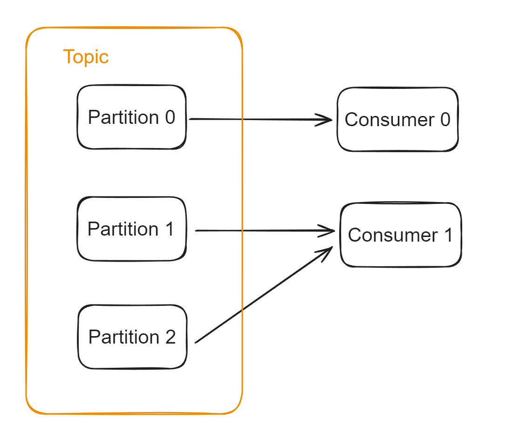

- [Partition to consumer mapping](#partition-to-consumer-mapping)
- [Number of partitions](#number-of-partitions)
- [Message backlog solutions](#message-backlog-solutions)
  - [Add partition](#add-partition)
  - [Add topic](#add-topic)
  - [Optimize consumer performances](#optimize-consumer-performances)
    - [Downgrade consumers](#downgrade-consumers)
    - [Batch messages](#batch-messages)
    - [Asynchronous processing](#asynchronous-processing)
      - [Message loss](#message-loss)
      - [Partial failure](#partial-failure)

# Partition to consumer mapping
* 1 partition corresponds to only 1 consumer. 
* 1 consumer corresponds to more than 1 partition. 

# Number of partitions
* The following QPS numbers are all average QPS rather than peak QPS because message queue is used to smooth the traffic in the beginning. 
* Depends on two factors:
  * The ratio of producing msgs: Suppose QPS 1000 and each partition could support 100 write request, then we need 10 partitions at least. 
  * The ratio of consuming msgs: Suppose each consumer consumes 100 request, then we need 20 paritions at least. 
  * Take the bigger of the two (10, 20)

# Message backlog solutions
## Add partition
* Sometimes devops team does not allow to add partition

## Add topic
* Add a new topic with more consumers. 

## Optimize consumer performances
### Downgrade consumers
* For example, original consumers need to call several downstream services for response. In downgraded cases, consumers could rely on cache. 

### Batch messages

### Asynchronous processing
* Consumer thread only pulls the msg from msg queue. 
* And then worker thread will actually perform tasks. 

#### Message loss

#### Partial failure

