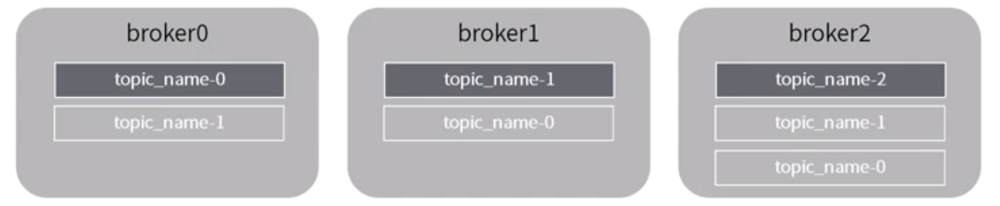

- [Overall flowchart](#overall-flowchart)
- [Broker](#broker)
  - [Kafka grouping data by topic](#kafka-grouping-data-by-topic)
  - [Kafka grouping topic by partition](#kafka-grouping-topic-by-partition)
  - [MySQL analogy for Kafka broker](#mysql-analogy-for-kafka-broker)
- [Producer](#producer)
  - [Load balancing](#load-balancing)
  - [Push-based produer](#push-based-produer)
    - [Batched message compression](#batched-message-compression)
  - [MySQL analogy for producer write process](#mysql-analogy-for-producer-write-process)
- [Consumer](#consumer)
  - [Consumption model](#consumption-model)

# Overall flowchart

# Broker

## Kafka grouping data by topic
* Different line of business uses different topics.

## Kafka grouping topic by partition
* The logs from the same topic could be distributed (replicated) on multiple physical machines. 
* The motivation is to avoid concurrent writing locks. 

* Partition replication

## MySQL analogy for Kafka broker

# Producer
## Load balancing
* The producer controls which partition it publishes to. It sends data directly to the broker that is the leader for the partition without any intervening routing tier. 
* Partition strategy
  * Round-robin
  * Randomized
  * Based on message key: or keyed This can be done at random, implementing a kind of random load balancing, or it can be done by some semantic partitioning function. 
  * Based on location
* To help the producer do this all Kafka nodes can answer a request for metadata about which servers are alive and where the leaders for the partitions of a topic are at any given time to allow the producer to appropriately direct its requests.

## Push-based produer
* You could imagine other possible designs which would be only pull, end-to-end. The producer would locally write to a local log, and brokers would pull from that with consumers pulling from them. A similar type of "store-and-forward" producer is often proposed. This is intriguing but we felt not very suitable for our target use cases which have thousands of producers. Our experience running persistent data systems at scale led us to feel that involving thousands of disks in the system across many applications would not actually make things more reliable and would be a nightmare to operate. And in practice we have found that we can run a pipeline with strong SLAs at large scale without a need for producer persistence.

### Batched message compression
* The producer can always compress its messages one at a time without any support needed from Kafka, but this can lead to very poor compression ratios as much of the redundancy is due to repetition between messages of the same type (e.g. field names in JSON or user agents in web logs or common string values). Efficient compression requires compressing multiple messages together rather than compressing each message individually.
* Kafka supports GZIP, Snappy, LZ4 and ZStandard compression protocols. And there is a parameter called linger.ms which decides how long producers will wait before producing messages. 

## MySQL analogy for producer write process

# Consumer
## Consumption model
* The same message could be consumed by multiple consumers.
* For the same application program, there could be multiple concurrent consumers. Kafka call this consumer group. 

