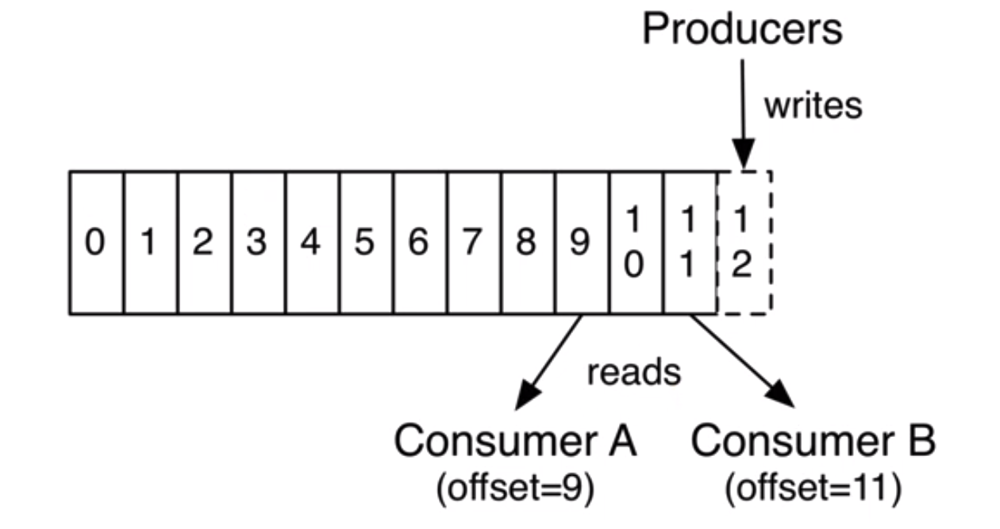

- [Overall flowchart](#overall-flowchart)
- [Broker](#broker)
  - [Kafka grouping data by topic](#kafka-grouping-data-by-topic)
  - [Kafka grouping topic by partition](#kafka-grouping-topic-by-partition)
  - [MySQL analogy for Kafka broker](#mysql-analogy-for-kafka-broker)
- [Producer](#producer)
  - [Load balancing](#load-balancing)
  - [Push-based produer](#push-based-produer)
- [Consumer](#consumer)
  - [Pull-based consumer group](#pull-based-consumer-group)
  - [Benefits](#benefits)
    - [Automatic best batching if there is enough message](#automatic-best-batching-if-there-is-enough-message)
    - [No internal states for consumer positions](#no-internal-states-for-consumer-positions)
  - [Zookeeper](#zookeeper)
  - [MySQL analogy](#mysql-analogy)
    - [Record the offset for each consumer](#record-the-offset-for-each-consumer)

# Overall flowchart

# Broker

## Kafka grouping data by topic
* Different line of business uses different topics.

## Kafka grouping topic by partition
* The logs from the same topic could be distributed (replicated) on multiple physical machines. 
* The motivation is to avoid concurrent writing locks. 

* Partition replication

## MySQL analogy for Kafka broker

# Producer
## Load balancing
* The producer controls which partition it publishes to. It sends data directly to the broker that is the leader for the partition without any intervening routing tier. 
* Partition strategy
  * Round-robin
  * Randomized
  * Based on message key: or keyed This can be done at random, implementing a kind of random load balancing, or it can be done by some semantic partitioning function. 
  * Based on location
* To help the producer do this all Kafka nodes can answer a request for metadata about which servers are alive and where the leaders for the partitions of a topic are at any given time to allow the producer to appropriately direct its requests.

## Push-based produer
* You could imagine other possible designs which would be only pull, end-to-end. The producer would locally write to a local log, and brokers would pull from that with consumers pulling from them. A similar type of "store-and-forward" producer is often proposed. This is intriguing but we felt not very suitable for our target use cases which have thousands of producers. Our experience running persistent data systems at scale led us to feel that involving thousands of disks in the system across many applications would not actually make things more reliable and would be a nightmare to operate. And in practice we have found that we can run a pipeline with strong SLAs at large scale without a need for producer persistence.

# Consumer
## Pull-based consumer group
* Consumers know what consumption rate will be suitable. So pull-based model will be better. 
* Consumer group is divided by business domain. Within the same consumer group, the same partition could only be consumed by one of the consumers. 

## Benefits
### Automatic best batching if there is enough message
* A push-based system must choose to either send a request immediately or accumulate more data and then send it later without knowledge of whether the downstream consumer will be able to immediately process it. A pull-based design typically gets optimal batching when compared with push. Consumers always pull all available messages after its current position in the log (or up to some configurable max size). 
* Pull downsides. The deficiency of a naive pull-based system is that if the broker has no data the consumer may end up polling in a tight loop, effectively busy-waiting for data to arrive. To avoid this we have parameters in our pull request that allow the consumer request to block in a "long poll" waiting until data arrives (and optionally waiting until a given number of bytes is available to ensure large transfer sizes).

### No internal states for consumer positions
* Typically, many messaging systems add an acknowledgement feature which means that messages are only marked as sent not consumed when they are sent; the broker waits for a specific acknowledgement from the consumer to record the message as consumed.
* However, it could be a lot of internal states to keep if there are a large number of consumers. Kafka does not need to maintain an internal state to guarantee at least once delivery.
* Kafka keeps metadata about what messages have been consumed on the consumer group level. 

## Zookeeper
* Within Kafka, it uses Zookeeper to record msgs. 

## MySQL analogy 
### Record the offset for each consumer

