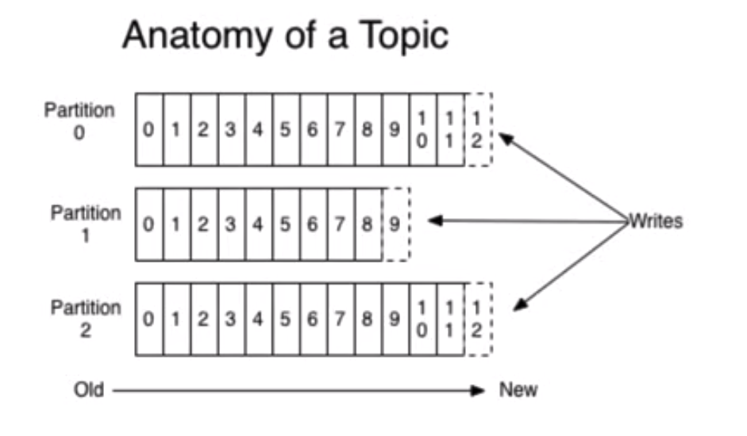

- [Producer](#producer)
  - [Partition key](#partition-key)
  - [Write process](#write-process)
  - [Load balancing](#load-balancing)
  - [Compression](#compression)
  - [Push-based produer](#push-based-produer)
- [Broker](#broker)
  - [Group by topic](#group-by-topic)
  - [Group by data partition](#group-by-data-partition)
- [Consumer](#consumer)
  - [Consumption model](#consumption-model)

# Producer 
* Log producers

## Partition key

## Write process

## Load balancing

* The producer controls which partition it publishes to. It sends data directly to the broker that is the leader for the partition without any intervening routing tier. 
  * Partition strategy
    * Round-robin
    * Randomized
    * Based on message key: or keyed This can be done at random, implementing a kind of random load balancing, or it can be done by some semantic partitioning function. 
    * Based on location: 
* To help the producer do this all Kafka nodes can answer a request for metadata about which servers are alive and where the leaders for the partitions of a topic are at any given time to allow the producer to appropriately direct its requests.

## Compression

* In some cases the bottleneck is actually not CPU or disk but network bandwidth. This is particularly true for a data pipeline that needs to send messages between data centers over a wide-area network. Of course, the user can always compress its messages one at a time without any support needed from Kafka, but this can lead to very poor compression ratios as much of the redundancy is due to repetition between messages of the same type (e.g. field names in JSON or user agents in web logs or common string values). Efficient compression requires compressing multiple messages together rather than compressing each message individually.
* Kafka supports GZIP, Snappy, LZ4 and ZStandard compression protocols.
* Message will be compressed on producer, maintained on broker and decompressed on consumer. 

## Push-based produer

* You could imagine other possible designs which would be only pull, end-to-end. The producer would locally write to a local log, and brokers would pull from that with consumers pulling from them. A similar type of "store-and-forward" producer is often proposed. This is intriguing but we felt not very suitable for our target use cases which have thousands of producers. Our experience running persistent data systems at scale led us to feel that involving thousands of disks in the system across many applications would not actually make things more reliable and would be a nightmare to operate. And in practice we have found that we can run a pipeline with strong SLAs at large scale without a need for producer persistence.

# Broker

## Group by topic
* Different line of business uses different topics.

## Group by data partition
* The logs from the same topic could be distributed (replicated) on multiple physical machines. 

* Replication

# Consumer
## Consumption model
* The same message could be consumed by multiple consumers.
* For the same application program, there could be multiple concurrent consumers. Kafka call this consumer group. 

