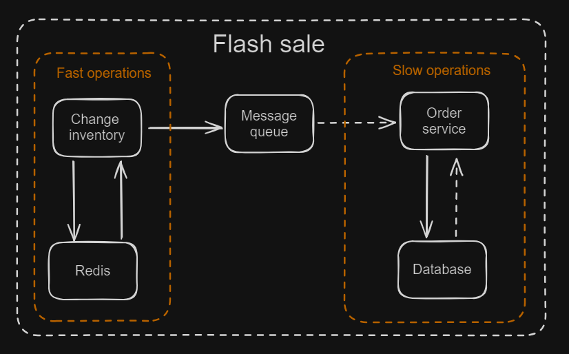
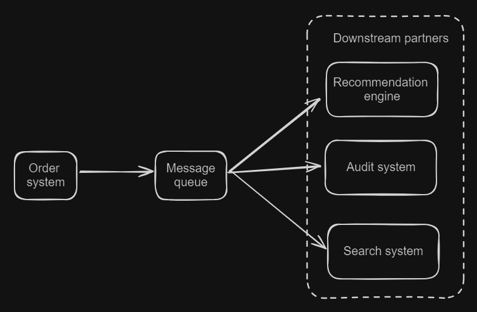

- [Benefits](#benefits)
  - [Asynchronous vs low performance](#asynchronous-vs-low-performance)
    - [Example: Flash sale scenario](#example-flash-sale-scenario)
  - [Decouple vs low extensibility](#decouple-vs-low-extensibility)
    - [Example: Many downstream partners](#example-many-downstream-partners)
  - [High vs low fault tolerance](#high-vs-low-fault-tolerance)
- [References](#references)
  - [TODO: Message ordering in MQ](#todo-message-ordering-in-mq)
  - [TODO: After Kafka: Pulsar](#todo-after-kafka-pulsar)
  - [TODO: MQ based Distributed transaction](#todo-mq-based-distributed-transaction)

# Benefits
## Asynchronous vs low performance
* Defer processing of time-consuming tasks without blocking our clients. Anything that is slow or unpredictable is a candidate for asynchronous processing. Example include
  * Interact with remote servers
  * Low-value processing in the critical path
  * Resource intensive work
  * Independent processing of high- and low- priority jobs

### Example: Flash sale scenario
* For example, in flash sale scenarios. Fast operations (deduct inventory number inside cache) could be performed in real time while slow operations (Whether the user has participated in flash sale before, deduct inventory number inside DB) could be put inside a queue. 

## Decouple vs low extensibility
* How hard it is when you want to add a new downstream partner
* With message queue, the downstream only needs to know the topic to subscribe. 
* With RPC/REST, downstream needs to know the server address and protocol format. 

### Example: Many downstream partners

## High vs low fault tolerance
* Even if some downstream partners fail, the service don't need to retry, etc. 
* Otherwise, it needs to guarantee the communication with downstream goes smoothly. 

# References
* Enterprise integration patterns: https://www.enterpriseintegrationpatterns.com/index.html

## TODO: Message ordering in MQ
* https://zhuanlan.zhihu.com/p/59000202

## TODO: After Kafka: Pulsar
* https://zhuanlan.zhihu.com/p/64901908

## TODO: MQ based Distributed transaction

* Reliable message producing
  * Data needs to be persisted
  * Confirmation needs to be obtained
  * Producer needs to retry
* Reliable message consumption
  * Ack mechanism
* Please see this [link](https://github.com/DreamOfTheRedChamber/system-design/blob/master/distributedTransactions.md#message-queue-based-implementation)
