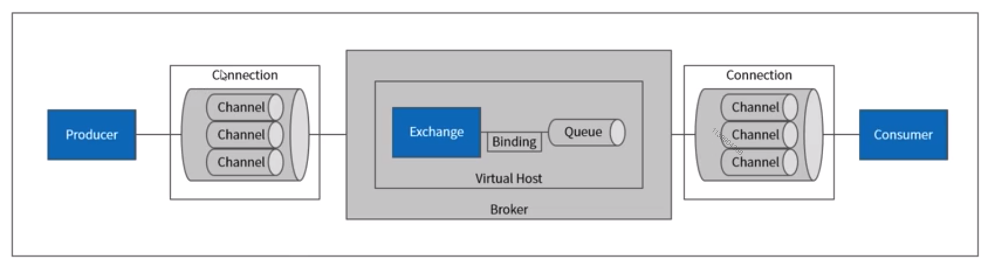

- [RabbitMQ](#rabbitmq)
  - [Concepts](#concepts)
  - [Persistence](#persistence)
  - [Memory control](#memory-control)
  - [High availability](#high-availability)
  - [Reliability](#reliability)
  - [Send reliability](#send-reliability)
  - [Storage reliability](#storage-reliability)
  - [Consumption](#consumption)

# RabbitMQ

## Concepts

## Persistence

* Queue persistence
* Message persistence
* Exchange persistence

## Memory control

* Max memory config

## High availability

* Metadata replication and forward
* Cluster mirrored queues
* Federation plugin
* Shovel plugin

## Reliability

## Send reliability

* Definition: Message could arrive at broker successfully
  * At most once: Supported. Usually not used because there might be message loss. 
  * At least once: Supported. There are two mechanism: Publisher confirm and transaction. The latter one is slow and seldomly used. 
  * Exactly once: Not supported
* Publisher confirm is a mechanism to return 

## Storage reliability

## Consumption

* Storage reliability: Broker could persist the message and guarantee no loss
* Consumption reliability: Message could be successfully consumed
