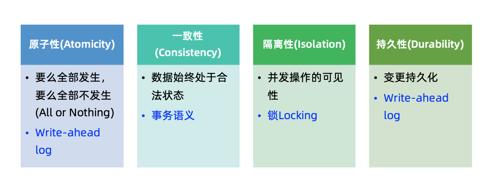

<!-- MarkdownTOC -->

- [Microservices](#microservices)
	- [Problems](#problems)
		- [Data distribution](#data-distribution)
			- [Use case](#use-case)
			- [Approaches](#approaches)
				- [Transactional outbox](#transactional-outbox)
				- [CDC \(Change data capture\)](#cdc-change-data-capture)
		- [Data join](#data-join)
			- [Use case](#use-case-1)
			- [Approaches](#approaches-1)
				- [CQRS](#cqrs)
		- [Distributed transactions](#distributed-transactions)
			- [Definition](#definition)
			- [Approaches](#approaches-2)
				- [2PC](#2pc)
				- [TCC](#tcc)
				- [Saga pattern](#saga-pattern)
		- [Breakdown monolithic](#breakdown-monolithic)
			- [Definition](#definition-1)
			- [Steps to migration](#steps-to-migration)
			- [Key difficult points](#key-difficult-points)
			- [Example](#example)
	- [Configuration center](#configuration-center)
		- [Problems without configuration center](#problems-without-configuration-center)
		- [Requirements on configuration center](#requirements-on-configuration-center)
		- [Configuration categories](#configuration-categories)
			- [Static configuration](#static-configuration)
			- [Dynamic configuration](#dynamic-configuration)
		- [Use case](#use-case-2)
			- [Blue green deploymment](#blue-green-deploymment)
			- [Graceful downgrade](#graceful-downgrade)
			- [DB migration](#db-migration)
			- [AB testing](#ab-testing)
			- [Continuous delivery](#continuous-delivery)
				- [Feature flag driven development](#feature-flag-driven-development)
				- [Trunk based development](#trunk-based-development)
		- [Apollo Architecture \(In Chinese\)](#apollo-architecture-in-chinese)
	- [Zuul](#zuul)
		- [How does Zuul get routing table](#how-does-zuul-get-routing-table)
			- [Eureka](#eureka)
			- [Domain name](#domain-name)
			- [Apollo](#apollo)
	- [Trace](#trace)

<!-- /MarkdownTOC -->

# Microservices
## Problems
### Data distribution
* Definition: Double write. How to guarantee the ACID of two writes

#### Use case
* Data replication
* Database migration
* Implement CQRS or remove join from database
* Implement distributed transactions

#### Approaches
##### Transactional outbox
* Flowchart

* Implementation: Killbill common queue

##### CDC (Change data capture)
* Flowchart

* Implementation:
	- Alibaba Canal (recommended)
	- Redhat Debezium
	- Zendesk Maxell
	- Airbnb SpinalTap

### Data join

#### Use case
* N+1 problem
* Data volume
* Performance

#### Approaches

##### CQRS
* Flowchart

* Possible problems: Eventual consistency

* Possible solutions:

### Distributed transactions
#### Definition 
* https://www.codingapi.com/blog/2020/02/01/txlcn002/

#### Approaches
##### 2PC
- Implementation: Alibaba Seata - 2PC commit. Not used
- Grow ups don't use distributed transactions

##### TCC
- Implementation: Not used

##### Saga pattern
- High entry bar: First need to build a state machine
- Two types of sagar:
	- Choreography Saga
	- Orchestration Saga
- Implementation: Uber Cadence
- Limitation: Does not guarantee the separation
	- Solution 1: Semantic lock

### Breakdown monolithic
#### Definition
* Velocity slow
* Hard to continue scale vertically
* Independent deployment capability

#### Steps to migration

#### Key difficult points
* Understand the APIs
* Database migration
	- Incremental and rollbackable
	- Data 
* Use data distribution and remove join

#### Example
* StichFix - Scaling your architecture with services and events

## Configuration center
### Problems without configuration center
* Static config files could not be changed dynamically. Need to be redeployed
* Configuration exists in many different places (e.g. xml, properties, DB). Errorprone for livesites. 
* No security audit and version control 
* Cloud native requires immutable infrastructure and microservices. This type of continuous delivery requires the architecture of configuration center. 

### Requirements on configuration center
* Access control and audit history
* Gradual rollout
* Management for different environments/clusters

### Configuration categories
#### Static configuration
* Database/middleware/service connection string
* Username, password, token, certificates

#### Dynamic configuration
* Application configuration: Request timeout, thread pool, queue, cache, connnection pool size, circuit breaker threshold, black-white list
* Function on-off toggles: Blue green deployment, HA toggle 
* Business logic toggles: 

### Use case
#### Blue green deploymment

#### Graceful downgrade

#### DB migration
* https://blog.launchdarkly.com/feature-flagging-to-mitigate-risk-in-database-migration

#### AB testing

#### Continuous delivery
##### Feature flag driven development
* Pros:
* Cons:

##### Trunk based development
* https://www.stevesmith.tech/blog/organisation-pattern-trunk-based-development/
* Benefits:
	- Replanning

### Apollo Architecture (In Chinese)
* Server architecture: https://time.geekbang.org/course/detail/100007001-8843
* Client architecture: https://time.geekbang.org/course/detail/100007001-8844
* High availability architecture: https://time.geekbang.org/course/detail/100007001-8845

## Zuul

### How does Zuul get routing table
#### Eureka 

#### Domain name

#### Apollo

## Trace
* Google Dapper
* 

