# RESTful

- [RESTful](#restful)
  - [When commpared with SOAP](#when-commpared-with-soap)
  - [Def](#def)
  - [Transposing API goals into REST APIs](#transposing-api-goals-into-rest-apis)
  - [Design API's data](#design-apis-data)
  - [Evolving an API](#evolving-an-api)
  - [Idempotency](#idempotency)
  - [Efficiency](#efficiency)
  - [Cache API response](#cache-api-response)
  - [Pagination for collections](#pagination-for-collections)
  - [Filtering for collections](#filtering-for-collections)
  - [Batch and bulk operations](#batch-and-bulk-operations)
  - [Security](#security)
  - [TODO](#todo)

## When commpared with SOAP

* SOAP only uses POST http method and embedded action inside. Since SOAP could embed various actions inside, usually SOAP relies either on the server (in most cases) or client to maintain the state of resource.
  * If storing this state info on server: This design makes it not scalable in internet cases where there are large number of clients.
    * e.g. NFS initially could remember each client's state.
    * e.g. For an ERP system having multiple pages, the server needs to remember which page each client is on.
  * If storing this state info on client: Then each API's design could also become a bit more complicated.
* On the contrary, REST makes the service stateless, which means that the server maintains the status of the resource, and client maintains the status of the conversation.
  * e.g. When designing a system for directory browse, it will be based on absolute path (REST style) vs relative path.

## Def

* Six architecture principles: [https://restfulapi.net/](https://restfulapi.net)
* Unfortunately, the REST keyword is already been abused: [https://dzone.com/articles/please-dont-call-them-restful](https://dzone.com/articles/please-dont-call-them-restful)

## Transposing API goals into REST APIs

**Cheat sheet**

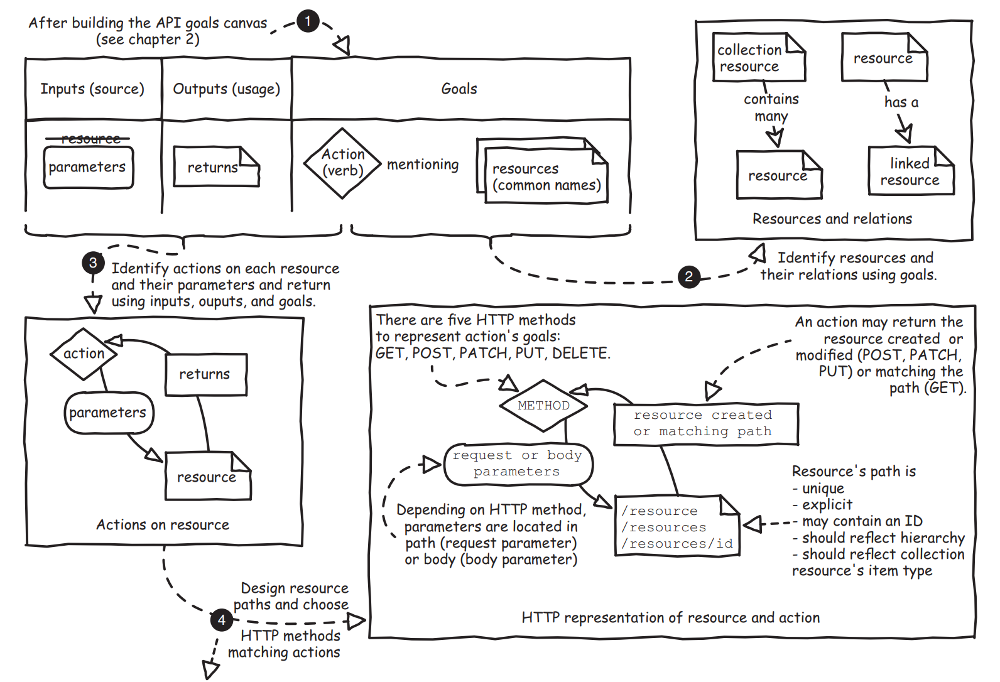

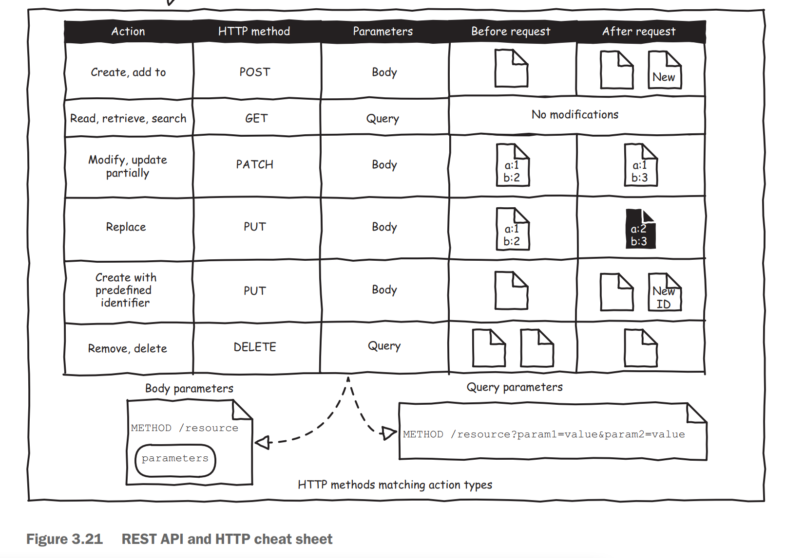

**Step by step**

1. Identify resources and their relationships
2. Identify actions, parameters and returns
3. Design resource paths
4. Identify action parameters and return values


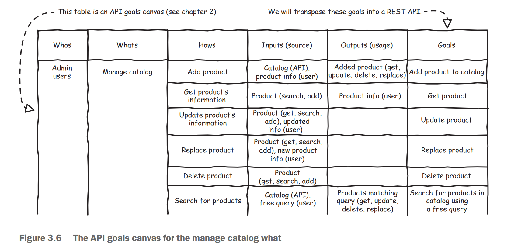

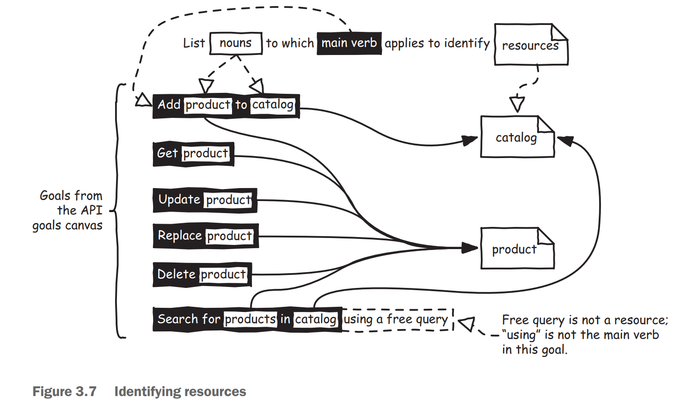

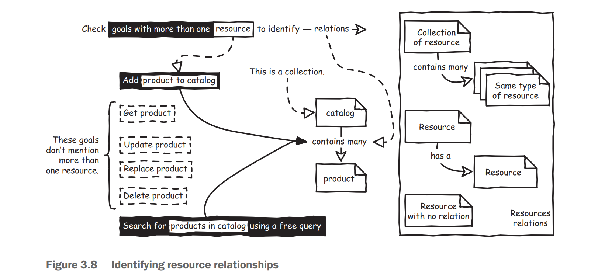


**Resource path best practices**

* Use all lowercase, hyphenated endpoints such as /api/verification-tokens. This increases URL "hackability", which is the ability to manually go in and modify the URL by hand. You can pick any naming scheme you like, as long as you're consistent about it.
* Use a noun or two to describe the resource, such as users, products, or verification-tokens.
* Always describe resources in plural: /api/users rather than /api/user. This makes the API more semantic.
  * Collection resource: /users
  * Instance resource: /users/007

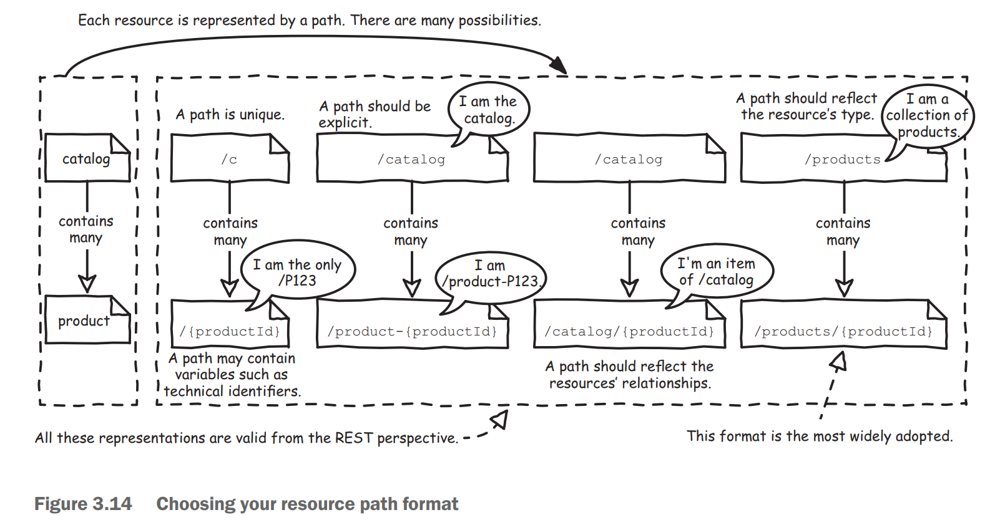

**Http verb best practices**

* Use HTTP verbs for CRUD operations (Create/Read/Update/Delete).

| Verb   | Endpoint              | Description                                                            |
| ------ | --------------------- | ---------------------------------------------------------------------- |
| GET    | /products             | Gets a list of products                                                |
| GET    | /products/:id         | Gets a single product by ID                                            |
| GET    | /products/:id/parts   | Gets a list of parts in a single product                               |
| PUT    | /products/:id/parts   | Inserts a new part for a particular product                            |
| DELETE | /products/:id         | Deletes a single product by ID                                         |
| POST   | /products             | Inserts a new product                                                  |
| HEAD   | /products/:id         | Returns whether the product exists through a status code of 200 or 404 |
| PATCH  | /products/:id         | Edits an existing product by ID                                        |
| POST   | /authentication/login | Most other API methods should use POST requests                        |

* Beyond CRUD: Http verbs could be used more than Create, Read, Update and Delete operations.


* Updates & creation should return a resource representation
  * A PUT, POST or PATCH call may make modifications to fields of the underlying resource that weren't part of the provided parameters (for example: created_at or updated_at timestamps). To prevent an API consumer from having to hit the API again for an updated representation, have the API return the updated (or created) representation as part of the response.
  * In case of a POST that resulted in a creation, use a HTTP 201 status code and include a Location header that points to the URL of the new resource.

## Design API's data

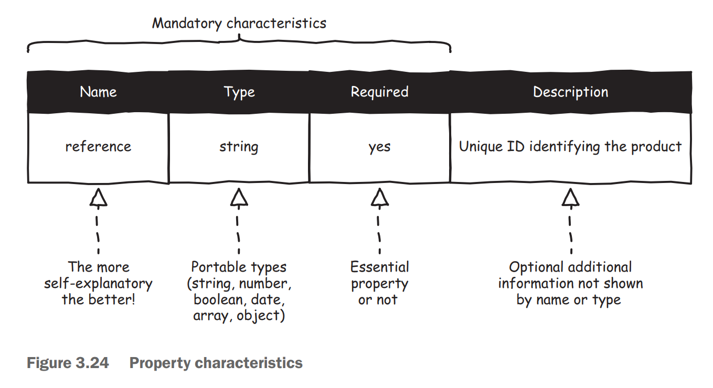

## Evolving an API

**Avoid breaking changes for output data**


**Avoid breakig changes for input data**


**Avoid breaking changes for success and error handling**

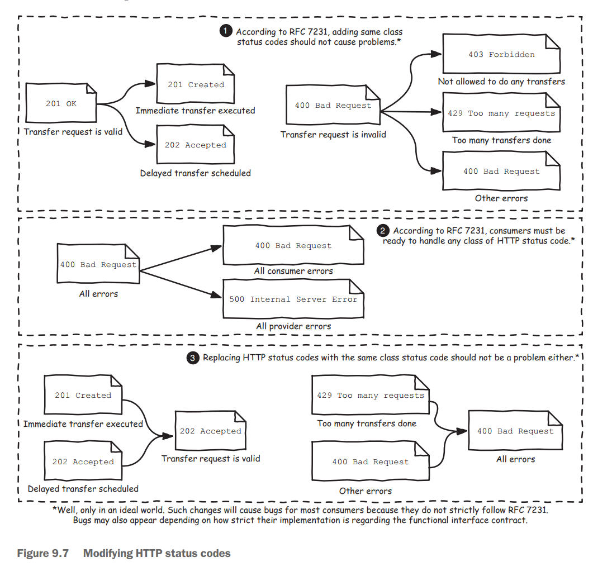

**Avoid breaking changes for security**


**Versioning**

**Semantic versioning**

* [https://semver.org/](https://semver.org)


**Ways to implement version**

* The best way to implement version will be domain name or path


**Versioning granularity**

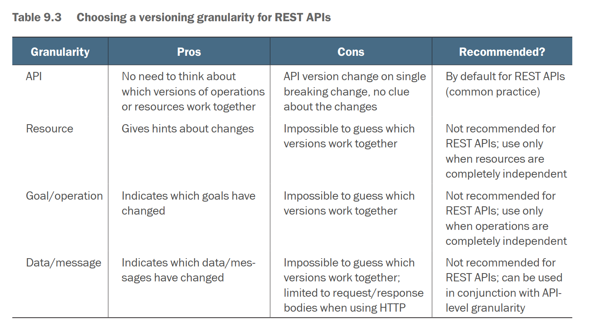

## Idempotency

**Scenario**

* Network problems or repeated operations: For example, the point praise function, a user can only point praise once for the same piece of article, repeated point praise prompt has already point praise.
* Third party callbacks: Our system often needs to deal with third party systems, such as WeChat recharge and Alipay recharge, WeChat and Alipay will often notify you to pay the result by callback your interface. In order to ensure that you receive callbacks, it is often possible to make multiple callbacks.

**Http idempotency**

* Safe vs Idempotent Methods
  * Safe methods: HTTP methods that do not modify resources.
  * Idempotent methods: HTTP methods that can be called many times without different outcomes.

| HTTP METHOD | USE CASE                                                                                       | IDEMPOTENCE | SAFETY |
| ----------- | ---------------------------------------------------------------------------------------------- | ----------- | ------ |
| GET         | Get resources, no side effect                                                                  | YES         | YES    |
| HEAD        | Same as GET except no response body                                                            | YES         | YES    |
| OPTIONS     | Used to get the HTTP Methods supported by the URL                                              | YES         | YES    |
| TRACE       | performs a message loop-back test to the target resource                                       | YES         | YES    |
| POST        | Create new resources. e.g. POST [http://www.forum.com/articles](http://www.forum.com/articles) | NO          | NO     |
| PATCH       | Partially update a resource                                                                    | NO          | NO     |
| PUT         | Completely update a resource                                                                   | YES         | NO     |
| DELETE      | Delete a resource                                                                              | YES         | NO     |

* Why PUT Idempotent and PATCH not
  * It's because it matters how you apply your changes. If you'd like to change the name property of a resource, you might send something like {"name": "foo"} as a payload and that would indeed be idempotent since executing this request any number of times would yield the same result: The resources name attribute is now "foo".
  * But PATCH is much more general in how you can change a resource (check this definition on how to apply a JSON patch). It could also, for example, mean to move the resource and would look something like this: { "op": "move", "from": "/a/b/c", "path": "/a/b/d" }. This operation is obviously not idempotent since calling at a second time would result in an error.
  * So while most PATCH operations might be idempotent, there are some that aren't.
* Why DELETE is Idempotent
  * "Methods can also have the property of "idempotence" in that (aside from error or expiration issues) the side-effects of N > 0 identical requests is the same as for a single request. The methods GET, HEAD, PUT and DELETE share this property. Also, the methods OPTIONS and TRACE SHOULD NOT have side effects, and so are inherently idempotent. "
  * The key bit there is the side-effects of N > 0 identical requests is the same as for a single request.
  * You would be correct to expect that the status code would be different but this does not affect the core concept of idempotency - you can send the request more than once without additional changes to the state of the server.


## Efficiency

**Persistent connections**

* A significant difference between HTTP/1.1 and earlier versions of HTTP is that persistent connections are the default behavior of any HTTP connection. That is, unless otherwise indicated, the client SHOULD assume that the server will maintain a persistent connection, even after error responses from the server.
* [https://www.w3.org/Protocols/rfc2616/rfc2616-sec8.html](https://www.w3.org/Protocols/rfc2616/rfc2616-sec8.html)

**Compression**

**Whether response should be compressed?**

* Content-Encoding header If the response is not already encoded, it will be considered for compression. If the response is already encoded, no further attempts are made to encode the body.
* Content-Length header If the body of the response is 2048 bytes or larger, it can be compressed. If it is smaller than 2048 bytes, it is too small to benefit from compression and no attempt will be made to compress it.
* Content-Type header If the type of content in the response body is in the list of types configured in the Open Liberty server as being valid candidates for compression, it can be compressed. Otherwise, no attempt will be made to compress it.

**End-to-End compression**

* Content negotiation algorithm
* Reference: [https://developer.mozilla.org/en-US/docs/Web/HTTP/Compression](https://developer.mozilla.org/en-US/docs/Web/HTTP/Compression)


## Cache API response

* REST API cache could reuse the functionality of HTTP Cache headers.

**Cache-Control headers**

The Cache-Control header determines whether a response is cacheable, by whom, and for how long.

**Decision tree**

* [Decision tree](https://github.com/NeilMadden/cache-control-flowchart) for determining what Cache-Control header to use.


* There are some other charts useful for what should be done related with cache control headers. (In Chinese so not attach inline here)
  * [What proxy/server should do about caching when get a response](https://github.com/DreamOfTheRedChamber/system-design-interviews/tree/b195bcc302b505e825a1fbccd26956fa29231553/images/cacheControlHeaders-server.png)
  * [What client should do about a request](https://github.com/DreamOfTheRedChamber/system-design-interviews/tree/b195bcc302b505e825a1fbccd26956fa29231553/images/cacheControlHeaders-client.png)

**Sample flow**

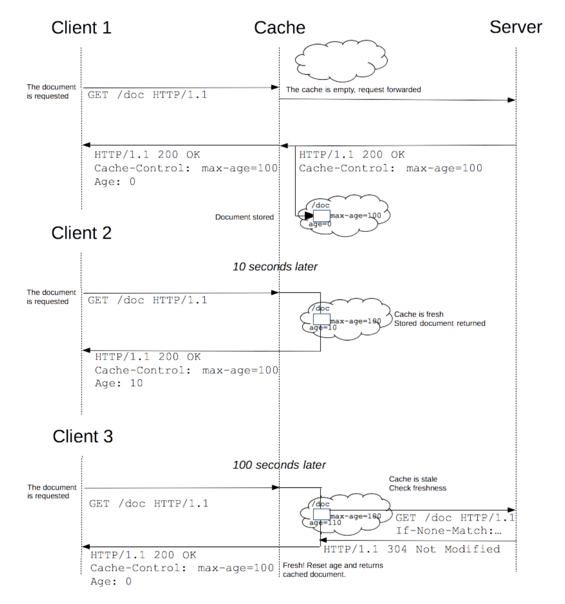

**Cache-Control vs Expire header**

* Comparison with Cache-Control header: Cache-Control was introduced in HTTP/1.1 and offers more options than Expires. They can be used to accomplish the same thing but the data value for Expires is an HTTP date whereas Cache-Control max-age lets you specify a relative amount of time so you could specify "X hours after the page was requested".
* HTML Cache control is a very similar question and has a good link to a caching tutorial that should answer most of your questions (e.g., [http://www.mnot.net/cache_docs/#EXPIRES](http://www.mnot.net/cache_docs/#EXPIRES)). To sum up though, Expires is recommended for static resources like images and Cache-Control when you need more control over how caching is done.

**Whether a response is cacheable**

* public: indicates that the response may be cached, even if it would normally be non-cacheable. Both intermediaries and local could cache it.
* private: indicates that the response may be cached by local (typically browser) caches only. Intermediaries (such as nginx, other caching layers like Varnish, and all kinds of hardware in between) are not allowed to cache it.
* no-cache: A cache will send the request to the origin server for validation before releasing a cached copy.
* no-store: Cache should not store anything about the client request or server response. A request is sent to the server and a full response is downloaded each and every time.

```
Cache-Control: no-store
Cache-Control: no-cache
Cache-Control: private
Cache-Control: public
```

**Set the expiration time of the header**

* max-age: gives a time to live of the resource in seconds, after which any local and shared caches must revalidate the response.
* s-maxage: gives a time to live of the resource in seconds, after which any shared caches must revalidate the response.

```
Cache-Control: max-age=31536000
```

**When a response must be revalidated**

* must-revalidate: indicates a normally uncacheable response is cacheable, but requires a cache to revalidate stale responses before using a cached response. This forces revalidation requests to travel all the way to the origin server, but an efficient validation mechanism on the server will prevent complex service logic from being invoked on each request.
* proxy-revalidate: similar to must-revalidate, but applied only to shared caches.
* stale-while-revalidate: allows a cache to serve a stale response while a revalidation happens in the background. This directive favors reduced latency over consistency of data by allowing a cache to serve stale data while a non-blocking request to revalidate happens in the background.
* stale-if-error: allows a cache to serve a stale response if there is an error during revalidation. This directive favors availability over consistency by allowing a cache to return stale data during origin server failure.

```
Cache-Control: must-revalidate
```

**Conditional Get with validation**

* To revalidate a response with the origin server, a cache uses the value in the Validator headers (Etag or Last-Modified) to do a conditional GET.
* ETag: An Etag, or entity tag, is an opaque token that the server associates with a particular state of a resource. Whenever the resource state changes, the entity tag should be changed accordingly.
* Last-modified: The Last-Modified header indicates the last point in time when the resource was changed.

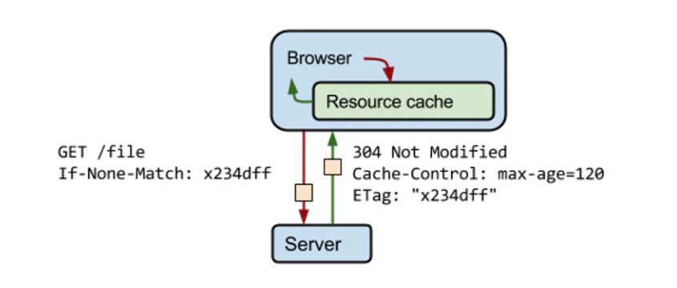

**Last-Modified/If-Modified-Since/Max-age**

* Specifying a Last-Modified header in your response. It's best to specify a max-age in the Cache-Control header, to let the browser invalidate the cache after a certain period of time even if the modification date doesn't change

```
Cache-Control: private, max-age=86400
Last-Modified: Thu, 3 Jul 2014 18:31:12 GMT
```

* The next time the browser requests this resource, it will only ask for the contents of the resource if they're unchanged since this date, using the If-Modified-Since request header. If the resource hasn't changed since Thu, 3 Jul 2014 18:31:12 GMT, the server will return with an empty body with the 304 Not Modified status code.

```
If-Modified-Since: Thu, 3 Jul 2014 18:31:12 GMT
```

**ETag**

* ETag header is usually a hash that represents the source in its current state. This allows the server to identify if the cached contents of the resource are different than the most recent versions:

```
Cache-Control: private, max-age=86400
ETag: "d5jiodjiojiojo"
```

* On subsequent requests, the If-None-Match request header is sent with the ETag value of the last requested version for the same resource. If the current version has the same ETag value, your current version is what the client has cached and a 304 Not Modified response will be returned.

```
If-None-Match: "d5jiodjiojiojo"
```

* If-Match: Succeeds if the ETag of the distant resource is equal to one listed in this header. By default, unless the etag is prefixed with 'W/', it performs a strong validation.
* If-None-Match: Succeeds if the ETag of the distant resource is different to each listed in this header. By default, unless the etag is prefixed with 'W/', it performs a strong validation.
* If-Modified-Since: Succeeds if the Last-Modified date of the distant resource is more recent than the one given in this header.
* If-Unmodified-Since: Succeeds if the Last-Modified date of the distant resource is older or the same than the one given in this header.
* If-Range: Similar to If-Match, or If-Unmodified-Since, but can have only one single etag, or one date. If it fails, the range request fails, and instead of a 206 Partial Content response, a 200 OK is sent with the complete resource.

**Vary header**

* The Vary HTTP response header determines how to match future request headers to decide whether a cached response can be used, or if a fresh one must be requested from the origin server.
* When a cache receives a request that has a Vary header field, it must not use a cached response by default unless all header fields specified in the Vary header match in both the original (cached) request and the new request.
* References: [https://developer.mozilla.org/en-US/docs/Web/HTTP/Caching](https://developer.mozilla.org/en-US/docs/Web/HTTP/Caching)

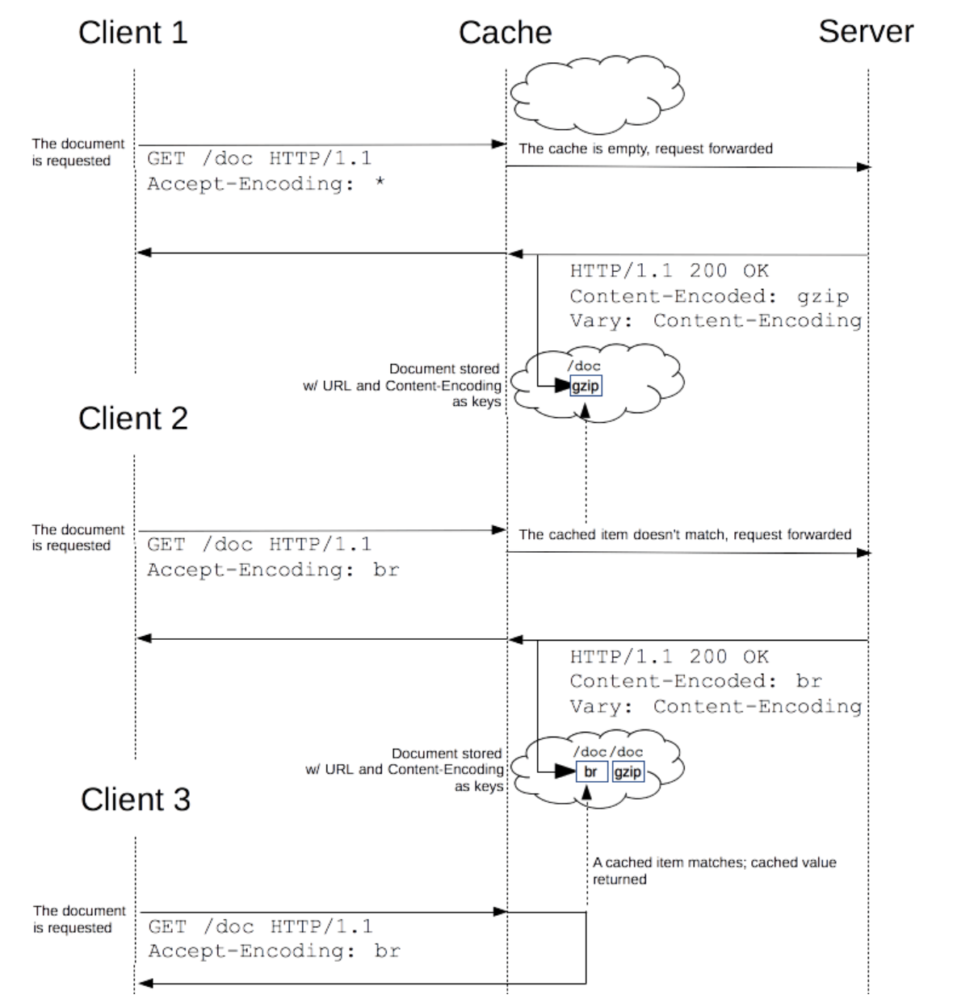

## Pagination for collections

**Naive impl with Offsets and Limits**

* Motivation: Most relational database supports Offset and Limits, it is tempting to carry forward that in an API as a way of exposing a window before a list of resources. For example, [https://example.org/chatRooms/5/messages?offset=30\&limit=10](https://example.org/chatRooms/5/messages?offset=30\&limit=10)


**Metadata**

* Total count: Include enough metadata so that clients can calculate how much data there is, and how and whether to fetch the next set of results.

```javascript
// Metadata: Total count
{
  "results": [ ... actual results ... ],
  "pagination": {
    "count": 2340,
    "offset": 4,
    "limit": 20
  }
}

// Metadata: Link header
```

* Link header: The pagination info is included in the Link header. It is important to follow these Link header values instead of constructing your own URLs. In some instances, such as in the Commits API, pagination is based on SHA1 and not on page number.

```bash
 Link: <https://api.github.com/user/repos?page=3&per_page=100>; rel="next",
   <https://api.github.com/user/repos?page=50&per_page=100>; rel="last"
```

**Cons**

* **Expose internal implementation details**: The fundamental problem with this pattern is that it leaks the implementation details to the API, so this API must continue to support offsets and limits regardless of the underlying storage system. This may not seem like a big deal now, but as storage systems become more complex, implementations using limits and offsets may not always work. For example, if your data is stored in an eventually consistent distributed system, finding the starting point of an offset might actually become more and more expensive as the offset value increases.
* **Consistency**: This pattern also suffers from problems related to consistency. In this example, if some new results are added, they may cause the response to return results that were already seen in a previous page

**Improved impl with maxPageSize + nextPageToken**

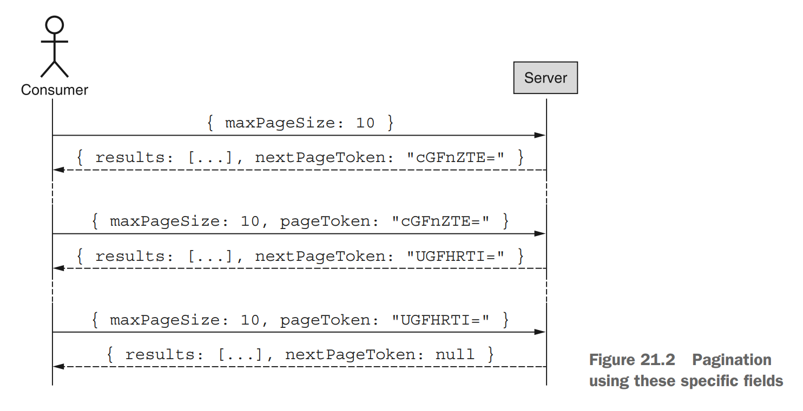

**MaxPageSize**

* max vs exact page size?
  * In most cases an API server might always be able to return an exact number of results; however, in many larger-scale systems this simply won’t be possible without paying a significant cost premium
  * In cases where there are a large number of records but the matching records are separated by some unmatched records, there will be huge waiting time before the second matching could be found. It will be a better idea to return all results found after a cut-off time instead of waiting all results to be returned.


**PageToken**

* Def: A cursor for server on how to pick up where it left off when iterating through a list of results.
* Opaque identifier to clients: Regardless of what you put into your page token, the structure, format, or meaning of the token should be completely hidden from the consumer. This is to avoid exposing internal implementation details to client. The most common format is to use a Base64-encoded encrypted value passed around as a UTF-8 serialized string.
* As termination criteria: In many systems we tend to assume that once we get a page of results that isn’t full we’re at the end of the list. Unfortunately, that assumption doesn’t work with our page size definition since page sizes are maximum rather than exact.

**Total count**

* It does not need to be super accurate if the number of records is large.

**Consistency problem**

* Problem


* Solution:
  * If the DB supports snapshot, then strong consistency could be guaranteed during pagination.
  * No simple answer to this question.

## Filtering for collections

* Provide filtering, sorting, field selection for collections
  * Filtering: Use a unique query parameter for all fields or a query language for filtering.
    * GET /cars?color=red Returns a list of red cars
    * GET /cars?seats<=2 Returns a list of cars with a maximum of 2 seats
  * Sorting: Allow ascending and descending sorting over multiple fields
    * GET /cars?sort=-manufactorer,+model. This returns a list of cars sorted by descending manufacturers and ascending models.
  * Field selection: Mobile clients display just a few attributes in a list. They don’t need all attributes of a resource. Give the API consumer the ability to choose returned fields. This will also reduce the network traffic and speed up the usage of the API.
    * GET /cars?fields=manufacturer,model,id,color

## Batch and bulk operations

* [https://tyk.io/api-design-guidance-bulk-and-batch-import/](https://tyk.io/api-design-guidance-bulk-and-batch-import/)
* Google Drive's batch / bulk operations: [https://developers.google.com/drive/api/v3/batch](https://developers.google.com/drive/api/v3/batch)

```
// Bulk import
// Request
POST /accounts/bulk-import
Content-Type: application/json-seq

{ "id":"12", "name":"...", ... }
{ "id":"13", "name":"...", ... }
{ "id":"14", "name":"...", ... }
{ "id":"15", "name":null, ... }

// Response
HTTP/1.1 207 Multi-Status
Content-Type: application/json

{
    "items": [
        { "id": "12", "status": 201, errors: [] },
        { "id": "13", "status": 201, errors: [] },
        { "id": "14", "status": 201, errors: [] },
        { "id": "15", "status": 400, errors: [ ... ] }
    ]
}


// Batch import
// Request
POST /accounts/batch-import
Content-Type: application/json-seq

{ "id":"12", "name":"...", ... }
{ "id":"13", "name":"...", ... }
{ "id":"14", "name":"...", ... }
{ "id":"15", "name":null, ... }

// Response
HTTP/1.1 400 Bad Request
Content-Type: application/json

{
    "items": [
        { "id": "12", "status": 200, errors: [] },
        { "id": "13", "status": 200, errors: [] },
        { "id": "14", "status": 200, errors: [] },
        { "id": "15", "status": 400, errors: [ ... ] }
    ]
}
```

## Security

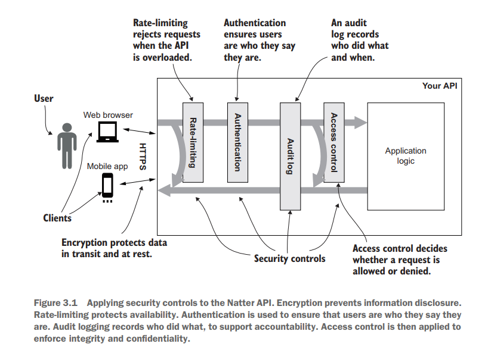


**Rate-limiting**

* Please see [Rate limiter design](../../Scenario_RateLimiter.md)

**Authentication / Audit log / Access control**

* Please see [MicroSvcs security](../../MicroSvcs_Security.md)


## TODO
* API versioning: https://stripe.com/blog/api-versioning
* API rate limit: https://stripe.com/blog/rate-limiters
* History: https://stripe.com/blog/payment-api-design
