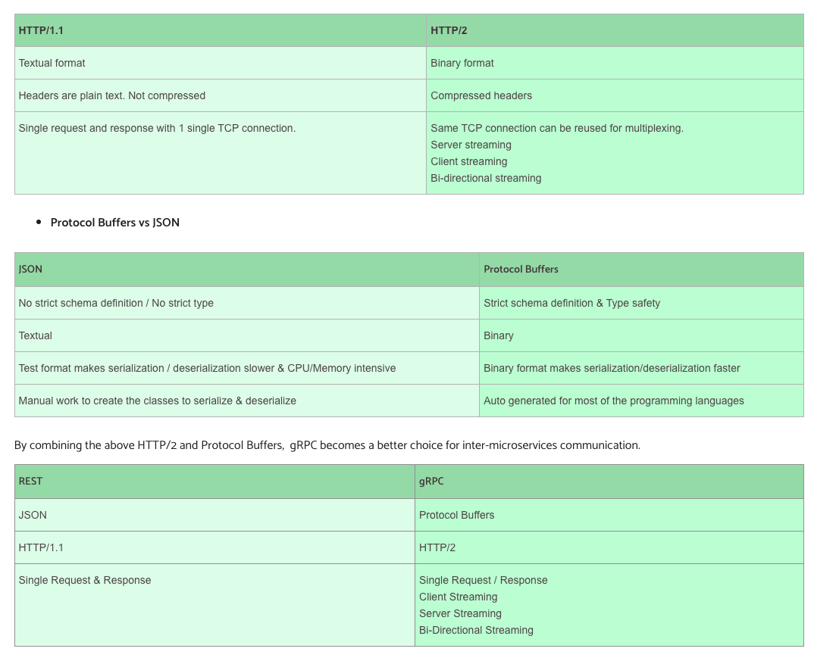

- [Modern RPC](#modern-rpc)
  - [When compared with REST (using gRPC as example)](#when-compared-with-rest-using-grpc-as-example)
  - [Sample Dubbo RPC implementation](#sample-dubbo-rpc-implementation)
  - [Skeleton RPC design](#skeleton-rpc-design)
  - [Choose RPC framework](#choose-rpc-framework)
  - [gRPC](#grpc)

# Modern RPC

## When compared with REST (using gRPC as example)

**Comparison table**

|                         |                                                                                                                                                                                                                              |                                                                                                                                                                                                                |
| ----------------------- | ---------------------------------------------------------------------------------------------------------------------------------------------------------------------------------------------------------------------------- | -------------------------------------------------------------------------------------------------------------------------------------------------------------------------------------------------------------- |
|                         | `REST`                                                                                                                                                                                                                       | `gRPC`                                                                                                                                                                                                         |
| Definition              | REST is an [architecture style](https://www.restapitutorial.com/lessons/whatisrest.html). It exposes data as resources and CRUD operations could be used to access resources. HTTP is an implement conforming to REST styles | Make the process of executing code on a remote machine as simple and straight-forward as calling a local functions. There are many types of RPC. RPC usually exposes action-based API methods. gRPC is a multi |
| Use case                | Cross-language platform, public and private facing scenarios                                                                                                                                                                 | Cross-language platform, public scenarios                                                                                                                                                                      |
| Serilization protocol   | readablee text(XML, JSon)                                                                                                                                                                                                    | Use ProtoBuf by default                                                                                                                                                                                        |
| Transmission protocol   | Typically on HTTP1.1                                                                                                                                                                                                         | HTTP 2.0 which supports streaming communication and bidirectional support.                                                                                                                                     |
| API contract            | Loose, Optional (Open API)                                                                                                                                                                                                   | Strict, required (.proto)                                                                                                                                                                                      |
| Delivery semantics      | Idempotent                                                                                                                                                                                                                   | At most/least/exactly once                                                                                                                                                                                     |
| User friendly           | Easy to debug because request/response are readable                                                                                                                                                                          | Hard to debug because request/response are not readable                                                                                                                                                        |
| Browser support         | Universal browser support.                                                                                                                                                                                                   | Limited browser support. gRPC requires gRPC-web and a proxy layer to perform conversions between HTTP 1.1 and HTTP 2.                                                                                          |
| Code generation support | Developers must use a third-party tool like Swagger or Postman to produce code for API requests.                                                                                                                             | gRPC has native code generation features.                                                                                                                                                                      |
| HTTP verbs              | REST will use HTTP methods such as GET, POST, PUT, DELETE, OPTIONS and, hopefully, PATCH to provide semantic meaning for the intention of the action being taken.                                                            | RPC uses only GET and POST, with GET being used to fetch information and POST being used for everything else.                                                                                                  |
| Examples                | SpringMVC/Boot, Jax-rs, drop wizard                                                                                                                                                                                          | Dubbo, Motan, Tars, gRPC, Thrift                                                                                                                                                                               |

**Semantics of RPC**

**At least once**

* Def: For every request message that the client sends, at least one copy of that message is delivered to the server. The client stub keeps retrying until it gets an ack. This is applicable for idempotent operations.

**Exactly once**

* Def: For every request message that the client sends, exactly one copy of that message is delivered to the server.
* But this goal is extremely hard to build. For example, in case of a server crash, the server stub call and server business logic could happen not in an atomic manner.

**At most once**

* Def: For every request message that the client sends, at most one copy of that message is delivered to the server.

**Designs**

1. How to detect a duplicate request?
   * Client includes unique transaction ID with each one of its RPC requests
   * Client uses the same xid for retransmitted requests
2. How to avoid false detection?
   * One of the recurrent challenges in RPC is dealing with unexpected responses, and we see this with message IDs. For example, consider the following pathological (but realistic) situation. A client machine sends a request message with a message ID of 0, then crashes and reboots, and then sends an unrelated request message, also with a message ID of 0. The server may not have been aware that the client crashed and rebooted and, upon seeing a request message with a message ID of 0, acknowledges it and discards it as a duplicate. The client never gets a response to the request.
   * One way to eliminate this problem is to use a boot ID. A machine’s boot ID is a number that is incremented each time the machine reboots; this number is read from nonvolatile storage (e.g., a disk or flash drive), incremented, and written back to the storage device during the machine’s start-up procedure. This number is then put in every message sent by that host. If a message is received with an old message ID but a new boot ID, it is recognized as a new message. In effect, the message ID and boot ID combine to form a unique ID for each transaction.
3. How to ensure that the xid is unique?
   * Combine a unique client ID (e.g. IP address) with the current time of the day
   * Combine a unique client ID with a sequence number
   * Combine a unique client ID with a boot ID
   * Big random number
4. seen and old arrays will grow without bound
   * Client could tell server "I'm done with xid x - delete it".
   * Client includes "seen all replies <= X" with every RPC
5. Server may crash and restart
   * If old\[], seen\[] tables are only in meory, then the user needs to retry

```
if seen[xid]:
    retval = old[xid]
else:
    retval = handler()
    old[xid] = retval
    seen[xid] = true
return retval
```

**Last of many**

* Last of many : This a version of 'At least once', where the client stub uses a different transaction identifier in each retransmission. Now the result returned is guaranteed to be the result of the final operation, not the earlier ones. So it will be possible for the client stub to tell which reply belongs to which request and thus filter out all but the last one.

## Sample Dubbo RPC implementation

```java
// Sample RPC implementation based on Dubbo

// Client of RPC
@Component
public class HelloClient 
{
    @Reference // RPC Dubbo annotation. Reference a registered service. 
    private HelloService helloService;

    public String hello() 
    {
      return helloService.hello("World");
    }
}

// Server of RPC
@Service // RPC Dubbo annotation. 
@Component
public class HelloServiceImpl implements HelloService 
{
    @Override
    public String hello(String name) 
    {
        return "Hello " + name;
    }
}
```

## Skeleton RPC design

**RPC framework (wrapping Registry center, client, server.)**

```java
/**
 * RPC framework exposed access points
 */
public interface RpcAccessPoint extends Closeable
{
    <T> T getRemoteService(URI uri, Class<T> serviceClass);
    <T> URI addServiceProvider(T service, Class<T> serviceClass);
    Closeable startServer() throws Exception;
}

/**
 * register center
 * Only maintains the mapping between ServiceName and Uri, not providing instance. 
 */
public interface NameService 
{
    void registerService(String serviceName, URI uri) throws IOException;
    URI lookupService(String serviceName) throws IOException;
}
```

```java
// Example with HelloService

/**
 * service name
 */
public interface HelloService 
{
    String hello(String name);
}

/**
* Service provider first implements the service and then register it. 
*/
public class HelloServiceImpl implements HelloService 
{
    @Override
    public String hello(String name) 
    {
        String ret = "Hello, " + name;
        return ret;
    }
}

rpcAccessPoint.startServer();
URI uri = rpcAccessPoint.addServiceProvider(helloService, HelloService.class);
nameService.registerService(serviceName, uri);

/**
 * Client side
 */
URI uri = nameService.lookupService(serviceName);
HelloService helloService = rpcAccessPoint.getRemoteService(uri, HelloService.class);
String response = helloService.hello(name);
logger.info("Receive response: {}.", response);
```

**Serialization**

**Factors to consider**

* Support data types: Some serialization framework such as Hessian 2.0 even support complicated data structures such as Map and List.
* Cross-language support
* Performance: The compression rate and the speed for serialization.
* General RPC protocol vs specialized RPC protocol:
* Prefer general RPC protocol because the parameters / methods / marshall / etc could be any type.

**Protobuf**

**Compatibility**

* Each field will be decorated with optional, required or repeated. optional keyword helps with compatibility. For example, when a new optional field is added, client and server could upgrade the scheme independently.

**Efficiency**

* Protobuf is based on varied length serialization.
* Tag, Length, Value
  * Tag = (field_num << 3) | wire_type
    * field_num is the unique identification number in protobuf schema.


```
// An example of serializing author = 3 field with value liuchao
message Order 
{
  required string date = 1;
  required string classname = 2;
  required string author = 3;
  required int price = 4;
}

// First step, field_num = 3, wire_type = 2, 
// Second step, (field_num << 3) | wire_type = (11000) | 10 = 11010 = 26
// Third step, value = "liuchao", length = 7 if using UTF-8 encoding
// Finally, encoding is "26, 7, liuchao"
```

**Hessian2**

* Def: Self-descriptive language. Avoids generating the client and server side stub and proto.
* Spec: [http://hessian.caucho.com/doc/hessian-serialization.html](http://hessian.caucho.com/doc/hessian-serialization.html)
* Use case: Default serialization scheme in Dubbo.

```
H x02 x00   # "H" represents Hessian 2.0 protocol
C           # "C" represents a RPC call
 x03 add    # method name has three characters "add"
 x92        # x92 represents there are two arguments (x90 is added to represent this is an int)
 x92        # 2 - argument 1
 x93        # 3 - argument 2
```

**Sample design**

```java
public class SerializeSupport 
{
    // Find the serializer for the given class. 
    private static Map<Class<?>/*Serialization target type*/, Serializer<?>/*Serializer implementation*/> serializerMap = new HashMap<>();

    // Find the class for a given serialized stream. 
    private static Map<Byte/*Serialized object*/, Class<?>/*Serialize object type*/> typeMap = new HashMap<>();

    public static  <E> E parse(byte [] buffer) 
    {
        // ...
    }

    public static <E> byte [] serialize(E  entry) 
    {
        // ...
    }
}

public interface Serializer<T> 
{
    int size(T entry);

    void serialize(T entry, byte[] bytes, int offset, int length);

    T parse(byte[] bytes, int offset, int length);

    byte type();

    Class<T> getSerializeClass();
}

// Serialize
MyClass myClassObject = new MyClass();
byte [] bytes = SerializeSupport.serialize(myClassObject);

// Deserialize
MyClass myClassObject1 = SerializeSupport.parse(bytes);
```

**Transport**

**Netty basics**

* Implementation based on Netty. Netty listens to the following types of events:
  * Connection event: void connected(Channel channel)
  * Readable event: void sent(Channel channel, Object message)
  * Writable event: void received(Channel channel, Object message)
  * Exception event: void caught(Channel channel, Throwable exception)

**Http 1.1 vs Http 2**

* REST APIs follow a request-response model of communication that is typically built on HTTP 1.1. Unfortunately, this implies that if a microservice receives multiple requests from multiple clients, the model has to handle each request at a time, which consequently slows the entire system. However, REST APIs can also be built on HTTP 2, but the request-response model of communication remains the same, which forbids REST APIs to make the most out of the HTTP 2 advantages, such as streaming communication and bidirectional support.
* gRPC does not face a similar obstacle. It is built on HTTP 2 and instead follows a client-response communication model. These conditions support bidirectional communication and streaming communication due to gRPC's ability to receive multiple requests from several clients and handle those requests simultaneously by constantly streaming information. Plus, gRPC can also handle "unary" interactions like the ones built on HTTP 1.1.



* gRPC is able to handle unary interactions and different types of streaming. The following are sampleSample gRPC interface definition

```
// Unary streaming: when the client sends a single request and receives a single response.

rpc SayHello(HelloRequest) returns (HelloResponse){}

// Server-streaming: when the server responds with a stream of messages to a client's request. Once all the data is sent, the server additionally delivers a status message to complete the process.

rpc LotsOfReplies(HelloRequest) returns (stream HelloResponse){}

// Client-streaming: when the client sends a stream of messages and in turn receives a single response message from the server.

rpc LotsOfGreetings(stream HelloRequest) returns (HelloResponse) {}

// Bidirectional-streaming: the two streams (client and server) are independent, meaning that they both can transmit messages in any order. The client is the one who initiates and ends the bidirectional streaming.

rpc BidiHello(stream HelloRequest) returns (stream HelloResponse){}
```

**Sample design**

**Command**

* Response Header:
* Payload:

```java
// Use Command to wrap the request and response. 
public class Command {
    protected Header header;
    private byte [] payload;
    //...
}

// Use Request Header: requestId / version / type
public class Header {
    private int requestId;
    private int version;
    private int type;
    // ...
}

// Response header needs to have additional fields 
// code: similar to HttpStatusCode
// eror: error description
public class ResponseHeader extends Header {
    private int code;
    private String error;
    // ...
}
```

**InFlightRequests**

* Used to capture all requests going on.
* Within the InflightRequests there is a semaphore implementation because:
  * In synchronous programming, client will only send another requests when it receives the current one.
  * In asynchronous programming, server will immediately return a response so there must be some concurrency control in place.

```java
public class InFlightRequests implements Closeable 
{
    private final static long TIMEOUT_SEC = 10L;
    private final Semaphore semaphore = new Semaphore(10);
    private final Map<Integer, ResponseFuture> futureMap = new ConcurrentHashMap<>();
    private final ScheduledExecutorService scheduledExecutorService = Executors.newSingleThreadScheduledExecutor();
    private final ScheduledFuture scheduledFuture;

    public InFlightRequests() 
    {
        scheduledFuture = scheduledExecutorService.scheduleAtFixedRate(this::removeTimeoutFutures, TIMEOUT_SEC, TIMEOUT_SEC, TimeUnit.SECONDS);
    }

    public void put(ResponseFuture responseFuture) throws InterruptedException, TimeoutException {
        if(semaphore.tryAcquire(TIMEOUT_SEC, TimeUnit.SECONDS)) {
            futureMap.put(responseFuture.getRequestId(), responseFuture);
        } else {
            throw new TimeoutException();
        }
    }

    // ...
}
```

**Netty channel**

* Used to send request.

```java
public interface Transport 
{
    // both input and output are abstracted as Command
    CompletableFuture<Command> send(Command request);
}

public class NettyTransport implements Transport
{
    @Override
    public  CompletableFuture<Command> send(Command request) 
    {
        // Build return value
        CompletableFuture<Command> completableFuture = new CompletableFuture<>();
        try 
        {
            // Put future response of all current requests currently being processed inside inFlightRequests
            inFlightRequests.put(new ResponseFuture(
                                        request.getHeader().getRequestId(), 
                                        completableFuture));

            // Send Command request
            channel.writeAndFlush(request)
                   .addListener((ChannelFutureListener) channelFuture -> 
                    {
                        // Send out failure conditions
                        if (!channelFuture.isSuccess())
                        {
                            completableFuture.completeExceptionally(channelFuture.cause());
                            channel.close();
                        }
                    });
        } 
        catch (Throwable t) 
        {
            // Process exceptions
            inFlightRequests.remove(request.getHeader().getRequestId());
            completableFuture.completeExceptionally(t);
        }

        return completableFuture;
    }
}
```

**Generate the stub**

**Static compiling**

* During compiling interface definition files
  * For example in gRPC, gRPC will compile IDL files into gRPC.java stub files.

**Example code for generating stub according to static resource**

* There is only one interface method to implement.
* StubFactory:
  * Implementation with DynamicStubFactory.
  * createStub():
* AbstractStub:
  * InvokeRemote() is a method.
  * RpcRequest is the parameter to the above method.
* SPI mechanism: Dynamically create concrete impl of an interface.
  * A more lightweight version of dependency injection.
  * NettyAccessPoint does not create an instance of DynamicStubFactory directly.

```
$cat rpc-netty/src/main/resources/META-INF/services/com.github.liyue2008.rpc.client.StubFactory
com.github.liyue2008.rpc.client.DynamicStubFactory
```

```java
public interface StubFactory 
{
    // transport used during transmission phase
    // serviceClass used to specify what class this is
    <T> T createStub(Transport transport, Class<T> serviceClass);
}

public class DynamicStubFactory implements StubFactory
{
    private final static String STUB_SOURCE_TEMPLATE =
            "package com.github.liyue2008.rpc.client.stubs;\n" +
            "import com.github.liyue2008.rpc.serialize.SerializeSupport;\n" +
            "\n" +
            "public class %s extends AbstractStub implements %s {\n" +
            "    @Override\n" +
            "    public String %s(String arg) {\n" +
            "        return SerializeSupport.parse(\n" +
            "                invokeRemote(\n" +
            "                        new RpcRequest(\n" +
            "                                \"%s\",\n" +
            "                                \"%s\",\n" +
            "                                SerializeSupport.serialize(arg)\n" +
            "                        )\n" +
            "                )\n" +
            "        );\n" +
            "    }\n" +
            "}";

    // From serviceClass, get all required properties
    @Override
    @SuppressWarnings("unchecked")
    public <T> T createStub(Transport transport, Class<T> serviceClass) 
    {
        try 
        {
            // populate the template
            String stubSimpleName = serviceClass.getSimpleName() + "Stub";
            String classFullName = serviceClass.getName();
            String stubFullName = "com.github.liyue2008.rpc.client.stubs." + stubSimpleName;
            String methodName = serviceClass.getMethods()[0].getName();

            String source = String.format(STUB_SOURCE_TEMPLATE, stubSimpleName,           classFullName, methodName, classFullName, methodName);

            // compile source code
            JavaStringCompiler compiler = new JavaStringCompiler();
            Map<String, byte[]> results = compiler.compile(stubSimpleName + ".java", source);

            // load compiled class
            Class<?> clazz = compiler.loadClass(stubFullName, results);

            // create a new instance using reflection
            ServiceStub stubInstance = (ServiceStub) clazz.newInstance();

            // assign Transport to stub instance
            stubInstance.setTransport(transport);

            // return stub instance
            return (T) stubInstance;
        } 
        catch (Throwable t) 
        {
            throw new RuntimeException(t);
        }
    }
}

$cat rpc-netty/src/main/resources/META-INF/services/com.github.liyue2008.rpc.client.StubFactory
com.github.liyue2008.rpc.client.DynamicStubFactory
```

**Dynamical bytecode instrument**

* Dynamically generating the stub (bytecode instrument, please see this chart [https://github.com/DreamOfTheRedChamber/system-design-interviews/blob/master/MicroSvcs_Observability.md#bytecode-instrumentation](../../MicroSvcs_Observability.md#bytecode-instrumentation)). For example Dubbo. Java class files have some fixed structure according to JVM.

**Example code for generating stub dynamically**

```java
/**
 * The interface to create a proxy for
 */
public interface Hello {
    String say();
}

/**
 * Actual calling target
 */
public class RealHello {

    public String invoke(){
        return "i'm proxy";
    }
}

/**
 * JDK proxy implementation for RealHello
 */
public class JDKProxy implements InvocationHandler {
    private Object target;

    JDKProxy(Object target) {
        this.target = target;
    }

    @Override
    public Object invoke(Object proxy, Method method, Object[] paramValues) {
        return ((RealHello)target).invoke();
    }
}

/**
 * Test case
 */
public class TestProxy {

    public static void main(String[] args){
        // Build a proxy
        JDKProxy proxy = new JDKProxy(new RealHello());
        ClassLoader classLoader = ClassLoaderUtils.getCurrentClassLoader();

        // Save generated proxy class inside file
        System.setProperty("sun.misc.ProxyGenerator.saveGeneratedFiles","true");

        // Generate concrete instance
        Hello test = (Hello) Proxy.newProxyInstance(classLoader, new Class[]{Hello.class}, proxy);

        // Call the method
        System.out.println(test.say());
    }
}
```

* The generated class file sun.misc.ProxyGenerator.saveGeneratedFiles

```
package com.sun.proxy;

import com.proxy.Hello;
import java.lang.reflect.InvocationHandler;
import java.lang.reflect.Method;
import java.lang.reflect.Proxy;
import java.lang.reflect.UndeclaredThrowableException;

public final class $Proxy0 extends Proxy implements Hello {
  private static Method m3;

  private static Method m1;

  private static Method m0;

  private static Method m2;

  public $Proxy0(InvocationHandler paramInvocationHandler) {
    super(paramInvocationHandler);
  }

  // Here is the say method
  public final String say() {
    try {
      return (String)this.h.invoke(this, m3, null);
    } catch (Error|RuntimeException error) {
      throw null;
    } catch (Throwable throwable) {
      throw new UndeclaredThrowableException(throwable);
    } 
  }

  public final boolean equals(Object paramObject) {
    try {
      return ((Boolean)this.h.invoke(this, m1, new Object[] { paramObject })).booleanValue();
    } catch (Error|RuntimeException error) {
      throw null;
    } catch (Throwable throwable) {
      throw new UndeclaredThrowableException(throwable);
    } 
  }

  public final int hashCode() {
    try {
      return ((Integer)this.h.invoke(this, m0, null)).intValue();
    } catch (Error|RuntimeException error) {
      throw null;
    } catch (Throwable throwable) {
      throw new UndeclaredThrowableException(throwable);
    } 
  }

  public final String toString() {
    try {
      return (String)this.h.invoke(this, m2, null);
    } catch (Error|RuntimeException error) {
      throw null;
    } catch (Throwable throwable) {
      throw new UndeclaredThrowableException(throwable);
    } 
  }

  static {
    try {
      m3 = Class.forName("com.proxy.Hello").getMethod("say", new Class[0]);
      m1 = Class.forName("java.lang.Object").getMethod("equals", new Class[] { Class.forName("java.lang.Object") });
      m0 = Class.forName("java.lang.Object").getMethod("hashCode", new Class[0]);
      m2 = Class.forName("java.lang.Object").getMethod("toString", new Class[0]);
      return;
    } catch (NoSuchMethodException noSuchMethodException) {
      throw new NoSuchMethodError(noSuchMethodException.getMessage());
    } catch (ClassNotFoundException classNotFoundException) {
      throw new NoClassDefFoundError(classNotFoundException.getMessage());
    } 
  }
}
```

**Server**

**Server processing model**

* BIO: Server creates a new thread to handle to handle each new coming request.
  * Applicable for scenarios where there are not too many concurrent connections
* NIO: The server uses IO multiplexing to process new coming request.
  * Applicable for scenarios where there are many concurrent connections and the request processing is lightweight.
* AIO: The client initiates an IO operation and immediately returns. The server will notify the client when the processing is done.
  * Applicable for scenarios where there are many concurrent connections and the request processing is heavyweight.
* Reactor model: A main thread is responsible for all request connection operation. Then working threads will process further jobs.

```java
@ChannelHandler.Sharable
public class RequestInvocation extends SimpleChannelInboundHandler<Command> 
{
    // ...

    // Netty RequestInvocation class receives request via the following command.
    @Override
    protected void channelRead0(ChannelHandlerContext channelHandlerContext, Command request) throws Exception 
    {
        // Get the handler based on the header type. 
        RequestHandler handler = requestHandlerRegistry.get(request.getHeader().getType());
        if(null != handler) 
        {
            Command response = handler.handle(request);
            if(null != response) 
            {
                channelHandlerContext.writeAndFlush(response).addListener((ChannelFutureListener) channelFuture -> 
                {
                    if (!channelFuture.isSuccess()) 
                    {
                        logger.warn("Write response failed!", channelFuture.cause());
                        channelHandlerContext.channel().close();
                    }
                });
            } 
            else 
            {
                logger.warn("Response is null!");
            }
        } 
        else 
        {
            throw new Exception(String.format("No handler for request with type: %d!", request.getHeader().getType()));
        }
    }

    // ...
}

// RpcRequestHandler not only implements RequestHandler interface, but also implements ServiceProviderRegistry interface.
// The following snippet shows the core functionalities of RpcRequestHandler 
public class RpcRequestHandler implements RequestHandler, ServiceProviderRegistry 
{
    @Override
    public Command handle(Command requestCommand) 
    {
        Header header = requestCommand.getHeader();

        // Deserialize RpcRequest from payload
        RpcRequest rpcRequest = SerializeSupport.parse(requestCommand.getPayload());

        // Look at all registered service provider and find the correct one for incoming rpcRequest
        Object serviceProvider = serviceProviders.get(rpcRequest.getInterfaceName());

        // 1. Find the service provider
        // 2. Use Java reflection to call service provider's corresponding method. 
        String arg = SerializeSupport.parse(rpcRequest.getSerializedArguments());
        Method method = serviceProvider.getClass()
                                       .getMethod(
                                           rpcRequest.getMethodName(), 
                                           String.class);
        String result = (String ) method.invoke(serviceProvider, arg);

        // Wrap result into command and return
        return new Command(
                        new ResponseHeader(type(), header.getVersion(), header.getRequestId()), SerializeSupport.serialize(result));
        // ...
    }

    @Override
    public synchronized <T> void addServiceProvider(Class<? extends T> serviceClass, T serviceProvider) {
        serviceProviders.put(serviceClass.getCanonicalName(), serviceProvider);
        logger.info("Add service: {}, provider: {}.",
                serviceClass.getCanonicalName(),
                serviceProvider.getClass().getCanonicalName());
    }
    // ...

}
```

**Service discovery**

* Please see [Service discovery](../../MicroSvcs_serviceRegistry.md)

```java
public interface RpcAccessPoint extends Closeable
{
    // 1. Get all implementations based on SPI
    // 2. Filter the correct instance based on nameServiceUri
    NameService getNameService(URI nameServiceUri);

    // ...
}

// There could be many different implementations of NameService. 
// e.g. Implement a NameService based on a local file
// When register a service provider, write it to the local file. 
// When lookup a service, read the file and create the instance. 
public interface NameService 
{
    Collection<String> supportedSchemes();
    void connect(URI nameServiceUri);

    // ...
}
```

## Choose RPC framework

* [TODO: REST vs XML vs IDL](https://time.geekbang.org/column/article/14425)

**Cross language RPC: gRPC vs Thrift**

|                            |                                                                                                                |                                                                                               |
| -------------------------- | -------------------------------------------------------------------------------------------------------------- | --------------------------------------------------------------------------------------------- |
| `Comparison criteria`      | `gRPC`                                                                                                         | `Thrift`                                                                                      |
| Integrated frameworks      | Lose -\_-                                                                                                      | Borned earlier. Integrate with big data processing frameworks such as Hadoop/HBase/Cassandra. |
| Supported num of languages | Lose -\_-                                                                                                      | Support 25+ languages, more than gRPC                                                         |
| Performance                | Used more often in mobile scenarios due to Protobuf and Http2 utilization. Generated code smaller than thrift. | Lose -\_-                                                                                     |

**Same language RPC: Dubbo (Motan/Tars) vs Spring Cloud**

|                           |                                        |                                                                                                                 |
| ------------------------- | -------------------------------------- | --------------------------------------------------------------------------------------------------------------- |
| `Comparison criteria`     | `Dubbo (Motan/Tars)`                   | `Spring Cloud`                                                                                                  |
| Supported languages       | Java (Java/C++)                        | Java                                                                                                            |
| Supported functionalities | Dubbo(Motan/Tars) is only RPC protocol | Spring cloud provides many other functionalities such as service registration, load balancing, circuit breaker. |

## gRPC

**Interface definition language**

* The steps are as follows:
  1. Programmer writes an interface description in the IDL (Mechanism to pass procedure parameters and return values in a machine-independent way)
  2. Programmer then runs an IDL compiler which generates
     * Code to marshal native data types into machien independent byte streams
     * Client/server stub: Forwards local procedure call as request to server / Dispatches RPC to its implementation

```
// An example of an interface for generating stubs
service FacebookService {
  // Returns a descriptive name of the service
  string getName(),

  // Returns the version of the service
  string getVersion(),

  // Gets an option
  string getOption(1: string key),

  // Gets all options
  map<string, string> getOptions()
}
```

**HTTP 1.1 vs HTTP 2**

* Transport over HTTP/2 + TLS
* First, gRPC runs on top of TCP instead of UDP, which means it outsources the problems of connection management and reliably transmitting request and reply messages of arbitrary size.
* Second, gRPC actually runs on top of a secured version of TCP called Transport Layer Security (TLS)—a thin layer that sits above TCP in the protocol stack—which means it outsources responsibility for securing the communication channel so adversaries can’t eavesdrop or hijack the message exchange.
* Third, gRPC actually, actually runs on top of HTTP/2 (which is itself layered on top of TCP and TLS), meaning gRPC outsources yet two other problems:
  * Binary framing and compression: Efficiently encoding/compressing binary data into a message.
  * Multiplexing: Requests by introducing concept of streams.
    * HTTP: The client could send a single request message and the server responds with a single reply message.
    * HTTP 1.1: The client could send multiple requests without waiting for the response. However, the server is still required to send the responses in the order of incoming requests. So Http 1.1 remained a FIFO queue and suffered from requests getting blocked on high latency requests in the front [Head-of-line blocking](https://en.wikipedia.org/wiki/Head-of-line_blocking)
    * HTTP2 introduces fully asynchronous, multiplexing of requests by introducing concept of streams. lient and servers can both initiate multiple streams on a single underlying TCP connection. Yes, even the server can initiate a stream for transferring data which it anticipates will be required by the client. For e.g. when client request a web page, in addition to sending theHTML content the server can initiate a separate stream to transfer images or videos, that it knows will be required to render the full page.

**gRPC use cases**

* As mentioned, despite the many advantages gRPC offers, it has one major obstacle: low browser compatibility. Consequently, gRPC is a bit limited to internal/private systems.
* Contrarily, REST APIs may have their disadvantages, as we have discussed, but they remain the most known APIs for connecting microservices-based systems. Plus, REST follows the HTTP protocol standardization and offers universal support, making this API architectural style a top option for web services development as well as app and microservices integrations. However, this does not mean we should neglect gRPC's applications.
* gRPC architectural style has promising features that can (and should) be explored. It is an excellent option for working with multi-language systems, real-time streaming, and for instance, when operating an IoT system that requires light-weight message transmission such as the serialized Protobuf messages allow. Moreover, gRPC should also be considered for mobile applications since they do not need a browser and can benefit from smaller messages, preserving mobiles' processors' speed.

**History**

* The biggest differences between gRPC and SunRPC/DCE-RPC/RMI is that gRPC is designed for cloud services rather than the simpler client/server paradigm. In the client/server world, one server process is presumed to be enough to serve calls from all the client processes that might call it. With cloud services, the client invokes a method on a service, which in order to support calls from arbitrarily many clients at the same time, is implemented by a scalable number of server processes, each potentially running on a different server machine.
* The caller identifies the service it wants to invoke, and a load balancer directs that invocation to one of the many available server processes (containers) that implement that service


**Multi-language, multi-platform framework**

* Native implementations in C, Java, and Go
* Platforms supported: Linux, Android, iOS, MacOS, Windows
* C/C++ implementation goals
  * High throughput and scalability, low latency
  * Minimal external dependencies


