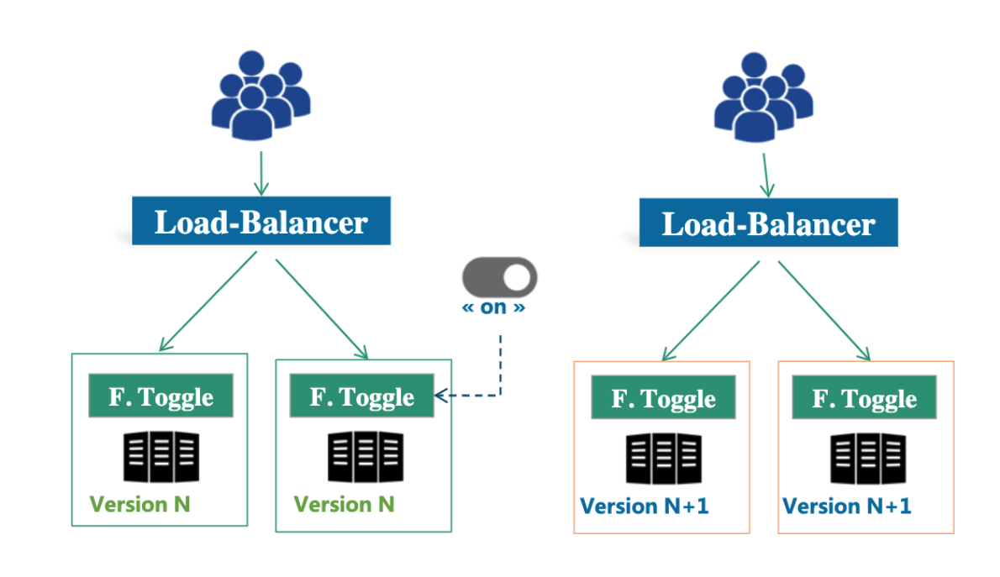
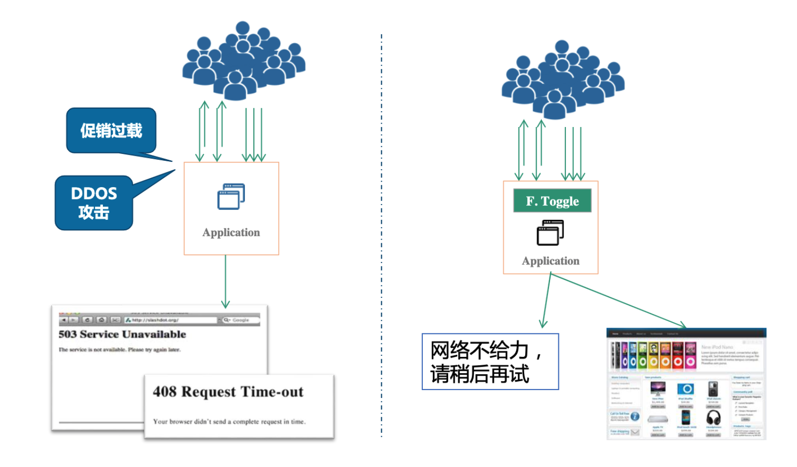
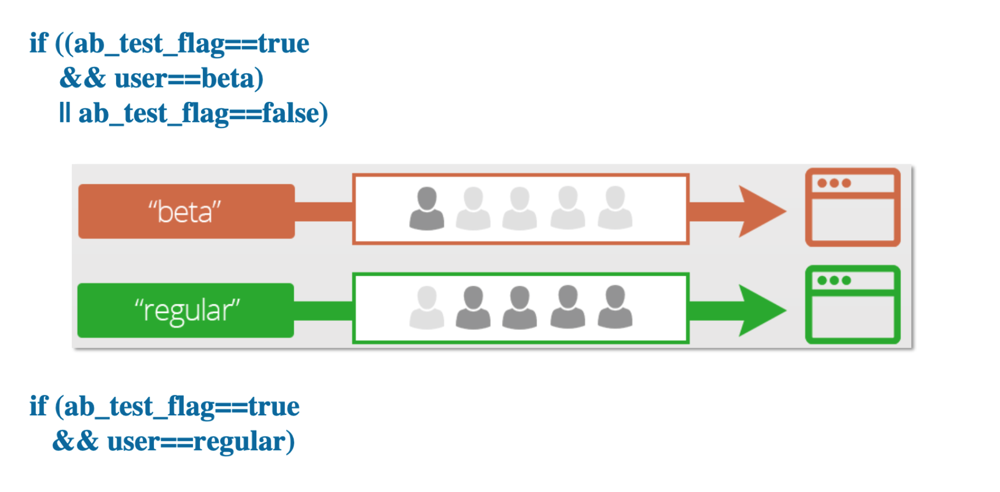
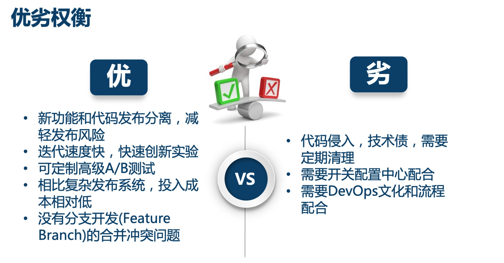
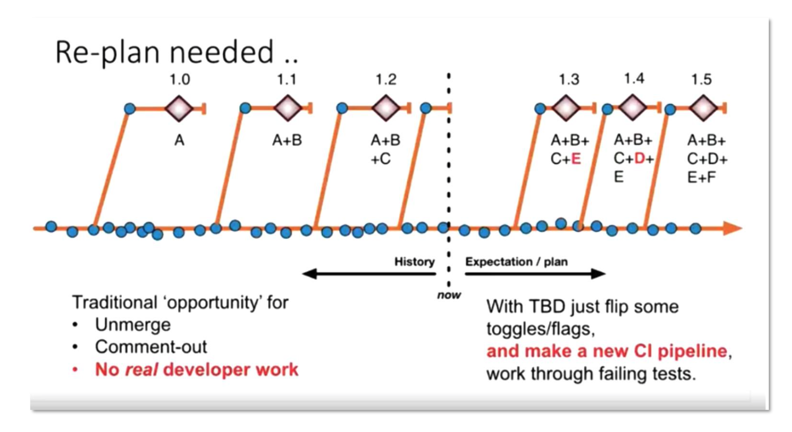

# MicroSvcs_ConfigCenter-\[TODO]

* [Configuration center](microsvcs_configcenter-todo.md#configuration-center)
  * [Motivation](microsvcs_configcenter-todo.md#motivation)
  * [Config operations and open source comparison \[Todo\]](microsvcs_configcenter-todo.md#config-operations-and-open-source-comparison-todo)
  * [Requirements on configuration center](microsvcs_configcenter-todo.md#requirements-on-configuration-center)
  * [Configuration categories](microsvcs_configcenter-todo.md#configuration-categories)
    * [Static configuration](microsvcs_configcenter-todo.md#static-configuration)
    * [Dynamic configuration](microsvcs_configcenter-todo.md#dynamic-configuration)
  * [Use case](microsvcs_configcenter-todo.md#use-case)
    * [Blue green deploymment](microsvcs_configcenter-todo.md#blue-green-deploymment)
    * [Graceful downgrade](microsvcs_configcenter-todo.md#graceful-downgrade)
    * [DB migration](microsvcs_configcenter-todo.md#db-migration)
    * [AB testing](microsvcs_configcenter-todo.md#ab-testing)
    * [Continuous delivery](microsvcs_configcenter-todo.md#continuous-delivery)
      * [Feature flag driven development](microsvcs_configcenter-todo.md#feature-flag-driven-development)
      * [Trunk based development](microsvcs_configcenter-todo.md#trunk-based-development)
  * [Apollo Architecture (In Chinese)](microsvcs_configcenter-todo.md#apollo-architecture-in-chinese)

## Configuration center

### Motivation

* [TODO: Review in case of missing](https://time.geekbang.org/course/detail/100003901-2273)
* Static config files could not be changed dynamically. Need to be redeployed
* Configuration exists in many different places (e.g. xml, properties, DB). Errorprone for livesites. 
* No security audit and version control 
* Cloud native requires immutable infrastructure and microservices. This type of continuous delivery requires the architecture of configuration center. 

### Config operations and open source comparison \[Todo]

* Config operations and open source comparison: [https://time.geekbang.org/column/article/41509](https://time.geekbang.org/column/article/41509)

### Requirements on configuration center

* Access control and audit history
* Gradual rollout
* Management for different environments/clusters

### Configuration categories

#### Static configuration

* Database/middleware/service connection string
* Username, password, token, certificates

#### Dynamic configuration

* Application configuration: Request timeout, thread pool, queue, cache, connnection pool size, circuit breaker threshold, black-white list
* Function on-off toggles: Blue green deployment, HA toggle 
* Business logic toggles: 

### Use case

#### Blue green deploymment

#### Graceful downgrade

#### DB migration

* [https://blog.launchdarkly.com/feature-flagging-to-mitigate-risk-in-database-migration](https://blog.launchdarkly.com/feature-flagging-to-mitigate-risk-in-database-migration)

#### AB testing

#### Continuous delivery

**Feature flag driven development**

* Pros:
* Cons:

**Trunk based development**

* [https://www.stevesmith.tech/blog/organisation-pattern-trunk-based-development/](https://www.stevesmith.tech/blog/organisation-pattern-trunk-based-development/)
* Benefits:
  * Replanning

### Apollo Architecture (In Chinese)

* Server architecture: [https://time.geekbang.org/course/detail/100007001-8843](https://time.geekbang.org/course/detail/100007001-8843)
* Client architecture: [https://time.geekbang.org/course/detail/100007001-8844](https://time.geekbang.org/course/detail/100007001-8844)
* High availability architecture: [https://time.geekbang.org/course/detail/100007001-8845](https://time.geekbang.org/course/detail/100007001-8845)
* Appolo architecture: [https://time.geekbang.org/course/detail/100003901-2273](https://time.geekbang.org/course/detail/100003901-2273)
