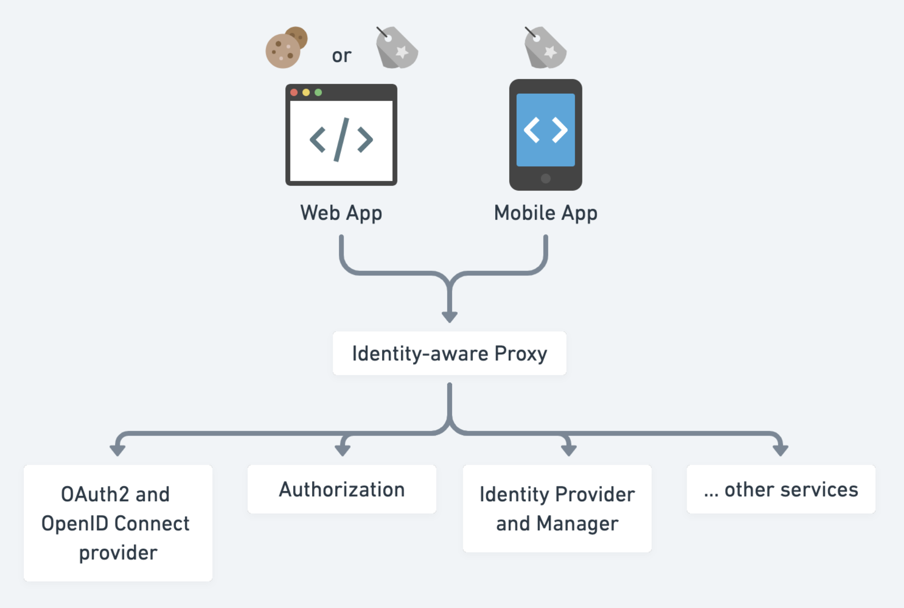

- [Security](#security)
  - [Auth architecture revolution](#auth-architecture-revolution)
    - [Single server cookie based auth](#single-server-cookie-based-auth)
    - [Multi server sticky session based auth](#multi-server-sticky-session-based-auth)
    - [Auth Service and token](#auth-service-and-token)
    - [Gateway and token](#gateway-and-token)
    - [Gateway and JWT](#gateway-and-jwt)
  - [Microservices security architecture](#microservices-security-architecture)
    - [External access token internal JWT token](#external-access-token-internal-jwt-token)
    - [Encrypted JWT token](#encrypted-jwt-token)
    - [External access token internal JWT token with token cache](#external-access-token-internal-jwt-token-with-token-cache)
    - [Identity proxy with backend services](#identity-proxy-with-backend-services)
  - [Real world examples](#real-world-examples)
    - [Auth at Netflix](#auth-at-netflix)
    - [Tianpan.co](#tianpanco)
    - [An excellent blogger](#an-excellent-blogger)

# Security

## Auth architecture revolution

### Single server cookie based auth

### Multi server sticky session based auth

* Cons:
  * Sticky session binds a session to a server. If the server goes down or needs to be maintained.
  * Sticky session needs to store session data in load balancer.
* Possible solutions:
  1. Session synchronization by replicating across web servers
  2. Store session data completely inside users' browser
     * Cons: Limited size of cookie
  3. Store session data in a shared storage

### Auth Service and token

* Pros:
  * Encapsulate everything related with token issuing
  * Introduce the concept of token, which could be passed around between services
* Cons:
  * Services need to implement the logic to validate the token.
  * All services need to talk to authSvc, which might become a performance bottleneck.
  * All requests need to be verified via auth service.

### Gateway and token

* Pros:
  * Gateway centralizes the logic of parsing userInfo. Only gateway need to validate the token with auth service.
* Cons:
  * All requests need to be verified via auth service. Auth service needs to be maintained and scaled in a manageable way.

### Gateway and JWT

* Pros:
  * Compact and lightweight
  * Low pressure on Auth server
  * Simplify the implementation of auth server
* Cons:
  * Could not invalidate a JWT token if it has been leaked
  * JWT might become big

## Microservices security architecture

### External access token internal JWT token

* Cons: Still rely on gateway to switch access token with JWT token.

### Encrypted JWT token

* Pros: Stateless token

### External access token internal JWT token with token cache

* Most widely used in practice

### Identity proxy with backend services
* Identity-aware proxy is a reverse proxy that allows either public endpoints or checks credentials for protected endpoints. If the credential is not presented but required, redirect the user to an identity provider. e.g. k8s ingress controller, nginx, envoy, Pomerium, ory.sh/oathkeeper, etc.
* Identity provider and manager is one or a few services that manage the user identity through certain workflows like sign in, forgot password, etc. e.g. ory.sh/kratos, keycloak
* OAuth2 and OpenID Connect provider enables 3rd-party developers to integrate with your service.
* Authorization service controls who can do what.

## Real world examples

### Auth at Netflix

* [https://netflixtechblog.com/edge-authentication-and-token-agnostic-identity-propagation-514e47e0b602](https://netflixtechblog.com/edge-authentication-and-token-agnostic-identity-propagation-514e47e0b602)
* A talk on InfoQ: [https://www.infoq.com/presentations/netflix-user-identity/](https://www.infoq.com/presentations/netflix-user-identity/)
* Access control at Netflix: [https://netflixtechblog.com/consoleme-a-central-control-plane-for-aws-permissions-and-access-fd09afdd60a8](https://netflixtechblog.com/consoleme-a-central-control-plane-for-aws-permissions-and-access-fd09afdd60a8)
* Netflix container security: [https://netflixtechblog.com/evolving-container-security-with-linux-user-namespaces-afbe3308c082](https://netflixtechblog.com/evolving-container-security-with-linux-user-namespaces-afbe3308c082)
* Netflix detect credential leak: [https://netflixtechblog.com/netflix-cloud-security-detecting-credential-compromise-in-aws-9493d6fd373a](https://netflixtechblog.com/netflix-cloud-security-detecting-credential-compromise-in-aws-9493d6fd373a)
* Netflix viewing privacy: [https://netflixtechblog.com/protecting-netflix-viewing-privacy-at-scale-39c675d88f45](https://netflixtechblog.com/protecting-netflix-viewing-privacy-at-scale-39c675d88f45)

### Tianpan.co
* https://tianpan.co/#big-picture-authn-authz-and-identity-management

### An excellent blogger
* https://medium.com/@chamod.14_80003/token-caching-wso2-api-manager-5c5b3d6ddd09
* https://www.pingidentity.com/en/company/blog/posts/2021/ultimate-guide-token-based-authentication.html

* [Protecting Server Resources Hosting Unauthenticated APIs](https://medium.com/@robert.broeckelmann/protecting-server-resources-hosting-unauthenticated-apis-d77875db7b8)
* [Who Owns API Security, and How Much Security Is Enough?](https://medium.com/@robert.broeckelmann/nissan-leaf-api-security-who-owns-api-security-and-how-much-security-is-enough-fa467fdb59a1)
* [DSig Part 1: XML Digital Signature and WS-Security Integrity](https://medium.com/@robert.broeckelmann/dsig-part-1-xml-digital-signature-and-ws-security-integrity-225ea3eb894e)
* [DSig Part 2: JSON Web Signature (JWS)](https://medium.com/@robert.broeckelmann/dsig-part-2-json-web-signature-jws-f428d0b5ae40)
* [DSig Part 3: XML DSig vs. JSON Web Signature](https://medium.com/@robert.broeckelmann/dsig-part-3-xml-dsig-vs-json-web-signature-709345c78541)
* [API Security vs. Web Application Security Part 1: A Brief History of Web Application Architecture](https://medium.com/@robert.broeckelmann/api-security-vs-web-application-security-part-1-a-brief-history-of-web-application-architecture-4c8a682a21e)
* [API Security vs. Web Application Security: Part 2](https://medium.com/@robert.broeckelmann/api-security-vs-web-application-security-part-2-e2f327b4b54c)
* [SAML 2.0 VS. JWT: UNDERSTANDING FEDERATED IDENTITY AND SAML](https://medium.com/@robert.broeckelmann/saml-2-0-vs-jwt-understanding-federated-identity-and-saml-a259dff8545c)
* [Delegation — A General Discussion](https://medium.com/@robert.broeckelmann/delegation-a-general-discussion-d0b2ab5a85c7)
* [OAuth2 Access Tokens vs API Keys — Using JWTs](https://medium.com/@robert.broeckelmann/oauth2-access-tokens-vs-api-keys-using-jwts-651f97df9e19)
* [OAuth2 Access Tokens and Multiple Resources Series](https://medium.com/@robert.broeckelmann/oauth2-access-tokens-and-multiple-resources-series-13e467861893)
* [Authorization Series](https://medium.com/@robert.broeckelmann/authorization-series-6b9c5890716c)
* [The Benefits of JWTs as OAuth2 Access Tokens](https://medium.com/@robert.broeckelmann/the-benefits-of-jwts-as-oauth2-access-tokens-6ec47dbd2783)
* [IDENTIVERSE REFLECTIONS: NEWS, TRENDS AND A GLIMPSE INTO THE FUTURE](https://medium.com/@robert.broeckelmann/identiverse-reflections-news-trends-and-a-glimpse-into-the-future-d585050b7cf5?readmore=1&source=user_profile---------20-------------------------------)
* [The Many Ways of Approaching Identity Architecture](https://medium.com/@robert.broeckelmann/the-many-ways-of-approaching-identity-architecture-813118077d8a)
* [A Brief Summary of All Things Apigee and API Management that I Have Written](https://medium.com/@robert.broeckelmann/a-brief-summary-of-all-things-apigee-and-api-management-that-i-have-written-46bb71c2d8b9)
* [Authentication vs. Federation vs. SSO](https://medium.com/@robert.broeckelmann/authentication-vs-federation-vs-sso-9586b06b1380)
* [What is Authorization?](https://medium.com/@robert.broeckelmann/what-is-authorization-9977caacc61e)
* [How To Submit Your Security Tokens to an API Provider Pt. 1](https://medium.com/@robert.broeckelmann/how-to-submit-your-security-tokens-to-an-api-provider-pt-1-4a68df35843a)
* [JWT Use Cases](https://medium.com/@robert.broeckelmann/jwt-use-cases-bb94e4e70949)
* [Application Security Models](https://medium.com/@robert.broeckelmann/application-security-models-e5b47fe6ac70)
* [Identity Propagation in an API Gateway Architecture](https://medium.com/@robert.broeckelmann/identity-propagation-in-an-api-gateway-architecture-c0f9bbe9273b)
* [An Alternative to Delegated Access in the Enterprise](https://medium.com/@robert.broeckelmann/an-alternative-to-delegated-access-in-the-enterprise-82023ed423b5?source=user_profile---------63-------------------------------)
* [SAML2 vs JWT: Apigee & Azure Active Directory Integration — A JWT Story](https://medium.com/levvel-consulting/saml2-vs-jwt-apigee-azure-active-directory-integration-a-jwt-story-a3eb00769a1f)
* [Keeping Your APIs Secure for Multiple User Types](https://medium.com/@robert.broeckelmann/keeping-your-apis-secure-for-multiple-user-types-d5c627793c4c)
* [Sample: WSO2 EI Cache Mediator based Token Caching](https://medium.com/@chamilad/sample-wso2-ei-cache-mediator-based-token-caching-3036f2e7e6eb)
