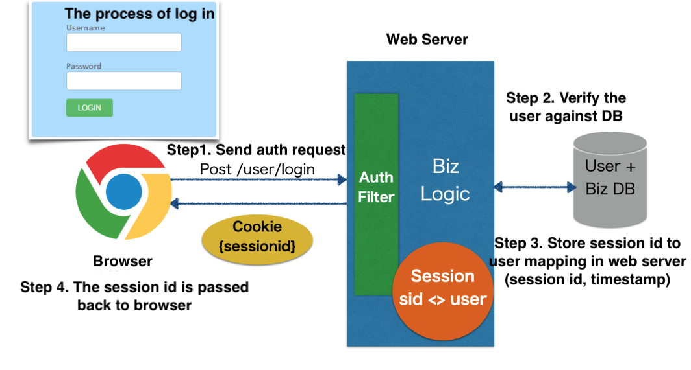
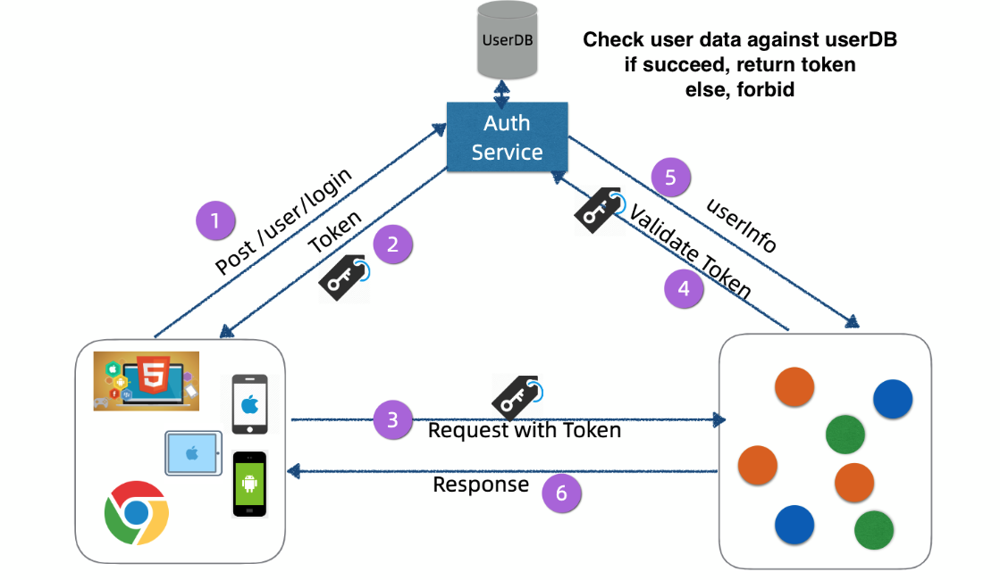
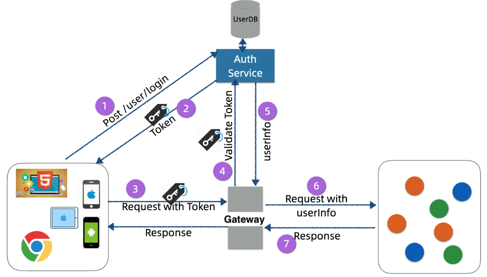
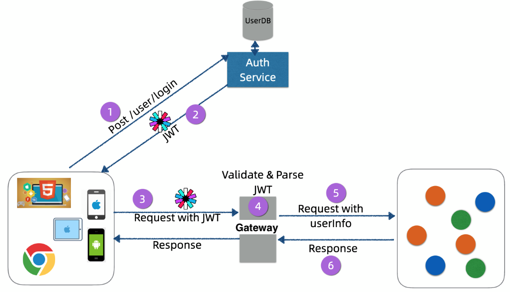
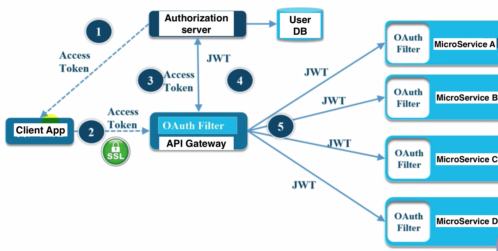
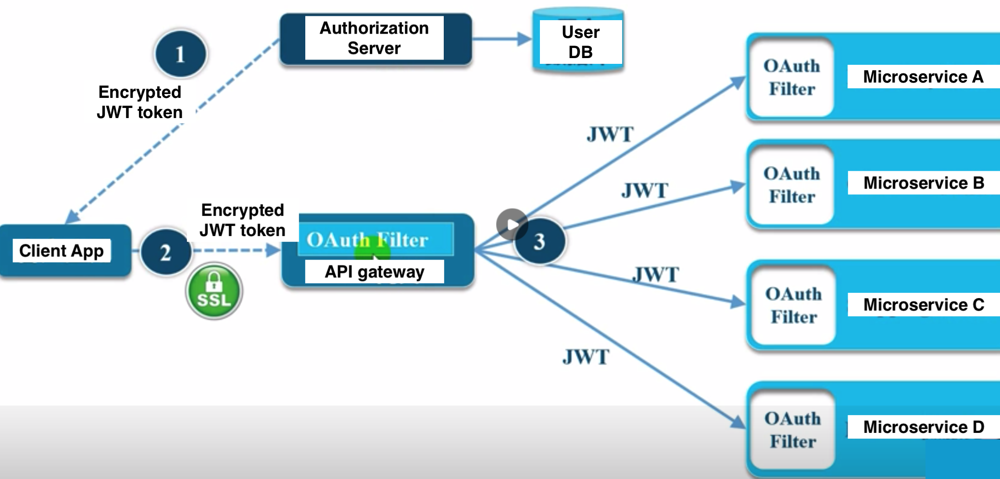
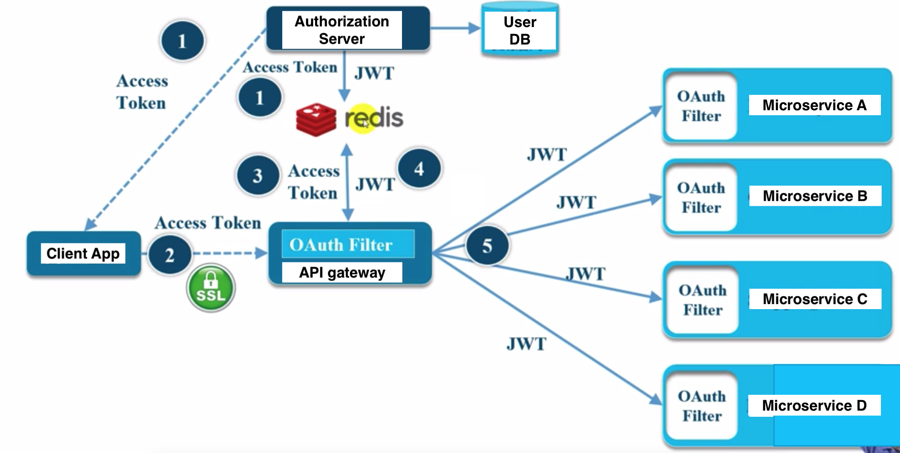

- [Security](#security)
  - [Auth architecture revolution](#auth-architecture-revolution)
    - [Single server cookie based auth](#single-server-cookie-based-auth)
    - [Multi server sticky session based auth](#multi-server-sticky-session-based-auth)
    - [Auth Service and token](#auth-service-and-token)
    - [Gateway and token](#gateway-and-token)
    - [Gateway and JWT](#gateway-and-jwt)
  - [Microservices security architecture](#microservices-security-architecture)
    - [External access token internal JWT token](#external-access-token-internal-jwt-token)
    - [Encrypted JWT token](#encrypted-jwt-token)
    - [External access token internal JWT token with token cache](#external-access-token-internal-jwt-token-with-token-cache)
  - [Real world examples](#real-world-examples)
    - [Auth at Netflix](#auth-at-netflix)

# Security

## Auth architecture revolution

### Single server cookie based auth

### Multi server sticky session based auth

* Cons:
  * Sticky session binds a session to a server. If the server goes down or needs to be maintained.
  * Sticky session needs to store session data in load balancer.
* Possible solutions:
  1. Session synchronization by replicating across web servers
  2. Store session data completely inside users' browser
     * Cons: Limited size of cookie
  3. Store session data in a shared storage

### Auth Service and token

* Pros:
  * Encapsulate everything related with token issuing
  * Introduce the concept of token, which could be passed around between services
* Cons:
  * Services need to implement the logic to validate the token.
  * All services need to talk to authSvc, which might become a performance bottleneck.
  * All requests need to be verified via auth service.

### Gateway and token

* Pros:
  * Gateway centralizes the logic of parsing userInfo. Only gateway need to validate the token with auth service.
* Cons:
  * All requests need to be verified via auth service. Auth service needs to be maintained and scaled in a manageable way.

### Gateway and JWT

* Pros:
  * Compact and lightweight
  * Low pressure on Auth server
  * Simplify the implementation of auth server
* Cons:
  * Could not invalidate a JWT token if it has been leaked
  * JWT might become big

## Microservices security architecture

### External access token internal JWT token

* Cons: Still rely on gateway to switch access token with JWT token.

### Encrypted JWT token

* Pros: Stateless token

### External access token internal JWT token with token cache

* Most widely used in practice

## Real world examples

### Auth at Netflix

* [https://netflixtechblog.com/edge-authentication-and-token-agnostic-identity-propagation-514e47e0b602](https://netflixtechblog.com/edge-authentication-and-token-agnostic-identity-propagation-514e47e0b602)
* A talk on InfoQ: [https://www.infoq.com/presentations/netflix-user-identity/](https://www.infoq.com/presentations/netflix-user-identity/)
* Access control at Netflix: [https://netflixtechblog.com/consoleme-a-central-control-plane-for-aws-permissions-and-access-fd09afdd60a8](https://netflixtechblog.com/consoleme-a-central-control-plane-for-aws-permissions-and-access-fd09afdd60a8)
* Netflix container security: [https://netflixtechblog.com/evolving-container-security-with-linux-user-namespaces-afbe3308c082](https://netflixtechblog.com/evolving-container-security-with-linux-user-namespaces-afbe3308c082)
* Netflix detect credential leak: [https://netflixtechblog.com/netflix-cloud-security-detecting-credential-compromise-in-aws-9493d6fd373a](https://netflixtechblog.com/netflix-cloud-security-detecting-credential-compromise-in-aws-9493d6fd373a)
* Netflix viewing privacy: [https://netflixtechblog.com/protecting-netflix-viewing-privacy-at-scale-39c675d88f45](https://netflixtechblog.com/protecting-netflix-viewing-privacy-at-scale-39c675d88f45)
