- [Authentication](#authentication)
  - [Http basic](#http-basic)
  - [Token based - Session cookie](#token-based---session-cookie)
  - [Database token based](#database-token-based)
  - [Self contained tokens based](#self-contained-tokens-based)
  - [Multifactor authentication](#multifactor-authentication)
  - [Passwordless](#passwordless)

# Authentication

## Http basic

* Overflow chart

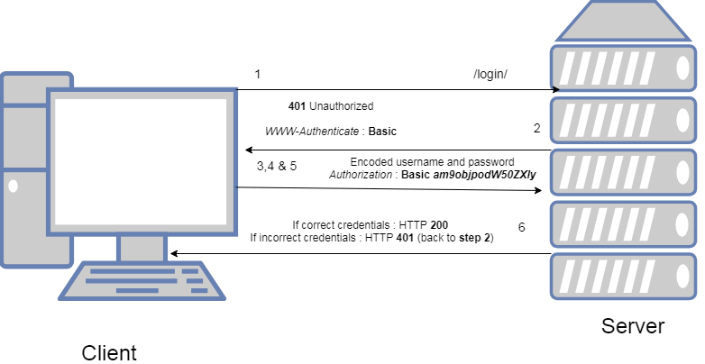

* Cons:
  * User password being passed along in every request.
  * Verifying a password is an expensive operation. Modern password hashing algorithm is designed to take around 100ms per operation.

## Token based - Session cookie

* Session cookie is the simplest and most widespread token issuing mechanism.

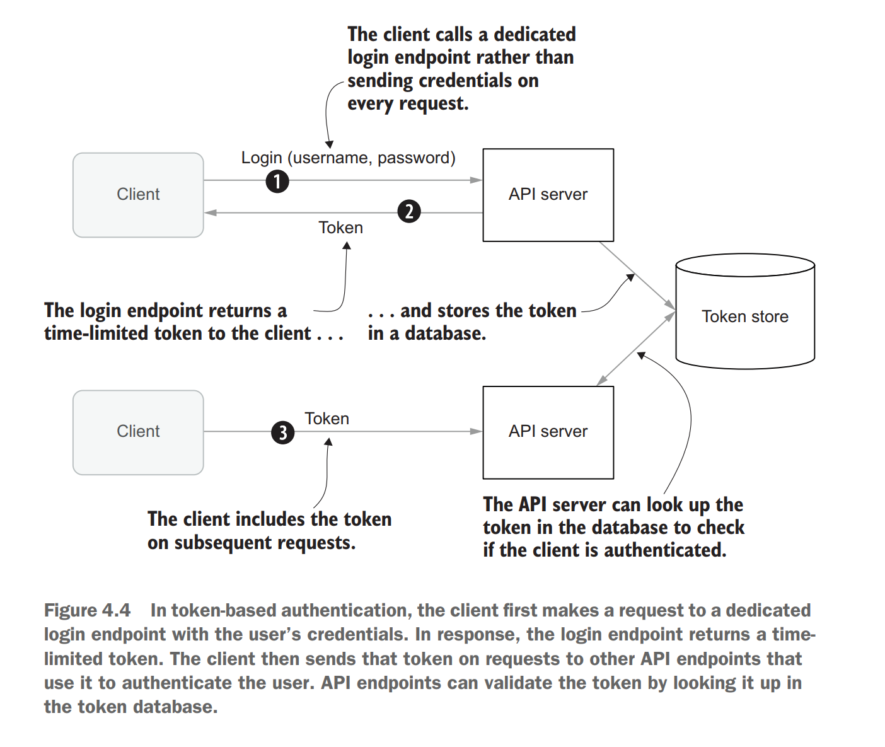

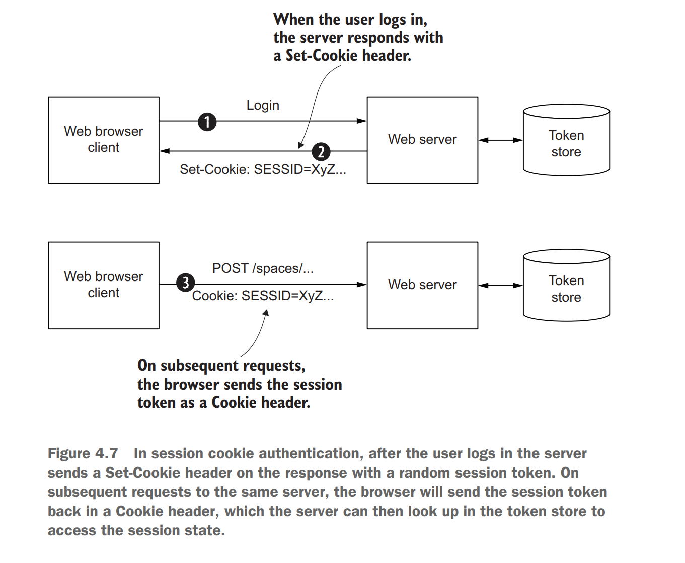

**Cookie security attributes**

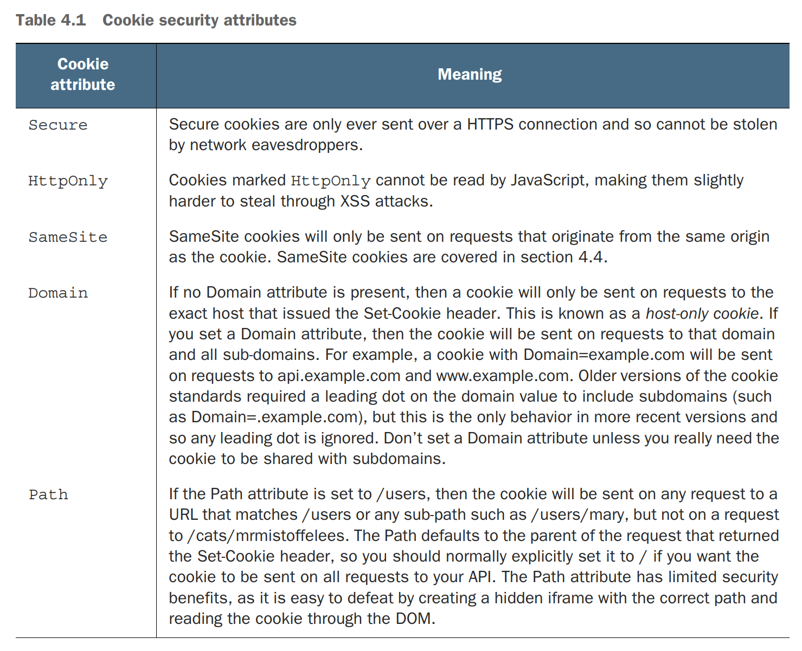

**Session fixation attacks**

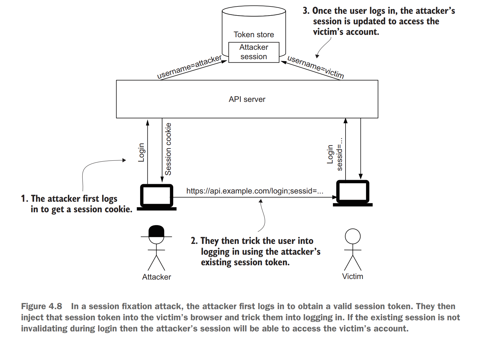

**CSRF attacks**

* Cross-site request forgery (CSRF, pronounced “sea-surf”) occurs when an attacker makes a cross-origin request to your API and the browser sends cookies along with the request. The request is processed as if it was genuine unless extra checks are made to prevent these requests.
* Impacts: The malicious site could create fake requests to your API that appear to come from a genuine client.

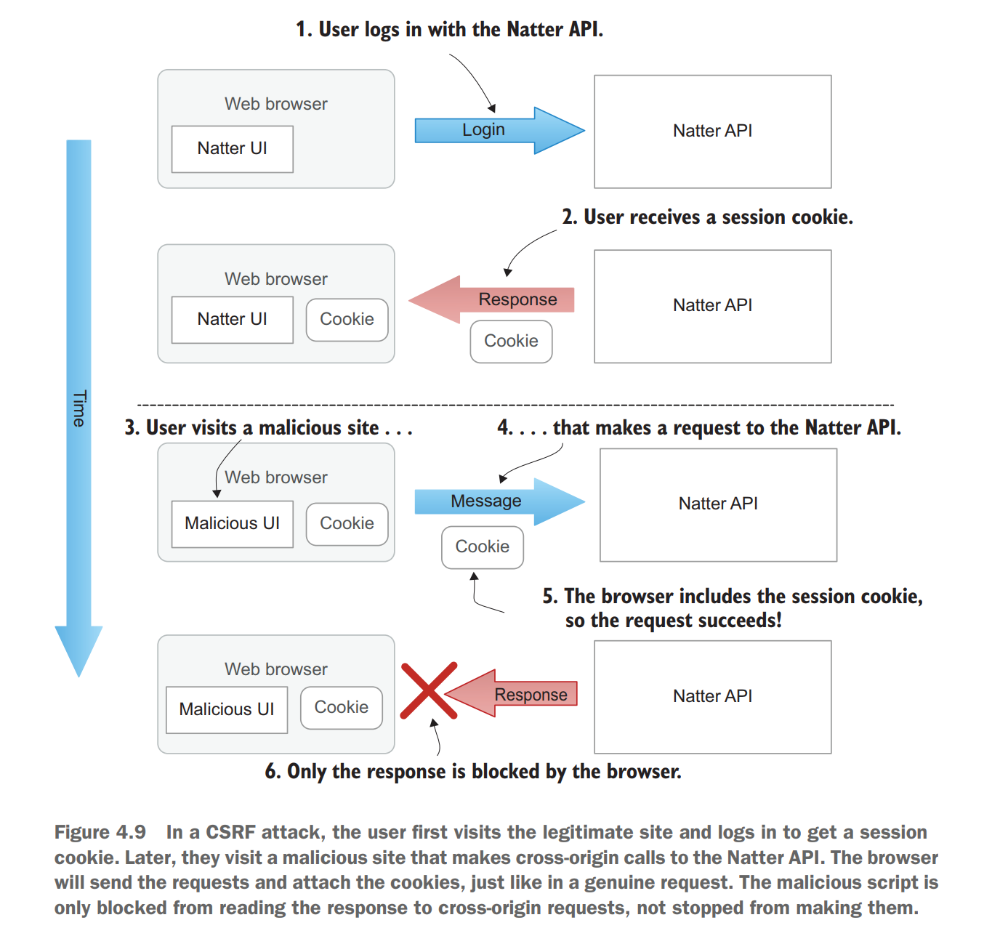

**Solution 1: Samesite cookies**

**Solution 2: Double-Submit cookie**

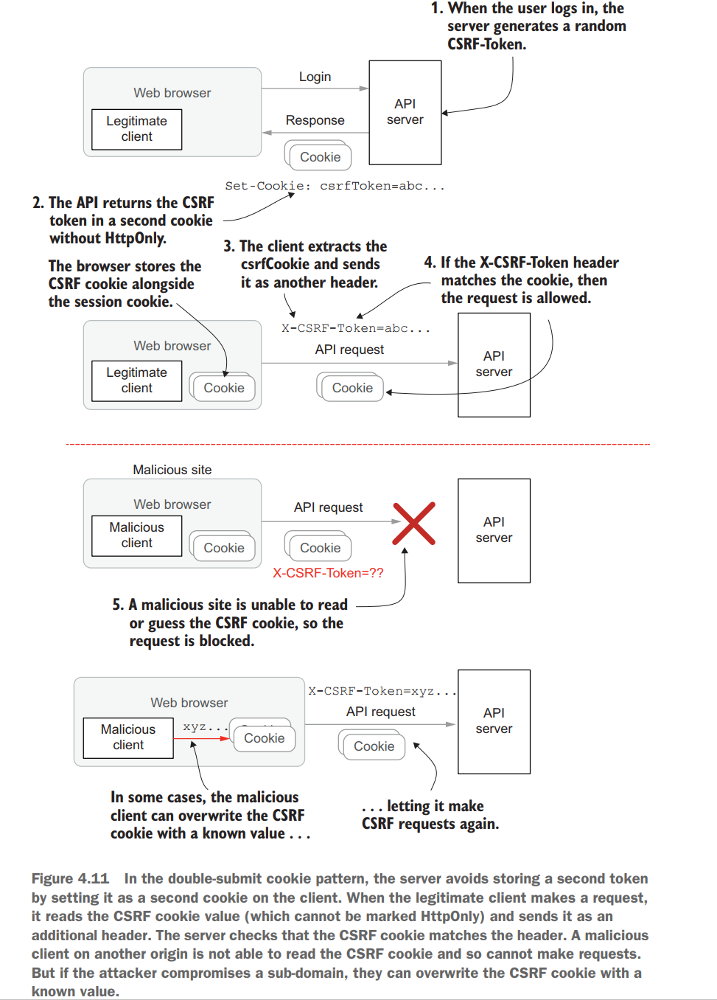

**Allow cross origin requests**

**Pros**

* Using cookies in authentication makes your application stateful. This will be efficient in tracking and personalizing the state of a user.
* Cookies are small in size thus making them efficient to store on the client-side.
* Cookies can be “HTTP-only” making them impossible to read on the client-side. This improves protection against any Cross-site scripting (XSS) attacks.
* Cookies will be added to the request automatically, so the developer will not have to implement them manually and therefore requires less code.

**Cons**

* It is vulnerable to Cross-site request forgery attack. It often needs other security measures such as CSRF tokens for protection.
* You need to store the session data in a database or keep it in memory on the server. This makes it less scalable and increases overhead when the site is having many users.
* Cookies normally work on a single domain. For example, it is impossible to read or send a cookie from a domain like jabs.com to a boo.com domain. This is an issue when the API service is from different domains for mobile and web platforms.
* The client needs to send a cookie on every request, even with the URLs that do not need authentication for access.

## Database token based

**Replace cookie**

* [https://www.section.io/engineering-education/cookie-vs-token-authentication/](https://www.section.io/engineering-education/cookie-vs-token-authentication/)

**Def**

* Bearer authentication scheme: [https://datatracker.ietf.org/doc/html/rfc6750#page-7](https://datatracker.ietf.org/doc/html/rfc6750#page-7)

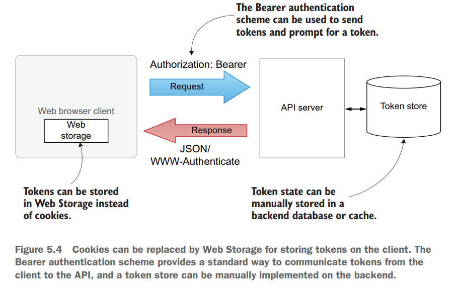

**Web storage XSS attack**

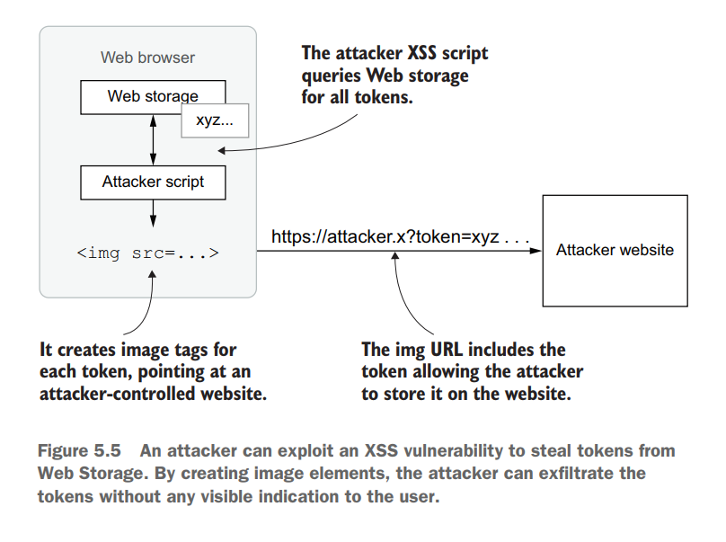

**Harden the database token store**

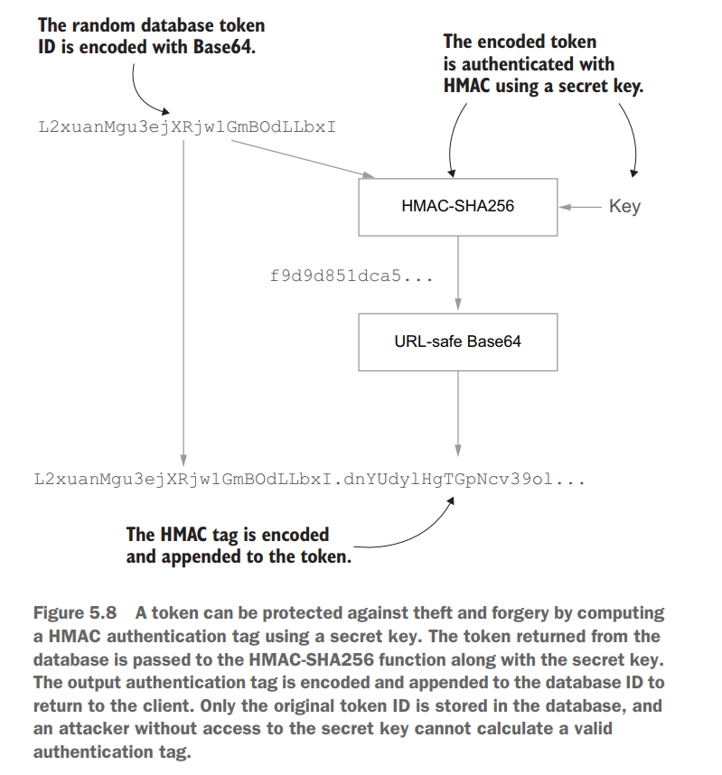

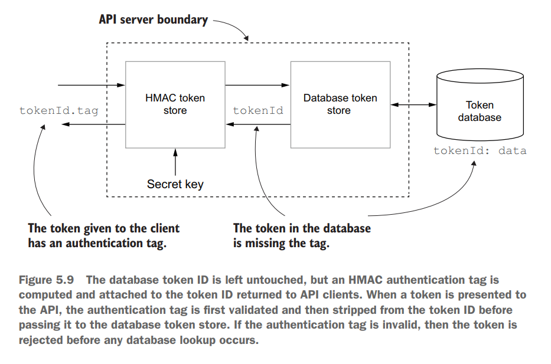

## Self contained tokens based

* JWT is a type of by value token which does not need to be verified at the authorization server.
  * Def for by reference token: Randomly generated string value. Upon receiving the token, resource server needs to verify it against OAuth authorization server to obtain information such as claims/scopes.
  * Def for by value token: A token which contains key value pair of (issuer, audience, scope, claims). It could be verified locally and does not need to be verified against authorization server.

**ID token claims**

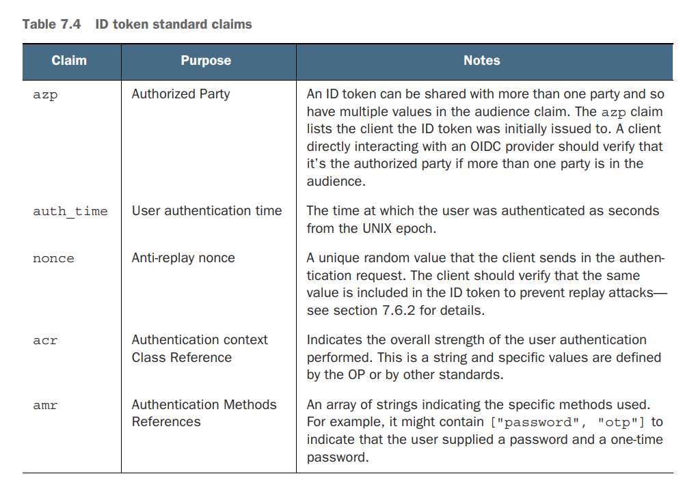

**Access token**

* Used to access target resource.

**JWT Format**

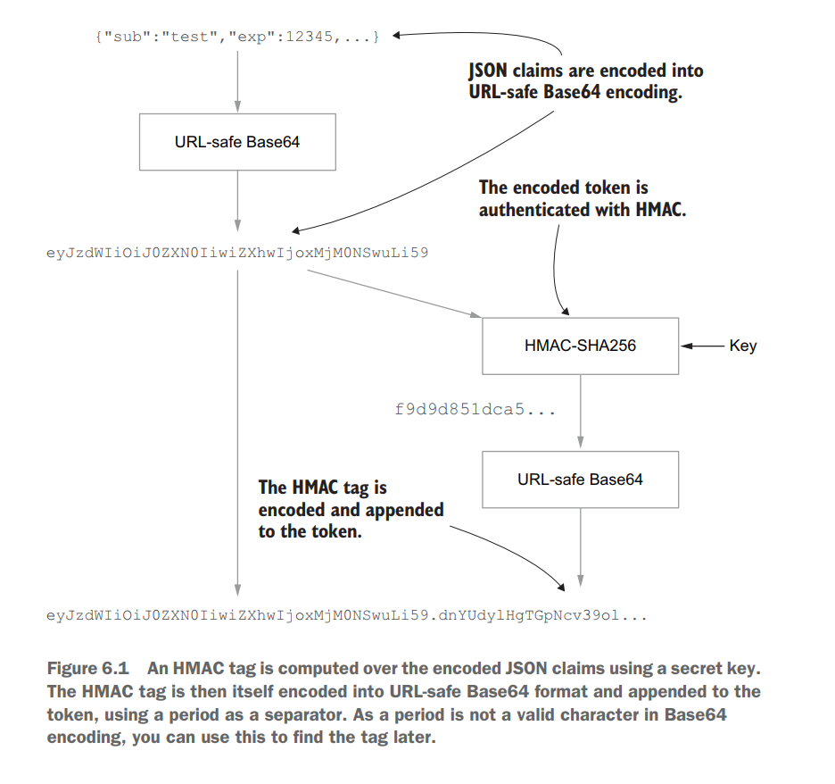

**JOSE header**

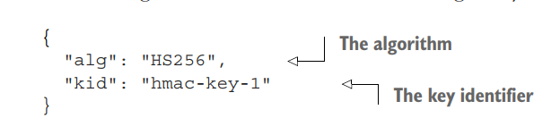

**JWS signing algorithms**

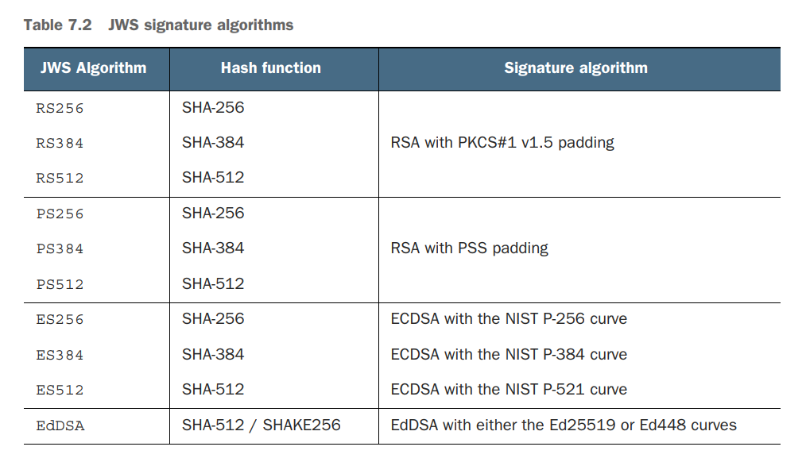

**JWK header**

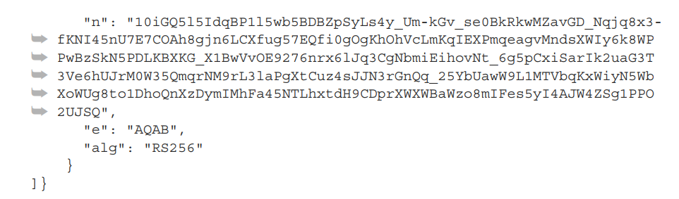

**Claims**

**Types of JWT**

* HMAC JWT

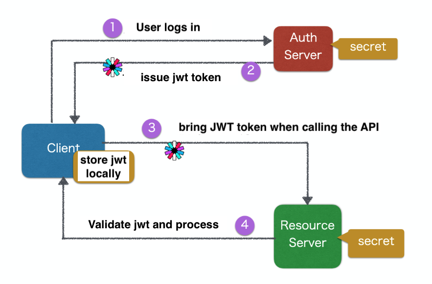

* RSA JWT

## Multifactor authentication

## Passwordless 
