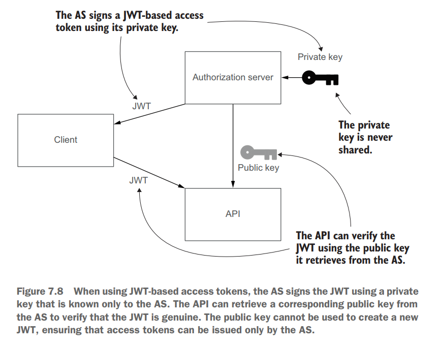
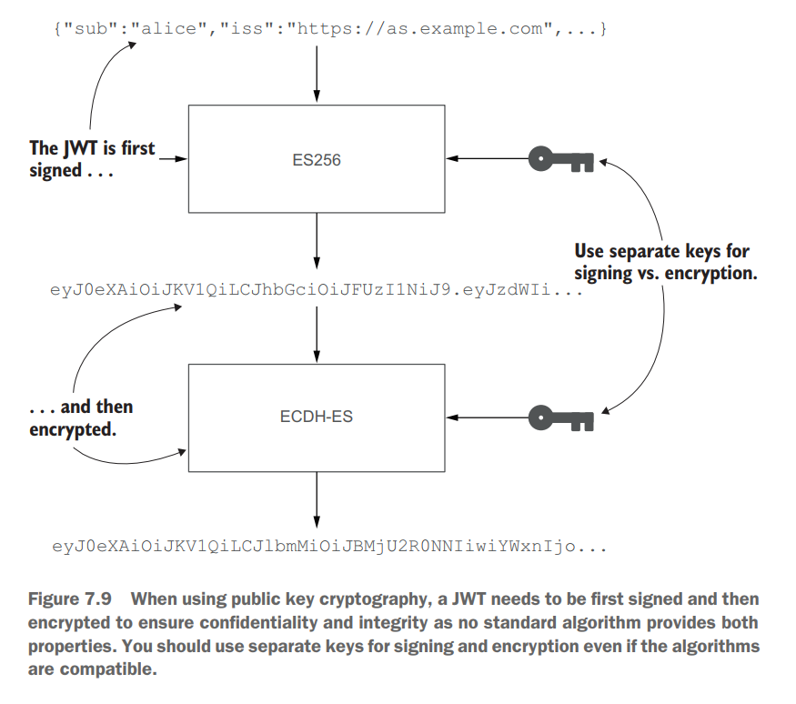

- [Authorization](#authorization)
  - [Authorization with OAuth2](#authorization-with-oauth2)
    - [Simple guide](#simple-guide)
    - [Roles](#roles)
    - [OAuth 2 modes](#oauth-2-modes)

# Authorization

## Authorization with OAuth2

### Simple guide

* Simlplest guide: [https://medium.com/@darutk/the-simplest-guide-to-oauth-2-0-8c71bd9a15bb](https://medium.com/@darutk/the-simplest-guide-to-oauth-2-0-8c71bd9a15bb)

### Roles

* Third party client app: it needs to access users' protected resource
* Resource server: a web server which expose users' protected resource to outside users
* Authorization server: issue access token to client app after resource owner grant the permission
* Resource owner: the owner of a resource who wants to share it with third party apps.

### OAuth 2 modes

* Good reference: Ruanyifeng overview - [http://www.ruanyifeng.com/blog/2014/05/oauth\_2\_0.html](http://www.ruanyifeng.com/blog/2014/05/oauth\_2\_0.html)
* Choose between OAuth modes:

