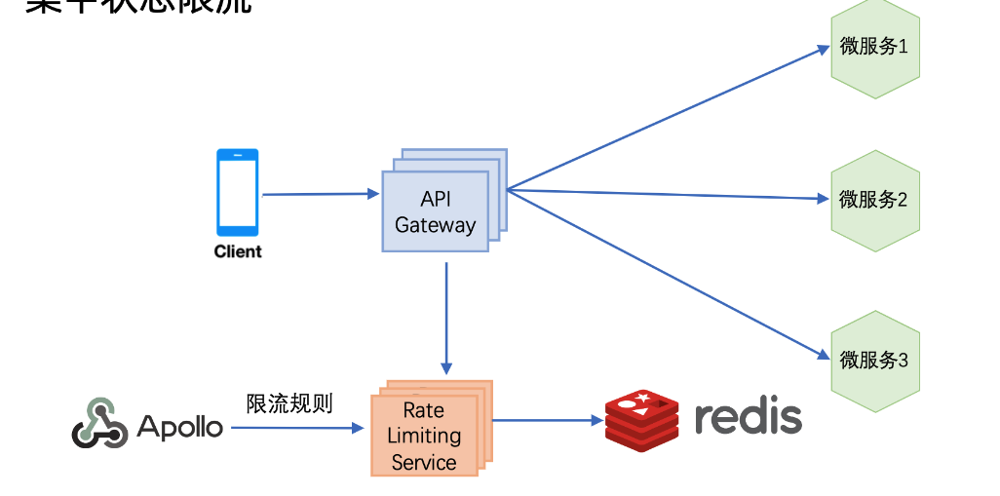
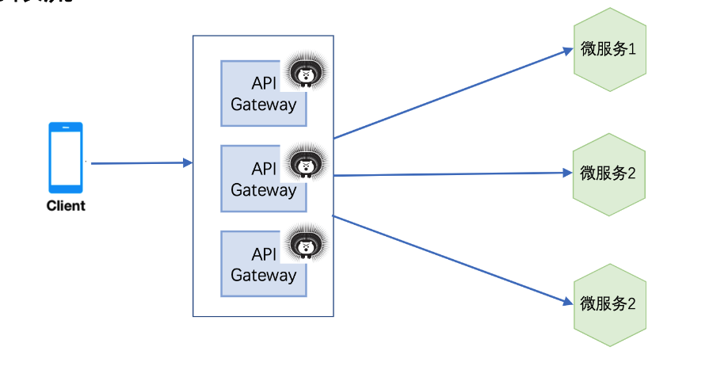

# MicroSvcs\_ApiGateway-\[TODO\]

* [API Gateway](microsvcs_apigateway-todo.md#api-gateway)
  * [Functionalities \[Todo\]](microsvcs_apigateway-todo.md#functionalities-todo)
    * [Rate limiting](microsvcs_apigateway-todo.md#rate-limiting)
  * [Existing solutions](microsvcs_apigateway-todo.md#existing-solutions)
    * [Zuul \[TODO\]](microsvcs_apigateway-todo.md#zuul-todo)
    * [How does Zuul get routing table](microsvcs_apigateway-todo.md#how-does-zuul-get-routing-table)
      * [Eureka](microsvcs_apigateway-todo.md#eureka)
      * [Domain name](microsvcs_apigateway-todo.md#domain-name)
      * [Apollo](microsvcs_apigateway-todo.md#apollo)
  * [References](microsvcs_apigateway-todo.md#references)

## API Gateway

### Functionalities \[Todo\]

* [https://time.geekbang.org/course/detail/100003901-2270](https://time.geekbang.org/course/detail/100003901-2270)

#### Rate limiting

 

### Existing solutions

#### Zuul \[TODO\]

* Zuul architecture: [https://time.geekbang.org/course/detail/100003901-2271](https://time.geekbang.org/course/detail/100003901-2271)

#### How does Zuul get routing table

**Eureka**

**Domain name**

**Apollo**

### References

* 美团APIGateway: [https://zhuanlan.zhihu.com/p/374130800](https://zhuanlan.zhihu.com/p/374130800)

