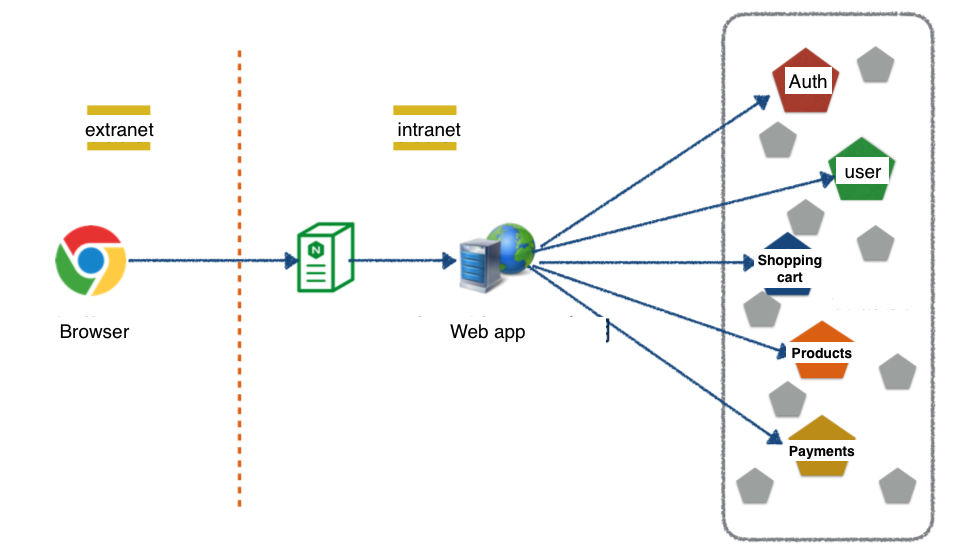
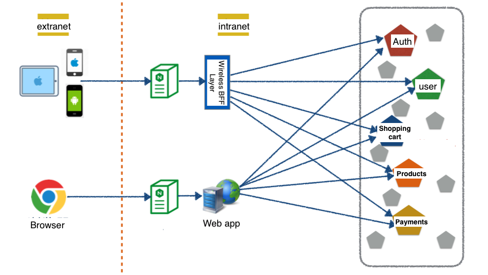
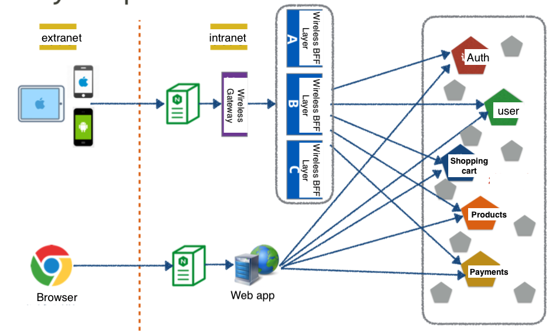
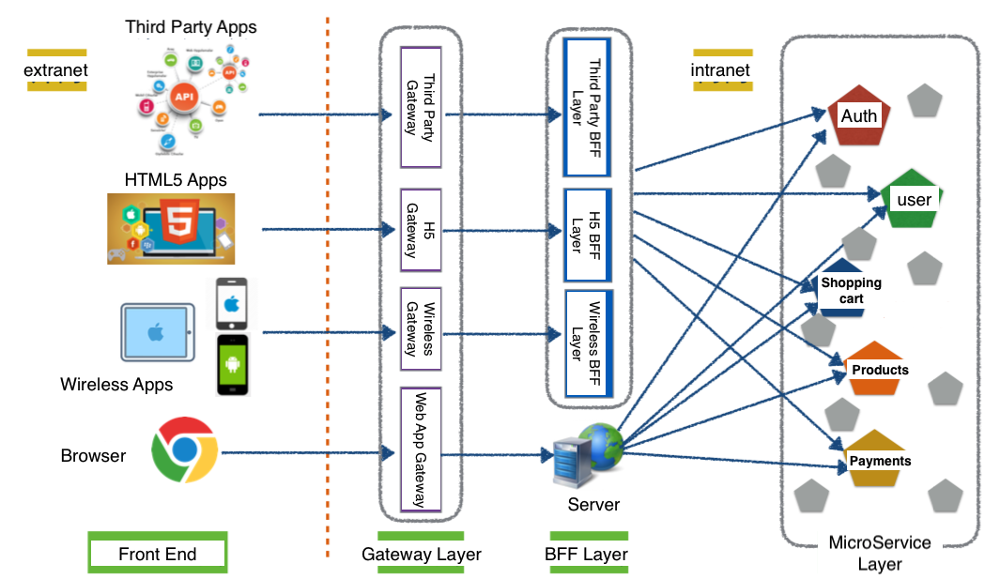
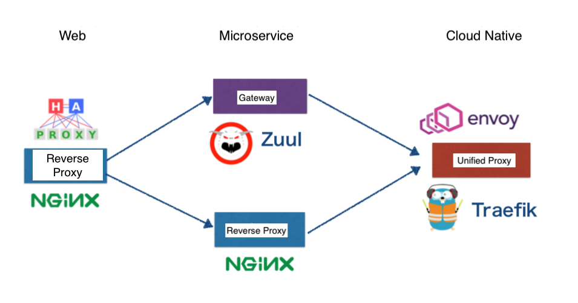
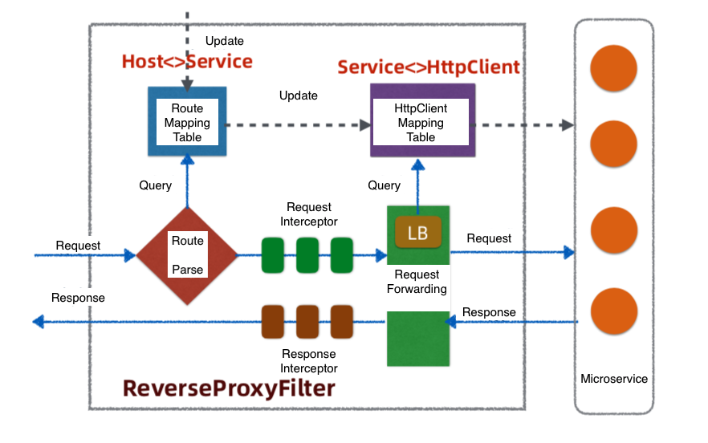
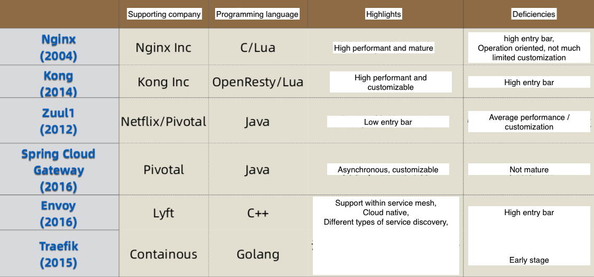

- [Overall flowchart](#overall-flowchart)
- [Gateway architecture](#gateway-architecture)
  - [Revolution history](#revolution-history)
  - [Gateway vs reverse proxy](#gateway-vs-reverse-proxy)
  - [Gateway internals](#gateway-internals)
  - [Gateway comparison](#gateway-comparison)
- [Service discovery](#service-discovery)
  - [Approach - Hardcode service provider addresses](#approach---hardcode-service-provider-addresses)
  - [Approach - Service registration center](#approach---service-registration-center)
- [How to detect failure](#how-to-detect-failure)
  - [Detect failure](#detect-failure)
- [How to gracefully shutdown](#how-to-gracefully-shutdown)
- [How to gracefully start](#how-to-gracefully-start)
  - [Future readings](#future-readings)

# Overall flowchart

```
                                                                   ┌──────────────────┐                 
                                                                   │      Client      │                 
                                                                   └──────────────────┘                 
                                                                             │                          
                                                                             ▼                          
                           Step 2.                                 ┌──────────────────┐                 
       ┌────────────────────Watch ─────────────────────────────────│     Gateway      │                 
       │                   changes                                 └──────────────────┘                 
       │                                                                     │                          
       │        ┌────────────┐                                               │                          
       │        │Control     │      Step 5. Command to restart               │                          
       │        │center      │◀──────────business logic 1────────────────────┤                          
       │        │service     │                                               │                          
       │        └────────────┘                                               │                          
       ▼               │                                        Step3.       ├──────────────────┐       
┌─────────────┐        │                        ┌─────────────Establish ─────┤                  │       
│   Service   │        │                        │                Long        │                  │       
│Registration │        │                        │                            │                  │       
└─────────────┘        │                        │                            │                  │       
       ▲               │                        │                            │                  │       
       │        Step 6: Restart                 │                            │                  │       
       │        business logic                  │                            ▼                  ▼       
       │            unit 1   ┌──────────────────┼────────────────┐  ┌─────────────────┐  ┌─────────────┐
       │               │     │                  ▼                │  │                 │  │             │
 Step 1. register      │     │   ┌────────────────────────────┐  │  │                 │  │             │
    IP:Port and        │     │   │Thread for business logic   │  │  │                 │  │             │
    establish a        │     │   │                            │  │  │                 │  │             │
  connection for       │     │   │   Step 4. Agent/Process    │  │  │                 │  │             │
     heartbeat         │     │   │  for business logic dies   │  │  │                 │  │             │
       │               │     │   │      for some reason       │  │  │                 │  │             │
       │               │     │   └────────────────────────────┘  │  │                 │  │             │
       │               │     │                                   │  │                 │  │             │
       │               │     │   ┌────────────────────────────┐  │  │                 │  │             │
       └───────────────┼─────┼───│Agent for heartbeat         │  │  │                 │  │             │
                       │     │   └────────────────────────────┘  │  │                 │  │             │
                       │     │                                   │  │                 │  │             │
                       │     │   ┌────────────────────────────┐  │  │ Business logic  │  │  Business   │
                       │     │   │Agent for restart           │  │  │    unit ...     │  │logic unit n │
                       │     │   │a). Kill agent for heartbeat│  │  └─────────────────┘  └─────────────┘
                       │     │   │b). Sleep long enough to    │  │           │                          
                       └─────┼──▶│wait removal of the entry   │  │           │                          
                             │   │within service registration │  │           ▼                          
                             │   │c). Restart the unit        │  │  ┌─────────────────┐                 
                             │   └────────────────────────────┘  │  │Data access layer│                 
                             │                                   │  │                 │                 
                             │                                   │  └─────────────────┘                 
                             │                                   │           │                          
                             │       Business logic unit 1       │           │                          
                             │                                   │           ▼                          
                             │                                   │  ┌─────────────────┐                 
                             └───────────────────────────────────┘  │    Database     │                 
                                                                    │                 │                 
                                                                    └─────────────────┘
```

# Gateway architecture

## Revolution history

**Initial architecture**

* Only need to support web browser



**BFF (Backend for frontEnd) layer**

* BFF layer exists to perform the following:
  * Security logic: If internal services are directly exposed on the web, there will be security risks. BFF layer could hide these internal services
  * Aggregation/Filter logic: Wireless service will typically need to perform filter (e.g. Cutting images due to the device size) / fit (client's customized requirements). BFF layer could perform these operations
* However, BFF contains both business and cross-cutting logic over time. 



**Gateway layer and Cluster BFF Layer**

* BFF contains too many cross-cutting logic such as
  * Rate limiting
  * Auth
  * Monitor
* Gateway is introduced to deal with these cross cutting concerns.



**Clustered BFF and Gateway layer**

* Cluster implementation is introduced to remove single point of failure. 



## Gateway vs reverse proxy

1. Web Age: Reverse proxy (e.g. HA Proxy/Nginx) has existed since the web age
   * However, in microservice age, quick iteration requires dynamic configuration
2. MicroService Age: Gateway is introduce to support dynamic configuration
   * However, in cloud native age, gateway also needs to support dynamic programming such as green-blue deployment
3. Cloud native Age: Service mesh and envoy are proposed because of this. 



**Reverse Proxy (Nginx)**

**Use cases**

* Use distributed cache while skipping application servers: Use Lua scripts on top of Nginx so Redis could be directly served from Nginx instead of from web app (Java service applications whose optimization will be complicated such as JVM/multithreading)
* Provides high availability for backend services
  * Failover config: proxy_next_upstream. Failure type could be customized, such as Http status code 5XX, 4XX, ...
  * Avoid failover avalanche config: proxy_next_upstream_tries limit number. Number of times to fail over

## Gateway internals

* API Gateway has become a pattern: [https://freecontent.manning.com/the-api-gateway-pattern/](https://freecontent.manning.com/the-api-gateway-pattern/)
* Please see this [comparison](https://github.com/javagrowing/JGrowing/blob/master/%E6%9C%8D%E5%8A%A1%E7%AB%AF%E5%BC%80%E5%8F%91/%E6%B5%85%E6%9E%90%E5%A6%82%E4%BD%95%E8%AE%BE%E8%AE%A1%E4%B8%80%E4%B8%AA%E4%BA%BF%E7%BA%A7%E7%BD%91%E5%85%B3.md) (in Chinese)



## Gateway comparison



# Service discovery

## Approach - Hardcode service provider addresses

* Pros:
  * Update will be much faster
* Cons:
  * Load balancer is easy to become the single point of failure
  * Load balancing strategy is inflexible in microservice scenarios. TODO: Details to be added.
  * All traffic volume needs to pass through load balancer, results in some performance cost. 

```
                                   ┌────────────────┐                                    
                                   │   DNS Server   │                                    
         ┌────────────────────────▶│                │              ┌────────────────────┐
         │                         └────────────────┘              │ Service provider 1 │
         │                                                 ┌──────▶│                    │
         │                                                 │       └────────────────────┘
         │                                                 │                             
         │             ┌────────────────────────────┐      │                             
┌────────────────┐     │Load balancer               │      │       ┌────────────────────┐
│Service consumer│     │                            │      │       │Service provider ...│
│                │────▶│service provider 1 address  │──────┼──────▶│                    │
└────────────────┘     │service provider ... address│      │       └────────────────────┘
                       │service provider N address  │      │                             
                       └────────────────────────────┘      │                             
                                                           │       ┌────────────────────┐
                                                           │       │ Service provider N │
                                                           └──────▶│                    │
                                                                   └────────────────────┘
```

## Approach - Service registration center

* Pros:
  * No single point of failure. 
  * No additional hop for load balancing
* For details on service registration implementation, please refer to \[Service registration center]\(([https://github.com/DreamOfTheRedChamber/system-design/blob/master/serviceRegistry.md](https://github.com/DreamOfTheRedChamber/system-design/blob/master/serviceRegistry.md)))

# How to detect failure

* Heatbeat messages: Tcp connect, HTTP, HTTPS
* Detecting failure should not only rely on the heartbeat msg, but also include the application's health. There is a chance that the node is still sending heartbeat msg but application is not responding for some reason. (Psedo-dead)

## Detect failure

* centralized and decentralized failure detecting: [https://time.geekbang.org/column/article/165314](https://time.geekbang.org/column/article/165314)
* heartbeat mechanism: [https://time.geekbang.org/column/article/175545](https://time.geekbang.org/column/article/175545)
* [https://iswade.github.io/database/db_internals_ch09\_failure_detection/#-accrual](https://iswade.github.io/database/db_internals_ch09\_failure_detection/#-accrual)

# How to gracefully shutdown

* Problem: Two RPC calls are involved in the process
  1. Service provider notifies registration center about offline plan for certain nodes
  2. Registration center notifies clients to remove certain nodes clients' copy of service registration list

```
┌──────────────────────────────────────────────────────────────────────────────────────┐
│                               Within the Shutdown Hook                               │
│                     (e.g. Java's Runtime.addShutdownHook method)                     │
│                              ┌──────────────────┐                                    │
│                              │For requests which│                                    │
│                        ┌───▶ │happens before    │───────┐                            │
│                        │     │flag is turned on,│       │        ┌──────────────────┐│
│ ┌──────────────────┐   │     └──────────────────┘       │        │Close the machine ││
│ │Turn on the       │   │                                ├───────▶│                  ││
│ │shutdown flag upon│───┴┐                               │        │                  ││
│ │hook is triggered │    │                               │        └──────────────────┘│
│ └──────────────────┘    │    ┌──────────────────┐       │                            │
│                         │    │For new request,  │       │                            │
│                         └───▶│notify the caller │───────┘                            │
│                              │about the closure │                                    │
│                              └──────────────────┘                                    │
└──────────────────────────────────────────────────────────────────────────────────────┘
```

# How to gracefully start

* Problem: If a service provider node receives large volume of traffic without prewarm, it is easy to cause failures. How to make sure a newly started node won't receive large volume of traffic? 

```
┌───────────────────────────────────────────────────────────────────────────────────────────────┐
│                                     Within the start Hook                                     │
│                                                                                               │
│                 ┌───────────────────────────┐    ┌───────────────────────────┐    ┌─────────┐ │
│  ┌─────────┐    │Register the node info and │    │                           │    │         │ │
│  │ Service │    │     start time within     │    │  Adaptive load balancer   │    │         │ │
│  │provider │    │    registration center    │    │  based on the start time  │    │Finished │ │
│  │  node   │───▶│                           │───▶│                           │───▶│pre-warm │ │
│  │ starts  │    │    Service: addToCart     │    │ +10% weight every certain │    │         │ │
│  │         │    │ Address: 192.168.1.2:9080 │    │          period           │    │         │ │
│  └─────────┘    │StartTime: 02172020-11:34pm│    │                           │    │         │ │
│                 └───────────────────────────┘    └───────────────────────────┘    └─────────┘ │
│                                                                                               │
└───────────────────────────────────────────────────────────────────────────────────────────────┘
```

## Future readings

* [https://blog.51cto.com/cloumn/detail/6](https://blog.51cto.com/cloumn/detail/6)
