# MicroSvcs\_Observability

* [MicroSvcs observability](microsvcs_observability.md#microsvcs-observability)
  * [Target to observe](microsvcs_observability.md#target-to-observe)
  * [Telemetry types](microsvcs_observability.md#telemetry-types)
    * [Events](microsvcs_observability.md#events)
      * [Properties](microsvcs_observability.md#properties)
      * [use cases](microsvcs_observability.md#use-cases)
    * [Metrics](microsvcs_observability.md#metrics)
      * [Properties](microsvcs_observability.md#properties-1)
      * [Use cases](microsvcs_observability.md#use-cases-1)
    * [Logs](microsvcs_observability.md#logs)
      * [Properties](microsvcs_observability.md#properties-2)
      * [Usecase](microsvcs_observability.md#usecase)
    * [Traces](microsvcs_observability.md#traces)
      * [Properties](microsvcs_observability.md#properties-3)
      * [Usecase](microsvcs_observability.md#usecase-1)
      * [Data model](microsvcs_observability.md#data-model)
        * [TraceID](microsvcs_observability.md#traceid)
          * [Generation rule](microsvcs_observability.md#generation-rule)
          * [Sample rate](microsvcs_observability.md#sample-rate)
        * [SpanID](microsvcs_observability.md#spanid)
          * [Parent spanId](microsvcs_observability.md#parent-spanid)
          * [Dot spanId](microsvcs_observability.md#dot-spanid)
        * [Annotation](microsvcs_observability.md#annotation)
      * [Context propogation](microsvcs_observability.md#context-propogation)
        * [Across threads](microsvcs_observability.md#across-threads)
        * [Across Restful style service APIs](microsvcs_observability.md#across-restful-style-service-apis)
        * [Across components such as message queues / cache / DB](microsvcs_observability.md#across-components-such-as-message-queues--cache--db)
      * [OpenTracing API standards](microsvcs_observability.md#opentracing-api-standards)
  * [Architecture](microsvcs_observability.md#architecture)
    * [Requirements](microsvcs_observability.md#requirements)
    * [Data collection](microsvcs_observability.md#data-collection)
      * [Asynchronous processing with bounded buffer queue](microsvcs_observability.md#asynchronous-processing-with-bounded-buffer-queue)
      * [Approaches](microsvcs_observability.md#approaches)
        * [Manual tracing](microsvcs_observability.md#manual-tracing)
        * [AOP](microsvcs_observability.md#aop)
        * [Bytecode Instrumentation](microsvcs_observability.md#bytecode-instrumentation)
        * [Append to log files](microsvcs_observability.md#append-to-log-files)
    * [Data transmission](microsvcs_observability.md#data-transmission)
      * [Capacity planning for Kafka](microsvcs_observability.md#capacity-planning-for-kafka)
    * [Data storage](microsvcs_observability.md#data-storage)
      * [Trace](microsvcs_observability.md#trace)
        * [Requirement analysis](microsvcs_observability.md#requirement-analysis)
        * [Column-family data storage](microsvcs_observability.md#column-family-data-storage)
          * [Data model for a normal trace](microsvcs_observability.md#data-model-for-a-normal-trace)
          * [Data model for a buiness trace](microsvcs_observability.md#data-model-for-a-buiness-trace)
        * [Distributed file system](microsvcs_observability.md#distributed-file-system)
        * [Case study: Netflix's ElasticSearch -&gt; Cassandra \(SSD-&gt;EBS\)](microsvcs_observability.md#case-study-netflixs-elasticsearch---cassandra-ssd-ebs)
      * [Logs](microsvcs_observability.md#logs-1)
        * [Java logging frameworks](microsvcs_observability.md#java-logging-frameworks)
      * [Metrics](microsvcs_observability.md#metrics-1)
    * [Data display](microsvcs_observability.md#data-display)
      * [Offline analysis](microsvcs_observability.md#offline-analysis)
      * [Real-time analysis](microsvcs_observability.md#real-time-analysis)
  * [Real world applications](microsvcs_observability.md#real-world-applications)
    * [Distributed tracing solutions](microsvcs_observability.md#distributed-tracing-solutions)
      * [Solution inventory](microsvcs_observability.md#solution-inventory)
      * [OpenZipkin](microsvcs_observability.md#openzipkin)
      * [Pinpoint](microsvcs_observability.md#pinpoint)
      * [Compare Pinpoint and OpenZipkin](microsvcs_observability.md#compare-pinpoint-and-openzipkin)
    * [Netflix](microsvcs_observability.md#netflix)
    * [Healthchecks.io](microsvcs_observability.md#healthchecksio)
  * [References](microsvcs_observability.md#references)

## MicroSvcs observability

### Target to observe

1. Infrastructure layer: Network traffic, Connection number, CPU, memory, disk
2. Dependencies: Cache, service availability
3. Application API layer: Business functionalities such as log in, checkout, etc. 
4. End user layer: E2E behaviors across different regions, devices, etc.

### Telemetry types

* Reference: [https://newrelic.com/platform/telemetry-data-101](https://newrelic.com/platform/telemetry-data-101)

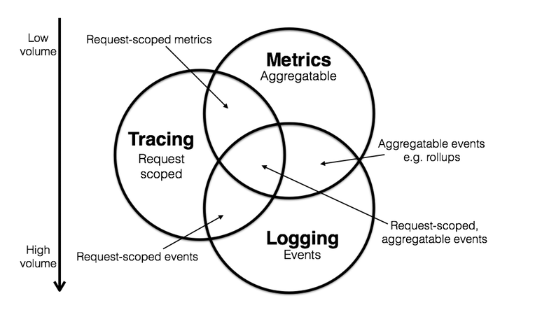

#### Events

**Properties**

* Conceptually, an event can be defined as a discrete action happening at a moment in time. 
* Events become more powerful when you add more metadata to them.

**use cases**

* Events are useful when the data is relatively small or sporadic in nature, or when you don’t know the specific aggregates you want to see ahead of time. And each individual event is stored until it’s deleted.


#### Metrics

**Properties**

* Metrics are numeric measurements. Metrics can include:
  * A numeric status at a moment in time \(like CPU % used\)
  * Aggregated measurements \(like a count of events over a one-minute time, or a rate of events-per-minute\)
* The types of metric aggregation are diverse \(for example, average, total, minimum, maximum, sum-of-squares\), but all metrics generally share the following traits:
  * A name
  * A timestamp
  * One or more numeric values


**Use cases**

* Metrics work well for large bodies of data or data collected at regular intervals when you know what you want to ask ahead of time, but they are less granular than event data.

#### Logs

**Properties**

* Definitions:
  * logs are essentially just lines of text a system produces when certain code blocks get executed. 
* Structure: 
  * Similar to events, log data is discrete—it’s not aggregated—and can occur at irregular time intervals. Logs are also usually much more granular than events. In fact, one event can correlate to many log lines.
  * Log data is sometimes unstructured, and therefore hard to parse in a systematic way; however, these days you’re more likely to encounter “structured log data” that is formatted specifically to be parsed by a machine. Structured log data makes it easier and faster to search the data and derive events or metrics from the data. 

**Usecase**

* Developers rely on them heavily in order to troubleshoot their code and to retroactively verify and interrogate the code’s execution. Logs are incredibly versatile and have many use cases, and most software systems can emit log data. The most common use case for logs is for getting a detailed, play-by-play record of what happened at a particular time.

#### Traces

**Properties**

* Definitions:
  * Traces—or more precisely, “distributed traces”—are samples of causal chains of events \(or transactions\) between different components in a microservices ecosystem. And like events and logs, traces are discrete and irregular in occurrence.
* Properties:
  * Traces that are stitched together form special events called “spans”; spans help you track a causal chain through a microservices ecosystem for a single transaction. To accomplish this, each service passes correlation identifiers, known as “trace context,” to each other; this trace context is used to add attributes on the span.

**Usecase**

* Trace data is needed when you care about the relationships between services/entities. If you only had raw events for each service in isolation, you’d have no way of reconstructing a single chain between services for a particular transaction.
* Additionally, applications often call multiple other applications depending on the task they’re trying to accomplish; they also often process data in parallel, so the call-chain can be inconsistent and timing can be unreliable for correlation. The only way to ensure a consistent call-chain is to pass trace context between each service to uniquely identify a single transaction through the entire chain.
* Optimize the calling chain. For example, if a service calls the other one repeatedly, could these requests being batched? Or could such requests be parallelized?

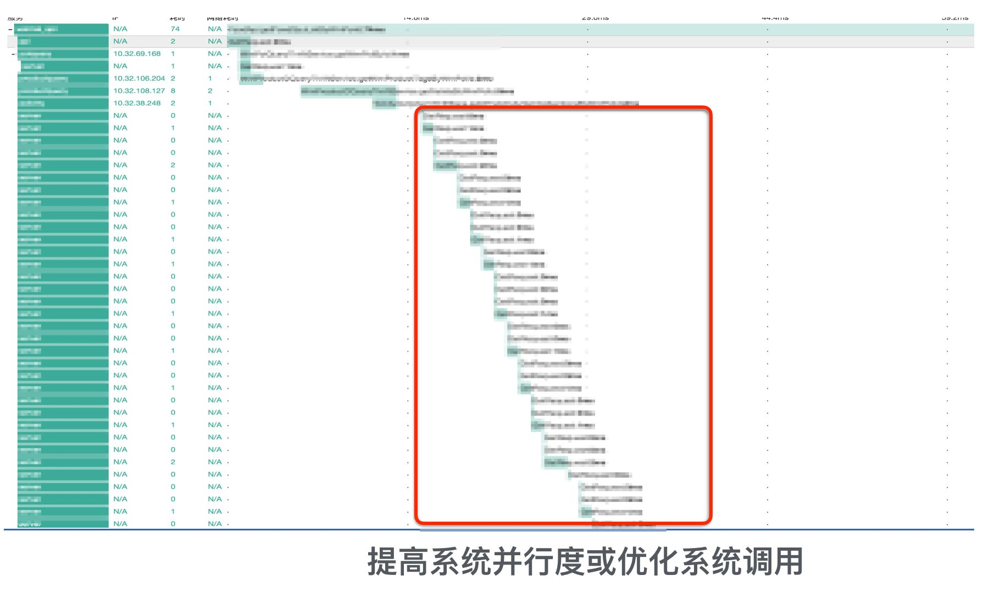

* Locate the bottleneck service. 


* Optimize the network calls. e.g. Identify whether there are cross region calls

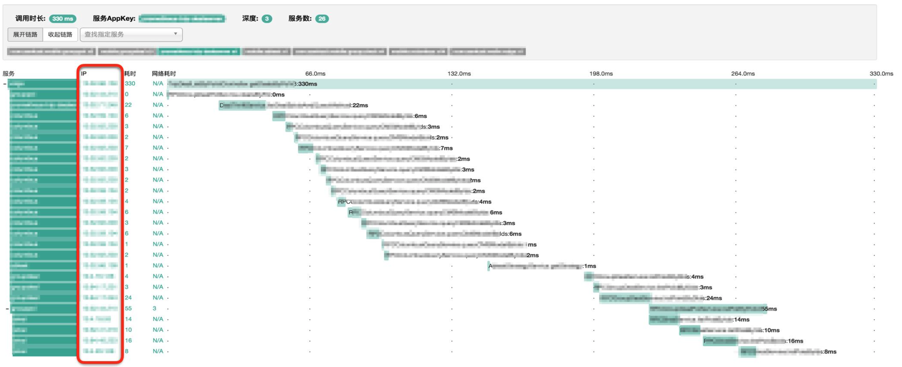

**Data model**

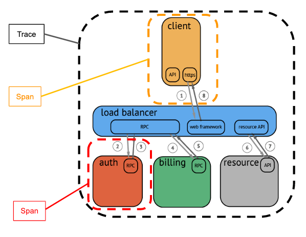

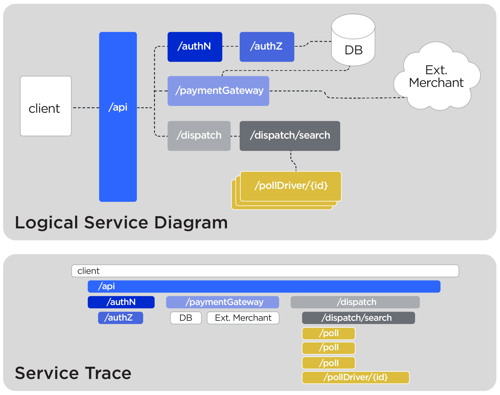

**TraceID**

* TraceId could be used to concatenate the call logs of a request on each server.

**Generation rule**

* Sample generation rule: 
  * The TraceId is typically generated by the first server that receives the request. The generation rule is: server IP + generated time + incremental sequence + current process ID, such as: 
* Example: 0ad1348f1403169275002100356696
  * The first 8 digits 0ad1348f is the IP of the machine that generates TraceId. This is a hexadecimal number, in which every two digits represents a part of IP. Based on the number, we can get a common IP address like 10.209.52.143 by converting every two digits into a decimal number. According to this rule, you can also figure out the first server that the request goes through.
  * The next 13 digits 1403169275002 is the time to generate the TraceId.
  * The next 4 digits 1003 is an auto-incrementing sequence that increases from 1000 to 9000. After reaching 9000, it returns to 1000 and then restarts to increase.
  * The last 5 digits 56696 is the current process ID. Its role in tracerId is to prevent the TraceId conflicts caused by multiple processes in a single machine.

**Sample rate**

* Sampling states applied to the trace ID, not the span ID. 
* There are four possible values for sample rate: 
  * Accept: Decide to include
  * Debug: Within certain testing environments, always enable the sample.
  * Defer: Could not make the decision on whether to trace or not. For example, wait for certain proxy to make the decision. 
  * Deny: Decide to exclude
* The most common use of sampling is probablistic: eg, accept 0.01% of traces and deny the rest. Debug is the least common use case.
* Reference: [https://github.com/openzipkin/b3-propagation](https://github.com/openzipkin/b3-propagation)
* On demand sampling: [https://github.com/openzipkin-contrib/zipkin-secondary-sampling/blob/master/docs/design.md](https://github.com/openzipkin-contrib/zipkin-secondary-sampling/blob/master/docs/design.md)

```text
   Client Tracer                                                  Server Tracer     
┌───────────────────────┐                                       ┌───────────────────────┐
│                       │                                       │                       │
│   TraceContext        │          Http Request Headers         │   TraceContext        │
│ ┌───────────────────┐ │         ┌───────────────────┐         │ ┌───────────────────┐ │
│ │ TraceId           │ │         │ X-B3-TraceId      │         │ │ TraceId           │ │
│ │                   │ │         │                   │         │ │                   │ │
│ │ ParentSpanId      │ │ Inject  │ X-B3-ParentSpanId │ Extract │ │ ParentSpanId      │ │
│ │                   ├─┼────────>│                   ├─────────┼>│                   │ │
│ │ SpanId            │ │         │ X-B3-SpanId       │         │ │ SpanId            │ │
│ │                   │ │         │                   │         │ │                   │ │
│ │ Sampling decision │ │         │ X-B3-Sampled      │         │ │ Sampling decision │ │
│ └───────────────────┘ │         └───────────────────┘         │ └───────────────────┘ │
│                       │                                       │                       │
└───────────────────────┘                                       └───────────────────────┘
```

**SpanID**

* Span ID could be used to determine the order of execution for all calls happened within the same Trace ID.

```text
// Temporal relationships between Spans in a single Trace

––|–––––––|–––––––|–––––––|–––––––|–––––––|–––––––|–––––––|–> time

 [Span A···················································]
   [Span B··············································]
      [Span D··········································]
    [Span C········································]
         [Span E·······]        [Span F··] [Span G··] [Span H··]


// Causal relationships between Spans in a single Trace


        [Span A]  ←←←(the root span)
            |
     +------+------+
     |             |
 [Span B]      [Span C] ←←←(Span C is a `ChildOf` Span A)
     |             |
 [Span D]      +---+-------+
               |           |
           [Span E]    [Span F] >>> [Span G] >>> [Span H]
                                       ↑
                                       ↑
                                       ↑
                         (Span G `FollowsFrom` Span F)
```

**Parent spanId**

* This is one way of defining parent span Id. More commonly adopted. 
* Ref: [https://www.sofastack.tech/en/projects/sofa-tracer/traceid-generated-rule/](https://www.sofastack.tech/en/projects/sofa-tracer/traceid-generated-rule/)

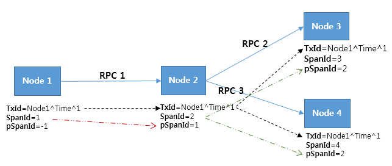

**Dot spanId**

* This is another way of defining parent span Id. 
* Cons: When a trace has too many calling layers, the dot spanId will carry too much redundant information. 


**Annotation**

* Basic description info related to the trace

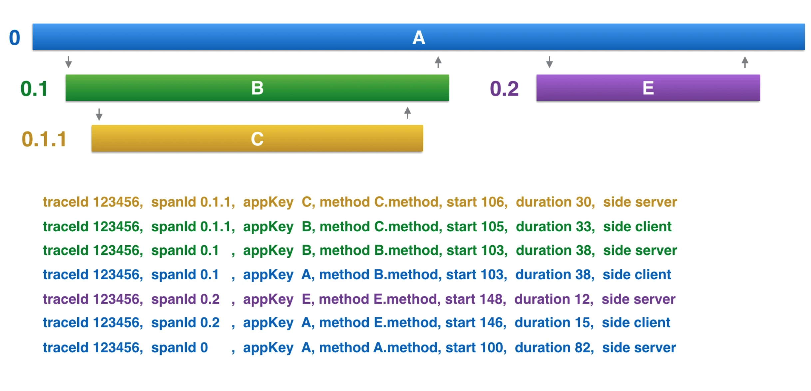

**Context propogation**

* A context will often have information identifying the current span and trace \(e.g. SpanId / TraceId\), and can contain arbitrary correlations as key-value pairs.
* Propagation is the means by which context is bundled and transferred across.
* The ability to correlate events across service boundaries is one of the principle concepts behind distributed tracing. To find these correlations, components in a distributed system need to be able to collect, store, and transfer metadata referred to as context.

**Across threads**

* References: [https://www.programmersought.com/article/65184544752/](https://www.programmersought.com/article/65184544752/)
* Use threadlocal to pass TraceID / SpanID

**Across Restful style service APIs**

* There are several protocols for context propagation that OpenTelemetry recognizes.
  * W3C Trace-Context HTTP Propagator
  * W3C Correlation-Context HTTP Propagator
  * B3 Zipkin HTTP Propagator

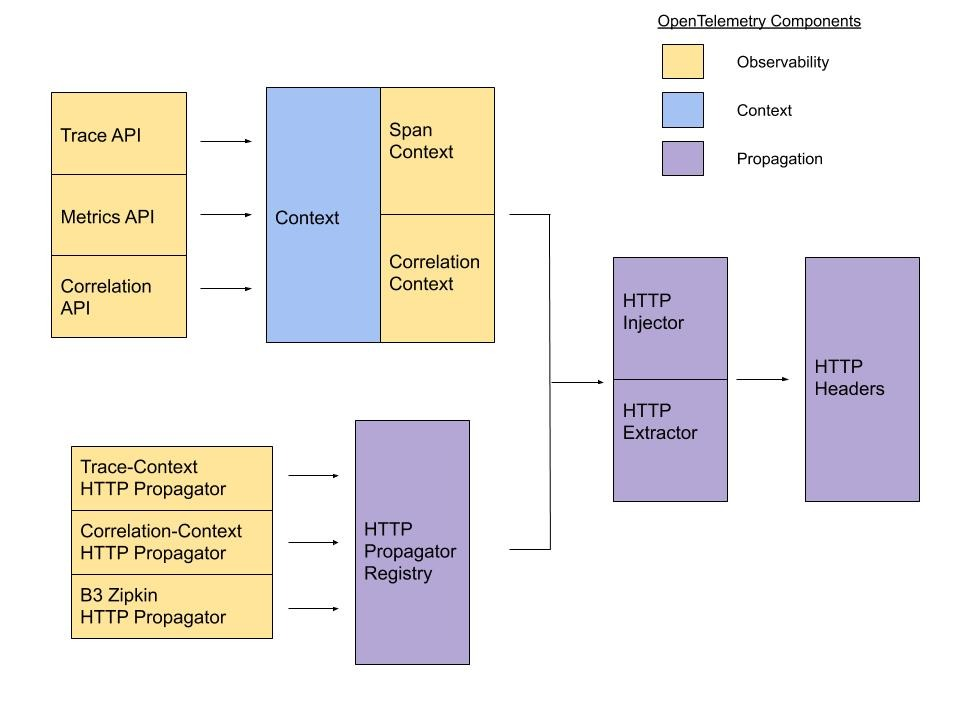

**Across components such as message queues / cache / DB**

1. Add the context variables inside message 
   * Cons: temper with message
2. Change message queue protocol 
   * Cons: challenging

**OpenTracing API standards**

* Reference: 
  * [OpenTracing specification](https://github.com/opentracing/specification/blob/master/specification.md)
  * [Doc](https://opentracing.io/docs/overview/spans/)

### Architecture

#### Requirements

* Realtime: Incident handling typically requires real-time data.
* High availability: Monitoring system
* High throughput: Lots of data to monitor
* Lose messsage is tolerated

#### Data collection

**Asynchronous processing with bounded buffer queue**

* No matter what approach the data collector adopts, the threads for sending out telemetry data must be separated from business threads. Call it using a background threads pool. 
* There should be a queue between business threads and background threads. And this queue should have bounded size to avoid out of memory issue. 

```text
┌─────────────────────────────────────────────────────────────────────────────────┐                                            
│                                   Application                                   │                                            
│                                                                                 │                                            
│                                                                                 │                                            
│   ┌───────────────────┐       ┌───────────────┐       ┌─────────────────────┐   │                                            
│   │                   │       │               │       │                     │   │                                            
│   │                   │       │               │       │                     │   │     ┌────────────┐      ┌─────────────────┐
│   │                   │       │               │       │                     │   │     │            │      │                 │
│   │                   │       │               │       │                     │   │     │            │      │                 │
│   │                   │       │               │       │                     │   │     │            │      │                 │
│   │                   │       │               │       │                     │   │     │            │      │                 │
│   │                   │       │               │       │                     │   │     │            │      │                 │
│   │  Business logic   │       │ Bounded size  │       │                     │   │     │            │      │Log/Trace/Metrics│
│   │      threads      │──────▶│queue to avoid │──────▶│ Background threads  │   │────▶│Kafka / UDP │─────▶│    Processor    │
│   │                   │       │ Out of Memory │       │                     │   │     │            │      │                 │
│   │                   │       │               │       │                     │   │     │            │      │                 │
│   │                   │       │               │       │                     │   │     │            │      │                 │
│   │                   │       │               │       │                     │   │     │            │      │                 │
│   │                   │       │               │       │                     │   │     │            │      │                 │
│   │                   │       │               │       │                     │   │     │            │      │                 │
│   │                   │       │               │       │                     │   │     └────────────┘      └─────────────────┘
│   │                   │       │               │       │                     │   │                                            
│   └───────────────────┘       └───────────────┘       └─────────────────────┘   │                                            
│                                                                                 │                                            
│                                                                                 │                                            
│                                                                                 │                                            
└─────────────────────────────────────────────────────────────────────────────────┘
```

**Approaches**

**Manual tracing**

* Manually add tracing logs

**AOP**

**Bytecode Instrumentation**

* Please see more in [In Chinese](https://tech.meituan.com/2019/09/05/java-bytecode-enhancement.html)


**Append to log files**

* Appender is responsible for outputing formatted logs to destinations such as disk files, console, etc. Then trace files could be processed in the similar way as log files. 
  * When multiple threads use the same appender, there is a chance for resource contention. The append operation needs to be asynchronous. And to fit with asynchornous operation, there must be a buffer queue. Please 

#### Data transmission

* Protocol
  * Use UDP protocol to directly transmit to servers
  * Send to specific topic inside Kafka, and consumers read from Kafka topic. 
* Serialization
  * Protobuf
  * Json

**Capacity planning for Kafka**

* **Data storage**

  **Trace**

  **Requirement analysis**

* No fixed data model but calling chain has a tree-structure. 
* Large amounts of data, would better be compressed. 
  * Sample size figures: meituan 100TB per day

**Column-family data storage**

**Data model for a normal trace**

* Use TraceID as rowKey
* Has two columns
  * Basic info column: Basic info about trace 
  * Calling info column: \(Each remote service call has four phases\)
    * P1: Client send
    * P2: Server receive
    * P3: Server send
    * P4: Client receive
* Using HBase as an example for an ecommerce website

| TraceId | 0001 | 0002 |
| :--- | :--- | :--- |
| Basic Info Column | Type: buy | Type: refund |
| Basic Info Column | Status: finished | Status: processing |
| Calling Info Column | SpanId 1 with P1 calling info | SpanId 1 with P1 calling info |
| Calling Info Column | SpanId 1 with P2 calling info | SpanId 1 with P2 calling info |
| Calling Info Column | SpanId 1 with P3 calling info | SpanId 1 with P3 calling info |
| Calling Info Column | SpanId 1 with P4 calling info | SpanId 1 with P4 calling info |
| Calling Info Column | SpanId 2 with P1 calling info | SpanId 2 with P1 calling info |
| Calling Info Column | SpanId 2 with P2 calling info | empty to be filled when finished |
| Calling Info Column | SpanId 2 with P3 calling info | ... ... |

**Data model for a buiness trace**

* Motivation:
  * The above trace data model covers the case where all spans could be concatenated together with a trace ID. There are cases where multiple trace id needed to be concatenated to form a business chain. 
  * For example, in ecommerce system, a customer could create an order, the revise an exsiting order, and later on cancel the order. 
* Also needs a column-family storage from traceID -&gt; json blob and the reverse mapping from system transaction id -&gt; trace ID

| TraceID | Order system transaction ID | Payment system transaction ID | User system transaction ID |
| :--- | :--- | :--- | :--- |
| 0001 | 1 | 2 | 3 |
| 0002 | 4 | 5 | 6 |
| 0003 | 7 | 8 | 9 |

**Distributed file system**

* Each block needs corresponding 48 bits index data. Based on the trace Id, the index position could be decided. 
* The trace Id format could be defined in a way to make locating index and block data easier. For example, ShopWeb-0a010680-375030-2 traceId has four segments. The index file name could be defined as the "ShopWeb" + "0a010680" + "375030". And the block position could be inferred from the 4th segment. 
  * ShopWeb: Application name
  * 0a010680: Current machine's IP address
  * 375030: Current time / hour 
  * 2: Mono-increasing sequence number in the current unit

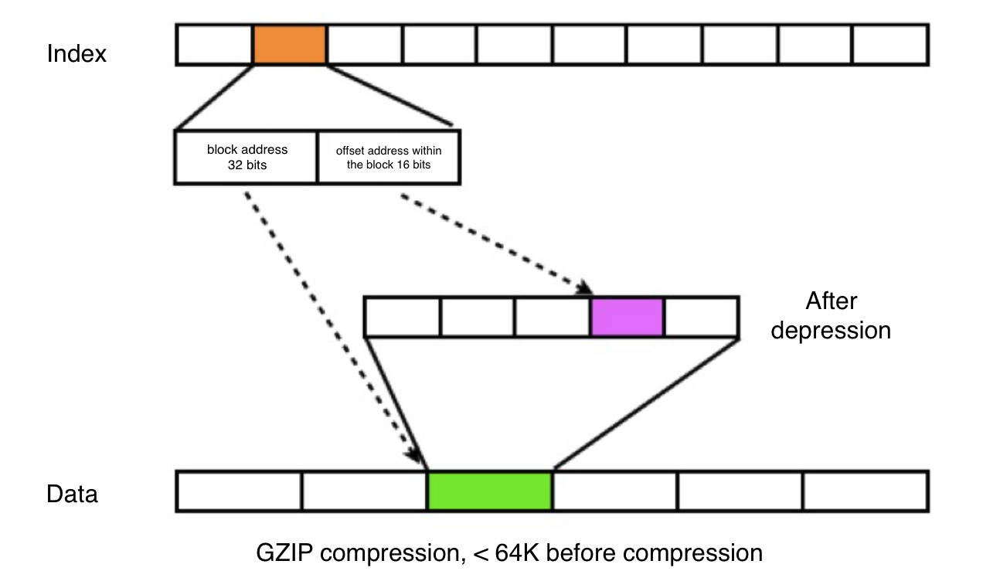

**Case study: Netflix's ElasticSearch -&gt; Cassandra \(SSD-&gt;EBS\)**

* [https://netflixtechblog.com/building-netflixs-distributed-tracing-infrastructure-bb856c319304](https://netflixtechblog.com/building-netflixs-distributed-tracing-infrastructure-bb856c319304)
* [https://netflixtechblog.com/lessons-from-building-observability-tools-at-netflix-7cfafed6ab17](https://netflixtechblog.com/lessons-from-building-observability-tools-at-netflix-7cfafed6ab17)

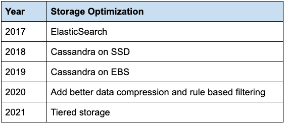

**Logs**

* Use case: Troubleshooting
* Storage by ElasticSearch and display by Kibana

**Java logging frameworks**

* JDK logger: Shipped together with Java 1.4
* Frameworks define logging APIs: Apache Commons Logging / Slf4j
  * Logger: includes methods such as trace/debug/info/warn/error
  * LogFactory: LogFactoryImpl
* Log4j / log4j 2/ Logback

**Metrics**

* Use case: Time series data such as counters aggregation, latency measurement
* Storage by InfluxDB and display by Grafana 

#### Data display

**Offline analysis**

* Based on Hadoop

**Real-time analysis**

* Spark/Flume performs real-time analysis for QPS, average response time
* Result is being piped into Redis

### Real world applications

#### Distributed tracing solutions

**Solution inventory**

* 2014 Google Dapper
* Twitter Zipkin: [https://zipkin.io/pages/architecture.html](https://zipkin.io/pages/architecture.html)
* Pinpoint: [https://pinpoint-apm.github.io/pinpoint/](https://pinpoint-apm.github.io/pinpoint/)
* DaZhongDianPing CAT \(Chinese\): [https://github.com/dianping/cat](https://github.com/dianping/cat)
* Alibaba EagleEye
* Jingdong Hydra
* Apache SkyWalking:[https://github.com/apache/skywalking](https://github.com/apache/skywalking)
* Pinpoint \(APM\)

**OpenZipkin**

* [https://zipkin.io/pages/architecture.html](https://zipkin.io/pages/architecture.html)


```text
// Here’s an example sequence of http tracing where user code calls the resource /foo. This results in a single span, sent asynchronously to Zipkin after user code receives the http response.

// Trace instrumentation report spans asynchronously to prevent delays or failures relating to the tracing system from delaying or breaking user code.

┌─────────────┐ ┌───────────────────────┐  ┌─────────────┐  ┌──────────────────┐
│ User Code   │ │ Trace Instrumentation │  │ Http Client │  │ Zipkin Collector │
└─────────────┘ └───────────────────────┘  └─────────────┘  └──────────────────┘
       │                 │                         │                 │
           ┌─────────┐
       │ ──┤GET /foo ├─▶ │ ────┐                   │                 │
           └─────────┘         │ record tags
       │                 │ ◀───┘                   │                 │
                           ────┐
       │                 │     │ add trace headers │                 │
                           ◀───┘
       │                 │ ────┐                   │                 │
                               │ record timestamp
       │                 │ ◀───┘                   │                 │
                             ┌─────────────────┐
       │                 │ ──┤GET /foo         ├─▶ │                 │
                             │X-B3-TraceId: aa │     ────┐
       │                 │   │X-B3-SpanId: 6b  │   │     │           │
                             └─────────────────┘         │ invoke
       │                 │                         │     │ request   │
                                                         │
       │                 │                         │     │           │
                                 ┌────────┐          ◀───┘
       │                 │ ◀─────┤200 OK  ├─────── │                 │
                           ────┐ └────────┘
       │                 │     │ record duration   │                 │
            ┌────────┐     ◀───┘
       │ ◀──┤200 OK  ├── │                         │                 │
            └────────┘       ┌────────────────────────────────┐
       │                 │ ──┤ asynchronously report span     ├────▶ │
                             │                                │
                             │{                               │
                             │  "traceId": "aa",              │
                             │  "id": "6b",                   │
                             │  "name": "get",                │
                             │  "timestamp": 1483945573944000,│
                             │  "duration": 386000,           │
                             │  "annotations": [              │
                             │--snip--                        │
                             └────────────────────────────────┘
```

**Pinpoint**

* [https://pinpoint-apm.github.io/pinpoint/techdetail.html\#bytecode-instrumentation-not-requiring-code-modifications](https://pinpoint-apm.github.io/pinpoint/techdetail.html#bytecode-instrumentation-not-requiring-code-modifications)

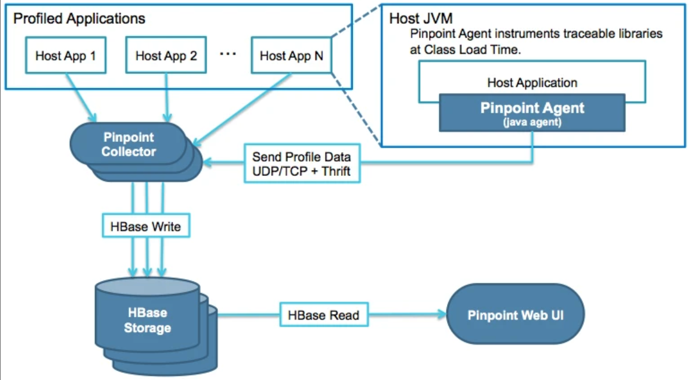


**Compare Pinpoint and OpenZipkin**

* Language support:
  * OpenZipkin has a broad language support, including C\#、Go、Java、JavaScript、Ruby、Scala、PHP
  * PinPoint only support Java
* Integration effort:
  * OpenZipkin's braven trace instrument api needs to be embedded inside business logic
  * Pinpoint uses Bytecode Instrumentation, Not Requiring Code Modifications. 
* Trace granularity: 
  * OpenZipkin: Code level
  * Pinpoint: Granular at bytecode level

#### Netflix

* Application monitoring: [https://netflixtechblog.com/telltale-netflix-application-monitoring-simplified-5c08bfa780ba](https://netflixtechblog.com/telltale-netflix-application-monitoring-simplified-5c08bfa780ba)
* Distributed tracing: [https://netflixtechblog.com/building-netflixs-distributed-tracing-infrastructure-bb856c319304](https://netflixtechblog.com/building-netflixs-distributed-tracing-infrastructure-bb856c319304)
* Edgar solving mysterious: [https://netflixtechblog.com/edgar-solving-mysteries-faster-with-observability-e1a76302c71f](https://netflixtechblog.com/edgar-solving-mysteries-faster-with-observability-e1a76302c71f)
* Self-serve dashboard: [https://netflixtechblog.com/lumen-custom-self-service-dashboarding-for-netflix-8c56b541548c](https://netflixtechblog.com/lumen-custom-self-service-dashboarding-for-netflix-8c56b541548c)
* Build observability tools: [https://netflixtechblog.com/lessons-from-building-observability-tools-at-netflix-7cfafed6ab17](https://netflixtechblog.com/lessons-from-building-observability-tools-at-netflix-7cfafed6ab17)
* Netflix On instance trace: [https://netflixtechblog.com/introducing-bolt-on-instance-diagnostic-and-remediation-platform-176651b55505](https://netflixtechblog.com/introducing-bolt-on-instance-diagnostic-and-remediation-platform-176651b55505)
* Netflix system intuition: [https://netflixtechblog.com/flux-a-new-approach-to-system-intuition-cf428b7316ec](https://netflixtechblog.com/flux-a-new-approach-to-system-intuition-cf428b7316ec)
* Time series data at Netflix: [https://netflixtechblog.com/scaling-time-series-data-storage-part-i-ec2b6d44ba39](https://netflixtechblog.com/scaling-time-series-data-storage-part-i-ec2b6d44ba39)

#### Healthchecks.io

* 120 paying customer
* 1600 monthly recurring revenue
* 10M pings per day
* Industrial implementation:
  * Sentry

### References

* OpenTelemetry; [https://opentelemetry.lightstep.com/](https://opentelemetry.lightstep.com/)
* 美团
  * 技术博客字节码：[https://tech.meituan.com/2019/09/05/java-bytecode-enhancement.html](https://tech.meituan.com/2019/09/05/java-bytecode-enhancement.html)
  * 美团技术深入分析开源框架CAT: [https://tech.meituan.com/2018/11/01/cat-in-depth-java-application-monitoring.html](https://tech.meituan.com/2018/11/01/cat-in-depth-java-application-monitoring.html)
  * 美团分布式追踪MTrace：[https://zhuanlan.zhihu.com/p/23038157](https://zhuanlan.zhihu.com/p/23038157)
* Datadog and Opentracing: [https://www.datadoghq.com/blog/opentracing-datadog-cncf/](https://www.datadoghq.com/blog/opentracing-datadog-cncf/)
* Metrics, logging and tracing: [https://peter.bourgon.org/blog/2017/02/21/metrics-tracing-and-logging.html](https://peter.bourgon.org/blog/2017/02/21/metrics-tracing-and-logging.html)
* Which trace to collect: 
  * [https://news.ycombinator.com/item?id=15326272](https://news.ycombinator.com/item?id=15326272)
  * Tail-based sampling: [https://github.com/jaegertracing/jaeger/issues/425](https://github.com/jaegertracing/jaeger/issues/425)
* 阿里云分布式链路文档：[https://help.aliyun.com/document\_detail/133635.html](https://help.aliyun.com/document_detail/133635.html)
* 阿里eagle eye:
* Java instruments API: [https://tech.meituan.com/2019/02/28/java-dynamic-trace.html](https://tech.meituan.com/2019/02/28/java-dynamic-trace.html)
* 移动端的监控：[https://time.geekbang.org/dailylesson/topic/135](https://time.geekbang.org/dailylesson/topic/135)
* 即时消息系统端到端：[https://time.geekbang.org/column/article/146995?utm\_source=related\_read&utm\_medium=article&utm\_term=related\_read](https://time.geekbang.org/column/article/146995?utm_source=related_read&utm_medium=article&utm_term=related_read)

