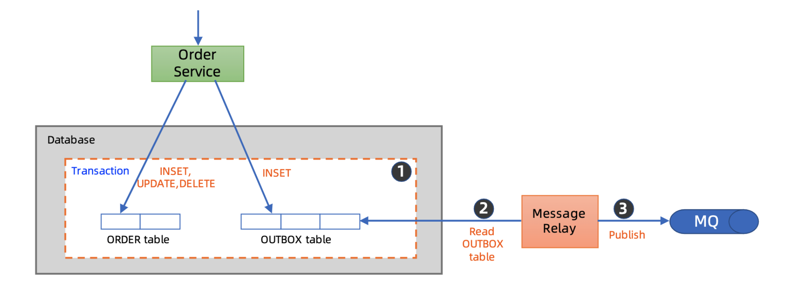
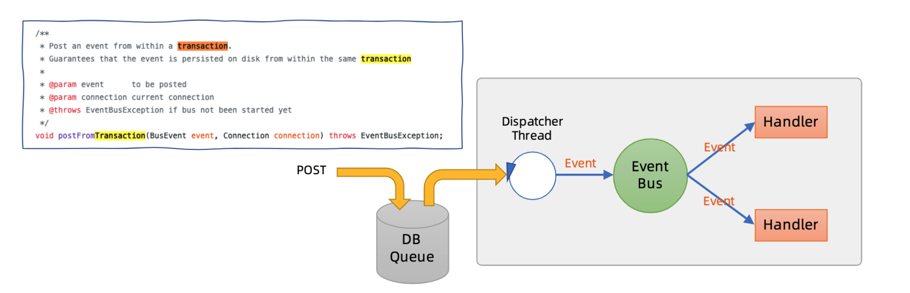
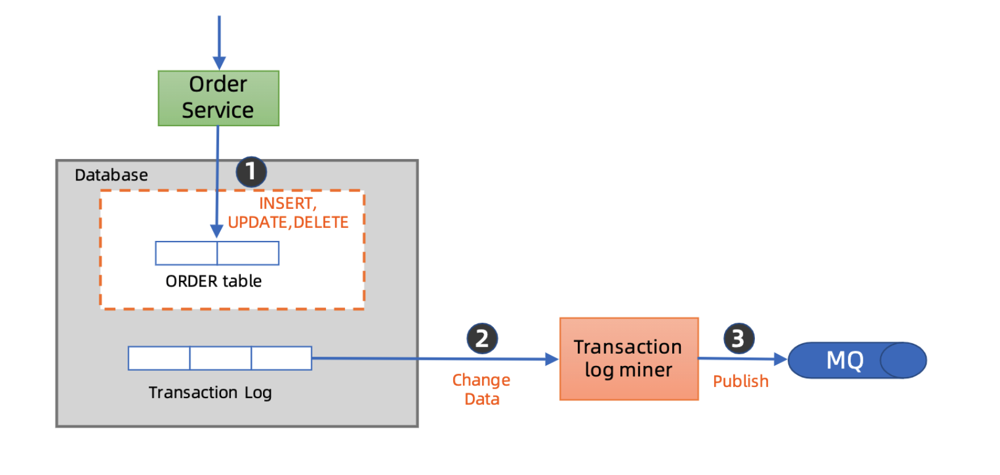
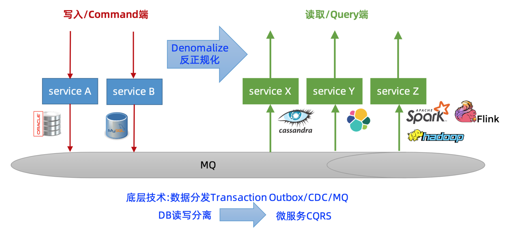
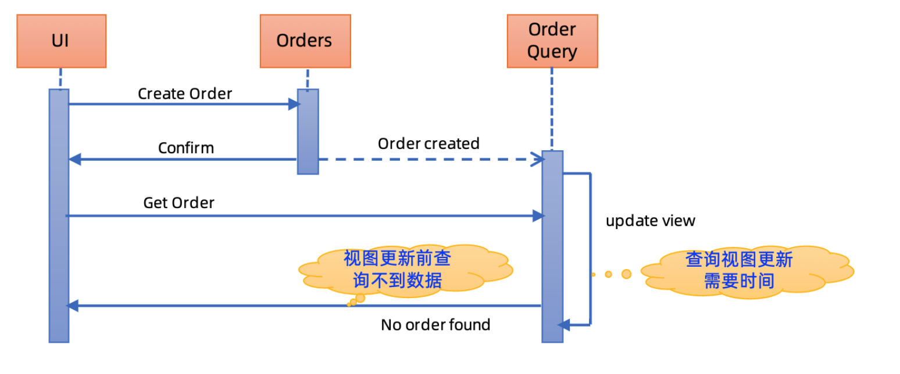
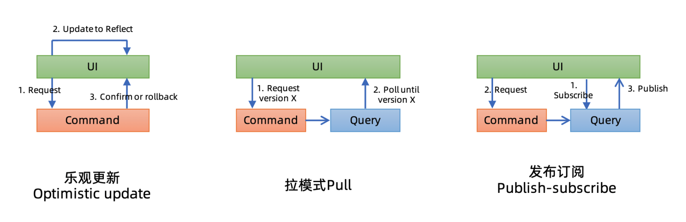

# MicroSvcs\_Overview-\[TODO\]

* [Microservices](microsvcs_overview-todo.md#microservices)
  * [Architecture](microsvcs_overview-todo.md#architecture)
  * [Capacity planning \[Todo\]](microsvcs_overview-todo.md#capacity-planning-todo)
  * [Org architecture \[Todo\]](microsvcs_overview-todo.md#org-architecture-todo)
  * [Microservice layers](microsvcs_overview-todo.md#microservice-layers)
  * [Tech architecture \[Todo\]](microsvcs_overview-todo.md#tech-architecture-todo)
  * [Problems](microsvcs_overview-todo.md#problems)
    * [Data distribution](microsvcs_overview-todo.md#data-distribution)
      * [Use case](microsvcs_overview-todo.md#use-case)
      * [Approaches](microsvcs_overview-todo.md#approaches)
        * [Transactional outbox](microsvcs_overview-todo.md#transactional-outbox)
        * [CDC \(Change data capture\)](microsvcs_overview-todo.md#cdc-change-data-capture)
    * [Data join](microsvcs_overview-todo.md#data-join)
      * [Use case](microsvcs_overview-todo.md#use-case-1)
      * [Approaches](microsvcs_overview-todo.md#approaches-1)
        * [CQRS](microsvcs_overview-todo.md#cqrs)
    * [Breakdown monolithic](microsvcs_overview-todo.md#breakdown-monolithic)
      * [Definition](microsvcs_overview-todo.md#definition)
      * [Steps to migration](microsvcs_overview-todo.md#steps-to-migration)
      * [Key difficult points](microsvcs_overview-todo.md#key-difficult-points)
      * [Example](microsvcs_overview-todo.md#example)
  * [Service mesh \[Todo\]](microsvcs_overview-todo.md#service-mesh-todo)

## Microservices

### Architecture

* RPC vs message queue based: [https://time.geekbang.org/column/article/73368](https://time.geekbang.org/column/article/73368)

### Capacity planning \[Todo\]

* [https://time.geekbang.org/column/article/44118](https://time.geekbang.org/column/article/44118)

### Org architecture \[Todo\]

* [TODO: Kangwei principle](https://time.geekbang.org/course/detail/100003901-2154)
* [TODO: when to introduce microservices](https://time.geekbang.org/course/detail/100003901-2186)
* [TODO: when to breakdown monolithic](https://time.geekbang.org/column/article/13882)
* [TODO: devops, management platform](https://time.geekbang.org/column/article/41873)
* [TODO: how to divide](https://time.geekbang.org/column/article/72090)
* [TODO: servicemesh在复杂环境下的落地](https://tech.meituan.com/2020/12/03/service-mesh-in-meituan.html)

### Microservice layers

* [TODO: Alibaba's big Middletier, small front end](https://time.geekbang.org/course/detail/100003901-2188)
* [TODO: Microservice divides to different layers](https://time.geekbang.org/course/detail/100003901-2189)
* TODO: Microservice challenges
  * [https://time.geekbang.org/column/article/13891](https://time.geekbang.org/column/article/13891)
  * [https://time.geekbang.org/column/article/14222](https://time.geekbang.org/column/article/14222)

### Tech architecture \[Todo\]

* [Routing architecture](https://time.geekbang.org/course/detail/100003901-2272)
* [Components](https://time.geekbang.org/course/detail/100003901-2222)
* Microservices management
  * [https://time.geekbang.org/course/detail/100003901-2275](https://time.geekbang.org/course/detail/100003901-2275)
  * [https://time.geekbang.org/column/article/18651](https://time.geekbang.org/column/article/18651)
  * [https://time.geekbang.org/column/article/41758](https://time.geekbang.org/column/article/41758)

### Problems

#### Data distribution

* Definition: Double write. How to guarantee the ACID of two writes

**Use case**

* Data replication
* Database migration
* Implement CQRS or remove join from database
* Implement distributed transactions

**Approaches**

**Transactional outbox**

* Flowchart

* Implementation: Killbill common queue

**CDC \(Change data capture\)**

* Flowchart

* Implementation:
  * Alibaba Canal \(recommended\)
  * Redhat Debezium
  * Zendesk Maxell
  * Airbnb SpinalTap

#### Data join

**Use case**

* N+1 problem
* Data volume
* Performance

**Approaches**

**CQRS**

* Flowchart

* Possible problems: Eventual consistency

* Possible solutions:

#### Breakdown monolithic

**Definition**

* Velocity slow
* Hard to continue scale vertically
* Independent deployment capability

**Steps to migration**

**Key difficult points**

* Understand the APIs
* Database migration
  * Incremental and rollbackable
  * Data 
* Use data distribution and remove join

**Example**

* StichFix - Scaling your architecture with services and events

### Service mesh \[Todo\]

* Overview: [https://time.geekbang.org/column/article/65132](https://time.geekbang.org/column/article/65132)
* Istio: [https://time.geekbang.org/column/article/67172](https://time.geekbang.org/column/article/67172)
* Weibo implements service mesh:
  * [https://time.geekbang.org/column/article/67548](https://time.geekbang.org/column/article/67548)
  * [https://time.geekbang.org/column/article/67940](https://time.geekbang.org/column/article/67940)

