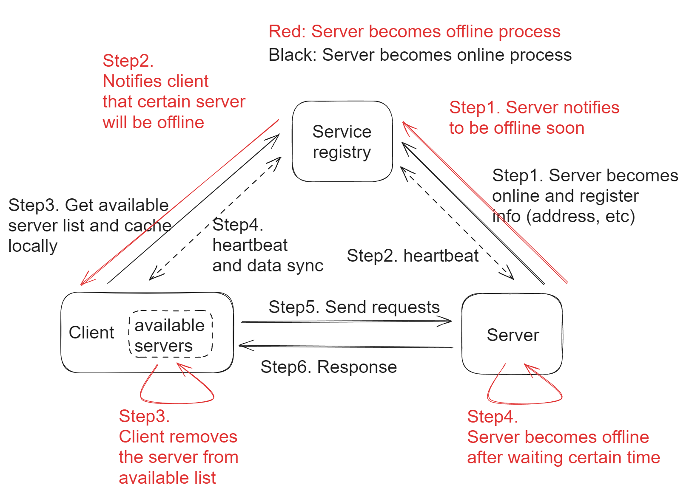

- [Roles and functionalities](#roles-and-functionalities)
  - [RPC server](#rpc-server)
  - [RPC client](#rpc-client)
    - [Local cache](#local-cache)
  - [Service registry](#service-registry)
- [Multiple service registry](#multiple-service-registry)
  - [Administration](#administration)

# Roles and functionalities

## RPC server
* Upon start, send registration information to registry center according to config file (e.g. server.xml)
* Upon running, regularly report heartbeat information to the server.

## RPC client
* Upon start, subscribe to registry center according to config file and cache the response from registry center inside cache.
* Upon running, based on some load balancing algorithm, connect with RPC servers.

### Local cache
* Local cache: Need local cache to improve performance.
* Snapshot: This snapshot in disk is needed because the network between consumers and registry center are not always good. If consumers restart and connection is not good, then consumers could still read from snapshot (there is no cache so far).

## Service registry
* When RPC servers have changes, registry center will notify RPC clients on these changes.

# Multiple service registry

* Multiple registration center deployed
  * Different gateways/business logic units are connected to different registration center
* What if a pushdown instruction arrives at the wrong registration center
  * Gossip protocol to discover between different registration centers
    * Cons: Long message delay / Forward redundancy
    * Pros: Suitable for large number of clusters. Used in P2P, Redis cluster, Consul
  * An open source implementation for Gossip [https://github.com/scalecube/scalecube-cluster](https://github.com/scalecube/scalecube-cluster)

## Administration

* Administrative functionalities:
  * Update a service provider's information
* Blacklist and whitelist service providers
  * e.g. Service providers in production environments should not register inside register center of test environments.
