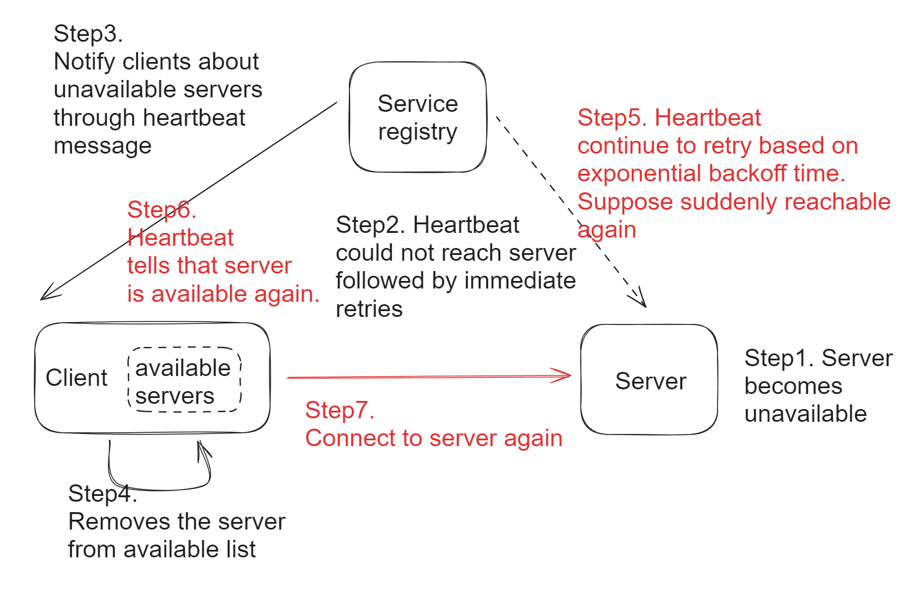
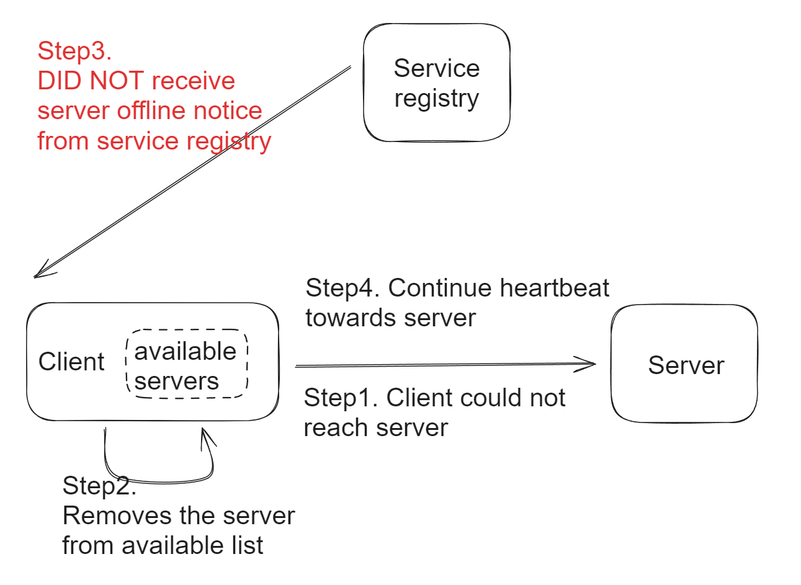

- [Fault tolerant heartbeat messages](#fault-tolerant-heartbeat-messages)
  - [Reactive heartbeat messages](#reactive-heartbeat-messages)
  - [Report frequency](#report-frequency)
  - [Subhealth criteria](#subhealth-criteria)
  - [Resilient to network latency](#resilient-to-network-latency)
  - [Event subscription](#event-subscription)
  - [How to avoid notification storm](#how-to-avoid-notification-storm)
- [Fault tolerance on servers](#fault-tolerance-on-servers)
- [Fault tolerance on clients](#fault-tolerance-on-clients)
- [Fault tolerance on service registry](#fault-tolerance-on-service-registry)
  - [What if service registry goes down in the worst case](#what-if-service-registry-goes-down-in-the-worst-case)
  - [Integration mechanism](#integration-mechanism)

# Fault tolerant heartbeat messages

## Reactive heartbeat messages
* Proactive: Registry center proactively calls service providers.
  * Cons: Registry center needs to loop through all service providers regularly. There will be some delay.
* Reactive: Service providers reports heartbeat messages to service registry. 
  * This will better suit for scenarios when there are lots of service providers. 

## Report frequency
* Usually the health ping frequency is set to 30s. This will avoid too much pressure on the server, and at the same time avoid too much delay in catching a node's health states.

## Subhealth criteria
* A State transition between death, health and subhealth. An interesting question is how to decide the threshold for a node to transit from health to subhealth?
  * Both application layer and service layer health info needs to be gathered. For application layer, the RPS/response time of each API will be different, so simply setting threshold for total failure or TPS. Use the percentage of success / total as standards.

## Resilient to network latency
* Deploy detectors across different locations.
* But set up a threshold (like 40%) to avoid remove all nodes due to network problems.

## Event subscription
* RPC client subscribes to certain services
* Take the example of Zookeeper: Use watch mechanism

## How to avoid notification storm
* Problem: Suppose a service provider has 100 nodes and each node has 100 consumers. Then when there is an update in the service provider, there will be 100\*100 notifications generated.
* Solution:
  * Capacity planning for registry center.
  * Scale up registry center.
  * Only transmit incremental information.

# Fault tolerance on servers

# Fault tolerance on clients

# Fault tolerance on service registry
* Choose among service registry frameworks. Choose AP oriented service registry if needed. 
* Typically, use AP model on large clusters and CP model on small clusters. Here AP and CP mean that
  * AP: Service registry will be alive but you may get wrong service entry. 
  * CP: Service registry might crash and you get nothing.  

|                       |             |              |                |              |
| --------------------- | ----------- | ------------ | -------------- | ------------ |
| `Criteria`            | `Zookeeper` | `etcd`       | `Eureka`       | `Consul`     |
| CAP model             | CP          | CP           | AP             | CP           |
| Consensus protocol    | ZAB (Paxos) | Raft         | Not applicable | Raft         |
| Integration mechanism | SDK client  | HTTP/gRPC    | HTTP           | HTTP/DNS     |
| Watch support         | Support     | Long polling | Long polling   | Long polling |
| KV storage            | Support     | Support      | Not support    | Support      |
| Written language      | Java        | Go           | Java           | Go           |

## What if service registry goes down in the worst case
1. Start backup service registry
2. Manually start the node

## Integration mechanism

* In-app solutions are typically suitable when both service providers and consumers belong to the same technology stack. Such as Euruka
* Out-app solutions are typically suitable in cloud apps (container). Such as Consul
