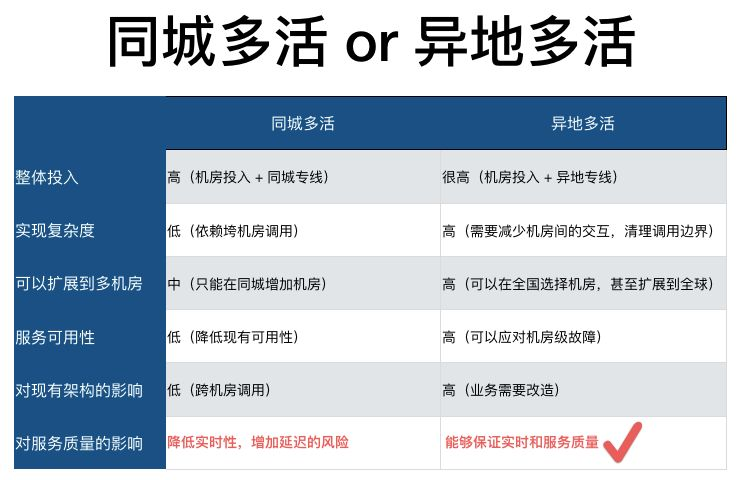
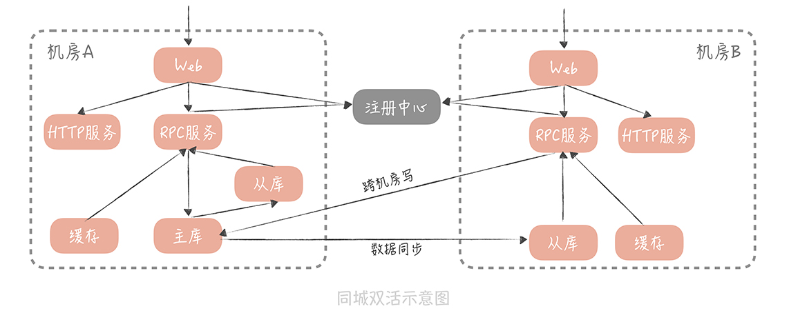
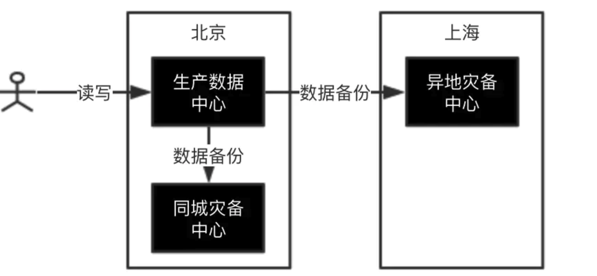
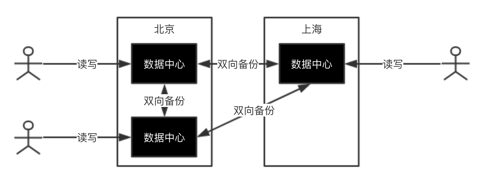
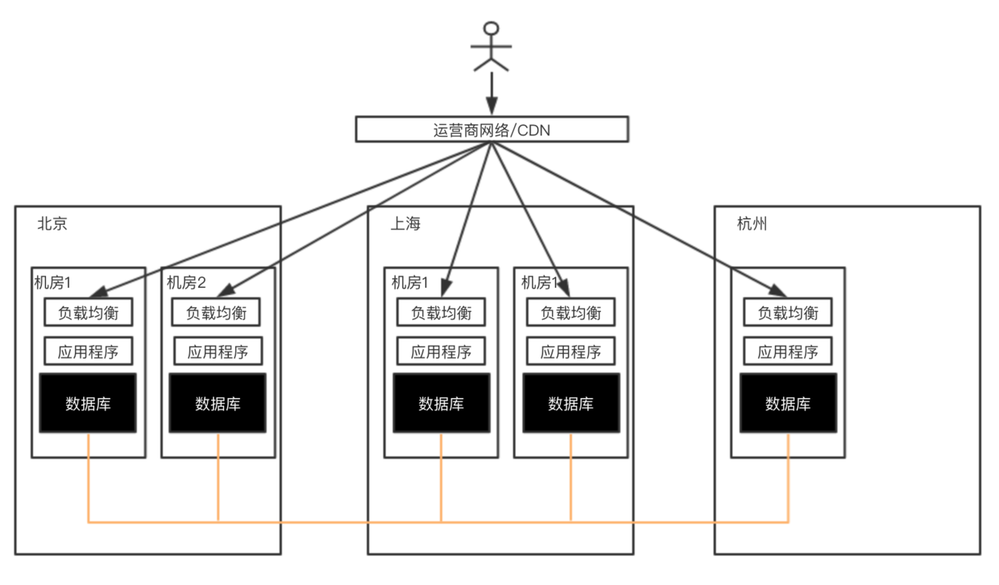

<!-- MarkdownTOC -->

- [Multi-DC](#multi-dc)
	- [Multi DC basics](#multi-dc-basics)
		- [Metrics](#metrics)
		- [Architecture](#architecture)
		- [Routing key](#routing-key)
		- [Data synchronization](#data-synchronization)
			- [MySQL data replication](#mysql-data-replication)
				- [DRC architecture](#drc-architecture)
				- [SCN](#scn)
				- [How to avoid circular replication](#how-to-avoid-circular-replication)
				- [How to recover from replication failure](#how-to-recover-from-replication-failure)
				- [How to avoid conflict](#how-to-avoid-conflict)
				- [How to avoid conflict](#how-to-avoid-conflict-1)
		- [Global zone service](#global-zone-service)
		- [Global eZone](#global-ezone)
	- [Multi DC in same city](#multi-dc-in-same-city)
		- [Architecture](#architecture-1)
	- [Multi DC in different city](#multi-dc-in-different-city)
		- [Three DC in two cities](#three-dc-in-two-cities)
			- [Initial design](#initial-design)
			- [Improved design](#improved-design)
		- [Five DC in three cities](#five-dc-in-three-cities)
	- [Typical architecture](#typical-architecture)

<!-- /MarkdownTOC -->

# Multi-DC

## Multi DC basics
### Metrics
* Same city - 1ms to 3ms
* Different city within same country - 50ms
* Cross counttry - 100ms - 200ms

### Architecture

### Routing key

### Data synchronization

#### MySQL data replication

##### DRC architecture

##### SCN

##### How to avoid circular replication

##### How to recover from replication failure

##### How to avoid conflict

##### How to avoid conflict

### Global zone service

### Global eZone 

## Multi DC in same city 

### Architecture

## Multi DC in different city
### Three DC in two cities

#### Initial design

#### Improved design

### Five DC in three cities

## Typical architecture

* References:
	- 饿了吗：https://zhuanlan.zhihu.com/p/32009822
	- 异地多活架构： https://www.infoq.cn/video/PSpYkO6ygNb4tdmFGs0G
	- 微博异地多活：https://mp.weixin.qq.com/s?__biz=MzAwMDU1MTE1OQ==&mid=402920548&idx=1&sn=45cd62b84705fdd853bdd108b9301a17&3rd=MzA3MDU4NTYzMw==&scene=6#rd
	- Overview: https://www.modb.pro/db/12798
	- golden ant: 
		* https://www.infoq.cn/article/xYEWLWBSc1L9H4XvzGl0
		* https://static001.geekbang.org/con/33/pdf/1703863438/file/%E7%BB%88%E7%A8%BF-%E6%97%B6%E6%99%96-%E5%BC%82%E5%9C%B0%E5%A4%9A%E6%B4%BB%E5%8D%95%E5%85%83%E5%8C%96%E6%9E%B6%E6%9E%84%E4%B8%8B%E7%9A%84%E5%BE%AE%E6%9C%8D%E5%8A%A1%E4%BD%93%E7%B3%BB.pdf
	- 甜橙： https://mp.weixin.qq.com/s?__biz=MzIzNjUxMzk2NQ==&mid=2247489336&idx=1&sn=0a078591dbacda3e892d21ac0525de67&chksm=e8d7e8fadfa061eca5ff5b0c8f0035f7eec9abc6a6e8336a07cc2ea95ed0e9de1a8e3f19e508&scene=27#wechat_redirect
	- More: https://www.infoq.cn/article/kihSqp_twV16tiiPa1LO
	- https://s.geekbang.org/search/c=0/k=%E5%BC%82%E5%9C%B0%E5%A4%9A%E6%B4%BB/t=
	- 魅族：http://www.ttlsa.com/linux/meizu-mutil-loaction-soul/
	- 迁移角度：https://melonshell.github.io/2020/01/24/tech3_multi_room_living/
	- 李运华：https://time.geekbang.org/column/article/12408
	- 唐杨：https://time.geekbang.org/column/article/171115
	- 微服务多机房：https://time.geekbang.org/column/article/64301
	- 缓存多机房：https://time.geekbang.org/course/detail/100051101-253459
	- Google Ads 异地多活的高可用架构：https://zhuanlan.zhihu.com/p/103391944
	- TiDB: https://docs.pingcap.com/zh/tidb/dev/multi-data-centers-in-one-city-deployment
	- 支付宝架构：https://www.hi-linux.com/posts/39305.html#1-%E8%83%8C%E6%99%AF
	- 三地五中心：https://www.jianshu.com/p/aff048130bed