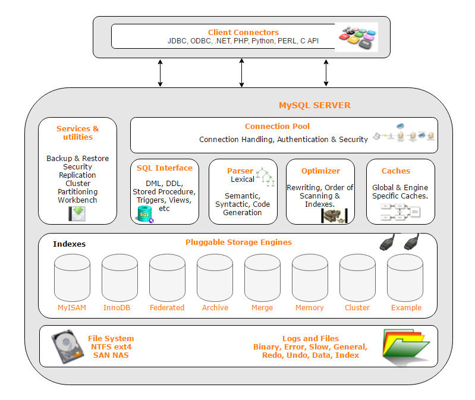

<!-- MarkdownTOC -->

- [MySQL](#mysql)
	- [Architecture](#architecture)
	- [Index](#index)
		- [Data structure](#data-structure)
			- [Balanced binary tree](#balanced-binary-tree)
			- [B Tree](#b-tree)
			- [B+ tree](#b-tree-1)
		- [InnoDB index](#innodb-index)
			- [Clustered index](#clustered-index)
				- [Def](#def)
				- [Pros and cons](#pros-and-cons)
			- [Secondary index](#secondary-index)
				- [Pros and cons](#pros-and-cons-1)
			- [Adaptive hash index](#adaptive-hash-index)
			- [Composite index](#composite-index)
			- [Covered index](#covered-index)
	- [Database transaction](#database-transaction)
		- [Concurrent transaction read problems](#concurrent-transaction-read-problems)
			- [Dirty read](#dirty-read)
			- [Non-repeatable read](#non-repeatable-read)
			- [Phantam read](#phantam-read)
		- [InnoDB isolation level](#innodb-isolation-level)
		- [Lock](#lock)
			- [How does InnoDB achieves the isolation level](#how-does-innodb-achieves-the-isolation-level)
			- [Types of lock](#types-of-lock)
				- [Shared lock](#shared-lock)
				- [Exclusive lock](#exclusive-lock)
				- [Intentional shared/exclusive lock](#intentional-sharedexclusive-lock)
				- [Interval lock](#interval-lock)
					- [Record lock](#record-lock)
					- [Gap lock](#gap-lock)
					- [Next-key lock](#next-key-lock)
	- [Query optimization](#query-optimization)
		- [Performance factors](#performance-factors)
		- [Optimize on Query level](#optimize-on-query-level)
		- [Reduce join](#reduce-join)
	- [High availability basics](#high-availability-basics)
		- [Master slave delay](#master-slave-delay)
			- [Sources](#sources)
				- [Inferior slave machines](#inferior-slave-machines)
				- [Too much load for slave](#too-much-load-for-slave)
				- [Big transactions](#big-transactions)
				- [Slow slave thread replay](#slow-slave-thread-replay)
					- [Paralelle approaches](#paralelle-approaches)
			- [How to find sync points](#how-to-find-sync-points)
				- [sql_slave_skip_counter](#sql_slave_skip_counter)
				- [slave_skip_errors](#slave_skip_errors)
				- [GTID](#gtid)
			- [Solutions for master slave delay](#solutions-for-master-slave-delay)
		- [Failover strategy](#failover-strategy)
			- [Reliability first](#reliability-first)
			- [Availability first](#availability-first)
				- [Inconsistency when binlog format = raw](#inconsistency-when-binlog-format--raw)
				- [Inconsistency when binlog format = mixed](#inconsistency-when-binlog-format--mixed)
		- [MMM \(Multi-master replication manager\)](#mmm-multi-master-replication-manager)
		- [MHA \(Master high availability\)](#mha-master-high-availability)
		- [PXC](#pxc)
		- [Group replication](#group-replication)
		- [Github/WePay MySQL high availability](#githubwepay-mysql-high-availability)
		- [Other solutions](#other-solutions)
	- [Sharding](#sharding)
		- [Choose the number of shards](#choose-the-number-of-shards)
		- [Shard routing strategy](#shard-routing-strategy)
			- [Lookup strategy](#lookup-strategy)
			- [Range strategy](#range-strategy)
				- [By customer or tenant](#by-customer-or-tenant)
				- [By geography](#by-geography)
				- [By time](#by-time)
			- [Hash strategy](#hash-strategy)
				- [By entity id](#by-entity-id)
			- [Shard a graph ???](#shard-a-graph-)
		- [Sharding preferences](#sharding-preferences)
		- [Table sharding](#table-sharding)
			- [Vertical sharding](#vertical-sharding)
			- [Horizontal sharding](#horizontal-sharding)
		- [Database sharding](#database-sharding)
			- [Limitations](#limitations)
				- [Write across shards](#write-across-shards)
				- [Query Cross shard](#query-cross-shard)
				- [Unique global key](#unique-global-key)
				- [Reshard](#reshard)
	- [Industrial practices](#industrial-practices)
		- [Basic standards](#basic-standards)
		- [Column usage standards](#column-usage-standards)
		- [Index usage standards](#index-usage-standards)
		- [SQL standards](#sql-standards)
		- [How to add an additional column](#how-to-add-an-additional-column)
- [NoSQL](#nosql)
	- [NoSQL vs SQL](#nosql-vs-sql)
	- [NoSQL flavors](#nosql-flavors)
		- [Key-value](#key-value)
		- [Document](#document)
		- [Column-Family](#column-family)
		- [Graph](#graph)
- [Future readings](#future-readings)

<!-- /MarkdownTOC -->


# MySQL

## Architecture



## Index
* Where to set up index
	* On columns not changing often
	* On columns which have high cardinality
	* Automatically increase id is a good candidate to set up B tree. 
* References: https://www.freecodecamp.org/news/database-indexing-at-a-glance-bb50809d48bd/

### Data structure
#### Balanced binary tree
* Why not balanced binary tree
	- Tree too high which results in large number of IO operations
	- Operating system load items from disk in page size (4k). 

#### B Tree
* How does B Tree solve the above problem
	- Control the height of tree. The number of children is the number of key word - 1. 
	- B tree stores data inside 


#### B+ tree 
* Pros compared with B tree
	- There is no data field inside non-leaf nodes. So have better IO capability
	- Only needs to look at leaf nodes. So have better range query capability (Does not need to move up and down in a tree


### InnoDB index
#### Clustered index
##### Def
* A clustered index is collocated with the data in the same table space or same disk file. You can consider that a clustered index is a B-Tree index whose leaf nodes are the actual data blocks on disk, since the index & data reside together. This kind of index physically organizes the data on disk as per the logical order of the index key.
* Within innoDB, the MySQL InnoDB engine actually manages the primary index as clustered index for improving performance, so the primary key & the actual record on disk are clustered together.
	- When you define a PRIMARY KEY on your table, InnoDB uses it as the clustered index. Define a primary key for each table that you create. If there is no logical unique and non-null column or set of columns, add a new auto-increment column, whose values are filled in automatically.	
	- If you do not define a PRIMARY KEY for your table, MySQL locates the first UNIQUE index where all the key columns are NOT NULL and InnoDB uses it as the clustered index.
	- If the table has no PRIMARY KEY or suitable UNIQUE index, InnoDB internally generates a hidden clustered index named GEN_CLUST_INDEX on a synthetic column containing row ID values. The rows are ordered by the ID that InnoDB assigns to the rows in such a table. The row ID is a 6-byte field that increases monotonically as new rows are inserted. Thus, the rows ordered by the row ID are physically in insertion order.

##### Pros and cons
* Pros: 
	- This ordering or co-location of related data actually makes a clustered index faster. When data is fetched from disk, the complete block containing the data is read by the system since our disk IO system writes & reads data in blocks. So in case of range queries, it’s quite possible that the collocated data is buffered in memory. This is especially true for range queries. 
- Cons: 
	- Since a clustered index impacts the physical organization of the data, there can be only one clustered index per table.

#### Secondary index
* Why secondary key does not directly point to data, instead it needs to point to primary key
	- when there are updates on primary key, it will need to modify all other secondary index if that's the case. 


##### Pros and cons
* Pros: Logically you can create as many secondary indices as you want. But in reality how many indices actually required needs a serious thought process since each index has its own penalty.
* Cons: 
	- With DML operations like DELETE / INSERT , the secondary index also needs to be updated so that the copy of the primary key column can be deleted / inserted. In such cases, the existence of lots of secondary indexes can create issues.
	- Also, if a primary key is very large like a URL, since secondary indexes contain a copy of the primary key column value, it can be inefficient in terms of storage. More secondary keys means a greater number of duplicate copies of the primary key column value, so more storage in case of a large primary key. Also the primary key itself stores the keys, so the combined effect on storage will be very high.


#### Adaptive hash index


#### Composite index
* Def: Multiple column builds a single index. MySQL lets you define indices on multiple columns, up to 16 columns. This index is called a Multi-column / Composite / Compound index.
* When you need a composite index
	- Analyze your queries first according to your use cases. If you see certain fields are appearing together in many queries, you may consider creating a composite index.
	- If you are creating an index in col1 & a composite index in (col1, col2), then only the composite index should be fine. col1 alone can be served by the composite index itself since it’s a left side prefix of the index.
	- Consider cardinality. If columns used in the composite index end up having high cardinality together, they are good candidate for the composite index.

#### Covered index
* A covering index is a special kind of composite index where all the columns specified in the query somewhere exist in the index. So the query optimizer does not need to hit the database to get the data — rather it gets the result from the index itself. 


## Database transaction
* MySQL database engine: https://dev.mysql.com/doc/refman/8.0/en/storage-engines.html
* InnoDB supports transaction

### Concurrent transaction read problems

#### Dirty read
* Def: SQL-transaction T1 modifies a row. SQL-transaction T2 then reads that row before T1 performs a COMMIT. If T1 then performs a ROLLBACK, T2 will have read a row that was never committed and that may thus be considered to have never existed.


#### Non-repeatable read
* Def: P2 ("Non-repeatable read"): SQL-transaction T1 reads a row. SQL-transaction T2 then modifies or deletes that row and performs a COMMIT. If T1 then attempts to reread the row, it may receive the modified value or discover that the row has been deleted. It only applies to UPDATE / DELETE operation. 


#### Phantam read
* Def: SQL-transaction T1 reads the set of rows N that satisfy some <search condition>. SQL-transaction T2 then executes SQL-statements that generate one or more rows that satisfy the <search condition> used by SQL-transaction T1. If SQL-transaction T1 then repeats the initial read with the same <search condition>, it obtains a different collection of rows.


### InnoDB isolation level
* Four types
	* Read uncommitted: 
		- Not solving any concurrent transaction problems.
	* Read committed: When a transaction starts, could only see the modifications by the transaction itself. 
		- Could solve dirty read problems. Not non-repeatable and phantom read problem. 
	* Repeatable read: Within a transaction, it always read the same data. 
		- Could solve non-repeatable read problems. Not phantom read problem. 
	* Serializable: 
		- Could solve all problems. 

* Default isolation level is RR
* InnoDB could avoid Phantom RR due to phantom read


### Lock
#### How does InnoDB achieves the isolation level 
* Lock based concurrency control: Have a lock on the table to block all other transactions. 
* Multi version concurrency control: Before performing a transaction, take a snapshot of the database. 

#### Types of lock
##### Shared lock
* Def: If transaction T1 holds a shared (S) lock on row r, then requests from some distinct transaction T2 for a lock on row r are handled as follows:
	- A request by T2 for an S lock can be granted immediately. As a result, both T1 and T2 hold an S lock on r.
	- A request by T2 for an X lock cannot be granted immediately.
* Operation:
	* Add lock: select * from student where id = 1 **LOCK IN SHARE MODE**
	* Release lock:  commit / rollback
* Example:

```
// an ecommerce order could contain many order_detail. One transaction needs to modify order_detail and don't want other transaction to modify order_info. 

order_detail	N
order_info		1
```

##### Exclusive lock
* Def: If a transaction T1 holds an exclusive (X) lock on row r, a request from some distinct transaction T2 for a lock of either type on r cannot be granted immediately. Instead, transaction T2 has to wait for transaction T1 to release its lock on row r.
* Operation:
	* Add lock:
		- Automatically by default: delete/update/insert will add exclusive lock
		- Add manually: select * from student where id=1 **FOR UPDATE**
	* Release lock: commit / rollback

##### Intentional shared/exclusive lock
* Goal: Improve the efficiency of adding table wise lock
* Operation: Automatically added by database

##### Interval lock


###### Record lock


###### Gap lock


###### Next-key lock


## Query optimization
### Performance factors
* Unpractical needs

```
Select count(*) from infoTable
```

* Deep paging

### Optimize on Query level
* Solution 1

```
SELECT id, subject, url FROM photo WHERE user_id = 1 LIMIT 10
SELECT COUNT(*) FROM photo_comment WHERE photo_id = ?
```

* Solution 2

```
SELECT id, subject, url FROM photo WHERE user_id = 1 LIMIT 10
SELECT photo_id, count(*) FROM photo_comment WHERE photo_id IN() GROUP BY photo_id
```

### Reduce join
* Have redundancy
* Merge in business level


#### Replication delay
* DefitionThe master-slave latency is defined as the difference between T3 and T1. 
	1. Master DB executes a transaction, writes into binlog and finishes at timestamp T1.
	2. The statement is replicated to binlog, Slave DB received it from the binlog T2.
	3. Slave DB executes the transaction and finishes at timestamp T3. 

##### Sources
* Inferior slave machines: Slave machine is insuperior to master
* Too much load for slave
	* Causes: Many analytical queries run on top of slave. 
	* Solutions:
		- Multiple slaves
		- Output telemetry to external statistical systems such as Hadoop through binlog 
* Big transactions
	* If a transaction needs to run for as long as 10 minutes on the master database, then it must wait for the transaction to finish before running it on slave. Slave will be behind master for 10 minutes. 
		- e.g. Use del to delete too many records within DB
		- e.g. mySQL DDL within big tables. 
* Slow slave thread replay


#### Replication categories
* Synchronous replication: 
* Asynchronous replication: 
* Semi-Synchronous replication: 

##### Paralelle approaches
* DB based parallel
* Table/Row based parallel
* History
	- MySQL 5.5
	- MySQL 5.6
	- MySQL 5.7
	- MySQL 5.7.22


#### How to find sync points
* sql_slave_skip_counter
* slave_skip_errors
* GTID

#### Solutions for master slave delay
* Solution1: After write to master, write to cache as well. 
	- What if write to cache fails
		+ If read from master, slave useless
		+ If read from slave, still replication delay
* Solution2: If cannot read from slave, then read from master. 
	+ It works for DB add operation
	+ It doesn't work for DB update operation
* Solution3: If master and slave are located within the same location, synchronous replication
* Solution4: Shard the data

### Failover strategy
#### Reliability first
* After step 2 and before step4 below, both master and slave will be in readonly state. 

```
                  │     │         ┌──────────────────────┐                          
                  │     │         │Step5. Switch traffic │                          
                  │     │         │     from A to B      │                          
                  │     │         └──────────────────────┘                          
                 Requests                                                           
                  │     │                                                           
                  │     │                                                           
                  │     │                                                           
                  ▼     ▼                                                           
                                                                                    
┌────────────────────────────┐                         ┌───────────────────────────┐
│          Master A          │                         │         Master B          │
│ ┌───────────────────────┐  │                         │ ┌───────────────────────┐ │
│ │step2. Change master to│  │                         │ │step1. check           │ │
│ │readonly state         │  │                         │ │seconds_behind_master  │ │
│ └───────────────────────┘  │                         │ │until it is smaller    │ │
│                            │                         │ │than 5 seconds         │ │
│                            │                         │ └───────────────────────┘ │
│                            │                         │ ┌───────────────────────┐ │
│                            │                         │ │step3. wait until      │ │
│                            │                         │ │seconds_behind_master  │ │
│                            │                         │ │to become 0            │ │
└────────────────────────────┘                         │ │                       │ │
                                                       │ └───────────────────────┘ │
                                                       │ ┌───────────────────────┐ │
                                                       │ │step4. change to       │ │
                                                       │ │read/write state       │ │
                                                       │ │instead of readonly    │ │
                                                       │ │                       │ │
                                                       │ └───────────────────────┘ │
                                                       │                           │
                                                       │                           │
                                                       └───────────────────────────┘
```

##### Availability first
* It may result in data inconsistency. Using row format binlog will makes identify data inconsistency problems much easier than mixed or statement based binlog. 

```
                  │     │         ┌──────────────────────┐                          
                  │     │         │Step3. Switch traffic │                          
                  │     │         │     from A to B      │                          
                  │     │         └──────────────────────┘                          
                 Requests                                                           
                  │     │                                                           
                  │     │                                                           
                  │     │                                                           
                  ▼     ▼                                                           
                                                                                    
┌────────────────────────────┐                         ┌───────────────────────────┐
│          Master A          │                         │         Master B          │
│ ┌───────────────────────┐  │                         │                           │
│ │step2. Change master to│  │                         │ ┌───────────────────────┐ │
│ │readonly state         │  │                         │ │step1. change to       │ │
│ └───────────────────────┘  │                         │ │read/write state       │ │
│                            │                         │ │instead of readonly    │ │
│                            │                         │ │                       │ │
│                            │                         │ └───────────────────────┘ │
│                            │                         │                           │
│                            │                         │                           │
│                            │                         │                           │
└────────────────────────────┘                         └───────────────────────────┘
```

##### Inconsistency when binlog format = raw
* [TODO]: understand deeper


##### Inconsistency when binlog format = mixed


### MMM (Multi-master replication manager)
* [MMM](https://mysql-mmm.org/downloads.html) is a set of scripts written in perl providing the following capabilities:
	- Load balancing among read slaves
	- Master failover
	- Monitor mySQL states
* Pros:
	- Easy config
* Cons:
	- Not suitable for scenarios having high requirements on data consistency
* Deployment: Although dual master, only allows writing to a single master at a time.
	- mmm_mond: Coordinator scripts. Run on top of a monitoring machine
		+ Create a set of virtual IPs. One write IP binds to the master and multiple read IPs bind to slave. 
		+ When a mySQL is down, it will migrate the VIP to another mySQL machine. 
	- mmm_agentd: Run on the same machine as the mysql server
	- mmm_control: Provides administrative commands for mmm_mond

### MHA (Master high availability)
* [MHA](https://github.com/yoshinorim/mha4mysql-manager/wiki/Architecture)
	- Fast failover: Complete the failover within 0-30 seconds
	- Max effort consistency: When a master goes down, it will try to save binlog in the failed master. It uses this way to keep the maximum data consistency. However, this isn't reliable way. For example, some hardware failures may result in failure of saving binlogs. 
	- Compared with MMM, 
		+ Supports devops work like health check, suspend nodes
		+ Supports semi-synchronous, GTID 
* Deployment: 
	- MHA manager could be deployed in a separate machine for managing several master-slave clusters. It could also be deployed on a single slave. 
	- MHA node runs on each mysql server. 
* Cons:
	- Needs at minimum 3 machines
	- Brain split
	- Not suitable for scenarios having high requirements on data consistency


### PXC 


### Group replication


### Github/WePay MySQL high availability
* [Used at Wepay](https://wecode.wepay.com/posts/highly-available-mysql-clusters-at-wepay)
* [Used at Github](
https://github.blog/2018-06-20-mysql-high-availability-at-github/)


* Master discovery series
1. DNS http://code.openark.org/blog/mysql/mysql-master-discovery-methods-part-1-dns
2. VPN and DNS
http://code.openark.org/blog/mysql/mysql-master-discovery-methods-part-2-vip-dns
3. app and service discovery
http://code.openark.org/blog/mysql/mysql-master-discovery-methods-part-3-app-service-discovery
4. Proxy heuristics
http://code.openark.org/blog/mysql/mysql-master-discovery-methods-part-4-proxy-heuristics
5. Service discovery and Proxy
http://code.openark.org/blog/mysql/mysql-master-discovery-methods-part-5-service-discovery-proxy
6. http://code.openark.org/blog/mysql/mysql-master-discovery-methods-part-6-other-methods

### Other solutions
* MySQL cluster
* Shared storage such as Amazon Aurora

## Sharding
### Choose the number of shards
* If has a cap on storage:
	- Each shard could contain at most 1TB data.
	- number of shards = total storage / 1TB
* If has a cap on number of records:
	- Suppose the size of row is 100 bytes
		- User table: uid (long 8 bytes), name (fixed char 16 bytes), city (int 4 bytes), timestamp (long 8 bytes), sex (int 4 bytes), age (int 4 bytes) = total 40 bytes
	- Total size of the rows: 100 bytes * Number_of_records
	- number of shards = total size of rows / 1TB

### Shard routing strategy
#### Lookup strategy
* Pros:
	- Easy to migrate data
* Cons: 
	- Need an additional hop when query
	- If the lookup table is really big, it could also need to be sharded


#### Range strategy
* Pros:
	- Easy to add a new shard. No need to move the original data. For example, each month could have a new shard.
* Cons:
	- Uneven distribution. For example, July is the hot season but December is the cold season. 


##### By customer or tenant
* If it is a SaaS business, it is often true that data from one customer doesn't interact with data from any of your other customers. These apps are usually called multi-tenant apps. 
	- Multi-tenant apps usually require strong consistency where transaction is in place and data loss is not possible. 
	- Multi-tenant data usually evolves over time to provide more and more functionality. Unlike consumer apps which benefit from network effects to grow, B2B applications grows by adding new features for customers. 

##### By geography
* Apps such as postmate, lyft or instacart.
* You’re not going to live in Alabama and order grocery delivery from California. And if you were to order a Lyft pick-up from California to Alabama you’ll be waiting a good little while for your pickup.

##### By time
* Time sharding is incredibly common when looking at some form of event data. Event data may include clicks/impressions of ads, it could be network event data, or data from a systems monitoring perspective.
* This approach should be used when
	- You generate your reporting/alerts by doing analysis on the data with time as one axis.
	- You’re regularly rolling off data so that you have a limited retention of it.

#### Hash strategy


##### By entity id
* Shard based on hashing value of a field. 
* Pros:
	- Evenly distributed data
* Cons:
	- Hard to add a new shard. Lots of data migration need to happen. 

#### Shard a graph ???
* Graph model is most common in B2C apps like Facebook and Instagram. 
* With this model, data is often replicated in a few different forms. Then it is the responsibility of the application to map to the form that is most useful to acquire the data. The result is you have multiple copies for your data sharded in different ways, eventual consistency of data typically, and then have some application logic you have to map to your sharding strategy. For apps like Facebook and Reddit there is little choice but to take this approach, but it does come at some price.

### Sharding preferences
* We could classify the layout within database into the following categories:
	- Single database single table
	- Single database multiple table
	- Multiple database multiple table
* The preference order is as follows:
	1. Single database single table
	2. Single database multiple table
		* Table vertical sharding: If within a single table, some fields have a different usage pattern and consume large amount of space
			- Take user profile as an example (name, age, sex, nickname, description). Nickname and description are usually only used in display instead of query and description is really long. They could be put into a different table.  
		* Table horizontal sharding: If data volume is big, could consider table horizontal sharding single database multiple table. 
			- Could use 50M rows as the standard size for a single table. 
			- The MyISAM storage engine supports 2^32 rows per table.The InnoDB storage engine doesn't seem to have a limit on the number of rows, but it has a limit on table size of 64 terabytes. How many rows fits into this depends on the size of each row.
	4. If concurrent volume is high, then could consider using multiple database multiple table. 
		- For example, test MySQL 5.7 on a 4 Core 8 GB cloud server
			- Write performance: 500 TPS 
			- Also note down here the read performance for reference: 10000 QPS

### Table sharding
* Use case: Single table too big: There are too many lines in a single table. Each query scans too many rows and the efficiency is really low.

#### Vertical sharding
* Operations:
	+ Put different **fields of a table** into different tables
	+ Segmented tables usually share the primary key for correlating data


#### Horizontal sharding
* Operations:
	+ Based on certain fields, put **rows of a table** into different tables. 


### Database sharding
* Use case:
	* Disk IO: There are too many hot data to fit into database memory. Each time a query is executed, there are a lot of IO operations being generated which reduce performance. 
	* Network IO: Too many concurrent requests. 


#### Limitations
##### Write across shards
* Original transaction needs to be conducted within a distributed transaction.
	- e.g. ecommerce example (order table and inventory table)
* There are wwo ways in general to implement distributed transactions:
	- 2PC 
	- TCC
* For example, some software has built-in implementations such as:
	- MySQL XA
	- Spring JTA

##### Query Cross shard
* Query types:
	- Join queries: 
	- count queries:
	- order by queries:

* Solutions:
	* Aggregate query result for different shard within application code.
	* Usually use two sets of data to solve the problem
		- One data is based on unique sharding key.
		- The other one is data replicated asynchronously to Elasticsearch or Solr.

##### Unique global key
* Please see [this](https://github.com/DreamOfTheRedChamber/system-design/blob/master/uniqueIDGenerator.md) for details

##### Reshard
* Use 2's multiply number as table's number or database's number.

## Industrial practices
### Basic standards
* A table must has primary key, recommend to use int as primary key.
	- int: 4 byte / long: 8 byte
	- UUID vs int: 32 byte 
* Don't use physical foreign key, use logical foreign key only. 
* Consider the amount of data in a table, if the number of rows < 1000W, use single table. 
* For big-field, low frequent column, would better put them in a separate table. 
* For each db, control the number of tables < 1024.

### Column usage standards
* Differentiate between tinyint, int, bigint.
* Use varchar(20) to store phone number.
* Use INT to store IPv4, not use char(15) because it will be easier.
* For all fields, would better set as Not NULL and set default value.

### Index usage standards
* Use uniq_* to name unique index.
* Use non idx_* to name non unique index.
* Don't use JOIN if possible. The columns being JOIN would better be off the same data type. 
* Limit the number of index within a table under five. 
* Limit the data field in composite index under five. Use left prefix principle to avoid rebuild index. 

### SQL standards
* Forbid to use select * 
* Forbid to use insert into T values(), must specify the column name
* Implicit type convert will not hit index
* Forbid to use function inside where clause. It wil not hit index
* Forbid to use negative matching (e.g. where x != 10) and % fuzzy matching. It will not hit index
* Avoid to directly return a large data set, use limit and avoid too big offset value
* Put big data query inside mirror database
* Change OR to IN' 

### How to add an additional column
* Alter table add column, not recommended under big data
* Preallocate data field
* Add a new table and migrate the original table
* Put inside extInfo
* Use key-value store

# NoSQL 
## NoSQL vs SQL 
* There is no generally accepted definition. All we can do is discuss some common characteristics of the databases that tend to be called "NoSQL".

|       Database        |        SQL    |     NoSQL    |  
| --------------------- |:-------------:| ------------:| 
|     Data uniformity  | Uniform data. Best visualized as a set of tables. Each table has rows, with each row representing an entity of interest. Each row is described through columns. One row cannot be nested inside another. | Non-uniform data. NoSQL databases recognize that often, it is common to operate on data in units that have a more complex structure than a set of rows. This is particularly useful in dealing with nonuniform data and custom fields. NoSQL data model can be put into four categories: key-value, document, column-family and graph. |
|     Schema change     | Define what table exists, what column exists, what data types are. Although actually relational schemas can be changed at any time with standard SQL commands, it is of high cost. | Changing schema is casual and of low cost. Essentially, a schemaless database shifts the schema into the application code. |
|    Query flexibility  | Low cost on changing query. It allows you to easily look at the data in different ways. Standard SQL supports things like joins and subqueries. | High cost in changing query. It does not allow you to easily look at the data in different ways. NoSQL databases do not have the flexibility of joins or subqueries. |
|    Transactions       | SQL has ACID transactions (Atomic, Consistent, Isolated, and Durable). It allows you to manipulate any combination of rows from any tables in a single transaction. This operation either succeeds or fails entirely, and concurrent operations are isolated from each other so they cannot see a partial update. | Graph database supports ACID transactions. Aggregate-oriented databases do not have ACID transactions that span multiple aggregates. Instead, they support atomic manipulation of a single aggregate at a time. If we need to manipulate multiple aggregates in an atomic way, we have to manage that ourselves in application code. An aggregate structure may help with some data interactions but be an obstacle for others.  |
|    Consistency        | Strong consistency  |  Trade consistency for availability or partition tolerance. Eventual consistency |
|    Scalability      | relational database use ACID transactions to handle consistency across the whole database. This inherently clashes with a cluster environment |  Aggregate structure helps greatly with running on a cluster. It we are running on a cluster, we need to minize how many nodes we need to query when we are gathering data. By using aggregates, we give the database important information about which bits of data (an aggregate) will be manipulated together, and thus should live on the same node. | 
|    Performance        | MySQL/PosgreSQL ~ 1k QPS  |  MongoDB/Cassandra ~ 10k QPS. Redis/Memcached ~ 100k ~ 1M QPS |
|    Maturity           | Over 20 years. Integrate naturally with most web frameworks. For example, Active Record inside Ruby on Rails | Usually less than 10 years. Not great support for serialization and secondary index |

* Scenarios where MySQL does not work so well [Pinterest experience](https://medium.com/pinterest-engineering/learn-to-stop-using-shiny-new-things-and-love-mysql-3e1613c2ce14)
	- Cartesian Distance: If you need to search for nearby points in two dimensions, storing coordinates as Geohashes in MySQL would work well (here’s an XKCD comic to help). Three dimensions would probably also work well. But if you need large N-dimensional search spaces, I don’t know of a good way to store and retrieve them in MySQL efficiently. You might find yourself needing to store N-dimensional points if, for instance, you have created a model that produces feature vectors for some input and you want to see if two inputs are similar. Classic examples include determining if two images are similar but not exactly the same. For these sorts of situations, consider building a distributed RP/KD tree (would love to collaborate! Email me!).
	- Speed of writes: MySQL delivers full write consistency. If you’re willing to trade off “full” for “eventual” consistency, your writes can be much faster. HBase, Cassandra and other similar technologies write to an update log incredibly fast, at the expense of making reads slower (reads must now read the stored info and walk the update log). This is a nice inversion, because it’s easier to cache reads and make them fast.
	- FIFOs, such as feeds: My biggest complaint about MySQL is that it’s still living in 1994 (with baggy pants and the.. erk.. Macarena). Many uses of databases back then needed relational queries. There were no social networks. MySpace wouldn’t come around for another nine years! And so MySQL is built out of trees and has no good notion of queues. To insert into a B-tree is an O(lg(N)) operation (assuming happy balance). But today, social networks are a major force on the internet, and they depend heavily on queues. We want uber fast O(1) enqueuing! My suggestion is to not use MySQL for feeds. It’s too much overhead. Instead, consider Redis, especially if you’re still a small team. Redis is super fast and has lists with fast insertion and retrieval. If you’re a larger company and can hire the folks to maintain it, consider HBase. It’s working well for our feeds.
	- Logs: For the love of everything holy, don’t store logs in MySQL. As mentioned in the previous paragraph, MySQL stores things in trees. Logs should not live in trees (that’s a weird thing to say…). Send your logs to Kafka, then use Secor to read from Kafka and ship up to S3. Then go nuts with EMR, Qubole or your map-reduce platform du jour.
	- Scale beyond one box: If you’re in this position and you’ve optimized all queries (no joins, foreign keys, distinct, etc.), and you’re now considering using read slaves, you need to scale to beyond one MySQL server. MySQL won’t do this for you out of the box, but it’s not hard. And we have a solution, which you’ll be able to read about and learn how we did this once I finish writing the blog post

## NoSQL flavors  

### Key-value 
* Suitable use cases 
	- **Storing session information**: Generally, every web session is unique and is assigned a unique sessionid value. Applications that store the sessionid on disk or in a RDBMS will greatly benefit from moving to a key-value store, since everything about the session can be stored by a single PUT request or retrieved using GET. This single-request operation makes it very fast, as everything about the session is stored in a single object. Solutions such as Memcached are used by many web applications, and Riak can be used when availability is important
	- **User profiles, Preferences**: Almost every user has a unique userId, username, or some other attributes, as well as preferences such as language, color, timezone, which products the user has access to, and so on. This can all be put into an object, so getting preferences of a user takes a single GET operation. Similarly, product profiles can be stored. 
	- **Shopping Cart Data**: E-commerce websites have shopping carts tied to the user. As we want the shopping carts to be available all the time, across browsers, machines, and sessions, all the shopping information can be put into value where the key is the userid. A riak cluster would be best suited for these kinds of applications. 

* When not to use 
	* **Relationships among Data**: If you need to have relationships between different sets of data, or correlate teh data between different sets of key, key-value stores are not the best solution to use, even though some key-value stores provide link-walking features. 
	* **Multioperation transactions**: If you're saving multiple keys and there is a failure to save any of them, and you want to revert or roll back the rest of the operations, key-value stores are not the best solution to be used.
	* **Query by data**: If you need to search the keys based on something found in the value part of the key-value pairs, then key-value stores are not going to perform well for you. This is no way to inspect the value on the database side, with the exception of some products like Riak Search or indexing engines like Lucene. 
	* **Operations by sets**: Since operations are limited to one key at a time, there is no way to operate upon multiple keys at the same time. If you need to operate upon multiple keys, you have to handle this from the client side. 

### Document 
* Suitable use cases 
	- **Event logging**: Applications have different event logging needs; within the enterprise, there are many different applications that want to log events. Document databases can store all these different types of events and can act as a central data store for event storage. This is especially true when the type of data being captured by the events keeps changing. Events can be sharded by the name of the application where the event originated or by the type of event such as order_processed or customer_logged. 
	- **Content Management Systems, Blogging Platforms**: Since document databases have no predefined schemas and usually uderstand JSON documents, they work well in content management systems or applications for publishing websites, managing user comments, user registrations, profiles, web-facing documents. 
	- **Web Analytics or Real-Time Analytics**: Document databases can store data for real-time analytics; since parts of the document can be updated, it's very easy to store page views or unique visitors, and new metrics can be easily added without schema changes. 
	- **E-Commerce Applications**: E-commerce applications often need to have flexible schema for products and orders, as well as the ability to evolve their data models without expensive database refactoring or data migration. 

* When not to use 
	- **Complex Transactions Spanning Different Operations**: If you need to have atomic cross-document operations, then document databases may not be for you. However, there are some document databases that do support these kinds of operations, such as RavenDB. 
	- **Queries against Varying Aggregate Structure**: Flexible schema means that the database does not enforce any restrictions on the schema. Data is saved in the form of application entities. If you need to query these entities ad hoc, your queries will be changing (in RDBMS terms, this would mean that as you join criteria between tables, the tables to join keep changing). Since the data is saved as an aggregate, if the design of the aggregate is constantly changing, you need to save the aggregates at the lowest level of granularity-basically, you need to normalize the data. In this scenario, document databases may not work. 

### Column-Family 
* Suitable use cases 
	- **Event Logging**: Column-family databases with their ability to store any data structures are a great choice to store event information, such as application state or errors encountered by the application. Within the enterprise, all applications can write their events to Cassandra with their own columns and the row key of the form appname:timestamp. Since we can scale writes, Cassandra would work ideally for an event logging system. 
	- **Content Management Systems, Blogging Platforms**: Using column-families, you can store blog entries with tags, categories, links, and trackbacks in different columns. Comments can be either stored in the same row or moved to a different keyspace; similarly, blog users and the actual blogs can be put into different column families. 
	- **Counters**: Often, in web applications you need to count and categorize visitors of a page to calculate analytics, you can use the CounterColumnType during creation of a column family. 
	- **Expiring usage**: You may provide demo to users, or may want to show ad banners on a website for a specific time. You can do this by using expiring columns: Cassandra allows you to have columns which, after a given time, are deleted automatically. This time is known as TTL and is defined in seconds. The column is deleted after the TTL has elapsed; when the column does not exist, the access can be revoked or the banner can be removed.

```sql
CREATE COLUMN FAMILY visit_counter
WITH default_validation_class=CounterColumnType
AND key_validation_class=UTF8Type AND comparator=UTF8Type

// Once a column family is created, you can have arbitrary columns for each page visited within the web application for every user. 
INCR visit_counter['mfowler'][home] BY 1;
INCR visit_counter['mfowler'][products] BY 1;
INCR visit_counter['mfowler'][contactus] BY 1;

// expiring columns
SET Customer['mfowler']['demo_access'] = 'allowed' WITH ttl=2592000;
```

* When not to use 
	- **ACID transactions for writes and reads**
	- **Database to aggregate the data using queries (such as SUM or AVG)**: you have to do this on the client side using data retrieved by the client from all the rows. 
	- **Early prototypes or initial tech spikes**: During the early stages, we are not sure how the query patterns may change, and as the query patterns change, we have to change the column family design. This causes friction for the product innovation team and slows down developer productivity. RDBMS impose high cost on schema change, which is traded off for a low cost of query change; in Cassandra, the cost may be higher for query change as compared to schema change. 

### Graph 
* Suitable use cases 
	- **Connected data**: 
		+ Social networks are where graph databases can be deployed and used very effectively. These social graphs don't have to be only of the friend kind; for example, they can represent employees, their knowledge, and where they worked with other employees on different projects. Any link-rich domain is well-suited for graph databases. 
	    + If you have relationships between domain entities from different domains (such as social, spatial, commerce) in a single database, you can make these relationships more valuable by providing the ability to traverse across domains. 
	- **Routing, Dispatch, and Location-Based Services**: Every location or address that has a delivery is node, and all the nodes where the delivery has to be made by the delivery person can be modeled as a graph nodes. Relationships between nodes can have the property of distance, thus allowing you to deliver the goods in an efficient manner. Distance and location properties can also be used in graphs of places of interest, so that your application can provide recommendations of good restaurants or entertainment options nearby. You can also create nodes for your points of sales, such as bookstores or restaurants, and notify the users when they are close to any of the nodes to provide location-based services. 
	- **Recommendation Engines**: 
	    + As nodes and relationships are created in the system, they can be used to make recommendations like "your friends also bought this product" or "when invoicing this item, these other items are usually invoiced." Or, it can be used to make recommendations to travelers mentioning that when other visitors come to Barcelona they usually visit Antonio Gaudi's creations. 
	    + An interesting side effect of using the graph databases for recommendations is that as the data size grows, the number of nodes and relationships available to make the recommendations quickly increases. The same data can also be used to mine information-for example, which products are always bought together, or which items are always invoiced together; alerts can be raised when these conditions are not met. Like other recommendation engines, graph databases can be used to search for patterns in relationships to detect fraud in transactions. 

* When not to use 
	- When you want to update all or a subset of entities - for example, in an analytics solution where all entities may need to be updated with a changed property - graph databases may not be optimal since changing a peroperty on all the nodes is not a straight-forward operation. Even if the data model works for the problem domain, some databases may be unable to handle lots of data, especially in global graph operations. 

# Future readings
* MySQL DDL as big transaction
* Sharding Proxy - 百度DB Proxy ??? 
