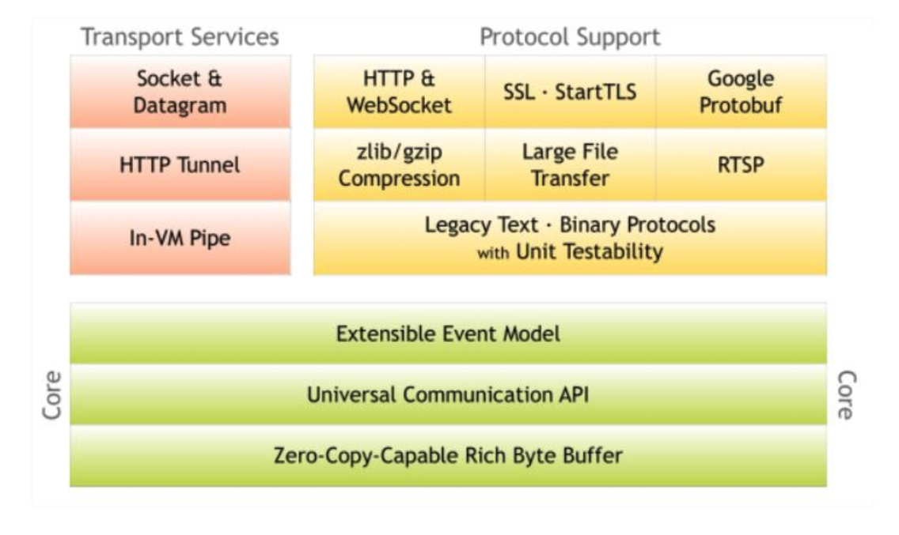
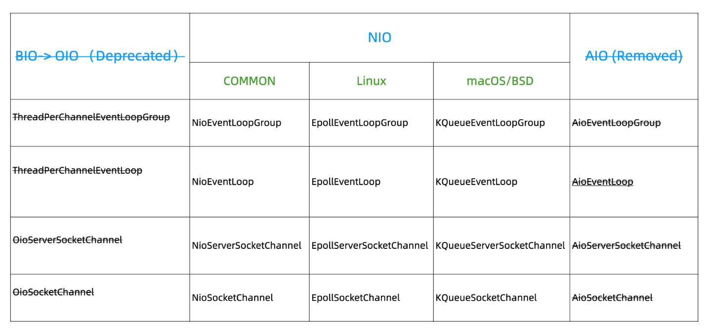
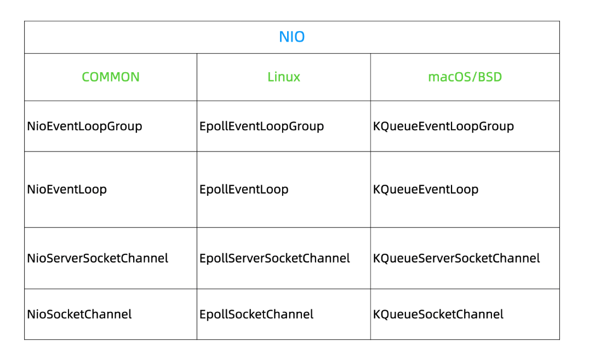
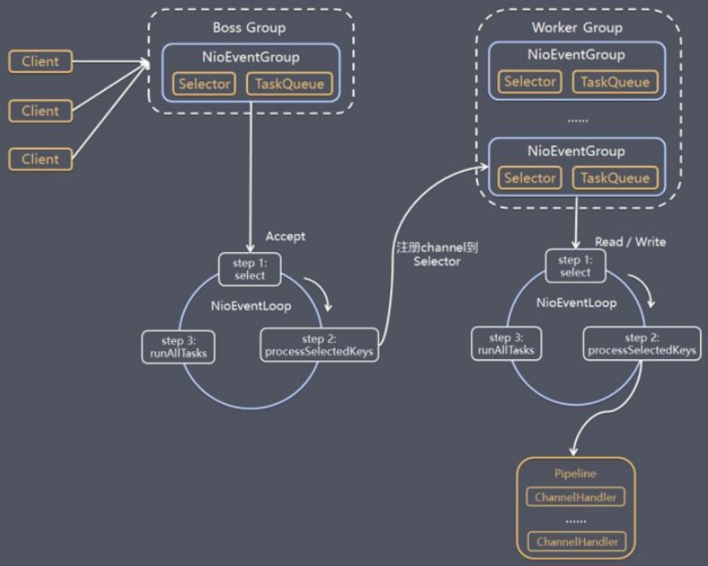
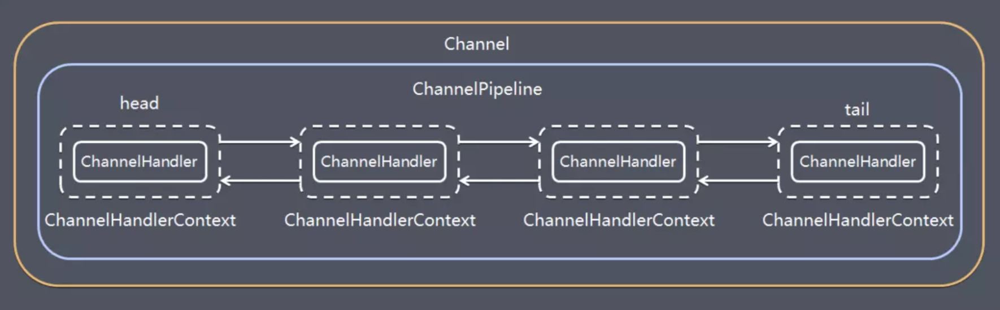
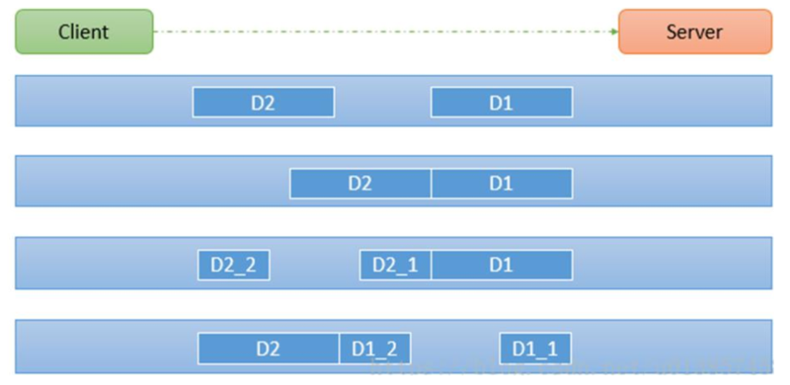

<!-- MarkdownTOC -->

- [Netty](#netty)
	- [Architecture](#architecture)
	- [Use cases](#use-cases)
	- [IO concepts](#io-concepts)
		- [Synchronous vs asynchronous](#synchronous-vs-asynchronous)
		- [Blocking vs non-blocking](#blocking-vs-non-blocking)
		- [Synchronous blocking](#synchronous-blocking)
		- [Synchronous nonblocking](#synchronous-nonblocking)
		- [Asynchronous blocking](#asynchronous-blocking)
		- [Asynchronous nonblocking](#asynchronous-nonblocking)
	- [IO modes](#io-modes)
		- [BIO \(Synchronous blocking mode\)](#bio-synchronous-blocking-mode)
		- [AIO \(Asynchronous nonblocking mode\)](#aio-asynchronous-nonblocking-mode)
		- [NIO \(Synchronous nonblocking mode\)](#nio-synchronous-nonblocking-mode)
			- [Concepts](#concepts)
				- [Buffer](#buffer)
				- [Channel](#channel)
				- [Selector](#selector)
			- [Implementation](#implementation)
				- [Reactor single thread model](#reactor-single-thread-model)
				- [Reactor multi thread model](#reactor-multi-thread-model)
- [Netty](#netty-1)
	- [Why Netty instead of NIO](#why-netty-instead-of-nio)
	- [Netty's supports for IO modes](#nettys-supports-for-io-modes)
	- [Netty's NIO implementation](#nettys-nio-implementation)
	- [How Netty support three Reactor models](#how-netty-support-three-reactor-models)
	- [Netty thread model](#netty-thread-model)
	- [Encoding](#encoding)
	- [TCP 拆包粘包](#tcp-%E6%8B%86%E5%8C%85%E7%B2%98%E5%8C%85)
	- [Heartbeat mechanism](#heartbeat-mechanism)
	- [Zero copy](#zero-copy)
	- [Memory](#memory)
		- [Direct memory](#direct-memory)
	- [Serialization](#serialization)
		- [Marshalling](#marshalling)
		- [Protobuf](#protobuf)
	- [Protocol](#protocol)
		- [自定义协议栈 protocol](#%E8%87%AA%E5%AE%9A%E4%B9%89%E5%8D%8F%E8%AE%AE%E6%A0%88-protocol)
		- [Netty HTTP protocol](#netty-http-protocol)
			- [Netty Http application on RxNetty Http](#netty-http-application-on-rxnetty-http)
	- [实战项目](#%E5%AE%9E%E6%88%98%E9%A1%B9%E7%9B%AE)
		- [Idle detection](#idle-detection)
		- [Chat room](#chat-room)
		- [数据可靠性通信场景与架构设计](#%E6%95%B0%E6%8D%AE%E5%8F%AF%E9%9D%A0%E6%80%A7%E9%80%9A%E4%BF%A1%E5%9C%BA%E6%99%AF%E4%B8%8E%E6%9E%B6%E6%9E%84%E8%AE%BE%E8%AE%A1)
			- [数据结构](#%E6%95%B0%E6%8D%AE%E7%BB%93%E6%9E%84)
			- [Server端架构](#server%E7%AB%AF%E6%9E%B6%E6%9E%84)
			- [Client端架构](#client%E7%AB%AF%E6%9E%B6%E6%9E%84)
			- [Netty 负载均衡与高可用](#netty-%E8%B4%9F%E8%BD%BD%E5%9D%87%E8%A1%A1%E4%B8%8E%E9%AB%98%E5%8F%AF%E7%94%A8)
			- [Netty 异步化数据处理](#netty-%E5%BC%82%E6%AD%A5%E5%8C%96%E6%95%B0%E6%8D%AE%E5%A4%84%E7%90%86)
			- [Netty linux性能调优](#netty-linux%E6%80%A7%E8%83%BD%E8%B0%83%E4%BC%98)
		- [RPC communication](#rpc-communication)
			- [Application in Dubbo](#application-in-dubbo)
		- [WebSocket](#websocket)
		- [Heartbeat mechanism](#heartbeat-mechanism-1)
		- [弹幕系统](#%E5%BC%B9%E5%B9%95%E7%B3%BB%E7%BB%9F)
	- [Toy project](#toy-project)
	- [Netty source code](#netty-source-code)

<!-- /MarkdownTOC -->


# Netty
## Architecture



## Use cases
* Netty related projects: https://netty.io/wiki/related-projects.html
	* Distributed system: Dubbo/RocketMQ
	* Game industry: 
	* Hadoop and Avro RPS

## IO concepts
### Synchronous vs asynchronous
* After IO calling thread invokes IO execution thread, whether IO calling thread could continue executing unrelevant logic related to IO execution thread
	- If could continue executing unrelevant logic, then asynchronous
	- If could't continue executing unrelevant logic, then synchronous

### Blocking vs non-blocking
* After IO calling thread invokes IO execution thread, whether the IO calling thread gets proactively waiting or passively waiting. 
	- If proactively waiting (e.g. use a while block to constantly check, thus consuming CPU cycle), then it is blocking
	- If reactively waiting (e.g. Register an event and fall into sleep)

### Synchronous blocking

```
┌ ─ ─ ─ ─ ─ ─ ─ ─ ─ ┐                               ┌ ─ ─ ─ ─ ─ ─ ─ ─ ─ ─ ─ ─ ─ ─ ─ ─ ─ ─ ─ ─ ┐
     User Space                                                    Kernel Space                
│                   │                               │                                         │
  ┌──────────────┐                                     ┌─────────┐                ┌─────────┐  
│ │IO thread (one│  │                               │  │ System  │                │ Network │ │
  │   for both   │                                     │ kernel  │                │  card   │  
│ │ calling and  │  │                               │  │         │                │ buffer  │ │
  │  execution)  │                                     └─────────┘                └─────────┘  
│ └──────────────┘  │                               │       │                          │      │
          │                                                                                    
│         │         │                               │       │                          │      │
          │                   Step1.a. System                                                  
│         ├─────────┼────────call to instruct ──────┼───────▶                          │      │
          │                     the kernel                                                     
│         │         │                               │       │         Step2.           │      │
   Step1.b. Thread                                          ────────Read data ─────────▶       
│ actively checking │                               │       │        request           │      │
 whether user buffer                                                                           
│     is ready      │                               │       │                          │      │
          │                                                                                    
│         ▼         │                               │       │                          │      │
     ┌─────────┐                                       ┌─────────┐                             
│    │  User   │    │      Step4. Copy data         │  │ Kernel  │       Step3. Copy   │      │
     │ buffer  │◀────────────to user space ────────────│  space  │◀────────data to ────        
│    └─────────┘    │           buffer              │  └────┬────┘      system kernel  │      │
          │                                                                                    
│         │         │                               │       │                          │      │
       Step5.                                                                                  
│     Continue      │                               │       │                          │      │
     execution                                                                                 
│         │         │                               │       │                          │      │
          │                                                                                    
│         │         │                               │       │                          │      │
          ▼                                                                                    
│                   │                               │                                         │
 ─ ─ ─ ─ ─ ─ ─ ─ ─ ─                                 ─ ─ ─ ─ ─ ─ ─ ─ ─ ─ ─ ─ ─ ─ ─ ─ ─ ─ ─ ─ ─                                                                                                                                             
```

### Synchronous nonblocking

```
┌ ─ ─ ─ ─ ─ ─ ─ ─ ─ ┐                               ┌ ─ ─ ─ ─ ─ ─ ─ ─ ─ ─ ─ ─ ─ ─ ─ ─ ─ ─ ─ ─ ┐
     User Space                                                    Kernel Space                
│                   │                               │                                         │
  ┌──────────────┐                                     ┌─────────┐                ┌─────────┐  
│ │IO thread (one│  │                               │  │ System  │                │ Network │ │
  │   for both   │                                     │ kernel  │                │  card   │  
│ │ calling and  │  │                               │  │         │                │ buffer  │ │
  │  execution)  │                                     └─────────┘                └─────────┘  
│ └──────────────┘  │                               │       │                          │      │
          │                                                                                    
│         │         │                               │       │                          │      │
          │                   Step1.a. System                                                  
│         ├─────────┼────────call to instruct ──────┼───────▶                          │      │
          │                     the kernel                                                     
│         │         │                               │       │         Step2.           │      │
   Step1.b. Thread                                          ────────Read data ─────────▶       
│ actively checking │                               │       │        request           │      │
 whether user buffer                                                                           
│     is ready      │                               │       │                          │      │
          │                                                                                    
│         ▼         │                               │       │                          │      │
     ┌─────────┐                                       ┌─────────┐                             
│    │  User   │    │      Step4. Copy data         │  │ Kernel  │       Step3. Copy   │      │
     │ buffer  │◀────────────to user space ────────────│  space  │◀────────data to ────        
│    └─────────┘    │           buffer              │  └────┬────┘      system kernel  │      │
          │                                                                                    
│         │         │                               │       │                          │      │
       Step5.                                                                                  
│     Continue      │                               │       │                          │      │
     execution                                                                                 
│         │         │                               │       │                          │      │
          │                                                                                    
│         │         │                               │       │                          │      │
          ▼                                                                                    
│                   │                               │                                         │
 ─ ─ ─ ─ ─ ─ ─ ─ ─ ─                                 ─ ─ ─ ─ ─ ─ ─ ─ ─ ─ ─ ─ ─ ─ ─ ─ ─ ─ ─ ─ ─ 
```

### Asynchronous blocking
* This does not make sense. 

```
// Not needed. It could regress to synchronous blocking because only one thread is needed for this case.
┌ ─ ─ ─ ─ ─ ─ ─ ─ ─ ─ ─ ─ ─ ─ ─ ─ ─ ─ ─ ┐                   ┌ ─ ─ ─ ─ ─ ─ ─ ─ ─ ─ ─ ─ ─ ─ ─ ─ ─ ─ ─ ─ ┐
               User Space                                                  Kernel Space                
│                                       │                   │                                         │
  ┌─────────┐              ┌─────────┐                           ┌─────────┐              ┌─────────┐  
│ │   IO    │              │   IO    │  │                   │    │ System  │              │ Network │ │
  │ calling │              │execution│                           │ kernel  │              │  card   │  
│ │ thread  │              │ thread  │  │                   │    │         │              │ buffer  │ │
  └─────────┘              └─────────┘                           └─────────┘              └─────────┘  
│      │                        │       │                   │         │                        │      │
       │         Step1.a                                                                               
│      │         Invoke         │       │                   │         │                        │      │
       ├────────execution ──────▶                                                                      
│      │         thread         │       │                   │         │                        │      │
       │                                 Step2. system call                                            
│      │                        ├───────┼──to instruct the ─┼─────────▶                        │      │
    Step1.b. Wait for the                      kernel                                                  
│  finish of IO execution       │       │                   │         │        Step3.          │      │
       │   thread                                                     ───────read data ────────▶       
│      │                        │       │                   │         │       request          │      │
       │                                                                                               
│      │                        │       │                   │         │                        │      │
       │                    ┌─────────┐                          ┌─────────┐                           
│      ▼       Step6.       │  User   │ │  Step5. Copy data │    │ Kernel  │      Step4.       ┘      │
       ◀─────Return to ─────│ buffer  │◀─────to user space ──────│  space  │◀───Copy data ────┤        
│      │      calling       └───┬─────┘ │       buffer      │    └────┬────┘    to system             │
       │                                                                                      │        
│      │                        │       │                   │         │                               │
       │                                                                                      │        
│      │                        │       │                   │         │                               │
       Step7. Continue                                                                        │        
│    executing relevant         │       │                   │         │                               │
       business logic                                                                         │        
│      │                        │       │                   │         │                               │
       │                                                                                      │        
│      │                        │       │                   │         │                               │
       │                                                                                      │        
│      │                        │       │                   │         │                               │
       ▼                                                                                               
│                                       │                   │                                         │
 ─ ─ ─ ─ ─ ─ ─ ─ ─ ─ ─ ─ ─ ─ ─ ─ ─ ─ ─ ─                     ─ ─ ─ ─ ─ ─ ─ ─ ─ ─ ─ ─ ─ ─ ─ ─ ─ ─ ─ ─ ─ 
```

### Asynchronous nonblocking

```
┌ ─ ─ ─ ─ ─ ─ ─ ─ ─ ─ ─ ─ ─ ─ ─ ─ ─ ─ ─ ┐                   ┌ ─ ─ ─ ─ ─ ─ ─ ─ ─ ─ ─ ─ ─ ─ ─ ─ ─ ─ ─ ─ ┐
               User Space                                                  Kernel Space                
│                                       │                   │                                         │
  ┌─────────┐              ┌─────────┐                           ┌─────────┐              ┌─────────┐  
│ │   IO    │              │   IO    │  │                   │    │ System  │              │ Network │ │
  │ calling │              │execution│                           │ kernel  │              │  card   │  
│ │ thread  │              │ thread  │  │                   │    │         │              │ buffer  │ │
  └─────────┘              └─────────┘                           └─────────┘              └─────────┘  
│      │                        │       │                   │         │                        │      │
       │         Step1.a                                                                               
│      │         Invoke         │       │                   │         │                        │      │
       ├────────execution ──────▶                                                                      
│      │         thread         │       │                   │         │                        │      │
       │                                 Step2. system call                                            
│      │                        ├───────┼──to instruct the ─┼─────────▶                        │      │
      Step1.b. Continue                        kernel                                                  
│   executing unrelevant        │       │                   │         │        Step3.          │      │
       business logic                                                 ───────read data ────────▶       
│      │                        │       │                   │         │       request          │      │
       │                                                                                               
│      │                        │       │                   │         │                        │      │
       │                    ┌─────────┐                          ┌─────────┐                           
│      ▼       Step6.       │  User   │ │  Step5. Copy data │    │ Kernel  │      Step4.       ┘      │
       ◀─────Return to ─────│ buffer  │◀─────to user space ──────│  space  │◀───Copy data ────┤        
│      │      calling       └───┬─────┘ │       buffer      │    └────┬────┘    to system             │
       │                                                                                      │        
│      │                        │       │                   │         │                               │
       │                                                                                      │        
│      │                        │       │                   │         │                               │
       Step7. Continue                                                                        │        
│    executing relevant         │       │                   │         │                               │
       business logic                                                                         │        
│      │                        │       │                   │         │                               │
       │                                                                                      │        
│      │                        │       │                   │         │                               │
       │                                                                                      │        
│      │                        │       │                   │         │                               │
       ▼                                                                                               
│                                       │                   │                                         │
 ─ ─ ─ ─ ─ ─ ─ ─ ─ ─ ─ ─ ─ ─ ─ ─ ─ ─ ─ ─                     ─ ─ ─ ─ ─ ─ ─ ─ ─ ─ ─ ─ ─ ─ ─ ─ ─ ─ ─ ─ ─ 
```

## IO modes

### BIO (Synchronous blocking mode)
* To support large number of connections
	- Each connection will need a new thread, resulting in high server pressure.
	- Read operation on the connection will block until there is data transfer, resulting in resource waste.
* Suitable use cases: Low number of connections.

```
                                  ┌ ─ ─ ─ ─ ─ ─ ─ ─ ─ ─ ─ ─ ─ ─ ─ ─ 
                                                Server             │
                                  │                                 
                                                                   │
┌──────────────┐                  │        ┌──────────────┐         
│              │                           │              │        │
│    Client    │ ─────────────────┼───────▶│    Thread    │         
│              │                           │              │        │
└──────────────┘                  │        └──────────────┘         
                                                                   │
                                  │                                 
                                                                   │
┌──────────────┐                  │        ┌──────────────┐         
│              │                           │              │        │
│    Client    │──────────────────┼───────▶│    Thread    │         
│              │                           │              │        │
└──────────────┘                  │        └──────────────┘         
                                                                   │
                                  │                                 
                                                                   │
┌──────────────┐                  │        ┌─────────────┐          
│              │                           │             │         │
│    Client    │──────────────────┼───────▶│   Thread    │          
│              │                           │             │         │
└──────────────┘                  │        └─────────────┘          
                                                                   │
                                  │                                 
                                   ─ ─ ─ ─ ─ ─ ─ ─ ─ ─ ─ ─ ─ ─ ─ ─ ┘
```

### AIO (Asynchronous nonblocking mode)


### NIO (Synchronous nonblocking mode)
* Start in Java 1.4
* Suitable use cases: Large number of connections. 

#### Concepts
##### Buffer
* Compared with operations on array, much easier to use because the three attributes (Capacity, Position and Limit) encapsulates many operation
* Provide direct memory and heap memory. 
	- Why need direct memory?
		- Direct memory have one fewer copy operation when compared with heap memory ("file/socket --- OS memory --- jvm heap" vs "file/socket --- direct memory")	
		- Direct memory could manage its own lifecycle, reducing the pressure on garbage collector. 

##### Channel
* Within BIO, every operation needs to happen on io package (inputStream/outputStream) and network package (socket)
* NIO provides the concepts of channel, which is equivalent to combination of io and network package.
* Channel operates on top of Buffer concept. 

##### Selector
* Selector could be implemented on top of Linux API such as select/pool/epoll

|                 | select      |      pool    |   epoll   |
|-----------------|-------------|--------------|-----------|
| Operation mode  | loop through| loop through | callback  |
| Data structure  |	array		| list 	       | list  	   |
| IO efficiency   | O(n)  		| O(n) 	       | O(1)  	   |
| max num of conn | limited		| unlimited    | unlimited |

#### Implementation
##### Reactor single thread model

```
// Initial implementation. Single thread block on socket (the while cycle below)
┌──────────────────────────────────────────────────────┐   
│                                                      │   
│         serverSocketChannel listen on a port         │◀─┐
│                                                      │  │
└──────────────────────────────────────────────────────┘  │
                            │                             │
                            │                             │
                            ▼                             │
┌──────────────────────────────────────────────────────┐  │
│                                                      │  │
│create a socketChannel upon accepting a client request│  │
│                                                      │  │
└──────────────────────────────────────────────────────┘  │
                            │                             │
                            │                             │
                            ▼                             │
┌──────────────────────────────────────────────────────┐  │
│       while(socketChannel not receiving data)        │  │
│                       { wait }                       │  │
│                                                      │  │
└──────────────────────────────────────────────────────┘  │
                            │                             │
                            │                             │
                            ▼                             │
┌──────────────────────────────────────────────────────┐  │
│                                                      │  │
│                    send response                     │──┘
│                                                      │   
└──────────────────────────────────────────────────────┘   

// Improved implementation. Single thread looping through new connection and read connection request
                   ┌──────────────────────────────────────────────────────┐                     
                   │                                                      │                     
┌─────────────────▶│         serverSocketChannel listen on a port         │◀───────────────────┐
│                  │                                                      │                    │
│                  └──────────────────────────────────────────────────────┘                    │
│                                              │                                               │
│                                              │           If there is no new                  │
│                                              │               connection                      │
│                                              │                                               │
│                          If there is a new   │                                               │
│                    ┌────────connection───────┴───────────────────────────┐                   │
│                    │                                                     │                   │
│                    │                                                     │                   │
│                    │                                                     │                   │
│                    │                                                     ▼                   │
│                    ▼                                     ┌───────────────────────────────┐   │
│  ┌──────────────────────────────────┐                    │                               │   │
│  │   create a socketChannel upon    │                    │loop through existing channels │   │
│  │    accepting a client request    │───────────────────▶│   and read if there is data   │   │
│  │                                  │                    │                               │   │
│  └──────────────────────────────────┘                    └───────────────────────────────┘   │
│                    │                                                     │                   │
│                    │                                                     │                   │
│                    ▼                                                     ▼                   │
│  ┌──────────────────────────────────┐                   ┌─────────────────────────────────┐  │
│  │add the socketChannel to a list of│                   │                                 │  │
└──│  channels for processing later   │                   │          send response          │──┘
   │                                  │                   │                                 │   
   └──────────────────────────────────┘                   └─────────────────────────────────┘   

// Replace while loop with selector. Single thread event driven architecture
                          ┌─────────────────────────────────────────┐                           
                          │                                         │                           
                          │      Create a serverSocketChannel       │                           
                          │                                         │                           
                          └─────────────────────────────────────────┘                           
                                               │                                                
                                               │                                                
                                               ▼                                                
                          ┌─────────────────────────────────────────┐                           
                          │Register serverSocketChannel on selector │                           
                          │       for new connection request        │                           
                          │                                         │                           
                          └─────────────────────────────────────────┘                           
                                               │                                                
                                               │                                                
                                               ▼                                                
                          ┌─────────────────────────────────────────┐                           
                          │                                         │                           
┌────────────────────────▶│           listen on selector            │◀─────────────────────────┐
│                         │                                         │                          │
│                         └─────────────────────────────────────────┘                          │
│                                              │                                               │
│                                              │                                               │
│                                              │                                               │
│                                              │                                               │
│                                              │                                               │
│                                              │                                               │
│                    ┌────────If it is ────────┴───────If there is ────────┐                   │
│                    │     accept/connect           read/write event       │                   │
│                    │          event                                      │                   │
│                    │                                                     │                   │
│                    │                                                     │                   │
│                    │                                                     │                   │
│                    │                                                     ▼                   │
│                    ▼                                     ┌───────────────────────────────┐   │
│  ┌──────────────────────────────────┐                    │                               │   │
│  │   create a socketChannel upon    │                    │     read/write the event      │   │
│  │    accepting a client request    │                    │                               │   │
│  │                                  │                    │                               │   │
│  └──────────────────────────────────┘                    └───────────────────────────────┘   │
│                    │                                                     │                   │
│                    │                                                     │                   │
│                    ▼                                                     ▼                   │
│  ┌──────────────────────────────────┐                   ┌─────────────────────────────────┐  │
│  │   register the READ request on   │                   │                                 │  │
└──│             selector             │                   │          send response          │──┘
   │                                  │                   │                                 │   
   └──────────────────────────────────┘                   └─────────────────────────────────┘   

```

##### Reactor multi thread model

```
// Reactor mode. Multi thread pool event driven architecture
                             ┌ ─ ─ ─ ─ ─ ─ ─ ─ ─ ─ ─ ─ ─ ─ ┐                                       
                                 Reactor thread pool for                                           
                             │    accept/connect events    │                                       
                                                                                                   
                             │    ┌────────────────────┐   │                                       
                                  │ randomly pick one  │                                           
    Whenever there is a new  │    │from reactor thread │   │                                       
───────────event on ─────────────▶│      pool for      │                                           
      serverSocketChannel    │    │   accept/connect   │   │                                       
                                  │       events       │                                           
                             │    └────────────────────┘   │                                       
                                             │                                                     
                             │               │             │                                       
                                             ▼                                                     
                             │    ┌────────────────────┐   │                                       
                                  │register on selector│                                           
                             │    │ for accept/connect │   │                                       
                                  │      request       │                                           
                             │    └────────────────────┘   │                                       
                                             │                                                     
                             │               ▼             │                                       
                                  ┌────────────────────┐                                           
                             │    │                    │   │                                       
                                  │ listen on selector │                                           
                             │    │                    │   │                                       
                                  └────────────────────┘               ┌ ─ ─ ─ ─ ─ ─ ─ ─ ─ ─ ─ ─ ─ 
                             │               │             │             Reactor thread pool for  │
                                  when there is an event               │    read/write events      
                             │               │             │                                      │
                                             ▼                         │                           
                             │    ┌────────────────────┐   │              ┌────────────────────┐  │
                                  │ randomly pick one  │               │  │register on selector│   
                             │    │from reactor thread │ ──┼─────────────▶│   for read/write   │  │
                                  │pool for read/write │               │  │      request       │   
                             │    └────────────────────┘   │              └────────────────────┘  │
                                                                       │             │             
                             └ ─ ─ ─ ─ ─ ─ ─ ─ ─ ─ ─ ─ ─ ─ ┘                         │            │
                                                                       │      If there is a        
                                                                               read/write         │
                                                                       │         request           
                                                                                     │            │
                                                                       │             ▼             
                                                                          ┌────────────────────┐  │
                                                                       │  │ process read/write │   
                                                                          │       event        │  │
                                                                       │  │                    │   
                                                                          └────────────────────┘  │
                                                                       │             │             
                                                                                     │            │
                                                                       └ ─ ─ ─ ─ ─ ─ ┼ ─ ─ ─ ─ ─ ─ 
                                                                                     │             
                                                                       ┌ ─ ─ ─ ─ ─ ─ ┼ ─ ─ ─ ─ ─ ┐ 
                                                                                     ▼             
                                                                       │  ┌────────────────────┐ │ 
                                                                          │business processing │   
                                                                       │  │                    │ │ 
                                                                          │                    │   
                                                                       │  └────────────────────┘ │ 
                                                                                                   
                                                                       │Business logic processing│ 
                                                                               thread pool         
                                                                       └ ─ ─ ─ ─ ─ ─ ─ ─ ─ ─ ─ ─ ┘ 
```


# Netty
## Why Netty instead of NIO
* Support common types of application layer protocol: encoding/decoding
* Solve transmission problem such as half package or sticky package
* Great handling for idle exception

## Netty's supports for IO modes



## Netty's NIO implementation



## How Netty support three Reactor models

## Netty thread model



## Encoding
* Encoding and decoding
	* ChannelHandler
	* ChannelHandlerContext
	* ChannelPipeline




## TCP 拆包粘包



## Heartbeat mechanism

## Zero copy

## Memory
### Direct memory


## Serialization
### Marshalling
### Protobuf

## Protocol
### 自定义协议栈 protocol
### Netty HTTP protocol
#### Netty Http application on RxNetty Http

## 实战项目

### Idle detection

### Chat room

### 数据可靠性通信场景与架构设计
#### 数据结构
#### Server端架构
#### Client端架构
#### Netty 负载均衡与高可用
#### Netty 异步化数据处理
#### Netty linux性能调优

### RPC communication


#### Application in Dubbo

### WebSocket

### Heartbeat mechanism

### 弹幕系统

## Toy project
* 极客时间

## Netty source code