# Network\_云中网络-\[TODO]

* [Network in the cloud](network-yun-zhong-wang-luo.md#network-in-the-cloud)
  * [Virtualization networkcard](network-yun-zhong-wang-luo.md#virtualization-networkcard)
    * [Flowchart](network-yun-zhong-wang-luo.md#flowchart)
    * [Share access](network-yun-zhong-wang-luo.md#share-access)
      * [Connect internally](network-yun-zhong-wang-luo.md#connect-internally)
      * [Connect to the outside](network-yun-zhong-wang-luo.md#connect-to-the-outside)
        * [Network bridging](network-yun-zhong-wang-luo.md#network-bridging)
        * [NAT](network-yun-zhong-wang-luo.md#nat)
    * [Separation access](network-yun-zhong-wang-luo.md#separation-access)
  * [Overlay network](network-yun-zhong-wang-luo.md#overlay-network)
    * [Motivation](network-yun-zhong-wang-luo.md#motivation)
    * [Definition](network-yun-zhong-wang-luo.md#definition)
    * [Approaches](network-yun-zhong-wang-luo.md#approaches)
      * [GRE - Generic Routing Encapsulation](network-yun-zhong-wang-luo.md#gre---generic-routing-encapsulation)
      * [VXLAN](network-yun-zhong-wang-luo.md#vxlan)
  * [SDN](network-yun-zhong-wang-luo.md#sdn)
    * [Use cases](network-yun-zhong-wang-luo.md#use-cases)
    * [OpenFlow and Openvswitch](network-yun-zhong-wang-luo.md#openflow-and-openvswitch)
  * [References](network-yun-zhong-wang-luo.md#references)

## Network in the cloud

### Virtualization networkcard

#### Flowchart

* The steps are shown in the graph below:
  1. Virtual machine could open a char dev file called TUN/TAP.
  2. After opening this file, a virtual network card driver will be seen on the physical machine. 
  3. This virtual network card will intercept network packets and send it through TCP/IP. 
  4. The virtual network card tap0 will send network packets. 

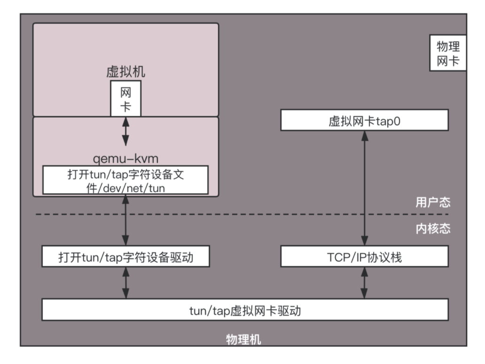

#### Share access

**Connect internally**

1. Use the Linux command to create an ethernet bridge 

> brctl addbr br0

1. Connect two virtual network card to br0

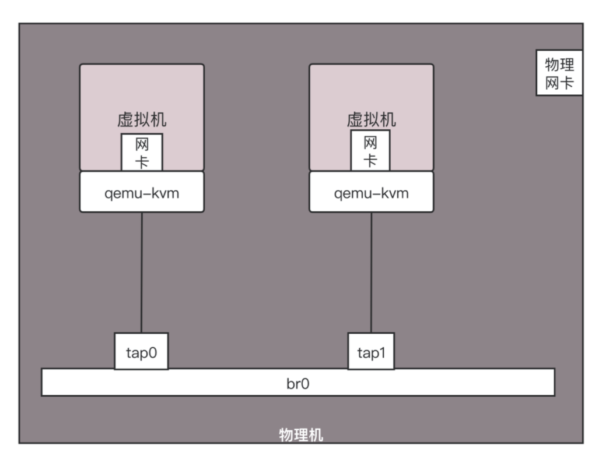

**Connect to the outside**

**Network bridging**

* Def: Virtual machine and physical machine will share the same IP address. 

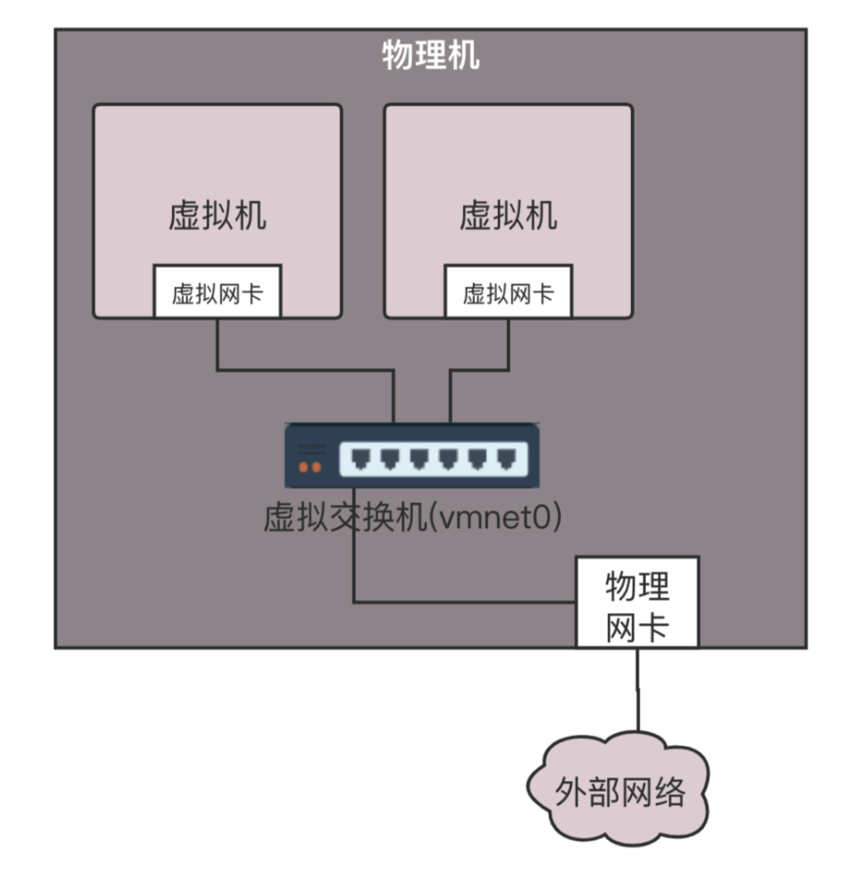

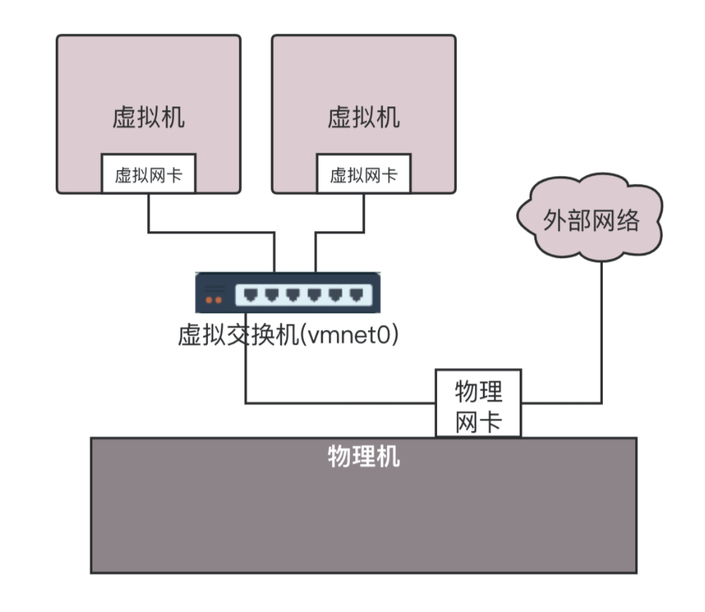

* Within cloud, the virtual machines inside Linux also share the same address as physical machines. 

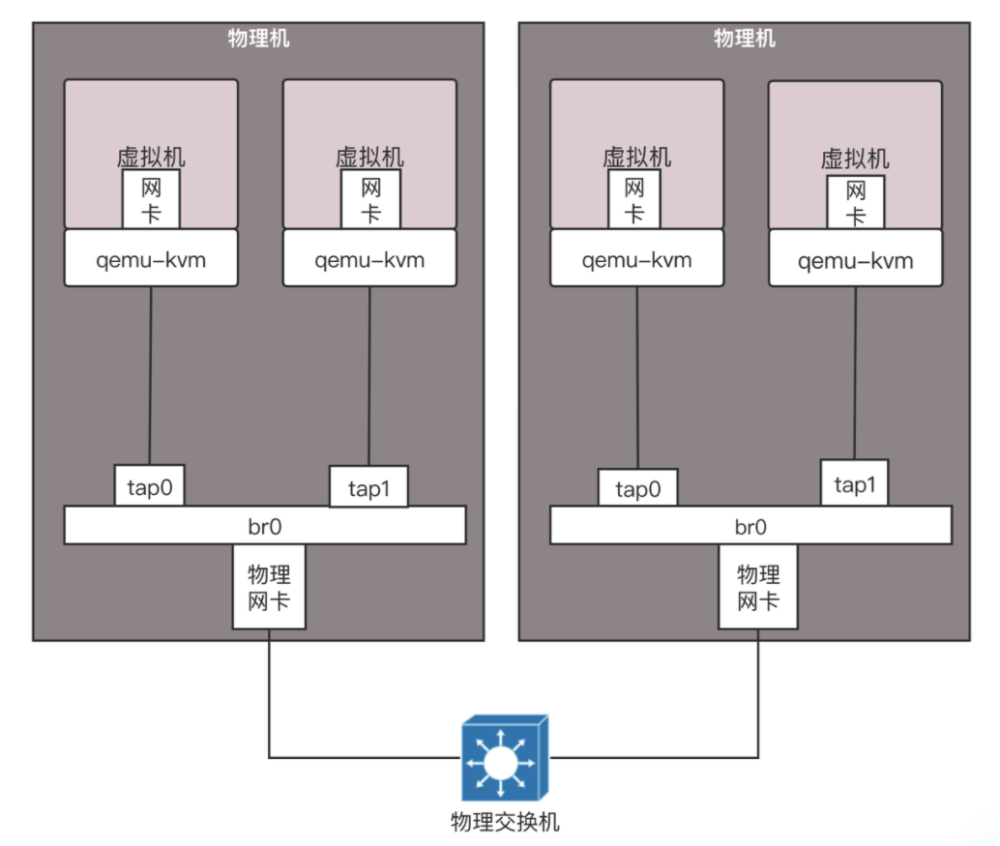

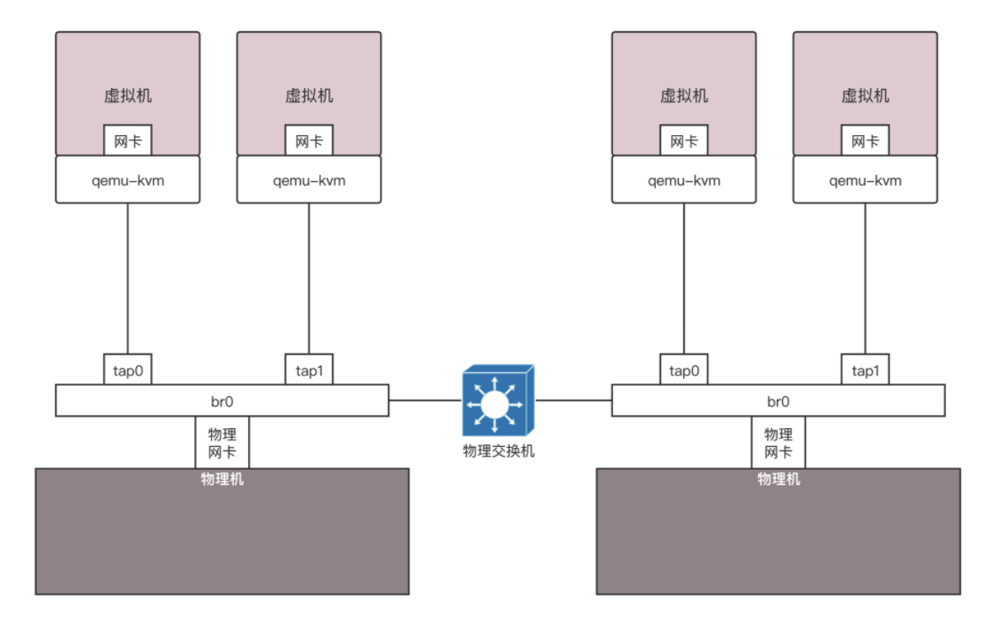

* Cons: When there is a large scale of machines, broadcast will be a problem because each virtualized machine needs to be broadcasted. 

**NAT**

* Def: Virtual machines will have different ip address as physical machines. 

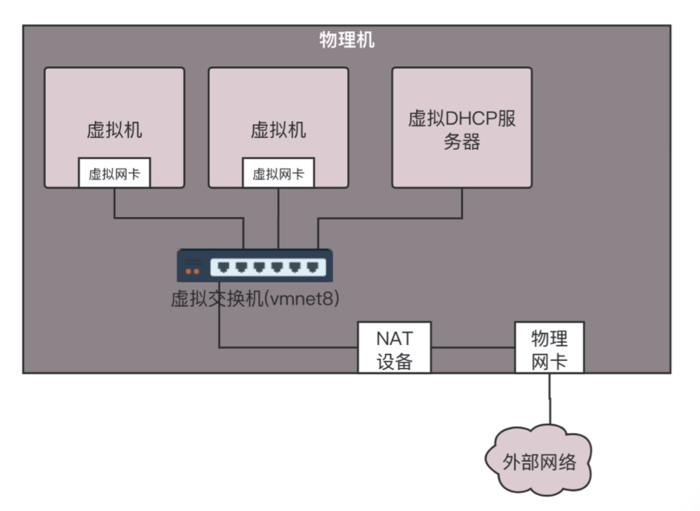

* A DHCP server will be created for assigning ip addresses to virtual machines dynamically. 

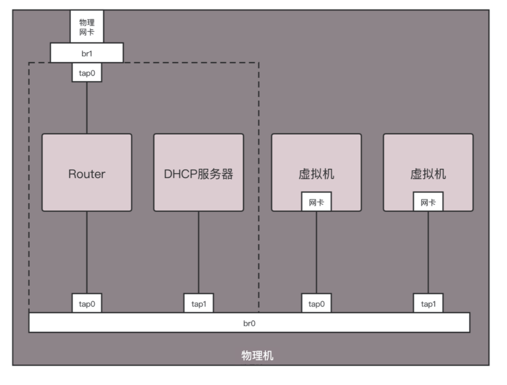

#### Separation access

* Approach: create VLAN based on physical network card eth0

> vconfig

* Within the same machine, there is no connectivity between network bridges. 
* Across machines, as long as physical bridge support VLAN, there will be no connectivity between different VLANs. 

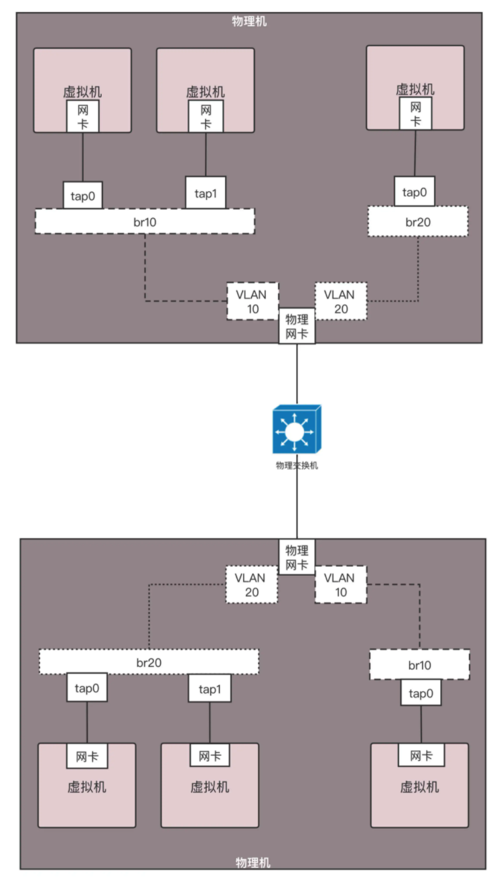

### Overlay network

#### Motivation

* Limitation of VLAN: Only has 12 bits and a capacity of 4096. 
* Possible solutions
  * Modify the VLAN protocol.
  * Extend the protocol by adding an additional header. 

#### Definition

* Underlay network: Physical network
* Overlay network: Virtual network implemented on top of underlay network. 

#### Approaches

**GRE - Generic Routing Encapsulation**

* Idea: It increases the number of VLAN ID by the way of tunnel. 

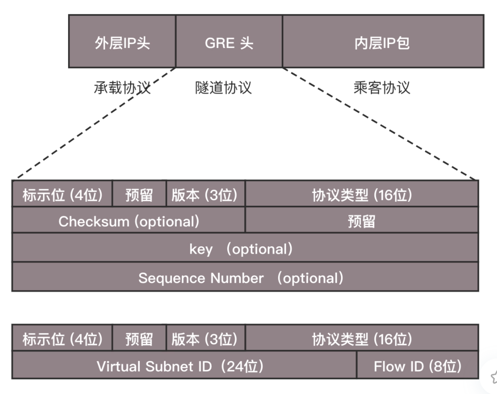

* Example

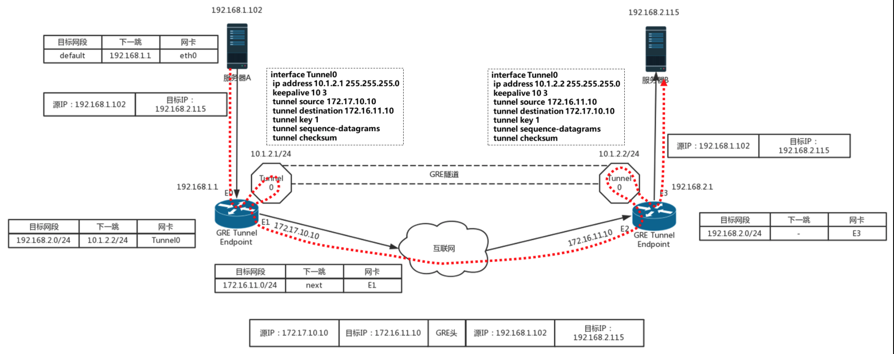

* Limitation:
  * The number of tunnels
  * It does not support group cast. 

**VXLAN**

* Idea:

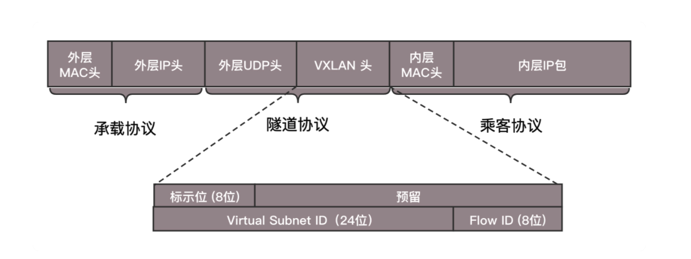

### SDN

#### Use cases

* Control and forward

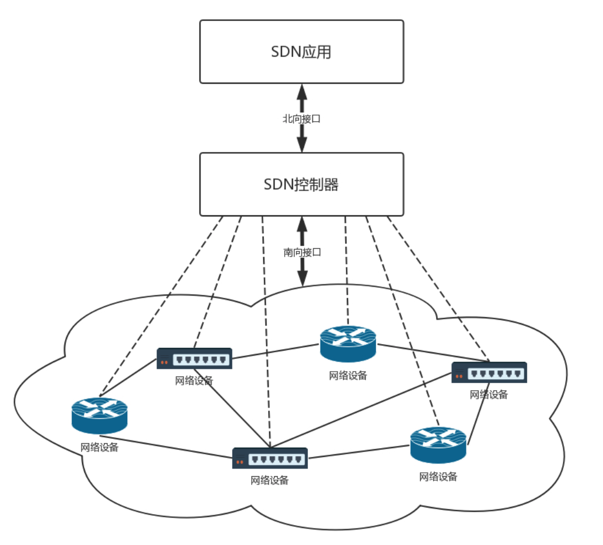

#### OpenFlow and Openvswitch

* SDN controller administrates the network by OpenFlow protocol. 

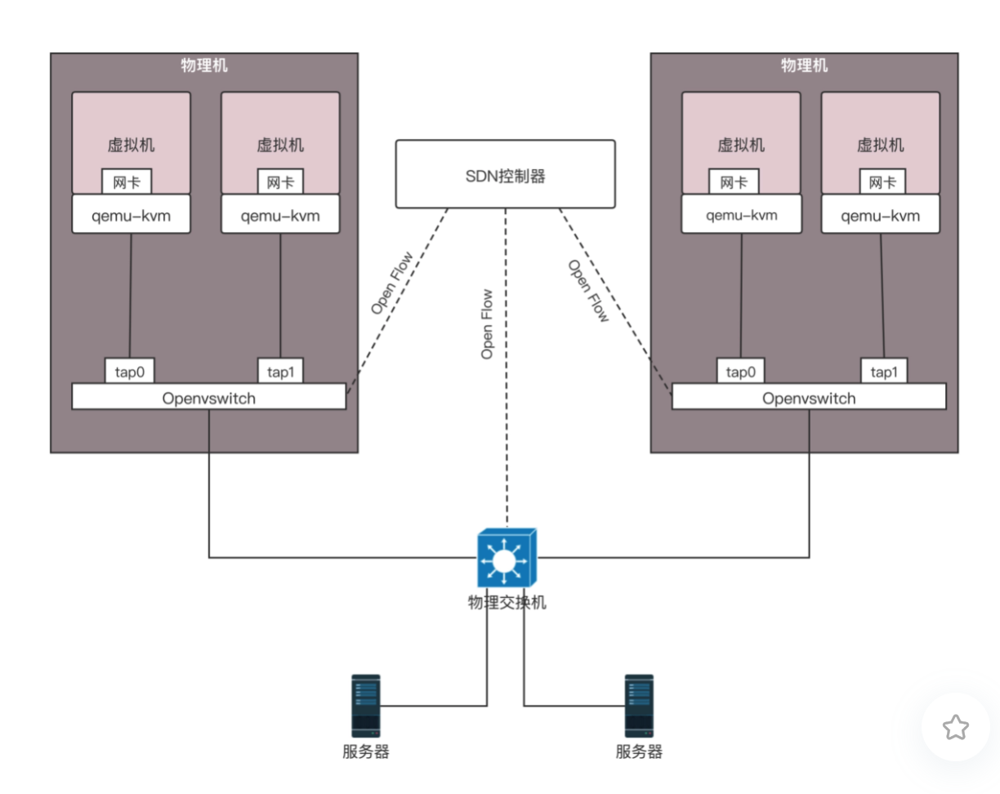

*   Within the Openvswitch, there is a flow table which defines flow rules. 

### References

* [趣谈网络协议](https://time.geekbang.org/column/article/10742)
