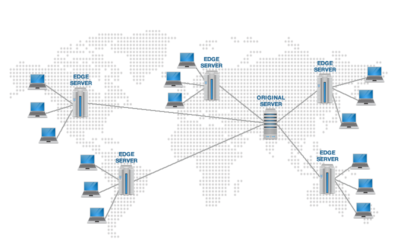
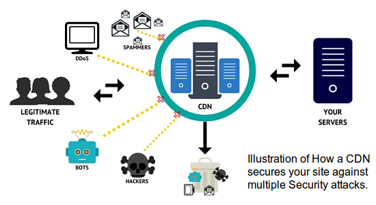
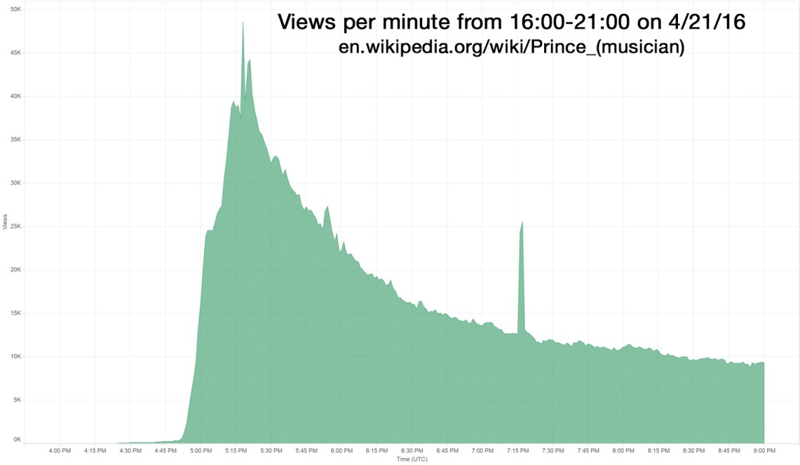
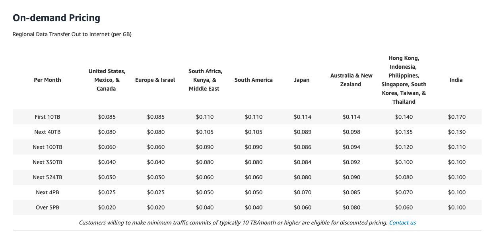

# Network\_CDN

* [Benefits of CDN?](network_cdn.md#benefits-of-cdn)
  * [Improve latency](network_cdn.md#improve-latency)
  * [Improve security](network_cdn.md#improve-security)
  * [Improve availability](network_cdn.md#improve-availability)
* [CDN cost](network_cdn.md#cdn-cost)
* [Flowchart](network_cdn.md#flowchart)
  * [How to put an item on CDN](network_cdn.md#how-to-put-an-item-on-cdn)
  * [How to get an item from](network_cdn.md#how-to-get-an-item-from)
* [CDN Operation Mode](network_cdn.md#cdn-operation-mode)
  * [Pull based CDN](network_cdn.md#pull-based-cdn)
  * [Push based CDN](network_cdn.md#push-based-cdn)
* [CDN internal](network_cdn.md#cdn-internal)
  * [Global server load balance - GSLB](network_cdn.md#global-server-load-balance---gslb)
  * [Cache proxy](network_cdn.md#cache-proxy)
    * [Architecture](network_cdn.md#architecture)
* [Real world](network_cdn.md#real-world)
  * [Google CDN](network_cdn.md#google-cdn)

## Benefits of CDN?

* [https://medium.com/@gianfranconuschese/why-use-a-cdn-b298c07e739e](https://medium.com/@gianfranconuschese/why-use-a-cdn-b298c07e739e)

### Improve latency

* Users accessing the CDN servers instead of the main server leads to better performance on both sides. Users who are farther from the main server can expect faster load times due to their requests traveling less distance. The edge servers are dividing and conquering the amount of traffic coming into the site, therefore the load on the main server is lifted. Even if the client needs to access the main server, they’ll get better speeds due to Dynamic Site Acceleration — a blanket term for techniques CDNs employ to make requests more efficient.
* Remember that 80-90% of the end-user response time is spent downloading all the components in the page: images, stylesheets, scripts, Flash, etc.
* Why not web storage / distributed cache?
  * Web storage or distributed cache could not necessarily be deployed as close as CDN to the end user. 
  * Static resource such as video or images are so big. 
  * If they were to serve from web storage / distributed cache, it will be a huge requirement for network bandwidth and introduce high latency for such content



### Improve security

* The layer of abstraction CDN servers offer help to keep security attacks away from your site’s main server. Edge servers are typically equipped with a WAF \(web application firewall\) that can filter out malicious incoming and outgoing requests. The firewall can analyze the requests at the edge, and block them from ever touching the main server. In case your site is already compromised, it can analyze outgoing attacks to prevent further spread of malicious messages.
* Node servers also offer DDoS protection by filtering and absorbing these attacks. Since the edge servers are built to distribute requests to other servers in case of overload or need to access something not in the cache, DDoS attacks can be neutralized. Networks can also handle this load in case of a giant uptick in legitimate requests.



### Improve availability

* The graph above shows the traffic on Prince’s Wikipedia page a few hours after his death was announced. Wikipedia had such a large amount of requests to edit and view that some people couldn’t access the page at all. Luckily, Wikipedia had measures put in place after experiencing similar CPU load spikes and with Michael Jackson and David Bowie’s deaths.
* In cases like these, the divide and conquer design of Content Delivery Networks can help mitigate the load by distributing requests and serving pages quickly thanks to caching. Even if the main server goes down for some reason, the site won’t go down for everyone due to the cached versions hosted on the CDN’s node servers.



## CDN cost

* CDN is expensive, especially when the data size is large. 
  * Using Amazon CDN as example [https://aws.amazon.com/cloudfront/pricing/](https://aws.amazon.com/cloudfront/pricing/)
  * Assume 100% of traffic is served from the United States. The average cost per GB is $0.02. For simplicity, we only calculate the cost of video streaming.

    • 5 million  _5 videos_  0.3GB \* $0.02 = $150,000 per day.



* How to reduce the CDN cost
  * Only serve the most popular contents from CDN and other videos from webserver
  * Some videos are popular only in certain regions. There is no need to distribute these videos to other regions.
  * Build your own CDN like Netflix and partner with Internet Service Providers \( Comcast, AT&T, Verizon, etc.\). Building your CDN is a giant project; however, this could make sense for large streaming companies. 

## Flowchart

### How to put an item on CDN

```text
┌─────────────────────────────────────────────────────────────────────────────────────┐
│        1. A user has a video xxx.avi to put on CDN and wants to access it as        │
│                        https://video.yourcompany.com/xxx.avi                        │
│                                                                                     │
└──────────────────────────────────────────┬──────────────────────────────────────────┘
                                           │                                           
                                           ▼                                           
┌────────────────────────────────────────────────────────────────────────────────────┐ 
│                                                                                    │ 
│     2. CDN Provider provides a domain name for you such as xxx.akamai.cdn.com      │ 
│                                                                                    │ 
└───────────────────────────────────────────┬────────────────────────────────────────┘ 
                                            │                                          
                                            │                                          
                                            ▼                                          
 ┌────────────────────────────────────────────────────────────────────────────────────┐
 │ 3. a CName mapping between your preferred domain name and the one provided by CDN  │
 │              provider is configured on the .com DNS authority server               │
 │                                                                                    │
 │                    video.yourcompany.com => xxx.akamai.cdn.com                     │
 │                                                                                    │
 └──────────────────────────────────────────┬─────────────────────────────────────────┘
                                            │                                          
                                            │                                          
                                            ▼                                          
 ┌────────────────────────────────────────────────────────────────────────────────────┐
 │ 4. A CName mapping between cdn domain name returned from 3 and the CDN global load │
 │        balancer address is configured on the .cdn.com DNS authority server         │
 │                                                                                    │
 │                 xxx.akamai.cdn.com => global.loadbalancer.cdn.com                  │
 │                                                                                    │
 └────────────────────────────────────────────────────────────────────────────────────┘
                                           │                                           
                                           │                                           
                                           │                                           
                                           ▼                                           
  ┌─────────────────────────────────────────────────────────────────────────────────┐  
  │           5. The video is uploaded to CDN, which could be accessed by           │  
  │                      https://video.yourcompany.com/xxx.avi                      │  
  │                                                                                 │  
  └─────────────────────────────────────────────────────────────────────────────────┘
```

### How to get an item from

* The overall load balancing algorithm \(step3 and step4\) depends on a couple of factors and is not only based on physical distance.
  * Based on local DNS's IP address
  * Round trip time
  * Based on bandwidth and cost
  * Based on the tier of service

```text
 ┌────────────────────────────────────────────────────────────────────────────────────┐
 │                                                                                    │
 │              1. A user accesses https://video.yourcompany.com/xxx.avi              │
 │                                                                                    │
 └─────────────────────────────────────────┬──────────────────────────────────────────┘
                                           │                                           
                                           │                                           
                                           │                                           
                                           ▼                                           
┌────────────────────────────────────────────────────────────────────────────────────┐ 
│          2. A request is sent to .com DNS authority server for resolving           │ 
│    video.yourcompany.com. Based on the CName mapping configured, a domain name     │ 
│                          xxx.akamai.cdn.com is returned.                           │ 
│                                                                                    │ 
│                    video.yourcompany.com => xxx.akamai.cdn.com                     │ 
│                                                                                    │ 
└────────────────────────────────────────────────────────────────────────────────────┘ 
                                           │                                           
                                           │                                           
                                           │                                           
                                           ▼                                           
┌────────────────────────────────────────────────────────────────────────────────────┐ 
│        3. A request is sent to .cdn.com DNS authority server for resolving         │ 
│      xxx.akamai.cdn.com. Based on the CName mapping configured, a domain name      │ 
│                    xxx.global.loadbalander.cdn.com is returned.                    │ 
│                                                                                    │ 
│               xxx.akamai.cdn.com => xxx.global.loadbalancer.cdn.com                │ 
│                                                                                    │ 
└────────────────────────────────────────────────────────────────────────────────────┘ 
                                           │                                           
                                           │                                           
                                           │                                           
                                           │                                           
                                           ▼                                           
┌────────────────────────────────────────────────────────────────────────────────────┐ 
│4. The CDN Global balancer xxx.global.loadbalancer.cdn.com returns an IP address    │ 
│based on the following conditions:                                                  │ 
│                                                                                    │ 
│a). User's IP address                                                               │ 
│b). User's network operator such as ATT                                             │ 
│c). Request url to determine which CDN server has it                                │ 
│d). Current traffic distribution condition                                          │ 
│                                                                                    │ 
└────────────────────────────────────────────────────────────────────────────────────┘ 
                                           │                                           
                                           │                                           
                                           │                                           
                                           ▼                                           
┌────────────────────────────────────────────────────────────────────────────────────┐ 
│                                                                                    │ 
│   5. A user accesses the resource by using https://{returned ip address}/xxx.avi   │ 
│                                                                                    │ 
└────────────────────────────────────────────────────────────────────────────────────┘
```

## CDN Operation Mode

* For most cases CDN uses Pull mode. However, in some special cases such as Netflix videos or super large chatrooms, push is preferred. 

### Pull based CDN

* Pull based CDN relies on [cache control](https://github.com/DreamOfTheRedChamber/system-design-interviews/tree/b195bcc302b505e825a1fbccd26956fa29231553/httpProtocol.md#cache-control) and [conditional get headers](https://github.com/DreamOfTheRedChamber/system-design-interviews/tree/b195bcc302b505e825a1fbccd26956fa29231553/httpProtocol.md#conditional-get) for determining when an item will expire. 

### Push based CDN

* Netflix uses precaching to push content to CDN nodes during off-peak hours. Please [read here for further details](https://media.netflix.com/en/company-blog/how-netflix-works-with-isps-around-the-globe-to-deliver-a-great-viewing-experience)
* How netflix use customized consistency hashing to distribute content on CDN. 
  * [A rough overview - Distributing Content to Open Connect](https://netflixtechblog.com/distributing-content-to-open-connect-3e3e391d4dc9)
  * [A deeper dive - Netflix and Fill](https://netflixtechblog.com/netflix-and-fill-c43a32b490c0)
* Content popularity
  * [Data science challenges to optimize CDN](https://netflixtechblog.com/how-data-science-helps-power-worldwide-delivery-of-netflix-content-bac55800f9a7)
  * [How to predict content popularity - Content Popularity for Open Connect](https://netflixtechblog.com/content-popularity-for-open-connect-b86d56f613b)

## CDN internal

### Global server load balance - GSLB

### Cache proxy

#### Architecture

* There could be multiple layer of cache clusters
  * L1 cache cluster is also called edge node. 
  * There are more L1 cache cluster than L2 cache cluster. In addition, L1 cache cluster are usually closer to the end user.
* Components within each cache cluster
  * Level 4 load balancer:
    * Is faster than level 7 load balancer
    * Could only load balance on transport layer properties such as Source IP address, source port number, dest IP address, dest port number. These propperties necessarily guarantee a high cache hit ratio. 
  * Level 7 load balancer
    * Could load balance on HTTP layer properties such as Cookie, URL, method, parameter. 
  * Cache server

```text
 ┌────────────────────────────────────────────────────────────────────────────────────────┐  
 │                                                                                        │  
 │                                    Source of truth                                     │  
 │                                                                                        │  
 └────────────────────────▲──────────────────────────────────────────┬────────────────────┘  
                          │                                          │                       
                          │                                          │                       
┌─────────────────────────┴──────────────────────────────────────────┼────────────────────┐  
│                                                                    ▼                    │  
│                               ...... Level N cache ......                               │  
│                                                                                         │  
└─────────────────────────▲──────────────────────────────────────────┬────────────────────┘  
                          │                                          │                       
                          │                                          │                       
                          │                                          │                       
 ┌───────────────────────────────────────────────────────────────────▼─────────────────────┐ 
 │                                      CDN L2 Cache                                       │ 
 │ ┌────────────┐   ┌────────────┐        ┌────────────┐     ┌────────────┐  ┌────────────┐│ 
 │ │            │   │            │        │            │     │LVS with VIP│  │LVS with VIP││ 
 │ │LVS with VIP│   │LVS with VIP│        │   ......   │     │  address   │  │  address   ││ 
 │ │address VIP3│   │address VIP4│        │            │     │   VIP10    │  │   VIP11    ││ 
 │ │            │   │            │        │            │     │            │  │            ││ 
 │ └────────────┘   └────────────┘        └────────────┘     └────────────┘  └────────────┘│ 
 │                         ▲                                        ▲                      │ 
 └─────────────────────────┼────────────────────────────────────────┼──────────────────────┘ 
                           │                                        │                        
                      Request 1                                     │                        
                           │                                   Request 2                     
                           │                                        │                        
                           │                                        │                        
                           │                                        │                        
  ┌─────────────────────────────────────────────────────────────────┴───────────────────────┐
  │ Usually two L1 CDN cache cluster is deployed within a single region for resiliency and  │
  │                                   performance purpose                                   │
  │                                                                                         │
  │┌────────────────────────────────┐                     ┌────────────────────────────────┐│
  ││           Cluster 1            │                     │           Cluster 2            ││
  ││                                │     .─────────.     │                                ││
  ││                                │ _.─'           `──. │                                ││
  ││  ┌──────┐  ┌──────┐  ┌──────┐  │╱Local cache server ╲│ ┌──────┐  ┌──────┐  ┌──────┐   ││
  ││  │Cache │  │Cache │  │Cache │  │   such as Nginx,    │ │Cache │  │Cache │  │Cache │   ││
  ││  │server│  │server│  │server│  │  Varnish, Traffic   │ │server│  │server│  │server│   ││
  ││  └──────┘  └──────┘  └──────┘  │╲      server       ╱│ └──────┘  └──────┘  └──────┘   ││
  ││      ▲         ▲         ▲     │ ╲                 ╱ │     ▲         ▲         ▲      ││
  ││      │         │         │     │  `──.         _.─'  │     │         │         │      ││
  ││      ├─────────┼─────────┤     │      `───────'      │     ├─────────┼─────────┤      ││
  ││      │         │         │     │                     │     │         │         │      ││
  ││      │         │         │     │                     │     │         │         │      ││
  ││      │         │         │     │    .───────────.    │     │         │         │      ││
  ││  ┌──────┐  ┌──────┐  ┌──────┐  │_.─'             `──.│ ┌──────┐  ┌──────┐  ┌──────┐   ││
  ││  │Nginx │  │Nginx │  │Nginx │  │  L7 load balancer   │ │Nginx │  │Nginx │  │Nginx │   ││
  ││  └──────┘  └──────┘  └──────┘  │   such as Nginx,    │ └──────┘  └──────┘  └──────┘   ││
  ││      ▲         ▲         ▲     │╲      HAProxy      ╱│     ▲         ▲         ▲      ││
  ││      │         │         │     │ `──.           _.─' │     │         │         │      ││
  ││      └─────────┼─────────┘     │     `─────────'     │     └─────────┼─────────┘      ││
  ││                │               │                     │               │                ││
  ││                │               │                     │               │                ││
  ││                │               │                     │               │                ││
  ││         ┌────────────┐         │   .───────────.     │        ┌────────────┐          ││
  ││         │LVS with    │         _.─'             `──. │        │LVS with    │          ││
  ││         │virtual IP  │        ;    Level 4 load     :│        │virtual IP  │          ││
  ││         │address VIP1│        :  balancer such as   ;│        │address VIP2│          ││
  ││         │            │         ╲     LVS / F5      ╱ │        │            │          ││
  ││         └────────────┘         │`──.           _.─'  │        └────────────┘          ││
  ││                                │    `─────────'      │                                ││
  │└────────────────────────────────┘                     └────────────────────────────────┘│
  │                 ▲                                                      ▲                │
  └─────────────────┼──────────────────────────────────────────────────────┼────────────────┘
                    │                                                      │                 
                    │                                                      │                 
                    │                                                      │                 
                    │                                                      │                 
                    │                                                      │                 
                    │                                                      │                 
                    │                                                      │                 
                    │            return  ┌──────────────┐       return     │                 
                  Request 1       VIP1   │CDN global    │        VIP2    Request 2           
                    │         ◀───────── │load balancer ├──────────────▶   │                 
                    │                    │              │                  │                 
                    │                    └──────────────┘                  │                 
                    │                                                      │                 
                    │                                                      │                 
                    │                                                      │                 
                    │                                                      │                 
                    │                                                      │                 
                    │                                                      │
```

## Real world

### Google CDN

* [Talk on Cloud Next 2019](https://www.youtube.com/watch?v=JX2qrdp0WT4&ab_channel=GoogleCloudTech)

