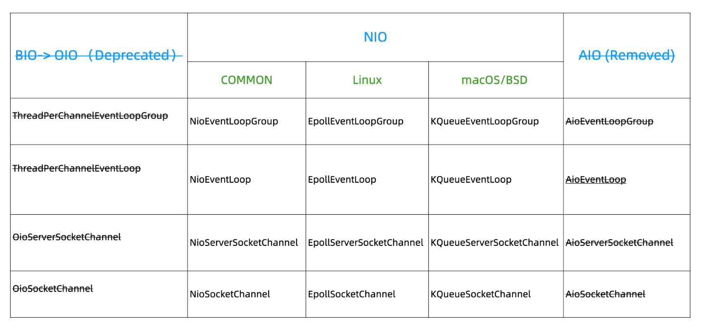
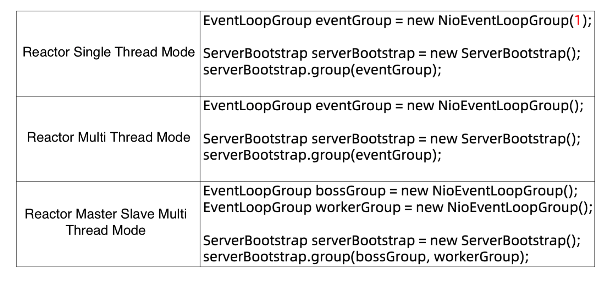
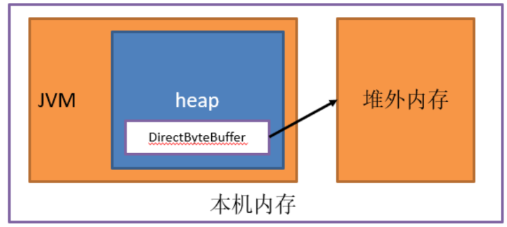

# Network_Netty-\[TODO]

* [Netty](network_netty-todo.md#netty)
  * [Architecture](network_netty-todo.md#architecture)
  * [Use cases](network_netty-todo.md#use-cases)
  * [IO concepts](network_netty-todo.md#io-concepts)
    * [Synchronous vs asynchronous](network_netty-todo.md#synchronous-vs-asynchronous)
    * [Blocking vs non-blocking](network_netty-todo.md#blocking-vs-non-blocking)
    * [Synchronous blocking](network_netty-todo.md#synchronous-blocking)
    * [Synchronous nonblocking](network_netty-todo.md#synchronous-nonblocking)
    * [Asynchronous blocking](network_netty-todo.md#asynchronous-blocking)
    * [Asynchronous nonblocking](network_netty-todo.md#asynchronous-nonblocking)
  * [IO modes](network_netty-todo.md#io-modes)
    * [BIO/Thread-Per-Connection (Synchronous blocking mode) < JDK 1.4](network_netty-todo.md#biothread-per-connection-synchronous-blocking-mode--jdk-14)
    * [AIO/Proactor (Asynchronous nonblocking mode) since JDK 1.7](network_netty-todo.md#aioproactor-asynchronous-nonblocking-mode-since-jdk-17)
    * [NIO/Reactor (Synchronous nonblocking mode) since JDK 1.4](network_netty-todo.md#nioreactor-synchronous-nonblocking-mode-since-jdk-14)
      * [Concepts](network_netty-todo.md#concepts)
        * [Buffer](network_netty-todo.md#buffer)
        * [Channel](network_netty-todo.md#channel)
        * [Selector](network_netty-todo.md#selector)
      * [Modes](network_netty-todo.md#modes)
        * [Single threaded reactor mode](network_netty-todo.md#single-threaded-reactor-mode)
        * [Multi threaded reactor mode](network_netty-todo.md#multi-threaded-reactor-mode)
        * [Master slave reactor mode](network_netty-todo.md#master-slave-reactor-mode)
* [Netty](network_netty-todo.md#netty-1)
  * [Thread model](network_netty-todo.md#thread-model)
    * [Why Netty instead of NIO](network_netty-todo.md#why-netty-instead-of-nio)
    * [Netty's supports for NIO](network_netty-todo.md#nettys-supports-for-nio)
      * [Why Netty does not support AIO](network_netty-todo.md#why-netty-does-not-support-aio)
      * [How Netty supports three types of Reactor modes](network_netty-todo.md#how-netty-supports-three-types-of-reactor-modes)
  * [Encoding](network_netty-todo.md#encoding)
  * [Memory](network_netty-todo.md#memory)
  * [Applications](network_netty-todo.md#applications)
    * [WebSocket](network_netty-todo.md#websocket)

## Netty

### Architecture


### Use cases

* Netty related projects: [https://netty.io/wiki/related-projects.html](https://netty.io/wiki/related-projects.html)
  * Distributed system: Dubbo/RocketMQ
  * Game industry: 
  * Hadoop and Avro RPS

### IO concepts

#### Synchronous vs asynchronous

* After IO calling thread invokes IO execution thread, whether IO calling thread could continue executing unrelevant logic related to IO execution thread
  * If could continue executing unrelevant logic, then asynchronous
  * If could't continue executing unrelevant logic, then synchronous

#### Blocking vs non-blocking

* After IO calling thread invokes IO execution thread, whether the IO calling thread gets proactively waiting or passively waiting. 
  * If proactively waiting (e.g. use a while block to constantly check, thus consuming CPU cycle), then it is blocking
  * If reactively waiting (e.g. Register an event and fall into sleep)

#### Synchronous blocking

```
┌ ─ ─ ─ ─ ─ ─ ─ ─ ─ ┐                               ┌ ─ ─ ─ ─ ─ ─ ─ ─ ─ ─ ─ ─ ─ ─ ─ ─ ─ ─ ─ ─ ┐
     User Space                                                    Kernel Space                
│                   │                               │                                         │
  ┌──────────────┐                                     ┌─────────┐                ┌─────────┐  
│ │IO thread (one│  │                               │  │ System  │                │ Network │ │
  │   for both   │                                     │ kernel  │                │  card   │  
│ │ calling and  │  │                               │  │         │                │ buffer  │ │
  │  execution)  │                                     └─────────┘                └─────────┘  
│ └──────────────┘  │                               │       │                          │      │
          │                                                                                    
│         │         │                               │       │                          │      │
          │                   Step1.a. System                                                  
│         ├─────────┼────────call to instruct ──────┼───────▶                          │      │
          │                     the kernel                                                     
│         │         │                               │       │         Step2.           │      │
   Step1.b. Thread                                          ────────Read data ─────────▶       
│ actively checking │                               │       │        request           │      │
 whether user buffer                                                                           
│     is ready      │                               │       │                          │      │
          │                                                                                    
│         ▼         │                               │       │                          │      │
     ┌─────────┐                                       ┌─────────┐                             
│    │  User   │    │      Step4. Copy data         │  │ Kernel  │       Step3. Copy   │      │
     │ buffer  │◀────────────to user space ────────────│  space  │◀────────data to ────        
│    └─────────┘    │           buffer              │  └────┬────┘      system kernel  │      │
          │                                                                                    
│         │         │                               │       │                          │      │
       Step5.                                                                                  
│     Continue      │                               │       │                          │      │
     execution                                                                                 
│         │         │                               │       │                          │      │
          │                                                                                    
│         │         │                               │       │                          │      │
          ▼                                                                                    
│                   │                               │                                         │
 ─ ─ ─ ─ ─ ─ ─ ─ ─ ─                                 ─ ─ ─ ─ ─ ─ ─ ─ ─ ─ ─ ─ ─ ─ ─ ─ ─ ─ ─ ─ ─
```

#### Synchronous nonblocking

```
┌ ─ ─ ─ ─ ─ ─ ─ ─ ─ ┐                               ┌ ─ ─ ─ ─ ─ ─ ─ ─ ─ ─ ─ ─ ─ ─ ─ ─ ─ ─ ─ ─ ┐
     User Space                                                    Kernel Space                
│                   │                               │                                         │
  ┌──────────────┐                                     ┌─────────┐                ┌─────────┐  
│ │IO thread (one│  │                               │  │ System  │                │ Network │ │
  │   for both   │                                     │ kernel  │                │  card   │  
│ │ calling and  │  │                               │  │         │                │ buffer  │ │
  │  execution)  │                                     └─────────┘                └─────────┘  
│ └──────────────┘  │                               │       │                          │      │
          │                                                                                    
│         │         │                               │       │                          │      │
          │                   Step1.a. System                                                  
│         ├─────────┼────────call to instruct ──────┼───────▶                          │      │
          │                     the kernel                                                     
│         │         │                               │       │         Step2.           │      │
   Step1.b. Thread                                          ────────Read data ─────────▶       
│ actively checking │                               │       │        request           │      │
 whether user buffer                                                                           
│     is ready      │                               │       │                          │      │
          │                                                                                    
│         ▼         │                               │       │                          │      │
     ┌─────────┐                                       ┌─────────┐                             
│    │  User   │    │      Step4. Copy data         │  │ Kernel  │       Step3. Copy   │      │
     │ buffer  │◀────────────to user space ────────────│  space  │◀────────data to ────        
│    └─────────┘    │           buffer              │  └────┬────┘      system kernel  │      │
          │                                                                                    
│         │         │                               │       │                          │      │
       Step5.                                                                                  
│     Continue      │                               │       │                          │      │
     execution                                                                                 
│         │         │                               │       │                          │      │
          │                                                                                    
│         │         │                               │       │                          │      │
          ▼                                                                                    
│                   │                               │                                         │
 ─ ─ ─ ─ ─ ─ ─ ─ ─ ─                                 ─ ─ ─ ─ ─ ─ ─ ─ ─ ─ ─ ─ ─ ─ ─ ─ ─ ─ ─ ─ ─
```

#### Asynchronous blocking

* This does not make sense. 

```
// Not needed. It could regress to synchronous blocking because only one thread is needed for this case.
┌ ─ ─ ─ ─ ─ ─ ─ ─ ─ ─ ─ ─ ─ ─ ─ ─ ─ ─ ─ ┐                   ┌ ─ ─ ─ ─ ─ ─ ─ ─ ─ ─ ─ ─ ─ ─ ─ ─ ─ ─ ─ ─ ┐
               User Space                                                  Kernel Space                
│                                       │                   │                                         │
  ┌─────────┐              ┌─────────┐                           ┌─────────┐              ┌─────────┐  
│ │   IO    │              │   IO    │  │                   │    │ System  │              │ Network │ │
  │ calling │              │execution│                           │ kernel  │              │  card   │  
│ │ thread  │              │ thread  │  │                   │    │         │              │ buffer  │ │
  └─────────┘              └─────────┘                           └─────────┘              └─────────┘  
│      │                        │       │                   │         │                        │      │
       │         Step1.a                                                                               
│      │         Invoke         │       │                   │         │                        │      │
       ├────────execution ──────▶                                                                      
│      │         thread         │       │                   │         │                        │      │
       │                                 Step2. system call                                            
│      │                        ├───────┼──to instruct the ─┼─────────▶                        │      │
    Step1.b. Wait for the                      kernel                                                  
│  finish of IO execution       │       │                   │         │        Step3.          │      │
       │   thread                                                     ───────read data ────────▶       
│      │                        │       │                   │         │       request          │      │
       │                                                                                               
│      │                        │       │                   │         │                        │      │
       │                    ┌─────────┐                          ┌─────────┐                           
│      ▼       Step6.       │  User   │ │  Step5. Copy data │    │ Kernel  │      Step4.       ┘      │
       ◀─────Return to ─────│ buffer  │◀─────to user space ──────│  space  │◀───Copy data ────┤        
│      │      calling       └───┬─────┘ │       buffer      │    └────┬────┘    to system             │
       │                                                                                      │        
│      │                        │       │                   │         │                               │
       │                                                                                      │        
│      │                        │       │                   │         │                               │
       Step7. Continue                                                                        │        
│    executing relevant         │       │                   │         │                               │
       business logic                                                                         │        
│      │                        │       │                   │         │                               │
       │                                                                                      │        
│      │                        │       │                   │         │                               │
       │                                                                                      │        
│      │                        │       │                   │         │                               │
       ▼                                                                                               
│                                       │                   │                                         │
 ─ ─ ─ ─ ─ ─ ─ ─ ─ ─ ─ ─ ─ ─ ─ ─ ─ ─ ─ ─                     ─ ─ ─ ─ ─ ─ ─ ─ ─ ─ ─ ─ ─ ─ ─ ─ ─ ─ ─ ─ ─
```

#### Asynchronous nonblocking

```
┌ ─ ─ ─ ─ ─ ─ ─ ─ ─ ─ ─ ─ ─ ─ ─ ─ ─ ─ ─ ┐                   ┌ ─ ─ ─ ─ ─ ─ ─ ─ ─ ─ ─ ─ ─ ─ ─ ─ ─ ─ ─ ─ ┐
               User Space                                                  Kernel Space                
│                                       │                   │                                         │
  ┌─────────┐              ┌─────────┐                           ┌─────────┐              ┌─────────┐  
│ │   IO    │              │   IO    │  │                   │    │ System  │              │ Network │ │
  │ calling │              │execution│                           │ kernel  │              │  card   │  
│ │ thread  │              │ thread  │  │                   │    │         │              │ buffer  │ │
  └─────────┘              └─────────┘                           └─────────┘              └─────────┘  
│      │                        │       │                   │         │                        │      │
       │         Step1.a                                                                               
│      │         Invoke         │       │                   │         │                        │      │
       ├────────execution ──────▶                                                                      
│      │         thread         │       │                   │         │                        │      │
       │                                 Step2. system call                                            
│      │                        ├───────┼──to instruct the ─┼─────────▶                        │      │
      Step1.b. Continue                        kernel                                                  
│   executing unrelevant        │       │                   │         │        Step3.          │      │
       business logic                                                 ───────read data ────────▶       
│      │                        │       │                   │         │       request          │      │
       │                                                                                               
│      │                        │       │                   │         │                        │      │
       │                    ┌─────────┐                          ┌─────────┐                           
│      ▼       Step6.       │  User   │ │  Step5. Copy data │    │ Kernel  │      Step4.       ┘      │
       ◀─────Return to ─────│ buffer  │◀─────to user space ──────│  space  │◀───Copy data ────┤        
│      │      calling       └───┬─────┘ │       buffer      │    └────┬────┘    to system             │
       │                                                                                      │        
│      │                        │       │                   │         │                               │
       │                                                                                      │        
│      │                        │       │                   │         │                               │
       Step7. Continue                                                                        │        
│    executing relevant         │       │                   │         │                               │
       business logic                                                                         │        
│      │                        │       │                   │         │                               │
       │                                                                                      │        
│      │                        │       │                   │         │                               │
       │                                                                                      │        
│      │                        │       │                   │         │                               │
       ▼                                                                                               
│                                       │                   │                                         │
 ─ ─ ─ ─ ─ ─ ─ ─ ─ ─ ─ ─ ─ ─ ─ ─ ─ ─ ─ ─                     ─ ─ ─ ─ ─ ─ ─ ─ ─ ─ ─ ─ ─ ─ ─ ─ ─ ─ ─ ─ ─
```

### IO modes

#### BIO/Thread-Per-Connection (Synchronous blocking mode) < JDK 1.4

* To support large number of connections
  * Each connection will need a new thread, resulting in high server pressure.
  * Read operation on the connection will block until there is data transfer, resulting in resource waste.
* Suitable use cases: Low number of connections.

```
                                  ┌ ─ ─ ─ ─ ─ ─ ─ ─ ─ ─ ─ ─ ─ ─ ─ ─ 
                                                Server             │
                                  │                                 
                                                                   │
┌──────────────┐                  │        ┌──────────────┐         
│              │                           │              │        │
│    Client    │ ─────────────────┼───────▶│    Thread    │         
│              │                           │              │        │
└──────────────┘                  │        └──────────────┘         
                                                                   │
                                  │                                 
                                                                   │
┌──────────────┐                  │        ┌──────────────┐         
│              │                           │              │        │
│    Client    │──────────────────┼───────▶│    Thread    │         
│              │                           │              │        │
└──────────────┘                  │        └──────────────┘         
                                                                   │
                                  │                                 
                                                                   │
┌──────────────┐                  │        ┌─────────────┐          
│              │                           │             │         │
│    Client    │──────────────────┼───────▶│   Thread    │          
│              │                           │             │         │
└──────────────┘                  │        └─────────────┘          
                                                                   │
                                  │                                 
                                   ─ ─ ─ ─ ─ ─ ─ ─ ─ ─ ─ ─ ─ ─ ─ ─ ┘
```

#### AIO/Proactor (Asynchronous nonblocking mode) since JDK 1.7

#### NIO/Reactor (Synchronous nonblocking mode) since JDK 1.4

* Start in Java 1.4
* Suitable use cases: Large number of connections. 

**Concepts**

**Buffer**

* Compared with operations on array, much easier to use because the three attributes (Capacity, Position and Limit) encapsulates many operation
* Provide direct memory and heap memory. 
  * Why need direct memory?
    * Direct memory have one fewer copy operation when compared with heap memory ("file/socket --- OS memory --- jvm heap" vs "file/socket --- direct memory")    
    * Direct memory could manage its own lifecycle, reducing the pressure on garbage collector. 

**Channel**

* Within BIO, every operation needs to happen on io package (inputStream/outputStream) and network package (socket)
* NIO provides the concepts of channel, which is equivalent to combination of io and network package.
* Channel operates on top of Buffer concept. 

**Selector**

* Selector could be implemented on top of Linux API such as select/pool/epoll

|                 | select       | pool         | epoll     |
| --------------- | ------------ | ------------ | --------- |
| Operation mode  | loop through | loop through | callback  |
| Data structure  | array        | list         | list      |
| IO efficiency   | O(n)         | O(n)         | O(1)      |
| max num of conn | limited      | unlimited    | unlimited |

**Modes**

**Single threaded reactor mode**

```
// Initial implementation. Single thread block on socket (the while cycle below)
┌──────────────────────────────────────────────────────┐   
│                                                      │   
│         serverSocketChannel listen on a port         │◀─┐
│                                                      │  │
└──────────────────────────────────────────────────────┘  │
                            │                             │
                            │                             │
                            ▼                             │
┌──────────────────────────────────────────────────────┐  │
│                                                      │  │
│create a socketChannel upon accepting a client request│  │
│                                                      │  │
└──────────────────────────────────────────────────────┘  │
                            │                             │
                            │                             │
                            ▼                             │
┌──────────────────────────────────────────────────────┐  │
│       while(socketChannel not receiving data)        │  │
│                       { wait }                       │  │
│                                                      │  │
└──────────────────────────────────────────────────────┘  │
                            │                             │
                            │                             │
                            ▼                             │
┌──────────────────────────────────────────────────────┐  │
│                                                      │  │
│                    send response                     │──┘
│                                                      │   
└──────────────────────────────────────────────────────┘   

// Improved implementation. Single thread looping through new connection and read connection request
                   ┌──────────────────────────────────────────────────────┐                     
                   │                                                      │                     
┌─────────────────▶│         serverSocketChannel listen on a port         │◀───────────────────┐
│                  │                                                      │                    │
│                  └──────────────────────────────────────────────────────┘                    │
│                                              │                                               │
│                                              │           If there is no new                  │
│                                              │               connection                      │
│                                              │                                               │
│                          If there is a new   │                                               │
│                    ┌────────connection───────┴───────────────────────────┐                   │
│                    │                                                     │                   │
│                    │                                                     │                   │
│                    │                                                     │                   │
│                    │                                                     ▼                   │
│                    ▼                                     ┌───────────────────────────────┐   │
│  ┌──────────────────────────────────┐                    │                               │   │
│  │   create a socketChannel upon    │                    │loop through existing channels │   │
│  │    accepting a client request    │───────────────────▶│   and read if there is data   │   │
│  │                                  │                    │                               │   │
│  └──────────────────────────────────┘                    └───────────────────────────────┘   │
│                    │                                                     │                   │
│                    │                                                     │                   │
│                    ▼                                                     ▼                   │
│  ┌──────────────────────────────────┐                   ┌─────────────────────────────────┐  │
│  │add the socketChannel to a list of│                   │                                 │  │
└──│  channels for processing later   │                   │          send response          │──┘
   │                                  │                   │                                 │   
   └──────────────────────────────────┘                   └─────────────────────────────────┘   

// Replace while loop with selector. Single thread event driven architecture
                          ┌─────────────────────────────────────────┐                           
                          │                                         │                           
                          │      Create a serverSocketChannel       │                           
                          │                                         │                           
                          └─────────────────────────────────────────┘                           
                                               │                                                
                                               │                                                
                                               ▼                                                
                          ┌─────────────────────────────────────────┐                           
                          │Register serverSocketChannel on selector │                           
                          │       for new connection request        │                           
                          │                                         │                           
                          └─────────────────────────────────────────┘                           
                                               │                                                
                                               │                                                
                                               ▼                                                
                          ┌─────────────────────────────────────────┐                           
                          │                                         │                           
┌────────────────────────▶│           listen on selector            │◀─────────────────────────┐
│                         │                                         │                          │
│                         └─────────────────────────────────────────┘                          │
│                                              │                                               │
│                                              │                                               │
│                                              │                                               │
│                                              │                                               │
│                                              │                                               │
│                                              │                                               │
│                    ┌────────If it is ────────┴───────If there is ────────┐                   │
│                    │     accept/connect           read/write event       │                   │
│                    │          event                                      │                   │
│                    │                                                     │                   │
│                    │                                                     │                   │
│                    │                                                     │                   │
│                    │                                                     ▼                   │
│                    ▼                                     ┌───────────────────────────────┐   │
│  ┌──────────────────────────────────┐                    │                               │   │
│  │   create a socketChannel upon    │                    │     read/write the event      │   │
│  │    accepting a client request    │                    │                               │   │
│  │                                  │                    │                               │   │
│  └──────────────────────────────────┘                    └───────────────────────────────┘   │
│                    │                                                     │                   │
│                    │                                                     │                   │
│                    ▼                                                     ▼                   │
│  ┌──────────────────────────────────┐                   ┌─────────────────────────────────┐  │
│  │   register the READ request on   │                   │                                 │  │
└──│             selector             │                   │          send response          │──┘
   │                                  │                   │                                 │   
   └──────────────────────────────────┘                   └─────────────────────────────────┘
```

**Multi threaded reactor mode**

**Master slave reactor mode**

```
// Reactor mode. Multi thread pool event driven architecture
                             ┌ ─ ─ ─ ─ ─ ─ ─ ─ ─ ─ ─ ─ ─ ─ ┐                                       
                                 Reactor thread pool for                                           
                             │    accept/connect events    │                                       

                             │    ┌────────────────────┐   │                                       
                                  │ randomly pick one  │                                           
    Whenever there is a new  │    │from reactor thread │   │                                       
───────────event on ─────────────▶│      pool for      │                                           
      serverSocketChannel    │    │   accept/connect   │   │                                       
                                  │       events       │                                           
                             │    └────────────────────┘   │                                       
                                             │                                                     
                             │               │             │                                       
                                             ▼                                                     
                             │    ┌────────────────────┐   │                                       
                                  │register on selector│                                           
                             │    │ for accept/connect │   │                                       
                                  │      request       │                                           
                             │    └────────────────────┘   │                                       
                                             │                                                     
                             │               ▼             │                                       
                                  ┌────────────────────┐                                           
                             │    │                    │   │                                       
                                  │ listen on selector │                                           
                             │    │                    │   │                                       
                                  └────────────────────┘               ┌ ─ ─ ─ ─ ─ ─ ─ ─ ─ ─ ─ ─ ─ 
                             │               │             │             Reactor thread pool for  │
                                  when there is an event               │    read/write events      
                             │               │             │                                      │
                                             ▼                         │                           
                             │    ┌────────────────────┐   │              ┌────────────────────┐  │
                                  │ randomly pick one  │               │  │register on selector│   
                             │    │from reactor thread │ ──┼─────────────▶│   for read/write   │  │
                                  │pool for read/write │               │  │      request       │   
                             │    └────────────────────┘   │              └────────────────────┘  │
                                                                       │             │             
                             └ ─ ─ ─ ─ ─ ─ ─ ─ ─ ─ ─ ─ ─ ─ ┘                         │            │
                                                                       │      If there is a        
                                                                               read/write         │
                                                                       │         request           
                                                                                     │            │
                                                                       │             ▼             
                                                                          ┌────────────────────┐  │
                                                                       │  │ process read/write │   
                                                                          │       event        │  │
                                                                       │  │                    │   
                                                                          └────────────────────┘  │
                                                                       │             │             
                                                                                     │            │
                                                                       └ ─ ─ ─ ─ ─ ─ ┼ ─ ─ ─ ─ ─ ─ 
                                                                                     │             
                                                                       ┌ ─ ─ ─ ─ ─ ─ ┼ ─ ─ ─ ─ ─ ┐ 
                                                                                     ▼             
                                                                       │  ┌────────────────────┐ │ 
                                                                          │business processing │   
                                                                       │  │                    │ │ 
                                                                          │                    │   
                                                                       │  └────────────────────┘ │ 

                                                                       │Business logic processing│ 
                                                                               thread pool         
                                                                       └ ─ ─ ─ ─ ─ ─ ─ ─ ─ ─ ─ ─ ┘
```

## Netty

### Thread model

#### Why Netty instead of NIO

* Support common types of application layer protocol: encoding/decoding
* Solve transmission problem such as half package or sticky package
* Great handling for idle exception

#### Netty's supports for NIO

**Why Netty does not support AIO**

* Windows AIO implementation mature, but seldomly used as server
* Linux AIO implementation not mature
* Under Linux, AIO does not perform much higher than NIO



**How Netty supports three types of Reactor modes**



### Encoding

* Solve half package / stuffed package

### Memory

* Netty's support for direct and heap memory



### Applications

#### WebSocket
